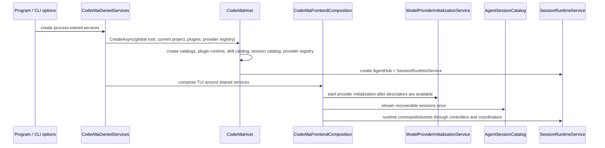
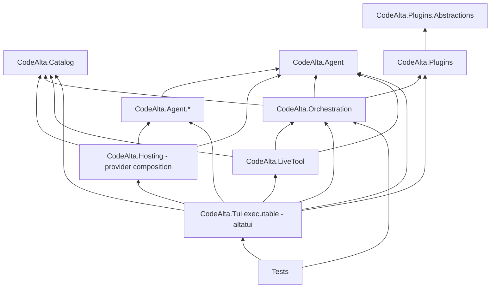
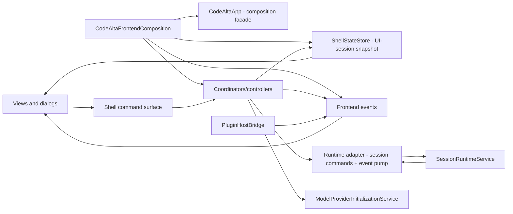
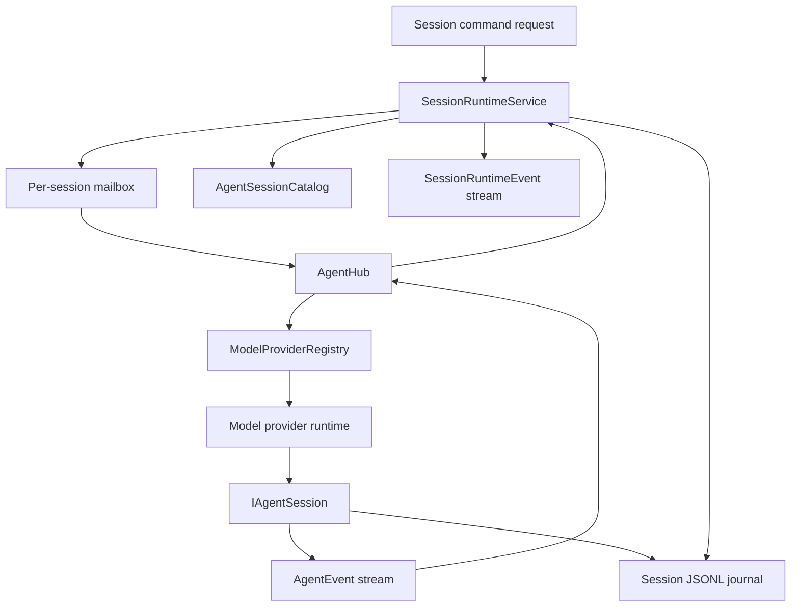

# Architecture overview

CodeAlta's terminal frontend is `CodeAlta.Tui` (`altatui`), on top of reusable runtime libraries. The desktop frontend is `CodeAlta` (`alta`), described in [CodeAlta Desktop](desktop.md); the composition below describes the TUI. Read the code from process composition downward: owned process services, shared host composition, frontend composition, orchestration runtime, session catalog, model providers, and extension points.

## Startup and composition

`CodeAltaOwnedServices.CreateAsync` owns process concerns: the default `~/.alta` root, logging, model-catalog refresh, global config, and registration timing. It delegates configured provider descriptors/lazy factories and their bundled compatibility defaults to the composition-only `CodeAlta.Hosting` library. It calls `CodeAlta.Orchestration.Hosting.CodeAltaHost.CreateAsync`, which composes reusable runtime services:

- `ProjectCatalog`, `SessionViewCatalog`, `AgentSessionCatalog`, and `SkillCatalog` from catalog/runtime stores;
- `PluginRuntimeManager` and plugin resource adapters;
- `ModelProviderRegistry`/`IModelProviderRegistry` and `IModelProviderInitializationService`;
- `AgentHub` and `SessionRuntimeService`;
- `ProjectFileSearchService` for prompt attachments and file pickers.

`CodeAltaHost` resolves the current directory as the visible default project. When that path is not already in the catalog, the host creates only an in-memory descriptor; `SessionRuntimeService` persists it through `ProjectCatalog` when a project session is created.

`CodeAlta.Hosting` contains provider registration/defaults, bounded provider inspection, configured Copilot/xAI authentication orchestration and Codex credential deletion/local account metadata lookup/device and browser login/authentication testing, not a replacement `CodeAltaHost` or another application-lifetime owner. `ConfiguredProviderInspection` applies cached test/model-list policy and owns directly created temporary runtimes through probe and asynchronous disposal; it does not create a temporary registry. `ConfiguredCopilotAuthentication` composes device login, credential deletion and non-secret cached status using provider-package contracts. `ConfiguredXaiAuthentication` composes distinct browser-PKCE and device logins, credential deletion and non-secret cached status; xAI cached status does not reject expired credentials and is not a freshness/readiness check. Concrete authentication, including xAI loopback mechanics, remains provider-owned. TUI adapters retain key lookup, lazy root selection, localization, browser launch, forms and progress. Other auth/configuration/refresh workflows and the models.dev service lifetime remain TUI-owned; host rollback, borrowed plugin ownership and shutdown consolidation remain separate work. Hosting references Agent, Catalog and concrete provider packages, with no frontend, Orchestration, LiveTool or plugin reference.

`ConfiguredCodexAuthentication.DeleteCredentialAsync` extracts only the existing CodeAlta-owned credential-file deletion route, not remote revocation. Required definition/root/message callbacks and exact ordinal `codex` selection precede a deferred factory that preserves root callback/store validation → HTTP/OAuth-client construction → provider-key read/login-manager validation → deletion with the original token. Provider-owned null/blank root/key validation is not duplicated or normalized in Hosting; no early cancellation, wrapping, retry, context suppression or disposal is added. Constructing the OAuth client does not itself make deletion an OAuth network exchange. No secret metadata or result DTO escapes deletion; the root remains trusted backend input, not a renderer filesystem grant. TUI keeps localized results, root fallback and Codex authentication-test presentation; its original shared login-manager and credential-message helpers remain preserved but unused, not called by browser login. Mandatory fake factories characterize forwarding only; source checks preserve the nested construction expression without qualifying real storage/constructor behavior. Existing non-disposal and broader application-lifetime/native parity remain unqualified.

`ConfiguredCodexAuthentication.ReadAccountMetadataAsync` adds only owned-store account lookup, not remote enumeration or authentication validation. A required synchronous callback receives null for a missing credential or one `CodexAccountMetadata` record with nullable ID/raw label; missing ID still means a credential was loaded. Preserve root/store before key/load, the null short circuit before configured-ID access, then the original definition's post-load `AccountId` read, existing provider resolution and once-only raw-label snapshot before the callback. That accepted snapshot is not equivalence to the old nonblank branch's two property reads. Presentation runs in the same post-load continuation before operation completion; storage/resolver/callback exceptions propagate. There is no type/auth-source/enabled/expiry/access-token eligibility guard, import or refresh. TUI retains its formatter, root policy and unchanged noncancelable dialog adapter. Metadata may be personal data; no logging or credential-capturing lazy result is added. The trusted backend root is not a sandbox or renderer grant. Fake forwarding and named-source checks do not qualify real storage/JWT resolution, broader authentication, lifetime or native parity.

`ConfiguredCodexAuthentication.LoginWithDeviceCodeAsync` owns only configured Codex device-login composition. Required definition/root/mismatch/report/prefix/completion callbacks precede exact ordinal `codex` selection and the mandatory deferred factory. Root callback/store validation → HTTP/OAuth construction → original key read/manager validation remain unchanged; the original token reaches the existing provider with `TimeProvider` unspecified. The provider requests, reports, polls and persists; the synchronous report callback receives raw `VerificationUri` STRING and `UserCode`, ignores the provider callback token, and does not guarantee the TUI dispatcher has rendered. After the manager await, caller-owned prefix localization runs first, then raw nullable `AccountId` is captured once, then completion receives prefix/ID synchronously without an intervening await. This separately accepted one-read deviation is not arbitrary-property or task identity/stack/settlement equivalence; it uses no trimming, resolver, label, DTO or lazy credential closure. Completion can fail after persistence. Transient authorization display and possibly personal metadata must not acquire extra logging or persistence. TUI retains display helpers, root fallback and dialog cancellation; roots remain trusted backend input, not renderer grants or sandboxes. No ownership/disposal, early cancellation, context suppression, retry, scheduling, wrapping or settlement framework is added. Authentication-test orchestration is also composed by Hosting. Recording fakes and named-source guards do not qualify real protocol/storage behavior, native parity or lifetime.

`ConfiguredCodexAuthentication.LoginWithBrowserAsync` owns configured browser-login composition with eight nonoptional parameters: definition, lazy root, mismatch formatter, `Action<Uri>` report, `Action<Uri>` opener, prefix formatter, synchronous prefix/raw-nullable-ID completion, and the original token. The seven required objects, then the internal mandatory factory, are guarded in order before ordinal `codex`; only mismatch invokes its formatter. The deferred factory preserves root/store validation → HTTP/OAuth → original key/manager. Its operation reads the original configured `AccountId` after construction at Begin → stores `WaitForBrowserCallbackAsync(...).AsTask()` → reports `login.AuthorizeUri` → opens via a separate URI property read → awaits the stored task → localizes prefix → captures raw ID once → invokes completion synchronously. This already accepted browser-specific nonblank two-reads-to-one deviation relies on the fresh sealed credential/plain property and concrete save, not arbitrary-property or task identity/stack/settlement equivalence. No resolver, label, metadata reuse, credential getter, DTO or protocol/PKCE/context/state object crosses callbacks.

The browser authorization URI is existing display data with query/correlation and potentially personal information, not permission for additional logging, persistence, parsing, normalization or snapshots. Caller-owned TUI helpers, opener, root policy and dialog cancellation remain unchanged; the trusted backend root is not a renderer grant or sandbox. An already-faulted/canceled returned wait still permits report/open before await; a genuinely synchronous fake start-wait throw differs from ordinary async provider failures. Report/custom-opener failure retains the missing wait join, so an abandoned wait may later persist; real `TryOpenBrowser` still suppresses ordinary launch exceptions. The provider saves before its status-200 `text/plain; charset=utf-8` success response, not HTML; response/cleanup failures may supersede earlier outcomes, and presentation can fail after persistence. No early cancellation, context suppression, scheduling, retry, wrapping, ownership/disposal or lifetime/settlement remediation is added. Inert sequence events are recording behavior, not execution of concrete Begin/listener/protocol/storage; application lifetime and native parity remain unqualified.

`ConfiguredCodexAuthentication.TestAuthenticationAsync` owns the authentication-test composition with five nonoptional parameters: original definition, lazy root, mismatch formatter, synchronous nullable-string completion, and original token. The four required objects, then the internal mandatory factory, are guarded in order before exact ordinal `codex`. The factory preserves root/store validation → HTTP/OAuth → original key → null-only auth-source default → configured ID → deferred Codex-home discovery → manager/key validation. Every matching source reaches home discovery, including owned/blank/unknown sources; root/store failure stops earlier, but an invalid key is not a discovery barrier. The core does not consume configuration or root callbacks. After the provider await, the fresh sealed positional context's provider-resolved ID is captured once and synchronously presented, without a prefix step. This accepted authentication-specific read-count change is distinct from raw credential-ID browser/device contracts and is not arbitrary-property or task identity/stack/settlement equivalence.

Authentication testing can import external credentials, refresh, save or delete owned credentials; `codex_auth_file_readonly` is not operation-wide read-only, and fresh cached credentials need no live server validation. Side effects can precede context resolution or presentation failure. No credential/context/metadata DTO or lazy credential getter crosses the callback; IDs may be personal data and acquire no extra logging. TUI retains the blank fallback, whole-message localization, root policy and noncancelable definition-only dialog adapter. Roots remain trusted backend inputs, not renderer grants or sandboxes. Exceptions escaping provider/callback work propagate unchanged; existing base-exception display is not a guarantee that arbitrary error text is sanitized. The original unused TUI auth/login helpers, credential formatter and opener remain preserved. No disposal, early cancellation, context suppression, retry, scheduling, wrapping or settlement framework is added. Inert forwarding and named-source checks establish wiring, not discovery/protocol/storage qualification, native parity or application lifetime.

`ConfiguredProviderLogin` is the provider-neutral facade over the three compositions above for a frontend that must not name the provider packages (the desktop `alta` assembly references neither `CodeAlta.Agent.Copilot` nor `CodeAlta.Agent.Xai`). It reports the sign-in modes of a provider type (`browser` for Codex, `device` for Copilot, both for xAI), signs in with a `ProviderLoginPrompt` callback (address, and for a device flow the user code and expiry), reads the stored state as a `ProviderLoginStatus` without network authentication, and signs out. It never opens a browser. The synchronous Codex authorization report is bridged to the asynchronous prompt without blocking the provider: a prompt that fails cancels the sign-in and is the reported failure, and a prompt still running is joined before the result is returned. A ChatGPT registration that declined plan usage is signed in but not `Usable`, as in the TUI. Codex is signed in only while its retained registration holds tokens; Copilot and xAI report the provider's cached status.

The TUI receives these services instead of constructing runtime primitives directly. Headless and tool-driven paths can reuse `CodeAltaHost` without terminal controls. Provider initialization and session catalog loading are independent startup tracks: providers can still be probing while local sessions are visible, and session listing does not instantiate or query providers.

## Dependency direction

Important boundary rules:

- Reusable session orchestration belongs in `CodeAlta.Orchestration`, not in `src/CodeAlta.Tui` views or dialogs. Lower-layer projects must not reference either `CodeAlta.Tui` or the reserved `CodeAlta` desktop project.
- `CodeAlta.Orchestration` is headless and references `CodeAlta.Agent`, `CodeAlta.Catalog`, and `CodeAlta.Plugins` only.
- Views and dialogs render state and invoke command/service interfaces; they must not call `SessionRuntimeService`, `AgentHub`, provider registries, or plugin runtime services directly.
- Model providers own protocol adaptation, credentials, readiness, and model metadata. They do not own persisted session listing or project/session restore.
- Configured provider registration/defaults, cached/temporary inspection and configured Copilot/xAI authentication orchestration belong in `CodeAlta.Hosting`; concrete authentication remains in provider packages and config persistence in Catalog. Registration fixtures retain uninvoked concrete factories; inspection and auth orchestration fixtures explicitly supply in-memory fake factories and do not start a host. Copilot/xAI production operations can perform network/credential I/O, and xAI browser login binds a provider-owned loopback listener; fake characterization never constructs a concrete manager, HTTP client, listener or credential store. Construction-before-root/options timing and the existing absence of manager/HTTP-client disposal are preserved, not resolved lifetime guarantees. Inspection borrows active model lists and metadata without fixing cache/configuration comparison or active-state concurrency. Existing plugin dependencies in the broader shared-host graph are not yet transitively terminal-free.
- `IAgentSessionStore`/`AgentSessionCatalog` own provider-independent persisted session listing, history reads, and deletion for one configured sessions root.
- `CodeAlta.Plugins.Abstractions` is the public plugin authoring surface. Runtime adapters belong in `CodeAlta.Plugins` or `CodeAlta.Orchestration`, not in the TUI. Plugins may contribute prompt parts, tools, resources, UI projections, and `alta` commands; they do not contribute independent session-owning provider runtimes.
- Public/runtime APIs expose ids, request/response records, snapshots, handles, and events. Internal mailbox actors stay internal.

`src/CodeAlta.Tests/ArchitectureGuardrailTests.cs` enforces several of these boundaries, including frontend/runtime separation, bounded runtime event streams, no broad UI callback regressions, and documentation of actor-style runtime ownership.

## Frontend shell

The terminal frontend is composed around narrow state, command, event, and projection seams.

Key frontend pieces:

- `CodeAltaApp` is the TUI composition facade and compatibility surface for existing view integration. New behavior should move into immutable shell commands, coordinators, presenters, or adapters when doing so shortens call paths.
- `CodeAltaFrontendComposition.Create` wires view models, `ShellStateStore`, frontend events, model-provider state, shell controllers, prompt/session coordinators, project-file search, plugin bridges, and the `alta` dispatcher.
- `CodeAltaShellController` owns startup catalog loading, project/session open operations, recoverable-session discovery, and runtime-event queuing/draining. Runtime-event mutations are marshalled through `IUiDispatcher`.
- `ShellStateStore` is an immutable UI-session-owned projection snapshot for selection, tabs, and prompt sessions. It is not the owner of all runtime state.
- `RuntimeEventPump` is the frontend consumer of the orchestration runtime event stream and projects events into the shell controller.
- Shell commands are registry-backed `ShellCommand` instances. Each instance owns its command-palette name/search text, help/category data, placement, shortcut, availability/visibility, dynamic label, routing flags, and no-argument activation callback.
- The active `ShellCommandRegistry` is the shared source for command palette, command bar, shortcuts, help, and placement registration. Plugin `PluginCommandContribution` instances are adapted into the same registry; plugin-specific dialogs, status items, visuals, and commands must be supplied by the plugin through generic contribution points rather than hard-coded in frontend views.
- Prompt text is not a shell command line. Empty-prompt `?` and `/` remain transient shortcuts for Help and Command Palette, while commands that need user input collect it from current UI state or from explicit dialog/controller workflows.

UI code awaits normally on the UI path. Background work must marshal back through the UI dispatcher before touching bindable state or controls.

## Runtime services

`SessionRuntimeService` is the central session runtime service. It owns coordinator sessions, recoverable-session projection, runtime events, prompt send/queue/steer/abort/compact flow, activation of CodeAlta-managed skills, and legacy session-view metadata persisted in session journals.

`AgentHub` is the active CodeAlta agent/session facade. It resolves provider runtimes through `IModelProviderRegistry` when creating or resuming a runnable session, then owns active session handles and per-session run coordination. It does not discover/list persisted sessions and does not probe model providers.

Same-session mutable orchestration state is serialized through internal mailbox actors and session coordinators. Different sessions can run concurrently. Locks around runtime maps must remain short and must not wrap provider calls, tool execution, compaction, or journal writes. Runtime events use bounded streams so slow readers do not create unbounded memory pressure.

## Agent and provider boundary

The `CodeAlta.Agent` contracts are split by responsibility:

- `IAgentSessionStore` and `IAgentSessionCatalog` list/read/delete CodeAlta-owned sessions from one configured sessions root.
- `IModelProviderRegistry`, `IModelProviderRuntime`, `IModelProviderTurnExecutor`, and `IModelProviderInitializationService` describe configured providers, readiness/model metadata, and turn execution.
- `IAgentSession` owns event streaming/subscription, send, steer, abort, compact, and history retrieval for an attached session.
- `AgentEvent` is a normalized polymorphic event model for content, activity, session updates, plans, interactions, permissions, user-input requests, and errors.
- `AgentToolDefinition` and `AgentToolSpec` define model-callable host tools with validated names and JSON schemas.

Provider-runtime compatibility surfaces now use model-provider names. Do not reintroduce `IAgentBackend`, `AgentBackendId`, or `AgentBackendFactory`; new user-facing docs and UI should say **model provider** and **session**, not backend-owned session.

Provider packages create model-provider runtimes and turn executors. The agent session runtime (`AgentRuntime`/`AgentSession`) replays journals, composes provider requests, executes turns, appends events, and can switch compatible providers by replaying canonical CodeAlta history.

## Extension integration

Extensions are trusted local code or files that the host explicitly discovers:

- Source plugins under `~/.alta/plugins/<package-id>/plugin.cs` and `<project>/.alta/plugins/<package-id>/plugin.cs` are built and loaded in-process by `CodeAlta.Plugins`.
- Built-in plugins are registered through the same plugin runtime. The statistics plugin contributes transient projections and an `alta` command root.
- Plugins can contribute prompt processors, system/developer prompt parts, tools, resources, UI elements, transient session/timeline projections, and `alta` command roots. Model-provider plugin contributions are deferred; plugins cannot list or own sessions independently.
- Skill roots come from project/user filesystem roots, built-ins, and plugin resource contributions. Discovery and activation are owned by `SkillCatalog` and `SessionRuntimeService`.
- The in-session `alta` live tool is an in-process command gateway built from core contributors plus plugin contributors.

Extensions do not own canonical transcript persistence. Plugin-derived timeline cards are transient projections replayed from canonical agent events.

## Session lifecycle at a glance

1. A user, plugin, or tool creates a global or project session.
2. `SessionRuntimeService` resolves the model provider, project roots, instructions, tools, and skill advertisements.
3. `AgentHub` starts or resumes the CodeAlta session with the selected provider runtime.
4. The session receives a prompt through `IAgentSession.SendAsync` or an accepted steering request through `SteerAsync` when supported.
5. Provider/tool events are normalized to `AgentEvent` values and projected to `SessionRuntimeEvent` values.
6. Agent-runtime sessions append normalized events plus legacy session-view headers/state to the sharded JSONL journal.
7. The frontend event pump projects runtime events into tabs, timelines, sidebars, usage indicators, and plugin projections.
8. Idle sessions can drain one queued prompt, switch providers when the agent-runtime history can be replayed safely, or compact when supported.

## Where to put new code

- UI controls, dialogs, view models, terminal presenters, and key-binding/slash-command adapters belong under `src/CodeAlta.Tui`.
- Runtime command/event contracts, session behavior, queue draining, skill activation, and plugin orchestration bridges belong under `src/CodeAlta.Orchestration`.
- Session catalog/store contracts, provider-neutral session/event contracts, model-provider contracts, and local raw-API mechanics belong under `src/CodeAlta.Agent`.
- Provider-specific protocol details belong under the matching `src/CodeAlta.Agent.*` package.
- Catalog/config/filesystem metadata belongs under `src/CodeAlta.Catalog`.
- In-session command gateway behavior belongs under `src/CodeAlta.LiveTool`.
- Public plugin authoring APIs belong under `src/CodeAlta.Plugins.Abstractions`; plugin runtime implementation belongs under `src/CodeAlta.Plugins`.
