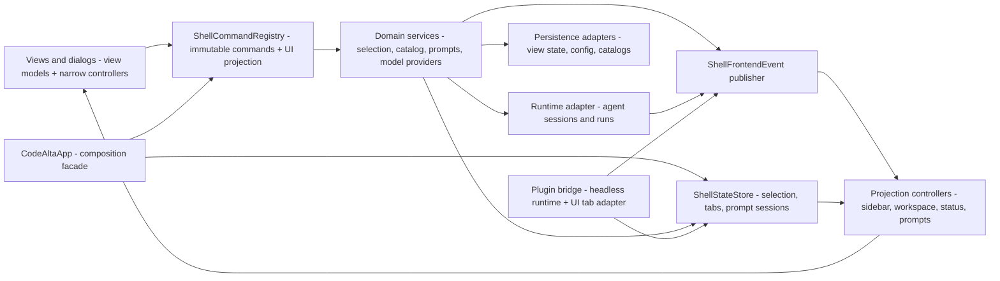

# Development Guide

Repository-wide development rules that should be enforced consistently belong here.

Add a rule here when it is important enough that contributors and agents should reliably follow it. Do not use this document for temporary plans or one-off design notes.

## Async And UI Threading

- Desktop docking title-bar attributes that change tab-strip height or padding must be applied when the strip mounts, before FlexLayout's first geometry observation; parent layout effects can run before its deferred portal content exists. Keep later resize/model updates frame-coalesced. Never globally suppress `ResizeObserver` errors: capture unsuppressed browser errors on a fresh profile, verify geometry and notification counts settle over multiple frames, and exercise asynchronous boot replies plus initial settings/guide dialogs (`startupLayout.browser.test.ts`). A single skipped notification during startup is not proof of a persistent layout cycle; corroborate browser regressions with isolated native startup when changing this geometry.
- Frontend UI flow defaults to plain `await`.
- Do not use `ConfigureAwait(false)` in UI code or UI callbacks when the continuation reads or mutates bindable state, view models, controls, presentation state, or frontend coordinator state.
- `ConfigureAwait(false)` is allowed in explicit background or infrastructure code such as libraries, SDKs, transport, persistence, filesystem I/O, pumps, workers, and startup code that marshals back before touching UI-owned state.
- When code leaves the UI flow for background work, keep the boundary explicit and narrow.
- If background work needs to update UI-owned state afterward, marshal back to the UI dispatcher first.
- File-editor watcher notifications are attachment-scoped: post to the captured terminal app, ignore notifications while unmounted, reconcile disk state on attachment, and invalidate pending callbacks on detach/disposal. Watcher threads must not mutate bindable state or post through an unattached global dispatcher.
- Do not introduce workaround abstractions only to compensate for incorrect frontend `ConfigureAwait(false)` usage.

## Architecture Boundaries

- Desktop Markdown parsing is browser-independent and returns explicitly **unsanitized** HTML. Its sole production consumer must be the instance-owned `markdownBoundary` used by `MarkdownContent`, never a direct injection sink. Keep markdown-it and DOMPurify instances/hooks component/factory-owned, with explicit useful-HTML tags/attributes and credential-free absolute HTTP(S)-only href policy. After sanitization the boundary may add only renderer-owned output computed from text: the constant code-region attributes, a fenced block's language name, highlight.js token spans (`codeHighlight`), the SVG Mermaid draws at its `strict` security level (`diagrams`), the table of a document's front matter (built with text nodes), the box and the classes of a task item (a `span`, never a form control), and the title, the class and the kind of an alert; never concatenate authored or unsanitized markup after sanitization. Retain inert source fallback, source Copy and equal-source DOM memoization. Always suppress click/aux/Enter WebView navigation. Only a trusted user activation in an assistant message with an explicit container callback/bridge grant may open a system-browser link; user messages and ungranted previews remain inert. The dedicated host action must check the current epoch and independently reject oversized, credentialed, malformed, whitespace/control/backslash-containing and non-HTTP(S) URLs, without exposing browser diagnostics. Production CSP, especially `base-uri 'none'`, remains part of the boundary; tests must fail on unexpected resource attempts even when blocked and must not equate fake-backed HTTPS evidence with `app://codealta` or native context-menu safety. Supported syntax and deliberate policy differences are documented in `doc/desktop.md`.

- Desktop workspace `CreatedAt` is nullable recorded catalog metadata from the already-loaded `AgentSessionMetadata.CreatedAt` only; year 1 is unavailable. Never substitute journal-header/update/clock/filesystem/runtime timestamps or add acquisition to render it. Reserve 64 bytes per session for the additive serialized field within the unchanged 700 KiB accounting cap, and verify actual generated JSON against the accounting envelope. Preserve the supplied ISO representation in Session Info; absent/malformed fields are unavailable, not cross-version contract-hash compatibility. Copy ID remains exact; separate Copy displayed details is bounded to the explicit visible projection, not raw JSON. This field does not strengthen scope, epoch, freshness or clipboard authority.

- New features are developed for CodeAlta Desktop only. `CodeAlta.Tui` gets no new screen, dialog, command or setting, and no counterpart of a desktop feature, unless a task asks for it. It is kept working: it shares orchestration, catalog, providers, plugins and the `alta` tool with the desktop application, so a change made in those layers for the desktop is built and tested with the TUI too, and what it breaks there is fixed. See `AGENTS.md`.
- Keep reusable agent/session orchestration out of frontend projects. `CodeAlta.Tui` (`altatui`) owns terminal controls, view models, visual projections, dialogs, and adapters from user actions to application/runtime commands; `CodeAlta` / `alta` owns the in-development native desktop lifecycle and generated RPC/React presentation. Lower-layer projects must not reference either frontend, and the desktop must not reference the TUI or initialize terminal controls.
- Keep the browser demo visibly and mechanically separate from packaged behavior: Vite `demo` mode may alias `#neoastra` to an in-memory typed fixture, while normal build mode must resolve the generated bridge. Demo state must not read profiles, credentials or provider services and must never be packaged as the production asset build. Read-only desktop configuration inventory may project bounded Host descriptors, but it must not instantiate providers or move provider/plugin mutation logic into TypeScript.
- Keep desktop native fixtures under `CodeAlta.Desktop.Tests`, outside production assets and contracts. Native tests require explicit opt-in and report unavailable graphical infrastructure as inconclusive, not native success. All automation injects a task-owned data root. Normal no-argument startup matches the TUI by acquiring an owned host for the current directory and `~/.alta`; it can run configured providers and update compatible shared project/catalog/journal/cache/provider state. Desktop/WebView-only state remains under separate platform-local application data and no `.alta` storage migration is introduced. The explicit data/catalog-copy route remains catalog-only, while explicit scoped owned startup retains its root validation and lock behavior. See [native qualification](desktop-native-qualification.md).
- Desktop startup failures must retain full exception chains in the log and stderr, and drain owned asynchronous diagnostics before returning or rethrowing. A failed/unconfirmed run can still own callbacks: flush without shutting down or replacing their logger, and leave pre-existing logging with its owner. Keep exception/exit-code behavior and successful shutdown intact. Regression tests read disposable log files before fixture teardown and use inert startup seams; they are not native Linux or complete application-lifetime qualification.
- State that two CodeAlta processes must not write together (session journals and their attachments, the application database, view state, prompt drafts, per-instance logs and the single-instance lock) is addressed through `CatalogOptions.StateRoot` / `CodeAltaInstanceProfile`, never through `GlobalRoot` or a recomputed `~/.alta`. The developer instance (`--dev`) relies on this to run beside the normal one; what it shares (configuration, credentials, prompts, skills, project catalog) stays under `GlobalRoot`. Do not make a host with a separate state root rewrite shared files at startup.
- Keep the in-process `alta` tool name, CodeAlta product identity, neutral library namespaces, and shared `.alta` persistence paths stable across frontend/package renames. The broad `CodeAlta.Tests` assembly keeps its identity and references the TUI for existing frontend coverage.
- Keep `CodeAlta.Orchestration`, `CodeAlta.Orchestration.Hosting`, `CodeAlta.Plugins`, and `CodeAlta.Catalog` independent from the TUI project and terminal UI controls.
- Optional project instruction/context file failures must stay local to the affected candidate/read, with path-bearing prompt diagnostics and existing session warning feedback rather than a failed history load/send or silent omission. Preserve ancestor order, size/path selection and instruction precedence; never change filesystem permissions to obtain guidance. Exercise both metadata and content failures, including disappearance after selection, without swallowing cancellation or programming errors. See `doc/runtime.md` for discovery and warning semantics.
- Opt-in `CodeAlta.Catalog.DirectoryCompletionReader` accepts only a caller-supplied canonical fully qualified non-root local directory and literal prefix. It counts every top-level entry, not just matching directories; returns at most 16 paths within per-path and aggregate text budgets and marks hidden/reparse/oversize omissions or exhausted entry/result bounds `Incomplete`. Its sort applies only to the bounded observed subset. Never treat a suggestion or complete enumeration as import/ownership authority, and never replace its bounded scan with the TUI's existing full enumeration/sort. No frontend/RPC calls are wired yet; callers must separately establish filesystem access authority. See `catalog-and-config.md` for status, path-swap and blocking-I/O limits.
- `CodeAltaOwnedServices` retains the existing `CodeAltaHost` as its sole runtime-service disposer; its host-exposed services are borrowed views, not a parallel disposal graph. The host still borrows a supplied prestarted plugin runtime. Program remains that runtime's owner, so its actual shutdown now occurs in Program's existing outer `finally`, after TUI host/metadata cleanup rather than during it. This timing change does not establish complete plugin/metadata lifetime qualification. Keep `CodeAlta.Hosting` composition-only; do not introduce a replacement application owner or transfer plugin ownership implicitly.
- Host and outer TUI disposal each use one instance-owned `Lazy<Task>` with default execution-and-publication and mandatory named operation factories. Validate every callback synchronously in signature order, even borrowed callbacks, without invoking it. First access starts inline; ordinary repeated/concurrent callers share the pending or terminal task with no retries. Attempt host runtime → hub → registry → owned plugin → owned logging, then at the outer level await the entire host task → models.dev → owned logging. Each stage catches synchronous throws, asynchronous faults and cancellation and attempts later stages. Rethrow a lone original exception through EDI (lone cancellation yields a canceled task); aggregate multiple direct exception references in execution order without flattening. A host aggregate stays intact when reported by the outer layer. Borrowed callbacks remain uncalled. Do not add a disposal bag, shared error helper, scheduler or generic lifetime facade.
- Same-owner reentrant disposal is unsupported: recursive lazy initialization can throw, and awaiting the already published disposal task from its own callback can deadlock. There is no hard timeout or guarantee that failed/noncooperative children have terminated. Complete composed-startup shutdown, frontend/probe/refresh/reminder lifetime, complete update/network shutdown, lower-owner complete disposal and early admission remain separate open work. Characterize only the actual named disposal/rollback operations with instance-owned recording operations, independently retained fault/cancellation/gated tasks and finally-released manual gates; all independent observations must be attempted with five-second bounds even if another times out. Never construct real owners/services or use a temporary profile as an isolation shortcut. Named-source tests establish wiring only, not concrete shutdown safety.
- Failed `CodeAltaHost.CreateAsync` and `CodeAltaOwnedServices.CreateAsync` now await acquired-object rollback through their mandatory named `RollbackHostCreationAsync` / `RollbackOwnedServicesCreationAsync` operations. Track only successfully returned objects before the next fallible step and acquire logging/plugin ownership only after acquisition succeeds. Preserve successful evaluation order, original option reads, caller-token forwarding, immediate metadata refresh and registration captures; a completed host remains the outer owner's only runtime disposer. Validate the original creation exception first, then all callbacks synchronously through the unchanged disposal factory, before starting its existing traversal inline. Clean rollback rethrows the original through EDI; failed rollback reports `AggregateException(creationFailure, rollbackFailure)` as two ordered direct references without flattening either nested failure. Clean rollback preserves creation cancellation; any rollback failure instead yields a faulted aggregate. Do not cancel cleanup with the caller token, retry, schedule, cache across creation calls or await the current creation/rollback operation from its own callback. Durable root/bootstrap effects remain; never delete them as rollback. Resources hidden by throwing constructors, unpublished plugin activation state, lower-owner cleanup failures, pending deferred-startup joining and actual startup/native lifetime remain unqualified. Returned-object cleanup is not complete construction rollback or termination proof; synthetic tests never execute `CreateAsync`, and source reads/localization/writerless assembly logging are not zero I/O.
- Deferred startup uses five narrowly named, mandatory internal operations: `BeginDeferredRun`, `TryStartDeferredServices`, `CreateDeferredDisposal`, `DisposeDeferredStartupAsync` and `IsExpectedDeferredStartupCancellation`. Allocate/store a Deferred-owned linked startup CTS in nonasync `RunAsync` before terminal entry; only services receive that linked token, while the terminal loop/iteration/Tick retain the original token. Reject run admission after disposal before checking repeated run; latch one-use admission before source creation. Retain the original returned startup task without replacement, retry or cancellation-abandonment. Keep config preflight and nonblocking completion polling, reject stopped recovery continuation, and preserve `_app = Create(...)` before preparation/root attachment. Do not add asynchronous live-iteration cleanup or infer a concurrent recovery/retry protocol from the pre-start flow. These operations are Deferred-local seams, not a replacement application/Hosting owner or generic lifetime framework.
- Deferred disposal supports never-run instances and Program's serialized terminal-run-completed-before-dispose flow. The first disposer belongs to the frontend cleanup context; an explicit nonthrowing stop assignment precedes the lazy core and all cancellation callbacks, including while lazy initialization is still in progress. Ordinary repeated/concurrent nonreentrant callers share one pending/terminal task without retries; concurrent run/iteration/disposal and same-owner recursive disposal remain unsupported. Capture app/task/live-recorded failure/token/source after stopping admission but before `Cancel()`. Attempt cancellation, then exclusively dispose an existing app or await the original startup task to actual completion and dispose its exact late returned resource; never dispose services additionally when an app exists. Use plain awaits so existing-app cleanup starts inline before the first pending await and later frontend-owned cleanup retains its context. Independently attempt update, presenter and startup-CTS stages after earlier failures. Keep a lone failure through EDI and multiple direct references in execution order without flattening; cancellation callback aggregates and nested rollback failures remain intact.
- Suppress a Deferred join failure only by exact reference equality to the failure recorded by live startup reporting, or when the original task is canceled and its caught OCE carries the exact cancelable linked token, requested both at the selected observation and now. For a task already terminal before disposal's cancellation request, use the pre-request state; for a pending task use its completion-observation state. Do not retroactively excuse an already-terminal unrequested cancellation, accept default/unrelated tokens, suppress a faulted OCE or unwrap an aggregate to classify cancellation. Reference suppression applies only to the join catch, never to new app/resource/final-stage cleanup errors, even when a callback throws that same object. The live failure field records an attempted reporting branch, not successful presentation acknowledgement. External cancellation callers remain responsible for their own callback errors; Deferred reports exceptions from its own cancellation/cleanup calls. Dispose the linked source after required joins. Tagged .NET 10 linked-source/registration disposal code supports only narrow parent-registration waiting evidence, not installed-runtime or external-race qualification; neither a requested token nor a later cancellation call alone proves another callback traversal finished.
- Qualify Deferred ownership decisions only through those five production-used operations and inert returned `IAsyncDisposable` resources. Retain every started synthetic fault/cancellation/gated task, including unselected tasks and callback-created operations before assertions; release gates in `finally`, start independent five-second observations before awaiting each aggregate, and dispose test CTS only after actual required joins. Retain and join asynchronous barrier callers and their returned disposal tasks; use at most one explicitly awaited inert context post, not a terminal dispatcher pump. A timeout with unjoined work is a failed fixture, not termination evidence or permission to release its CTS. No concrete Deferred/app/host/services/provider/auth/plugin/metadata construction or creation calls, profile/HOME isolation shortcuts, production timers or detached fixture work. Named-source guards establish forwarding only. In particular, `PluginStartupFeedback` invokes `Terminal.Live` and joins its operation: plain awaits or outer/host context suppression do not establish UI-independent composed startup. Hidden constructor acquisitions, partial frontend construction and publication-window cleanup, existing Tick-after-failure behavior, early admission, Program's CTS ownership and existing run/disposal exception precedence, reminder joining, complete update/network shutdown, metadata/lower-owner completeness and noncooperative callback/operation termination remain open. Deferred now awaits updater disposal at its existing update stage, not earlier or concurrently. This bounded join does not close complete startup/shutdown, native lifetime or the broader ownership milestone.
- Returned-app frontend cleanup uses the mandatory static `ShellFrontendHost.DisposeFrontendResourcesAsync` operation, without moving composition or creating another owner. Validate all seven callbacks synchronously in signature order, then start the local async core inline. Independently attempt projection disposal, reminder UI unsubscribe, view-state persistence, editor workspace disposal, event-pump disposal, shell-controller disposal and prompt-draft disposal in exactly that order. Plain awaits retain frontend cleanup context. Preserve App's nonasync persistence lambda with `reportStatus: false`: the returned `Task<result>` is awaited as `Task`, discarding the result as before. Ordinary persistence errors/conflicts already returned as data are not reinterpreted or thrown; only escaped synchronous throws, task faults and cancellation enter this cleanup failure policy. Attempt later siblings after terminal failures, retain a lone original through EDI and aggregate multiple direct exception references in execution order without flattening or cancellation/identity suppression. No caching, retry, scheduling, parallel stages, timeout, concrete fallback or new repeated/concurrent disposal guarantee is added.
- Preserve App's public disposal forwarding and Shell's entire existing frontend-then-owned-services traversal, including late owned-services lookup and direct nested error policy. The existing host remains the sole runtime-service owner; outer cleanup awaits the entire host. Deferred still publishes the returned app before preparation/root attachment and exclusively disposes that app instead of also disposing its startup result; its awaited updater, presenter and startup-CTS stages stay unchanged. A noncompleting frontend stage can prevent later siblings, owned-service cleanup and updater cancellation from being reached. This is failure containment for resources held by a successfully returned app, not rollback of hidden constructor acquisitions, partial frontend/surface creation or publication/preparation failures. Tick-after-failure, early admission, Program CTS/exception precedence, reminder/metadata/lower-owner completeness and startup/UI/plugin/network/noncooperative termination remain open; M2–M7 are not completed by this traversal.
- Frontend cleanup behavioral fixtures invoke only that actual static operation and the accepted Deferred disposal core with an inert app, never concrete App/Shell/Deferred/frontend/services/managers/stores/clients/providers/coordinators/listeners/plugins/metadata/UI/version-info objects. Do not call static App helpers that initialize its logger. The new inert integration does not execute Shell's actual disposal traversal, which remains unchanged and source-checked. Retain every independently started synthetic task immediately, including unselected startup tasks and callback-produced/returned disposal work before fallible setup or assertions. Finally release every manual gate, start all independent five-second observations before each aggregate, and take a second finite snapshot for callback-produced work. Explicitly retain/rethrow timeouts even after later completion, independently observing available original faults/cancellations. Use one explicitly awaited inert context post; restore context and arrange/retain teardown dispatch before aggregate observation, not a serial dispatch observation first. These fixtures need no CTS/registrations; adding any requires further audit and actual release only after successful required observations and joins. No fixture scheduling, sleeps, polling, detached work, production timers, recursive disposal probes, auth/protocol/credential records, HOME/profile isolation or localization/log setup. Named source reads and existing writerless assembly logging are nonzero I/O, not complete lifetime qualification.
- RuntimeEventPump disposal uses mandatory static `DisposePumpAsync` with its original task and four required callbacks, validated synchronously in signature order before the local core starts inline. Snapshot the task and optional linked source before own cancellation; the readonly disposal CTS remains the same instance-owned source. Independently attempt disposal cancellation, pump cancellation, original-task join, linked-source release and disposal-source release, preserving successful order even after earlier terminal failures. Await the original task to actual completion with `ConfigureAwait(false)` before releases; preserve the original unconditional OCE catch only around this join, including faulted-OCE suppression without task/token/request classification. Callback/release OCE remains a failure; aggregates containing OCE are not unwrapped. Rethrow a lone retained failure through fully qualified EDI and aggregate multiple direct references in order, including repeated references, without flattening or deduplication. Support never-started pumps and serialized Start/first disposal without new admission, caching, retry, field reset, replacement task, owner, timeout, parallelism or repeated/concurrent disposal guarantees. A pending pump join does not retain frontend context; completed awaits can stay inline without a guaranteed thread switch. App's unchanged plain-await seven-stage adapter retains its later frontend context, and Shell/Deferred/updater/host/outer ownership routing stays unchanged.
- Preserve the pump's fields/constructor, complete Start scheduling and original-task monitoring, and complete RunAsync stream/projector and requested-token OCE policy. The serialized baseline already joined before releasing sources; no updater-style released-source token-read race was established. Cancellation and release errors are source-backed exception channels, not proof that the current concrete channel callbacks or ordinary CTS disposal throw. Own synchronous cancellation can report a nested linked callback aggregate; external Cancel callers remain responsible for their own callback errors. Joining the original worker covers enumeration, synchronous queue calls and enumerator cleanup, not queued UI event/wake draining, publisher/runtime/stream/controller/plugin termination or external cancellation-traversal completion. CodeAltaTaskMonitor still reports faulted tasks through its existing flattened fatal-reporting path and the default reporter can FailFast; inert cleanup tests never execute that path and do not establish process survival. Noncooperative cancellation callbacks or worker operations remain unbounded and can prevent later cleanup. Hidden construction/frontend/publication windows, Program/early admission, controller/editor/drafts/reminders/metadata and other lower owners remain separate work; M2–M7 remain open.
- Pump lifetime fixtures invoke only the actual static pump core and accepted static frontend cleanup core, never concrete pump/stream/projector/controller/dispatcher/App/Shell/Deferred/owner/service/provider/client/store/manager/coordinator/listener/plugin/metadata/UI/version-info objects or monitor/reporter/terminator substitution. Keep actual CTS/registrations confined to the three linked-callback rows; retain external/disposal/linked sources before registering with uncanceled parents, and record the actual escaping own-cancellation aggregate without an external racing Cancel caller. Release-stage callbacks record/fail only. Retain every independently started original/producer/callback/caller/pump/frontend-disposal task immediately before fallible setup or assertions. Finally release every manual gate, launch all independent five-second observations before each aggregate, then take a second finite callback-task snapshot. Record every observation timeout in fixture-owned state, including body and context-dispatch observations: later successful completion never rehabilitates it or permits actual registration/CTS release. Independently observe original faults/cancellations; release actual registrations and sources only after successful required observations and actual joins with no earlier timeout. Use at most one retained inert context post, restore context, and arrange/retain dispatch before aggregate teardown, never serially observing dispatch first. Assert context identity boundaries rather than a thread switch. No fixture scheduling, sleeps, polling, detached continuations, production timers, recursive disposal probes, event/auth/protocol/credential records, HOME/profile isolation or logging/localization setup. Named-source guards prove wiring only; existing writerless assembly logging and source reads remain nonzero I/O.
- `CodeAltaShellController` disposal uses mandatory static `DisposeInitializationAsync`, validating its four callbacks synchronously in signature order before the local core starts inline. Snapshot the retained initializer and optional linked CTS before callbacks; retain fields and the same readonly disposal CTS. Independently attempt own cancellation → linked cancellation → actual supplied original-task join with `ConfigureAwait(false)` → linked release → own release, preserving successful order after earlier errors. Only the join suppresses OCE unconditionally, including faulted OCE without task/token/request classification; callback/release OCE remains failure and aggregates containing OCE stay intact. Preserve lone EDI identity and multiple direct ordered, nested and repeated references without flattening/deduplication. Preserve never-started and serialized Start/first disposal, complete scheduling/monitoring, initialization tracks/token/error/fallback policies, direct `InitializeAsync`, dispatcher/queue/frame/merge behavior and fields. Add no shared pump helper, owner, cache, latch, retry, timeout, scheduling, replacement task, parallel stages, reset or repeated/concurrent disposal guarantee. A pending internal join avoids context capture without a promised thread switch; App's unchanged plain await keeps later draft-stage context.
- This joins only the retained initializer, not all startup descendants: interaction dispatch failure/cancellation can skip the local startup-track join, direct `InitializeAsync` is unretained, and the None-token fallback can hang or replace errors. Existing provider/session wrappers swallow/log errors except cache-lock; actual escaping errors, including fallible logging/finally work, remain unchanged. Provider refresh uses an independent probe-timeout token and cancelable caller waits; state posts/dispatcher waits do not join queued actions. A provider final reader stop's preceding Cancel can skip its join; first-stop failure alone does not prove unjoined work because finally retries the stop. Restoration/history work remains separately or discardedly retained. No application-defined throwing registration, ordinary CTS release failure or updater-like released-source token-read race is currently demonstrated. Own-call error containment does not join external Cancel callers, who own their errors/traversals. The retained join does not drain actions/events/wakes or terminate providers/publishers/runtime/plugins. Default monitoring can FailFast: tests characterize cleanup if reached, not process survival. Waiting despite cancel errors can prevent releases/drafts/later owners indefinitely instead of escaping earlier. Hidden acquisitions/publication, earlier noncompletion, Program/admission, reader/provider/history/editor/drafts/reminder/metadata and M2–M7 remain open.
- Controller lifetime fixtures invoke only the actual static controller core and accepted static frontend core, with controller stage six and drafts stage seven; a controller aggregate stays one direct frontend error between earlier projection and later draft errors. `Core_OnlyJoinsSuppliedOriginal` is an inert seam-contract test, not reproduction of skipped runtime startup tracks. Retain every original/producer/unselected/callback/caller/controller/frontend/context-signal/dispatch task before fallible setup or assertions; prepare and retain all manual gates before callbacks. Finally release every gate, retain all independent five-second observations as started before each aggregate, then take a second finite callback-task snapshot; independently observe original faults/cancellation. Every observation timeout permanently poisons fixture-owned state, including body/nested context observations: later success never permits real resource release. Actual CTS/registrations exist only in three linked rows: retain both uncanceled parents and linked source before registering, capture the actual escaping own-cancellation aggregate without an external racing Cancel caller, and let release callbacks record/fail only. Release actual registrations/CTS only after successful required observations, actual joins, completed tasks and zero timeout history. Use at most one retained inert context post; restore context in body/finally and arrange/retain dispatch, launching dispatch/frontend/controller observations before aggregate rather than serial dispatch-first observation. Assert context identity, not a forced thread switch. No concrete controller/owner/App/Shell/Deferred/provider/history/dispatcher/worker/service/host/manager/client/store/coordinator/listener/plugin/metadata/UI/version-info construction, monitor/reporter/terminator substitution, fixture scheduling/sleeps/polling/timers/detached continuations/recursive probes, event/auth/protocol/credential records, HOME/profile isolation or logging/localization initialization. Named-source reads and existing writerless assembly logging are nonzero I/O, not isolation or full lifetime qualification.
- Editor-workspace disposal routes through mandatory static `FileEditorWorkspaceCoordinator.DisposeWorkspaceAsync`, still at App/Shell frontend stage four after persistence and before pump/controller/drafts. Validate picker and snapshot callbacks synchronously in signature order, start the local Task core inline, plain-await picker terminal completion even on failure, invoke one late snapshot, then plain-await each returned entry sequentially in snapshot order. Keep the original `FileEditorTab[]` allocation and covariance to `IAsyncDisposable[]`; snapshot throw/null has no fallback traversal. Null snapshot/null entry are explicit `InvalidOperationException` seam contracts, not demonstrated dictionary corruption; a null entry does not skip later entries. Preserve lone fully qualified EDI/OCE identity and ordered direct aggregate references, including nested/repeated references, without cancellation suppression, flattening, sorting or deduplication. Plain awaits retain workspace and later frontend context. Add no replacement snapshot/list, cache, latch, admission, retry, scheduling, timeout, parallelism or repeated/concurrent/recursive disposal guarantee; do not change owner routing or other workspace behavior.
- Editor-workspace lifetime fixtures invoke only the actual static workspace core and accepted static frontend core with inert recording `IAsyncDisposable` entries, never real editors/workspaces/services/files/codecs/watchers/UI/hosts/providers/clients/stores/plugins/metadata or logger/version/monitor initialization. Retain every original/producer/unselected/callback/caller/workspace/frontend/signal/dispatch task before fallible setup or assertions, prepare manual gates before callbacks, and consume each returned task-backed ValueTask once. Finally release all gates, start and retain every independent five-second observation before each aggregate, then take a second finite snapshot for callback-produced work; independently observe original faults/cancellations. Every timeout, including body/nested/context observations, permanently fails the fixture even after later completion. Restore the previous context in body and teardown, arrange/retain manual dispatch before concurrently observing dispatch/frontend/workspace, retain additional posts rather than dropping them, and assert context identity for a later tab entry and pump/controller/drafts, not a forced thread switch. No CTS/registrations, fixture scheduling/sleeps/polling/detached continuations, production timers, concrete fallback factories, auth records or HOME-isolation claims. Freeze complete original workspace content outside disposal through ordinal inverse reconstruction, exact adapter/core and XML placement after the complete final helper; retain App/Shell, older fixtures and all architecture allowances/budgets unchanged. Source-only containment/preservation audit precedes separately authorized filtered verification; source reads and existing writerless assembly logging remain nonzero I/O, while the lifetime fixture has no source/file/directory reads.
- Editor-workspace containment is bounded sibling-failure handling, not complete shutdown: picker Close can fail before session release/reset and does not join discarded query/dismiss/accept/usage/open work; search sets disposed before cancel/release and retains no refresh/ranking join, while out-of-lock publication can survive disposal. Interface-delayed acquisition is possible, but researched default memory cache/usage does not demonstrate delayed acquisition or ordinary CTS-release failure. Initial tab load/construction/watcher acquisition and dictionary/UI publication can partially fail or publish after the single snapshot. Tab disposal sets disposed before unsubscription/watcher disposal without joining save/reload/initial loads, dirty-dialog actions, queued focus/updates or native callbacks; pending saves need not stop and dirty-close return need not mean its chosen action completed. Shared codec durable commit can precede later result/UI failure and is not rolled back by disposal. Existing detached-observation dropping/fatal-reporting behavior remains, so cleanup if reached is not process-survival evidence. Any awaited noncompletion can indefinitely prevent later tabs/frontend/owned services; path-key reuse is not filesystem identity, duplicate references are not claimed normal, no installed UI-binary match or native callback join is established, and partial acquisition/publication, other lower owners and M2–M7 remain open.
- Prompt-draft prerequisites use mandatory static `SessionPromptDraftPersistenceCoordinator.JoinDraftPrerequisitesAsync`: synchronous validation of previous, delay factory and predicate in signature order precedes the inline local core. Retain previous before invoking the factory once and immediately retain/await its original task; a null task is the explicit `InvalidOperationException("The delay operation returned a null task.")` seam contract, not malformed concrete Task.Delay evidence. Only delay acquisition/await OCE evaluates the predicate, once: true suppresses, false retains, and a throwing predicate follows C# filter-false semantics retaining the original OCE, not adding the predicate error. Independently await actual previous after every terminal delay outcome, including acquisition/null failure; never suppress or task/token-classify predecessor OCE. Preserve lone fully qualified EDI identity and multiple direct ordered [delay, previous] errors, including nested/repeated references without flattening/deduplication. Infrastructure awaits suppress context capture without a forced thread switch; the frontend plain-await caller keeps its own context. Pending delay prevents reaching previous; pending previous blocks completion. Intentional changed exceptional ordering delays error storage/logging/local source release until previous terminates, with both failures reaching the unchanged outer catch, which ordinarily stores/logs rather than propagates; logger/finally precedence remains unchanged.
- Prompt-draft lifetime fixtures call only that actual static prerequisite core and the accepted static frontend cleanup core, with drafts last at stage seven; assert caller context identity after plain-await frontend completion, not an invented later stage. Use inert tasks/immutable cancellation tokens and callback channels, no actual CTS/registrations or concrete coordinator/owner/App/Shell/Deferred/provider/store/codec/service/manager/listener/worker/UI/metadata/version construction, fallback factory or logger/localization/monitor/reporter setup. Retain every original/producer/unselected/callback/caller/core/frontend/context-signal/dispatch/observer/aggregate task immediately before fallible setup/assertions, prepare gates before callbacks, and single-consume task-backed ValueTasks. Finally release every gate, start/retain all independent five-second observations before each aggregate, then take a second finite snapshot for late callback tasks; independently observe original faults/cancellations. Permanently record/rethrow every timeout, including body/nested/context-dispatch observations, even after later completion; benign expected errors must not mask body failures. Restore context in body/teardown, arrange/retain manual dispatch and its start gate before callbacks/concurrent observations, never observe dispatch serially first, and retain additional posts. No fixture scheduling/sleeps/polling/detached continuations/production timers/recursive probes/auth records/HOME shortcuts or lifetime source/file/directory reads; fixed source reads and pre-existing writerless assembly logging remain nonzero I/O, not isolation.
- This is bounded prerequisite joining, not complete draft shutdown: only supplied originals are joined, not hidden/withheld descendants or adapter allocation/invocation setup. Freeze every unrelated persistence byte via whole-original inverse, including instance logger initialization, Observe/QueueFlush/Dispose, state selection/save/conflict/acknowledgement/error wrapper and local finally, plus owner routing, App/Shell, prior fixtures and architecture. Observe setup/CTS acquisition, partial QueueFlush retention, reentrant admission, concurrent delete/edit, UI rollback/callback invalidation remain open; durable replacement/deletion may precede failed result/ack/UI without rollback, cross-process CAS or linearizable concurrent delete guarantees. Add no owner/cache/latch/retry/admission/scheduling/timeout/cancel/release/save callback to this seam. Noncompletion can still block later cleanup indefinitely. These inert cases are not an oversized-delay/BCL/logger/durable-write reproduction; source/helper/diff/byte audit must precede separately authorized exact filtered execution. Editor picker/search/tab/watcher/save/dirty-close/late publication, controller incomplete startup joins, Program/early admission, reminders/metadata/lower owners and M2–M7 remain open.
- `ModelsDevCatalogService` shares one stop/snapshot/cancellation/join/release outcome through an instance-owned `Lazy<Task>`, without retries or recursive-disposal guarantees. Under the existing gate, reject stopped starts before the retained-task no-op, capture the token and publish the single original refresh task; stop sets its flag and captures that task under the same gate before cancellation outside it. Preserve constructor statement order, immediate outer startup, host → metadata → owned logging and rollback ownership. Queries remain available; completed/faulted retained tasks are not restarted.
- Catalog cleanup must use the separate fieldless, initializer-free `ModelsDevCatalogLifetime.DisposeRefreshAsync`, not a static seam on the logger-initialized service. Validate cancel/source/client synchronously in signature order even when borrowed; allocate bounded error storage before callbacks. Attempt cancel, await the supplied original if present, then independently release source and owned client. Preserve unconditional OCE suppression only around the original join, including faulted-OCE input; callback OCE remains failure. Report lone EDI or direct ordered cancel → worker → source → client aggregates without flatten/dedup. Pending original blocks releases even after cancellation failure; add no second cancellation caller/fence, parallel cleanup or forced timeout.
- Qualify catalog cleanup only with supplied inert tasks/callbacks; admission/Lazy/scheduling atomicity remains source-wiring evidence, not a copied fixture state model or BCL race proof. Retain originals/unselected/core/observer/wrapper tasks before fallible work, release every gate in finally, start all independent five-second observers before each aggregate, take a second finite snapshot and preserve timeouts permanently. No concrete catalog/CTS/registration/client/owner or runtime fixture filesystem/logger initialization. Freeze the complete unrelated source through exact XML/member inverses and all existing owner/guard routes. Constructor rollback, cache durability/publication-before-persistence, external dependency lifetime, blocking callbacks and complete shutdown remain unqualified; do not execute or repair the existing concrete catalog/cache tests as part of this slice.
- Returned-App reminder ownership is limited to the active frontend-created `AltaReminderService`, including when the backend is borrowed. Composition transfers it immediately to the existing `ShellFrontendHost` before exposure; do not add activation or change ownerless fallback/failed-acquisition routes. Shell's expression adapter plain-awaits `DisposeRemindersThenFrontendAsync` before the verbatim old frontend-then-late-owned-services traversal. Terminal reminder failure still attempts that traversal; pending reminder cleanup blocks it. Preserve all seven frontend stages, including stage-two reminder UI unsubscription, and run/PrepareForRun/Deferred/outer/host routing. Add no Shell disposal cache or replacement owner.
- Only the reminder service shares disposal through one instance `Lazy<Task>`. Retain actual original workers independently of descriptor membership, then publish the assigned original; admit transactionally under the service gate and release known-unstarted rejected entries outside it. Stop and snapshot under that same gate without an initial prune. Opportunistic pruning observes only completed published originals, is disabled after stopping and retains only the first retired failure reference, not exhaustive history or an absolute memory bound. Claim cancellation once under the gate, traverse outside it, store failure before completing the successful return fence; the worker marks source closing and owns source release after that fence. Keep mutation argument precedence, historical queries and existing firing/catch/notification semantics; add no scheduled retirement or CRUD drain.
- Reminder seams are mandatory production-used static operations: `StartAndPublishReminderWorker`, `TryObserveCompletedReminder`, `CancelAndComplete`, `FinishReminderSourceAsync`, `DisposeReminderWorkersAsync` and Shell's `DisposeRemindersThenFrontendAsync`. Validate synchronously before callbacks. Start/cancel completion failure supersedes the earlier action error; failed/canceled return fences never authorize source release. Join a shallow cloned array after ascending request/publication/reader validation and error-storage allocation, attempt every cancellation before awaiting publication then the actual original, and read stored cancellation failure only when none was already captured. Preserve direct history, indexed cancellation/read and indexed worker error order, lone EDI and nested/repeated aggregate references without flattening/deduplication. Cloning does not make concurrent caller-array mutation atomic.
- Qualify reminder seams only with inert supplied tasks/callbacks and the accepted static frontend core; actual admission/pruning/history/Lazy/source-closing wiring remains source-only evidence, not a fixture-side model or BCL race proof. Retain originals/publications/unselected/core/frontend/context/dispatch/observer/wrapper tasks before fallible setup, finally release every gate, start independent five-second observers before each aggregate and take a second finite snapshot. Independently observe original errors, preserve every timeout permanently and restore context in body/teardown; retain arranged dispatch before concurrent observations and assert context identity. No concrete service/entry/CTS/registration/owner/UI/provider/host construction or fixture scheduling. Worker joining does not certify unknown setup/publication work, failed acquisition, synchronous CRUD notifications, posted UI/dialogs, detached sends/provider descendants, full service quiescence or externally disposed dependency liveness. Noncompletion can block later cleanup indefinitely; M2–M7 remain open.
- The Deferred-owned updater has one async-only cached lifetime, implemented by mandatory internal `StartUpdateCheck`, `CreateUpdateDisposal` and `DisposeUpdateCheckAsync` operations. Validate start callbacks synchronously in signature order, then reject stopped admission before the already-started no-op. Latch before allocation/publication/scheduling; store the independent CTS and capture its token before publishing `Checking` and scheduling the original task. The existing production scheduling adapter closes over that token value, never a later source-field read, and supplies no scheduling cancellation argument. Retain task/source fields after failures and disposal; no retry, reset, fallback, synchronous disposer or new Program/Deferred token linkage. A failed start retains any stored source for later disposal; hidden throwing-constructor acquisitions remain unqualified. Preserve the complete `CheckAsync` outcome policy: requested-token OCE is swallowed without exact-token classification, other failures publish `Failed`, and late successful results still publish. Preserve snapshot locking, generation increments, UI synchronization/coalescing and borrowed App/About use. Program still prints its sampled update result before Deferred disposal; a result arriving during the join does not cause an additional print.
- Updater disposal supports never-started instances, serialized start/first disposal and ordinary repeated/concurrent nonreentrant disposal callers. A nonthrowing stop assignment precedes the lazy core; snapshot the actual check task/source before cancellation. Independently attempt own synchronous cancellation, await the original scheduled task to actual completion, then release its CTS, retaining every escaped failure without cancellation or reported-reference suppression. The check wrapper already handles normal requested cancellation; an escaped OCE remains a cleanup failure. Keep EDI for a lone original failure and ordered direct, unflattened aggregates for multiple failures. Deferred accepts a mandatory `Func<ValueTask>` update operation and awaits it in the same try/catch after exclusive app/startup cleanup and before presenter/startup-CTS cleanup. Preserve plain awaits/frontend context and retain an updater aggregate as one direct Deferred-stage error. Do not block the UI, abandon the task, move cancellation earlier or add parallel cleanup: an earlier noncompleting app/startup stage can prevent updater cancellation from being reached. No overall deadline or arbitrary callback/operation/network/transport termination is established; the checker's ten-second HTTP timeout is not a total check/shutdown bound, and its lexical HTTP/stream cleanup is source evidence only.
- Updater lifetime fixtures invoke only the three actual static updater operations and the accepted Deferred disposal core, with inert operations/resources rather than concrete updater/checker/client/UI/version-info initialization. Retain the source in a fixture-owned ref field before fallible start callbacks, and independently retain every started task immediately, including unselected ownership tasks and callback-created work before duplicate assertions. Use manual gates instead of fixture scheduling, sleeps, polling, production timers or detached continuations; finally release all gates and launch all independent five-second observations before each aggregate, including a second finite snapshot for callback-produced tasks. Explicitly rethrow observation timeouts even if the original later completes; separately observe available original faults/cancellations. Release actual fixture CTS only after required joins, never merely a late terminal state. Source-release callbacks may record/fail until that containment release. Use one explicitly awaited inert context post and arrange/retain teardown dispatch before the all-task aggregate, not a serial dispatch observation first. No network/protocol/auth/credential records, temporary HOME, profile manipulation, localization/logging setup or recursive disposal probes. Named source reads and existing writerless assembly logging remain nonzero I/O; these fixtures do not qualify full updater, plugin/composed-startup or lower-owner lifetime.
- Keep `CodeAlta.Hosting` composition-only. It owns configured provider registration/defaults, bounded cached/temporary inspection, configured Copilot device-login/deletion/cached-status orchestration, xAI's distinct browser-PKCE/device-login/deletion/cached-status orchestration and Codex token-sharing browser login/sign-out/local registration metadata/authentication testing. Registration borrows the registry/config store/models.dev service; inspection directly owns only its temporary runtime, with no temporary registry or new application owner. TUI keeps key lookup, lazy root selection, localization, browser launch and presentation; other auth/configuration/refresh workflows and metadata refresh lifetime remain there until separately extracted. Copilot/xAI orchestration preserves manager construction before root/options and the existing absence of manager/HTTP-client disposal; mandatory call-scoped fake factories must never fall back to production in tests. Cached status is not live authentication; xAI status does not reject expired credentials or apply Copilot-style refresh skew. Keep concrete auth/protocol code, including xAI loopback binding, teardown and exception transformations, in provider packages and persistence in Catalog. Wrapper fakes do not qualify those concrete paths or application lifetime. Add references only for implemented composition, never to either frontend or to anticipate later LiveTool/plugin wiring. The existing `CodeAlta.Orchestration.Hosting` APIs remain in Orchestration.
- Codex Hosting adapters preserve the token-sharing sequence verified on `main`: provider login-manager construction → stable host ID → awaited `BeginBrowserLoginAsync` → retained callback wait → report URI → system-browser open → await original wait, with the same browser-context disposal. Sign-out invokes provider remote revocation/local-token clearing and retains the registration; authentication testing calls `GetCredentialAsync`, not account-context/home discovery. Do not reintroduce device login, credential imports or deletion-only sign-out. Validate required inputs and exact ordinal `codex` before concrete login/sign-out/test factories; forward original definition/root/token references without new scheduling, retries, context suppression or exception transformations. Roots remain trusted backend input, not renderer grants.
- Codex results cross Hosting only as non-secret account label, validated subject, issued client ID and plan-permission metadata, never credentials or token-capturing getters. Local account lookup returns null for missing, pending or legacy registrations using the provider's registration predicate, without refresh or configured-account reinterpretation. Preserve `main`'s label/subject/null fallback, plan-permission failure and revocation-confirmation messages in TUI. Both frontends use the shared registration builder, provider runtime and global credential store; desktop provider Settings remain read-only. Mandatory fake factories characterize forwarding only; required-null public tests must fail before concrete construction, and pending test work must be retained and joined with bounded cleanup. Provider auth tests cover the real protocol with synthetic credentials/network responses, not a live account or native parity.
- Keep plugin orchestration hooks headless. Frontend code may render plugin-derived projections or adapt plugin UI/tab services, but should not own agent event observer dispatch or derived-event creation.
- Keep plugin prompt/notification abstractions minimal data contracts. Do not reproduce `XenoAtom.Terminal.UI` toast or control APIs in plugin abstractions; terminal controls and dialogs stay owned by the frontend.
- Treat plugin-derived session/timeline events as transient projections. Do not persist them as canonical user/agent transcript events unless a future decision explicitly changes the event model.
- Bound file-change snapshot capture and generated diffs in the shared agent runtime, before JSON serialization. Preserve explicit omission evidence and complete retained per-file diff blocks; model-visible tool-output truncation does not protect event details or `DiffUpdated` records. These inspection limits must not change file mutation or permission behavior.
- Prefer named ports, request/response DTOs, immutable snapshots, and event streams over large callback aggregates or callback-wrapper context classes.
- New shell/application contracts should use `ModelProvider` terminology for selectable LLM runtime and endpoint configuration. Do not introduce new `Backend` names for provider/session ownership; keep remaining backend strings limited to explicit compatibility wire/config names or real third-party terminal/backend concepts.

### Agent runtime, sessions, and model providers

The current provider/session split is intentional and should be preserved:

- `AgentHub` is the in-process active-session facade. It owns active session handles, per-session run coordination, abort/steer/compact flow, and provider resolution for start/resume/run. It must not own persisted session discovery or model-provider probing.
- `SessionRuntimeService` is the headless orchestration service that maps UI/live-tool session actions to runtime requests, prompt queues, skill activation, session history, and `SessionRuntimeEvent` projections.
- A tool that makes other tools available (an activated MCP server) registers them in the running turn through `AgentToolInvocation.RunTools` (`PluginAltaCommandContext.RunTools` for an `alta` command): the agent session offers them with its next model request. Do not end the turn, queue a follow-up run or ask the user for another message to get new tools.
- Its `GetUsageStateAsync` prerequisite reads only an existing per-session actor's attachment-scoped, last-admitted typed usage event; it must not create a coordinator, inspect history/metadata, probe providers, aggregate deltas or fill missing fields from catalog limits. Retain bounded numeric values, source/scope/provider timestamps and owner sequence with explicit invalid/omitted evidence, never arbitrary labels/Details. Fence exact provider/session/attachment on admission and withhold usage through transition, retirement and termination; the result is neither current-context freshness nor an event-completeness watermark. The owned `sessionUsage.read` RPC adds epoch validation and an exact first-line bounded persisted-header check, plus complete unarchived bounded catalog ownership for project scope (positive actor/persisted global evidence for global scope); it rechecks the original actor/attachment after asynchronous reads. Do not fall back to `ResolveOwnedSessionBodyAsync`, `LoadAsync`, unbounded header readers or a provider probe. See `runtime.md` for point-in-time/external-writer limits. The opt-in compact owned composer inspector reads only on open or explicit refresh and discards old selection/host replies; full/native usage parity is not established.
- Reported tool activity belongs only in the existing immutable partial Display projection: two most recently updated plain ToolCall identities per session, exact provider/nullable-run/activity keys, six supported reported phases and explicit eviction/name-prefix truncation. Invalid identities/phases or malformed names omit the report without replacing valid rows; never traverse structured tool details or change original-instance effect delivery. Latest phase is not a monotonic lifecycle, approval, process-start or completion authority. Keep text/session/subscriber limits unchanged and prove the combined generated selected-item escaping budget with JSON overhead and framing counted separately. Frontend validates/freezes scalar rows and full replacements through the existing channel/store; no new reader, action, polling or history/effect replay.
- What a running tool call writes is transient: it is not journaled and not in the Display projection. `RuntimeToolOutputProjection` (fed by the same publisher) retains it per running call, bounded, for the frontend that looks at the call; the desktop serves it with `toolCalls.observe` and reads the whole persisted record of a call with `toolCalls.read`, instead of growing history rows. A new view of a tool belongs in the window of the call (`ToolCallDialog`, `ToolCallViews`, parsers in `toolCall.ts`), keyed by what the call does, with the raw record in its Details tab.
- Owned deferred text execution is volatile and exact-attachment-bound. Distinguish receipt reservation, host-only insertion and eventual execution; retain exact replay and one outstanding item per session within shared receipt capacity. Never promote journal provenance into live authority. Give eligible legacy records precedence through the existing drain slot; failed/null reads are not permission to start a separate drainer. Waiting items must not obstruct retirement with a long-lived use; protect registration with a temporary use, register outside the mailbox, then revalidate publication/claim. Bind actual run permission authority only when the captured handle executes, with no resolving/replacement fallback. Cancel the original queue operation, not a latest run; classify unsolicited provider OCE as failure. Retain original sends, cancellation traversals, registrations and permission closure through independent shutdown cancellation and joins. No new polling, raw-event reader, Display authority or durable-recovery promise is implied.
- Desktop references LiveTool solely to reuse its in-process `AltaReminderService`/delivery contract; do not compose a general live-tool dispatcher in Desktop. Delivery is routed through the desktop host's restricted `OwnedSessionCommandService.AdmitSend`, never through the TUI's default live-tool dispatcher or a frontend timer. Bound reads through the existing `OwnedSessionWorkspace` admission/drain; close reminder admission and join its worker before disposing the host. The shared service retains process-only schedules, not durable timers; completed status means attempted send, not agent completion. Busy sends fail without retry. Browser mutations hold uncertain responses per exact host epoch and session; delete requires exact reminder ID confirmation. Reminder detail reads descriptor, full content and opaque revision in one shared-gate snapshot; Save compares exact ID/owner/revision/active state and replaces content under that same gate (not a list/read then update), refusing completed or unseen edits including content ABA. Legacy shared content edits retain their existing caller contract while advancing the revision. Save never changes schedule/counts and cannot retract already captured deliveries. This does not establish complete native shutdown qualification. Desktop Providers keeps registry descriptor projection separate from initialization state: bounded cached availability is not a completed probe, and explicit selected-provider `probe` alone calls `RefreshProviderAsync` (with no caller-cancellable owner work). Close admission and join retained probes before host disposal. Never return arbitrary probe status/error messages, categories, endpoints or secrets; the shared state does not safely classify authentication requirements. Catalog-only descriptors are read-only; enable/default/auth/config mutation needs an independently verified safe source-write contract and must not be inferred from this probe slice.
- Desktop queue/cancel are thin owner-admission adapters, not a second queue. Keep attachment generations as canonical Int64 strings, epoch-first validation, shared receipt bounds and independent insertion/execution projection (sample completion first). App-owned exact intents/latches permit only manual retry/reconciliation; busy/draining observations permit attempts, never authority. Distinguish recovered queue intent from recovered cancellation so cancellation-only receipt refresh cannot erase unrelated draft text. Late epoch mismatch invalidates shared mutation even after selection cancellation; document reload must not reconstruct lost text/keys or silently retarget. Keep generated-JSON framing budgets and malformed-phase tests alongside this contract.
- Desktop Send/Abort uses the same document-lifetime discipline without inventing runtime/run targets: App-owned immutable intents and original transport waiters, synchronous exclusion, combined 256-intent retention and no reconciliation while a waiter is live. Validate accepted/replay receipts before clearing uncertainty; preserve legacy nullable fields and mixed pages. Observe valid late invalidation independently of obsolete presentation. Return distinct Send/Abort recovery results so Abort-only refresh cannot erase composer text; do not weaken shared mutation capability or other command helpers to implement this frontend correction.
- Composer primary emphasis is presentation only: label an eligible observed-run cancellation explicitly, retain exact-cancellation recovery wording and give retained original Send recovery precedence. Keep Send and cancellation as separate stable controls with unchanged handlers/keyboard dispatch; never turn a focused Send into Abort or infer live-running state from an observation, pending admission or catalog inventory. Preserve capability/epoch/archive gates and original operation-targeted Send Abort. Labels may wrap the narrow toolbar, but must not hide recovery, clear drafts, cause reads or release uncertainty.
- Desktop regular composer transient `?`/`/` keyboard input opens shell-owned Help/implemented-actions palette only for an exactly empty document at caret zero with no selection. Apply this to owned and draft-only regular prompts, not expanded/search editors; reject composition/229, handled, repeated and ctrl/meta/alt gestures, but allow Shift for `?`. Leave paste and nonempty drafts literal. Modal close focus must respect newer focus, selection replacement and modal ownership; transient navigation never authorizes mutation or routes slash text to command execution.
- Keep the Desktop timeline/composer splitter in the mounted regular workspace (owned and catalog/archived draft-only), not a tab/docking or profile preference. Measure its available space from the containing pane's viewport and fixed chrome, never the moving splitter/timeline coordinates or an ancestor's scroll offset; ignore resize gestures while the pane is unplaced/hidden. Preserve automatic prompt growth until an explicit drag/Arrow Up/Arrow Down reservation, offer Home/Auto size reset, and retain only bounded per-host/project/session in-memory sizes. Clamp rendered size on viewport changes without overwriting the preference; allow tall composer controls and retained operation recovery to scroll while timeline follow/unfollow stays owned by its existing scroll policy. Splitter keyboard handling must not submit/steer or steal modified/composing/repeated keys.
- Desktop session tabs are workspace-global, independent of the selected project. Keep their FlexLayout model, factory roots and split geometry across project selection; show exactly one temporary new-session node, reusing it on project changes and removing it on existing-session selection. Never replace a real factory payload with a project draft or persist the temporary node as a session. Add replacement nodes before deleting the last tab in a tabset. Share `ComposerSurface`, `ComposerToolbar`, `PromptEditor` and `useComposerLayout` between new/existing sessions; keep draft/request authority outside presentation. Reuse the TUI's `3d.flf` welcome asset. Observe viewport sizing through callback-ref DOM lifetimes, because FlexLayout portals can mount after their owning component's effects. Return accepted selection/move/resize actions from `onAction` so FlexLayout applies them before `onModelChange` synchronizes App focus; external menu/pointer dispatch applies the accepted action through `model.doAction`, whose Layout listener performs focus synchronization once. Closing remains App-authorized. Session tab drags use pointer capture and public node geometry/move actions, not native HTML5 drags or private controller APIs. Do not select on pointer-down: selection can retire the captured lifetime or temporary target. Recheck identity/catalog/lifetime on release; cancel on Escape, blur, lost capture or teardown. Retain keyboard split menu actions. Notes are a session-owned collapsible overlay inside the timeline viewport, never another docking model. Keep its reader/evidence mounted while collapsed and exclude the timeline area from composer chrome measurements. Scope zero-width Explorer splitter overrides so they cannot collapse session dividers.
- Retained desktop tab content must subscribe to FlexLayout visibility events: hidden content is memoized, so factory render flags alone cannot stop its background readers. Pause automatic history/live/runtime/receipt/Ask/notes/choice reads while hidden without unmounting draft owners, detaching exact-command recovery or discarding Ask answers. Observe every visible split pane, not just the focused one. Keep new/existing composer markup and selector wrappers shared; pre-creation catalog preferences require fresh created-session choice validation before transfer, and provider-catalog failure must not erase independently valid Agent choices.
- Desktop live-revision history refresh may recover transient `read_failed` and `history_changed` states through its existing coalesced/bounded retries; never let a temporary failed page permanently disable latest-window invalidation. Do not retry permanent journal/scope/format errors, cancel admitted page chains, replace an explicitly older/source-inspection view, or reinterpret spinner activity as transcript delivery or mutation receipt evidence. A failed live display channel still needs explicit reconnect with existing cleanup/epoch fences.
- Long persisted user/assistant message bodies (>1,200 UTF-16 units) initially expose an inert plain-text excerpt of at most 240 units, never parsed from sliced Markdown or accompanied by a hidden interactive Markdown tree. The explicit disclosure renders the full existing sanitized Markdown; Copy remains the full retained source, and backend omission/shortening evidence remains visible. Keep state local to a record's session/revision/offset and source, preserve retained older-page identities, and delegate height-change follow/unfollow to the established timeline scroll hook. This does not recover omitted text, change live projection or complete timeline/native parity.
- Persisted disclosure source lifetime compares the body, item key, event/category/title/subtitle/timestamp, identity metadata values and truncation/omission flags. Clear expansion before paint on an intervening change, even for A→B→A or long→short→long; do not invalidate on newly allocated items or metadata arrays alone. Mounted regression must exercise production History's same-session/revision/offset refresh path and retain its row/toggle, equivalent-refresh expansion, older-page anchors and Copy guards. This is not a live-body collapse policy.
- Only `TimelineMessage` opts into capped Markdown code regions (body and Markdown details): wrap, natural short height, maximum 14 rendered lines plus box, full retained text, trusted labelled/tabbable regions and a visible focus ring. Keep parser/purifier state instance-owned and region opt-in per render; never add global renderer/sanitizer hooks or let raw HTML impersonate app controls. Sanitized authored pre/code receives the same harmless region as fenced code. Preserve equivalent-source code DOM/selection/focus/scroll, whole-message Copy and disclosure lifetime. Keyboard region navigation prevents outer scrolling; native wheel/touch input belongs to code while it can move, but outward boundary movement must remain genuine timeline intent. Keep Notes/live Markdown without region opt-in and diagnostic Wrap/details unchanged. Mounted History + scroll-hook coverage uses disposable browser roots and fake clipboard only; emulated touch is not native touch/screen-reader qualification.
- Persisted `activity` records with normalized supplied kind `FileChange` use the disclosure label “File change record details” only. Preserve every other presented field, Copy, identity and omission evidence; this does not classify other events, extract diagnostics, establish applied state/diff totals or authorize path navigation.
- Persisted ToolCall activities retain an otherwise-hidden nonempty supplied `text` exactly in disclosed `detailMarkdown` and full-source Copy. Label it as a supplied activity message, not authoritative output/outcome; do not extract new diagnostic fields. Preserve failed/no-summary body rendering without duplication, all phase/identity/omission evidence, and unchanged other activity kinds/live projection.
- `TimelineMessage` Copy Markdown captures the full retained source at the explicit click and fences only its UI feedback/reset to the current rendered record source, latest copy request and mounted component. Source changes and unmount clear owned timers; a late clipboard result or already-queued timer cannot publish/reset feedback for a newer owner. This does not cancel a dispatched clipboard write, fix history-loading errors, fetch omitted text, or alter timeline navigation.
- `LiveTextMessage` follows the same local copy-feedback discipline for its run/content/kind identity, retained text and complete/truncated/missing-prefix flags. History reuses the live row key across streaming replacements; raw-text equality alone is not source identity. Clear and fence timers through semantic changes and unmount, disclose current failures accessibly, and keep full click-captured text without changing live subscription ownership, selection guards, reconciliation or reads. Dispatched clipboard writes remain outside these feedback guards.
- Keep Desktop Session info in one App-owned selected-session projection, exposed as an accessible icon beside regular owned/catalog/archived composer controls; avoid parallel info triggers or a mutation-capability gate on read-only metadata. Chord and palette retain exact unique selected-session eligibility; an ambiguous icon view discloses unverified scope and disables Copy ID. Guard instance-owned deferred close focus against newer editor/modal focus, reopen, and keyed selection teardown. Never infer live runtime/model/prompt/usage values from catalog metadata.
- Session Info observations use explicit scoped runtime/usage reads and existing validators, not history, providers or hidden workspaces. Keep recorded, runtime configuration and last-observed usage distinct; cross-read host/runtime/attachment mismatch withholds observations. Fence reads and clipboard feedback by the synchronous App capture revision (including same-value ABA), request and dialog lifetime. No polling, authority changes or inferred occupancy/totals/currency. See [Session Info](session-info.md) for bounds and remaining qualification.
- Activity presentation uses actor-owned last admitted matching agent-event timestamps in attachment arrival order, not saved dates or historical maxima. Keep unknown/stale/omitted facts explicit; recent-session count is only a loaded-row projection with active/lineage retention and show-all access. Never expand observation RPC scope to fill a display preference. See [observed activity](session-activity.md) for provenance and limits.
- A provider callback posts its event to the session mailbox before it returns to the provider (`OwnedProviderEventForwarding.Forward` and `LiveEventPublication` start inline). Do not move that post to the thread pool: events raised back to back, such as the last events of a turn and `Idle`, would be processed in either order and could leave the run marked active.
- Browser batch deletion uses an App-owned retained controller, frozen exact-title requests, explicit review and a 32-target sequential cap. Invalidated captures stop successors, not admitted originals; uncertainty never unlocks through refresh. Keep single/batch local admission mutually exclusive and leave backend exact-session guards unchanged. No automatic catalog reconciliation or draft/tab cleanup follows batch success. See [batch deletion](session-batch-deletion.md).
- Execution-options assembly belongs to Orchestration's `SessionExecutionPolicy`: capture an immutable `SessionExecutionRequest` from explicit session/project descriptors and provider/model/reasoning/agent-prompt choices before binding host tools and interaction adapters. Existing sessions resolve their own `ProjectRef`; draft creation must carry its captured project through the frontend route, never infer authority from selected tabs or nonempty roots. Tool caller project/working-directory values and handler fallback identity must remain tied to that captured context; only the intentional post-creation canonical session-id binding is deferred. These are trusted backend inputs, not renderer grants or tool approvals. Keep LiveTool service resolution and UI callbacks out of the portable policy. Immediate user-input answer selection belongs to Orchestration's pure `SessionUserInputPolicy`; permission policy and pending completion ownership belong to `SessionRuntimeService.Permissions`.
- Keep immediate user-input policy separate from presentation: the TUI coordinator retains entry cancellation, captured session association and AutoApprove setting, and open-tab timeline rendering. Preserve the existing substring scores/question heuristics, first-tie selection, literal labels, option precedence over secret/freeform flags, no-option defaults, and ordinal/duplicate answer-id behavior. These trusted request/setting inputs are not renderer permissions; extracting the policy does not introduce pending question UI, shared `alta ask` ownership, reconnect/recovery or lifecycle guarantees.
- `SessionPermissionService` owns the existing AutoApprove decision and attempt-scoped pending permissions outside lossy runtime streams. Frontends capture the setting, present still-pending requests and resolve full session/run/interaction/attempt handles; never expose completion sources or use open tabs as completion authority. Preserve explicit provider-session precedence over captured permission fallback as a trusted callback association, not renderer authorization. Keep user waits outside the mailbox, remove completed entries without tombstones, cancel permissions before joining runtime runs, and join queued presentation/closure work. Disposing presentation alone is not permission cancellation; caller cancellation, explicit Cancel and owner shutdown are. Pending summaries retain scalar preview data, not mutable provider payload collections. User-input/`alta ask` ownership, durable recovery and whole-application close/reload qualification are separate work.
- Desktop command review must use the mailbox's owned-only list/resolve surface, not the trusted TUI registration API. Validate the host epoch at RPC and the complete operation/runtime/attachment/attempt association under mailbox ownership. Show complete bounded command/directory/reason data; never approve a truncated preview or derive permission from live-display state. Default denial and the separate explicit review opt-in remain distinct from TUI AutoApprove. Treat lost decision responses as uncertain, never automatically replay them, and keep selection/detach cancellation separate from permission cancellation.
- Retain one original Desktop permission decision and transport waiter at App lifetime, with immutable epoch/full handle/clicked decision and synchronous exclusion before callbacks. List reads remain selection-cancellable; decision waits keep their existing transport deadline independently of selection. Validate exact late responses before fencing obsolete presentation, permanently preserving uncertainty/epoch invalidation. Local-only explicit observation reports original attribution and never invokes RPC; pending observation and live terminal publication cannot acknowledge a result for replacement. Require terminal observation plus fresh manual review before another decision. Mailbox replay returns false, not an earlier outcome, and empty pending lists cannot reconcile decisions. Renderer reload loses the local record; never rebase old authority after host restart or turn this into a permission completion ledger.
- Owned steering captures immutable epoch/session/runtime/attachment/non-null run/text/retry identity. Use only an existing actor/entry, atomically validate owned defaults and target before acquiring attachment use, and forward the original `ExpectedRunId` through the provider's mutation boundary. Never create, replace, clear a stale run or fall back to send/queue on rejection. Preserve the run's permission callback without reopening review. Retain execution and cancellation-registration joins before releasing attachment/source lifetime. Frontend manual retry must use the exact retained request; receipt reconciliation must distinguish Send, Abort and Steer. Observations and steering receipts do not prove run completion.
- Owned idle compaction must use the optional `IAgentIdleCompactionProvider` capability, never unconditional compaction fallback. Both hub run admission and provider state admission are non-waiting; the provider atomically excludes active/new runs until actual compaction settles. Null means busy/no compaction started, not background work. An exact existing attachment with owned defaults, no recorded run/drain/transition/termination and retained use is eligibility only; no discovery/replacement/pending-prompt mutation or premature start event. Keep trusted compaction semantics and permission authority unchanged. Retain work/cancellation joins, sanitize unsuccessful outcomes, and reconcile only Compact-kind receipts. A busy receipt is immutable; a new attempt requires a new explicit action. The target is attachment context at admission, not a historical revision.
- Provider run lifetime is distinct from logical turn completion. Retain the original source record through postprocessing and awaited `AgentRunLifecycle.ClosingAsync`; new sends and idle compaction must not overtake it. One cancellation worker owns all exact/trusted/caller/disposal traversals; join the original worker and forwarding registration disposal before releasing the source. A later `CancelAsync` on an already-canceled source does not prove earlier traversal settlement. Lifecycle Started binds actual run/token before permission work, outside provider gates; Closing joins the captured owned execution even on startup failure. Bound cancellation rejects mailbox approvals and covers null-run requests with token None; non-null mismatches deny. Do not infer binding from events, broaden to attachment-wide invalidation, alter trusted policy or revoke previously accepted decisions. The optional exact-abort capability's outcome is cancellation signalled, not run completion. Callbacks must not await their own send/control/disposal; retain noncooperative work rather than discard it on timeout.
- Owned exact cancellation captures immutable epoch/session/runtime/attachment/run/key and only an existing owned attachment, with no transition, retirement or termination. A queue drain does not refuse it: the run a drain started is draining for as long as it runs, because a provider returns from its send when the run ends. Forward the original expected run; events are not authority. No acquisition, recapture, fallback or permission invalidation. Only `IAgentTargetedAbortProvider` sessions bypass hub run/control gates for exact and trusted cancellation, supporting concurrent calls and independent callback control reads; legacy trusted serialization remains. Retain original entry/use/provider work and asynchronous forwarding-registration disposal before source release. AbortRun has an independent slot, shared bounded receipt/key capacity and immutable replay even after closure. Map failures, including owner cancellation, to bounded exact-abort codes without implying no signalling or run completion. Start independent shutdown cancellation before joins. App-owned frozen uncertainty/latches survive remount; reconcile only exact epoch/session/key AbortRun rows after the live waiter joins. Never confuse legacy Abort, automatically retry, or retarget.
- `IAgentSessionStore` and `IAgentSessionCatalog` are the durable session owners. Session listing, metadata reads, history reads, and deletion are provider-independent for one configured sessions root. The session projection in the application database (`<state root>/data/alta.sqlite3`) is only an implementation cache for metadata/session-view overlays: JSONL journals remain authoritative, missing or damaged projection tables rebuild from journals, and lock failures of a write must surface rather than falling back to a slow scan. The file itself is **not** a cache: plugins keep data in it that cannot be built again, so nothing may delete it. Everything that reads or writes it goes through `ApplicationDatabase` (reads on their own connections, writes through its queue, one owner name and one recorded version per set of tables); never open a second connection to `alta.sqlite3` from feature code, and never create a table whose name does not start with the prefix of its owner (`IPluginDatabase.TablePrefix` for a plugin). Keep the listing surface streaming-only through `IAsyncEnumerable<AgentSessionMetadata> ListSessionsAsync(...)`; callers that need a list can materialize at the edge.
- Model providers own configured provider identity, protocol adaptation, readiness, capabilities, and model catalogs only. `IModelProviderRegistry` and `IModelProviderInitializationService` initialize/probe providers independently and must not gate local session listing, session history loading, or project import.
- Code that reads session journals for what they hold over time (the statistics) lists them with `ISessionJournalCatalog` (`CodeAltaHost.SessionJournals`), which names every journal of the store, the sessions of removed projects included, and opens them with sharing that lets the session write and its file be replaced; it holds no lock of a session. It reads them with `JournalScanner` from a byte offset to the last complete line and never loads a journal or a line: a line of 165 MB exists, and most of the bytes of a journal (state snapshots, tool outputs, copies of messages) are passed over without being parsed. The kind of a record is read from the first bytes of its line and its envelope (`timestamp`, `runId`, `backendId`) from the last 512 bytes, which depends on the order the serializer writes; the numbers a reader keeps are additions (`FactBatch`), so that reading in two halves gives the facts of reading at once. See [statistics facts](statistics-facts.md).
- The statistics are kept up to date by one engine (`StatisticsEngine`, `doc/statistics.md`) that CodeAlta Desktop starts as a tracked plugin task and CodeAlta TUI does not. It does one thing, catch a session up from its saved cursor, and saves the facts, the roll-ups and the cursor in one write transaction; the history (the journals that changed, the most recent first, from the choice of the user) and the flow (the sessions that wrote) both only ask for it. `PluginBase.OnAgentEventAsync` of the plugin is a signal that enqueues a session id and returns: at most 64 callbacks may be outstanding, and the numbers always come from the journal, never from the event. The reading runs on a thread of its own below normal priority, commits per session or per chunk of a large journal, never one transaction for the history, and stops at a line end. The pages and `alta statistics` read the numbers through `StatisticsQueries` only, so that both give the same ones.
- A provider reached through an agent CLI that runs its own tools (`claude-code`) is a turn executor like the others, not a session owner: each `ExecuteTurnAsync` returns the next assistant message of the CLI, and the internal `IAgentProviderToolHost` supplies the definition that "runs" each of its tool calls by waiting for the CLI (or by running the session's own tool for a call that came through CodeAlta's MCP server). Such a provider may run several tool calls of one model message at the same time: it keeps them in one assistant message and tells when each starts (`WhenToolStarts`), so that the session shows a call as running when it runs, not when the calls before it ended. Do not give such a provider its own `IAgentSession`, journal or timeline events, and do not execute its tool calls a second time. What it delegates goes to child sessions of CodeAlta, which the user sees, not to subagents of its own. It never handles the credentials of the CLI: no login flow, token store, `api_key` or endpoint setting, and no authentication variable set or removed in the child's environment. Treat the CLI's output as open-ended (skip unknown lines, message types, subtypes and blocks; answer unknown control requests with an error) and qualify changes with the scripted `ClaudeCodeFakeCli`, whose messages have the shape the real CLI writes. See `providers.md`.
- Provider initialization starts eagerly after provider descriptors/configuration are available and runs concurrently with session catalog listing and pending-session restore. A slow or failing provider must become a provider state, not an application startup failure.
- Active sessions must remain independently scheduled. Use per-session ownership/serialization for mutable runtime state and event append ordering; do not add a process-wide run lock, event-writer lock, or provider/session deduplication layer.
- Parent/sub-session relationships are lineage/orchestration metadata only. Do not make child sessions share the parent's run gate, cancellation token, provider continuation state, or journal writer after creation.
- Conversation-like orchestration and UI concepts should use `Session` or `SessionView` naming. Keep `Thread` only for actual OS/runtime threading, framework terms, or explicit tolerant readers/legacy view-state APIs that still load old session-view data.
- Removed `AgentBackendId`, `BackendId`, `IAgentBackend`, and `AgentBackendFactory` symbols must not be reintroduced. Use `ModelProviderId`, `ModelProviderDescriptor`, `IModelProviderRegistry`, and `IModelProviderRuntime` for selectable providers.
- Avoid `LocalRuntime`, active `LocalAgent*`, and broad `CodeAlta*` runtime class prefixes in `CodeAlta.Agent`; use neutral agent/session/provider names such as `AgentRuntime`, `AgentSession`, and `AgentModelProviderRuntime`. Keep legacy `backend*`, `Local*`, and `Thread*` terminology only for explicit persisted/wire/config compatibility or genuine external framework/runtime terms.
- Compatibility constraints are user data and configuration only: existing session journals and legacy session-view view state must remain loadable with tolerant reads of legacy `BackendId`/`SessionId`/provider fields, and existing provider `config.toml` / `[providers]` semantics must stay stable unless a focused migrator is added.

Existing guardrail coverage to keep intact when touching startup/session boundaries:

- `src/CodeAlta.Tests/AgentSessionCatalogTests.cs` covers concurrent callers sharing one catalog load, cached streaming snapshots, corrupt-file tolerance, and provider-independent listing for missing/disabled providers.
- `src/CodeAlta.Tests/SessionJournalSqliteCacheTests.cs` covers SQLite session-cache rebuild, hot listing, readers that do not wait for a writer, locked-database errors of a write, the move of the old cache file, stale-row pruning, external reconciliation, write-through projection, corrupt-journal tolerance, and a damaged database file (the list rebuilt, the tables of plugins restored from the copy).
- `src/CodeAlta.Catalog.Tests/ApplicationDatabaseTests.cs` and `src/CodeAlta.Plugins.Tests/PluginDatabaseTests.cs` cover the application database (write-ahead log, one writer at a time, canceled queued writes, versioned migrations, prefix checks, copies and their rotation, the damaged-file replacement, the old file's move) and what plugins get from it (table prefixes, restart, the host without a database, the runtime's ownership of the database).
- `src/CodeAlta.Tests/CodeAltaShellControllerTests.cs` covers sessions becoming visible before provider initialization completes, provider initialization starting before slow session scans complete, and complete startup catalog loading through one recoverable session stream.
- `src/CodeAlta.Tests/ModelProviderInitializationServiceTests.cs` covers per-provider failure/timeout isolation and model-list caching/reuse.
- `src/CodeAlta.Orchestration.Tests/AgentHubTests.cs`, `src/CodeAlta.Tests/AgentSessionJournalFileTests.cs`, and `src/CodeAlta.Orchestration.Tests/SessionRuntimeStressTests.cs` cover per-session runtime coordination and journal/concurrency behavior.

## Desktop Frontend Sources

The React sources of the desktop app are in `src/CodeAlta/frontend/src`. A feature has a folder of its own
there, with its components, its state modules, their tests and its stylesheet:

- `explorer/`: the projects of the Explorer (what is open, the favorites, the rows and what they open).
- `editor/`: the code editor of a project (the files, the search, the open files, their text and pictures).
- `changes/`: the Changes tab, the git status of the composer and the diffs shown in the timeline.
- `monaco/`: the Monaco setup shared by every editor of the page, the languages, and the text and diff editors.
- `terminal/`: the terminals (the link to the host, the xterm.js view, the tab, the list of the Explorer, the options, the font).
- `canvases/`: the tabs that plugins provide (the link to the host, the tab and its placeholder, the control of a plugin that does not run).
- `pluginScript/`: what runs the script of plugins (the `alta` object, the module loader, the error boundary, the `html` tag, the components of the `codealta` module).
- `lent/`: the entries of the libraries lent to plugins and the `codealta` module (below).
- `spaces/`: the spaces (the rules of what a space shows, the link to the host, the switch of the title bar, the bar of the Explorer, the window that creates one, the settings page).

Rules for these sources:

- Put a new feature in a folder of its own. Move the files of an existing feature into one when a change
  touches most of them, with `git mv` so that their history follows. What several features share (the shell,
  the tabs, the icons, the localization) stays at the root.
- A test sits beside the module it tests: `npm test` runs every `*.test.ts` and `*.test.tsx` under `src`.
- Keep what can be decided without the DOM in a module of plain functions with a test, and the component thin.
- A feature's stylesheet is imported from `main.tsx`, after `style.css`, not from its components: the tests
  import components without a bundler.

### What a render of the desktop page may cost

`App` (in `main.tsx`) holds the state of the whole window, and every open session tab stays mounted with its
timeline. A render of `App` goes through all of it, so what makes `App` render, and how far a render goes,
decides how the application feels with long sessions and many tabs:

- A keystroke, a token of a running session and a timer never render `App`. What changes often lives in a
  store (`subscribe` and a snapshot function) or in the component that shows it, and `App` follows only what it
  needs from it: a value that changes when its own decision does (`draftSendFacts`, `getRunning`), not the
  store's whole state.
- A component that shows one fact of a store follows that fact: `useSyncExternalStore(store.subscribe, () =>
  theFact(store))`, where the function returns a primitive or an object that stays the same while the fact
  does (`useDraftIndicator`, `RunningSessionBadge`).
- The value of a context is the same object while what it says is the same (`useMemo`, or kept by its owner).
  A new object on each render renders every reader of the context, through `memo`.
- What a memoized component is given keeps its identity while it says the same: an array a function builds
  on each call (`submissions.outgoing`), an inline function among the dependencies of an effect, break it
  silently.
- A live update of a session touches what changed: the rows of a timeline are compared by group
  (`sameTimelineGroup`), and what the records of a history window say is worked out once per window
  (`reconcileTimeline`). A history window is never changed in place.
- Reading the layout (`getBoundingClientRect`, `scrollTop`, `offsetHeight`) in an effect that runs on every
  render forces the browser to lay the page out each time. Such an effect has dependencies that name when
  it must run.
- Whether a modal dialog is open is asked with `modalDialogOpen()`, not by searching the document.
- The panes of a space that is not shown are unmounted: only the tabs of the shown space are in the page. The
  window is given the catalog as the shown space has it (`scopeSnapshot`), and a switch of space publishes a
  new snapshot. What reads the snapshot needs no knowledge of spaces; read the whole catalog (the `catalog`
  ref of `App`) only for what must cross spaces.
- The host sends a session pane the live state of its own session, when it changed, at most every 33 ms
  (`SessionDisplayService`).

To see what a change costs, start the developer instance with
`WEBVIEW2_ADDITIONAL_BROWSER_ARGUMENTS=--remote-debugging-port=9223` and take a CPU profile over that port
(`Profiler.start` and `Profiler.stop` of the DevTools protocol) with several long sessions open; a build with
`minify: false` in `vite.config.ts` gives readable names.

## Charts

The desktop page draws charts with Apache ECharts (`echarts`, pinned; its only other packages are `zrender` and a nested `tslib`), behind the components of `src/CodeAlta/frontend/src/charts/` (`index.ts` lists the exports). Add no other chart library, wrapper or state manager.

| Need | Use |
| --- | --- |
| Lines, areas, bars, scatter, treemap, pie, box plot, histogram, a zoom or brush on the period | `Chart` with an ECharts option; `histogram` + `histogramOption` and `boxStats` + `boxPlotOption` build the option of a histogram (linear or log) and of a box per item |
| A year of days; weekday by hour | `CalendarHeatmap`, `WeekdayHourHeatmap`: plain SVG, one focusable square per day (ECharts' own calendar draws one picture with no focus per day, so it cannot do this) |
| A line in a tile or in the cell of a table | `Sparkline` (one SVG path, no ECharts), `StatTile` (number, change with an arrow and a sign, line) |

How to add a chart: write the option (plain data where you can: it may then come from JSON, and `sanitizeChartOption` refuses what is not data: functions, links, a toolbox, markup or code in a `formatter`), give `Chart` an `ariaLabel`, a `group` when charts of a page share a cursor, `onSelect` for a click, `onPeriod` for a zoom, and `visible={false}` while its tab is hidden (hidden tabs stay mounted: a hidden chart draws nothing and catches up when shown). The component supplies the theme, the legend (buttons, reachable by keyboard), the text description, "Show as table" (read from the option, or `table`) and no animation under `prefers-reduced-motion`.

- Colors are variables, never literals: series `--chart-1` to `--chart-10` (Blueprint's extended colors, step 3 on the light theme except gold and lime at step 2, which are under 3:1 on white at step 3, and step 4 on the dark one), `--chart-seq-1` to `--chart-seq-5` for heat maps, `--chart-diverge-low/mid/high`, and `--chart-text`, `--chart-muted`, `--chart-axis`, `--chart-grid`, `--chart-tooltip-bg` (`charts/charts.css`). A color scheme restyles charts by redefining them or the palette variables they use. Blueprint's core colors keep their meaning of state (failed is red) and are not series colors. `Chart` rebuilds its theme when the root's `bp6-dark` class, `data-theme`, `data-palette` or style change, keeping the zoom and the hidden series.
- SVG is the default renderer (sharp at any page zoom); use `renderer="canvas"` for a very long series: it is drawn again when the pixel ratio changes.
- ECharts throws on an option it cannot draw (`Component xAxis.bogus is used but not imported`), and an error that leaves an effect unmounts the whole React root. `Chart` catches what `createChart`, `setOption`, `resize` and `dispatchAction` throw: it disposes the instance, shows "This chart could not be drawn." in the place of the chart (`.chart-failure`, `data-failed`, the text of ECharts as the tooltip), and tries again when it is given another option. Call ECharts from a new place in the same way.
- The page's content security policy forbids `eval` and `new Function`. `chartEngine.ts` imports from `echarts/core` only the chart types, components and renderers the pages use; import nothing from ECharts' geo or map parts. Keep new imports in that file, so the ECharts chunk (about 280 KB compressed) stays lazy: `Chart` loads it with `import("./chartEngine")` when the first chart is shown, and the rest of the charts folder is about 11 KB compressed.
- The Statistics canvas (`src/CodeAlta/frontend/src/statistics/`, described in `doc/statistics.md`, "The canvas") is the largest user of these components. Its charts go through `StatChart`, which adds the hatch of the part of the period that is not read yet; its options are built by pure functions (`options.ts`) and memoized, because `Chart` compares the content of an option and a function is compared by identity (build an option inside `useMemo`, never in the render). A file of the folder must not differ from another only by case (`frame.ts` and `Frame.tsx` are one file on Windows and macOS).
- Tests: pure parts in `charts.test.ts`; `charts.browser.test.ts` mounts a gallery (`charts.mount.tsx`) under StrictMode and the production policy in headless Edge, in both themes, and saves screenshots under `tmp/charts/`.

## Lent libraries

Scripts of plugins run in the page, and the application lends them its own libraries as the instances it runs: `react`, `react/jsx-runtime`, `react-dom`, `react-dom/client`, `@blueprintjs/core`, `@blueprintjs/table`, `flexlayout-react`, `lucide-react` and `codealta`. Two copies of React in a page break hooks, so the sharing is a requirement, not a saving.

- Each library is an entry of the Vite build (`src/lent/*.ts`, listed in `src/lent/libraries.ts`) that the plugin `codealta:lent-modules` of `vite.config.ts` emits at a fixed address, `lib/<name>.js`, with its exports kept whole (`preserveSignature: "strict"`). The bundler shares the chunks with the application, so a module that imports a library gets the instance the application runs; the part of a library the application does not use sits in the file of the library and loads when a plugin first imports it. React is CommonJS, so `src/lent/react*.ts` list its exports by name, and a test compares the lists with what the packages export.
- The names reach the addresses through an **import map** in the entry document. An import map is inline, so the content security policy of the page (`assets.csp` of `neoastra.json`) names its SHA-256 in `script-src`, and that is the only change to the policy: no `unsafe-inline`, no `unsafe-eval`, no other origin. The map is one line, the text of `importMapText()`, and the build writes it: `index.html` has a `<!-- importmap -->` place that the `codealta:lent-modules` plugin of `vite.config.ts` fills, so the document names exactly the libraries the build emits. `pluginScript.test.ts` computes the hash of that text and compares it with the policy, and with the built document when there is one; `ImportMapPolicyTests` (`CodeAlta.Desktop.Tests`) hashes the map of the built document (`frontend/dist/index.html`) and compares it with the policy, so `dotnet test` alone fails on a map that changed without the policy. To add a library: add the entry file, add it to `libraries.ts`, and put the new hash in `neoastra.json` (the failing test prints it).
- `lentVersions` (`pluginScript/versions.ts`) is what `alta.versions` tells; the same test compares it with `package.json`, so updating a library means updating that file and the version table of `doc/plugins.md`.
- The `codealta` module is what the application wrote for itself and keeps stable while the libraries follow their versions: add to it with care, since plugins depend on it. The charts load ECharts when the first one is drawn; do not make a heavy import static in `lent/codealta.ts`.
- **Application modules.** A built-in plugin whose interface is written in the frontend of the application (a canvas, a dialog, a card in `src/CodeAlta/frontend/src/<feature>/`) names a module of the application's own build, not a file of a folder. To add one: write the entry (it exports `default function Canvas()`, using `useAlta()` from `../pluginScript/PluginScript`, or `mount(root, alta)`; it imports application code and the libraries directly, so it needs no import map), and add `{ name: "statistics", entry: "src/statistics/canvas.tsx" }` to `src/lent/appModules.ts`. The build emits it at `lib/app/<name>.js`, sharing its chunks with the application, and the manifest serves it with the other files; a tab loads it when it first shows it. The plugin declares it with `PluginCanvasView.Script = PluginScript.App("statistics")` (or on a dialog, content or card); the host accepts it only for a plugin of the application (key `builtin:...`, no package folder) and gives the page `/lib/app/statistics.js`, which the page accepts as a script path. `appModules.test.ts` checks that each entry exists and the names are valid; `DesktopPluginModulesTests` covers the host rule. Test the component itself like any other of the application: a `*.mount.tsx` fixture rendering it under `AltaReactContext` with an `alta` made by `createAlta`, or through `PluginHtml` with `script.load` returning the module.
- Plugin modules are served by `DesktopPluginModules` (`src/CodeAlta/Desktop`): the route, the types, the limits and the refusal of anything outside the package folder are tested in `DesktopPluginModulesTests`. Never serve a file the plugin did not publish or a file that is not of a web type.

## Plugin RPC carrier

A script of a canvas calls the C# of its plugin with `alta.rpc`. The contract of the page is generated and frozen when the host is built, and a plugin page gets no native bridge, so the calls cannot be services of that contract. Each open canvas instance has **its own NeoAstra host, built at run time** from what its plugin registered (`DesktopCanvasRpc.cs`: `PluginRpcRegistry` collects `Handle`, `Stream` and `JsonOptions` while the open handler runs; `CanvasRpcEndpoint` seals it, builds the `NeoRpcHost` with `NeoRpcBuilder.AddCommand`, `AddChannelCommand` and one `AddEvent`, and opens sessions with the public `OpenSession(identity, send)` and `ReceiveAsync(json)`, with no view). Requests and results are `JsonElement` on the NeoAstra side; the plugin's records are read and written by `System.Text.Json` with the plugin's options inside the registered wrapper, which is also where errors are mapped (`PluginRpcException` to a code, anything else to `internal_error` and a line in the plugin's logger) and where the token of the call is linked to the token of the instance. The abstractions (`IPluginCanvasRpc`) know nothing of NeoAstra, so the terminal application and the plugin contract take no dependency on it.

- **One carrier.** The frames go through the existing `canvases` service and its single `watch` channel (`ICanvasRpcCarrier`, implemented by `DesktopCanvases`): the page has a budget of 35 channels, so no channel is added for calls. Frames in are batched by the page (one call to `rpcSend` at a time, a few milliseconds apart, acknowledgements of a stream merged), frames out wait in an ordered queue of the outbox that is neither merged nor dropped, and a writer waits for room, so a slow page holds back the stream behind it. The frames of one connection that wait together are one event.
- **Identity.** The host names each connection (`rpcOpen` answer); a frame that names another connection, another instance or a closed one is refused with `closed` and never reaches a session. There is one session per instance; connecting again ends the one before. A watch that starts or ends drops the sessions of the generation before it, so a reloaded page never talks to the session of the page it replaced. A session that NeoAstra closes itself (a script that keeps being refused for calling too fast, a frame the page could not take) is ended and reported through `CanvasRpcEndpoint.OnSessionClosed`.
- **Limits** are the NeoAstra options of the endpoint: frames of 1 MiB in (a result above 4 MiB is replaced by a `payload_too_large` error), 8 calls, 8 streams, 8 subscriptions, 8 items in flight, 200 calls a second with a burst of 400, 30 seconds, 128 frames or 16 MiB waiting for the page. Diagnostics of the host go to the logger of the plugin, one line for each code in ten seconds.
- **The call is not awaited.** `rpcSend` gives the frame to `ReceiveAsync` without waiting for an invoke to finish (its answer is a frame), and the plugin's code starts on the thread pool (`Task.Yield`), so a slow handler never holds a thread of the page's RPC.
- **The page.** `canvases/canvasRpc.ts` makes the connection object for the unchanged `NeoRpcClient` (the client needs no handshake: only `state`, `closed`, `send` and `setReceiveHandler`), the controller (`createCanvasRpc`: lazy connect, reconnect, `generation`, `connected`, events multiplexed on `alta.events` by one subscription that belongs to no caller) and `useCanvasRpc`, which makes a controller with no side effect so React's double run of effects opens one session. A hidden tab holds back `channel_ack` frames: NeoAstra's credits then stop the plugin's iterator.
- Tests: a real NeoAstra host with a fake carrier (`CanvasRpcEndpointTests`), the service over a plugin runtime (`CanvasesRpcTests`), a real source plugin (`CanvasRpcSourcePluginTests`), the client and the controller over a host the test plays (`canvasRpc.test.ts`), and the tab under StrictMode in Edge (`canvasRpc.browser.test.ts`).

## Frontend Shell Shape

The TUI frontend should stay organized around explicit state, commands, events, and projections rather than broad callbacks into `CodeAltaApp`:

- `CodeAltaApp` is the TUI shell composition root and compatibility facade. `ShellFrontendHost` is only the run/tick/dispose lifecycle wrapper; do not treat it as the owner of frontend service composition.
- Guardrails should prevent `CodeAltaApp` from becoming a broad callback target again: new behavior belongs in named command services, domain coordinators, events, projection controllers, or explicit adapters.
- Remaining `CodeAltaApp` internal methods are grouped by owner: composition/lifecycle wiring; provider and prompt services; projection/status/focus adapters; catalog/selection/session restore coordinators; and tab/file/dialog command routing. Move a method only when doing so deletes callbacks/adapters or shortens an existing call path.
- Views and dialogs receive view models plus command/service interfaces; they should not receive long domain callback lists.
- Selection, catalog, tab, prompt, model-provider, runtime, persistence, and plugin changes should either publish a typed frontend event or return a typed command/use-case result that a small application service projects.
- Shell commands are single immutable `ShellCommand` objects: metadata, placement, visibility/availability, dynamic label, routing flags, and execution callback live together. Add a built-in command by adding one static command instance and one `BuiltinShellCommands.Enumerate()` entry.
- Command activation is no-argument UI activation. Commands read current UI state through narrow `ShellCommandContext` ports or open dialog/controller workflows for additional input; do not reintroduce slash-tail parsers, runtime argument containers, or command-ID switch dispatchers.
- `ShellCommandViewFactory` is the shared XenoAtom projection path for command palette, command bar, shortcuts, help, and placement registration. It forwards the triggering `Visual` to availability, visibility, dynamic labels, and execution, and runs async callbacks through the UI command runner/status diagnostics path.
- Plugin commands enter the same registry by adapting `PluginCommandContribution` instances. The frontend may add generic insertion points, but must not add plugin-specific command, dialog, or status wiring.
- Logical draft, session, editor, and plugin tabs should be inspectable through a single shell tab state/service model even when a visual toolkit requires cached tab-page instances.

## Runtime Orchestration Concurrency

- Desktop observation ownership stays in the existing App-owned Display store and current-state reader. Bound each to one original owner/waiter plus one latest explicit desired request; do not replace original cleanup joins with cancellation or an accumulating promise chain. Failed Display return retains/blocks its owner. Selection-scoped detach must not cancel a successor. Validate correlated identity evidence before presentation fences and notify the existing monotonic mutation latch independently of obsolete UI callbacks; preserve handler-side authority checks. Retain current-state drain work before launch and distinguish its join from refresh outcomes and actual backend termination. Neither partial Display replacements nor point-in-time runtime/history reads form an effect/recovery watermark.
- Shared file-search invalidation and live plugin observation belong to runtime-owned forwarding/append operations, not TUI delivery or Display/history replay. Borrow the host's same concrete cache and plugin observer; carry the exact projected event and captured directory outside actor/publisher/journal locks. Plugin callbacks use bounded activation-owned admission and an explicit frontend/headless failure policy. Preserve original-reader and host-close ownership, keep independent cache/notification/queue work running after ordinary plugin failure, and do not recursively synthesize plugin-failure events. Cache invalidation is best effort, not write success or durable effect acknowledgment; history replay remains a separate projection route without a live watermark.
- Landing-card callbacks share the existing activation-owned event admission/join and self-join guard. Admit before scheduling the original callback off the window; retain its linked token and cleanup inside the owned operation. The five-second reader wait and cancellation are not termination evidence: stop/reload/shutdown must still join the original before releasing the plugin or dependencies. Reject closed admission and fail capacity without queuing. Before invoking project cards, supply exactly the space's existing unarchived catalog project IDs, also for default/null space; keep global cards and each card's explicit project context. Treat an unsolicited cancellation-shaped content failure as a per-card failure, not RPC cancellation.
- Owned provider input is a separate default-false capability, not command review or ask activation. Keep it in the existing permission mailbox with combined delivery limits and exact operation/runtime/attachment/session/request-run/interaction/attempt authority. Bind the actual run token separately from nullable provider request RunId; never manufacture it or infer authority from Display/history. Reject unsupported callback forms in full, preserve literal answers, and warn that answers may enter provider history. In-process built-in activation requires both the explicit per-send flag and selected callback; profiles may opt out, not independently opt in. Preserve TUI immediate-input/AutoApprove and denying owned defaults. App-owned action admission and acknowledgment invalidate retained pages and racing reads; fresh explicit listing is required, uncertainty cannot replay, and missing entries are not recovered outcomes. Actual delivery tasks include registration cleanup and must be joined before dependent release. Distinguish an external cancellation gate from proof that the service's real registration disposal is suspended. Borrowed test dependencies must remain construction-only and caller-owned; unsuccessful original cleanup, including cancellation-shaped faults, must forbid fixture resource release.
- Owned Desktop notes reads use the existing `OwnedSessionWorkspace` eight-actual-read admission/drain, not a bare RPC delegate or second owner. Keep backend session/scope resolution, exact validated-path content opens and shared notes parser/lock semantics. Caller wait cancellation must not release the actual read slot. Distinguish synchronous gate capacity refusal from asynchronous downstream failure; only successful complete bounded text is content, never exception-as-empty. Process valid epoch evidence before selection fences, keep refresh explicit and render literal text until a separately scoped Markdown renderer. Notes writes require a separate conflict/revision contract; read access grants no execution or write authority.
- Runtime session state should have a clear single writer. Prefer per-session mailbox/actor-style command processors for mutable orchestration state instead of scattered locks, callback mutation, and frontend-owned workarounds.
- Pending `alta ask` queue and response authority stays in shared `AltaAskService`, now implemented in Orchestration with its public `CodeAlta.LiveTool` namespace retained and LiveTool type forwarders, under its existing instance lock. Copy nested question/choice collections at admission; expose immutable `Peek`/`GetPending` snapshots independent of tabs. `RespondAsync` claims the current owner-issued generation before formatting/history/dispatch; only its private settlement removes an admitted claimed head. Definite non-admission rotates the handle; uncertainty retains a non-replayable Indeterminate head. TUI cancellation must use `TryCancelResponse(handle)`, never raw keys that could cancel a newer attempt of the same ask. Exact ordinal `TryRemoveHead` remains available for unclaimed heads only. No historical attempt map, provider/UI callbacks or awaits belong under queue ownership. `QueueChanged` is outside-lock invalidation/requery, not ordered replay: attempt every subscriber and return immutable scalar `NotificationErrors` with committed mutations, without logging or diagnostic sinks.
- Restricted owned Desktop asks require explicit host opt-in; per-send `alta` accepts only `ask --stdin`, never general LiveTool dispatch. Bind producers to the original operation/attachment/provider and actual nullable run lifecycle, with one committed ask per producer. Recover the exact retained queue-issued handle; renderer scalars are not authority. Keep domain generations as `long` and Desktop wire generations as canonical decimal strings. Answer is a new normal owned submission with original `AskId`; only actual successful run-capture return is positive admission evidence. Close producer admission before dependency cleanup, but never join answer work from producer closing. Retain original actions across selection/remount; timeout permanently latches uncertainty and explicit observation is separate evidence, not replay. Process epoch evidence before obsolete-read presentation fences. No files, provider-input activation or restart authority is implied; see `runtime.md` for bounds and qualification.
- Ask-only dispatch uses the small Orchestration `SessionPromptResponseDispatch` evidence seam. Plugin interception/pre-invocation failure is not admission by this route (nor proof of no plugin side effects). Entering runtime invocation latches uncertainty; only recognized Submitted plus a valid run ID latches positive late evidence before frontend projection. Later UI failure cannot turn that evidence into retry. Do not infer early admission, provider success or safe retry from task completion, cancellation or a bare run ID. Keep ordinary prompt/queue/steer behavior separate. Settlement precedes frontend reconciliation; stale generations cannot reconcile a fresh form. An unresolved head blocks later asks and local cancel/resubmit, with no recovery operation in this slice. Persistence, reconnect, application-owned execution lifetime and authoritative earlier runtime receipts remain unimplemented.
- Actor-style orchestration is an internal implementation pattern: public APIs should expose session/run ids, request DTOs, snapshots, handles, and events, not actor references, actor paths, or mailbox channels.
- Reminder firing ownership stays in LiveTool's `AltaReminderService` instance gate. Verify membership/cancellation and capture the immutable descriptor plus content together immediately before dispatch; pass only that snapshot to delivery. Capture authorizes one local attempt, not runtime admission. Edits after capture affect later firings; delete after capture prevents repeats/bookkeeping but cannot retract that send, queued work or a run. Update completion metadata from the still-owned entry so later edits survive. Keep clock/timer callbacks, service resolution, dispatcher/UI work and awaits outside the gate. Preserve noncancelable `session send --stdin --queue-if-busy`, fixed-delay repeats after delivery returns, failure counting and process-only state. Timer shutdown/join, lazy registration concurrency, retained-history bounds and busy/send admission races remain separate work; this is not application-owned execution lifetime or exactly-once delivery.
- Reminder `Changed` is invalidation/requery, not ordered replay. Capture scalar change context under the reminder gate, then invoke every captured subscriber outside it. Observer exceptions, including `OperationCanceledException`, are feedback failures only: return immutable per-operation `AltaReminderNotificationFailure` through additive CRUD overloads, without changing committed results or timer/delivery cancellation. Retain at most eight messages of 512 characters and the total failure count/truncation flag; never retain exceptions or invoke a logging/diagnostic sink. `GetLastNotificationFailure()` exposes one latest failed-pass publication in instance-owned state, even after deletion. Publication order is not mutation order; success does not erase the snapshot, later failures overwrite it, and publishing feedback never raises another event. Reentrant mutations remain effective and stale context must not restore old entry metadata. Async feedback is query-based and process-only. TUI reports post-commit reload/refresh errors separately from mutation errors; blocking/infinite reentry, later posted-UI failures, status presenter failures and reliable diagnostic delivery remain unqualified.
- Async completions, provider/session callbacks, and plugin observer results must be converted into runtime commands/events before they mutate mailbox-owned state.
- Use bounded queues or documented overflow/coalescing policies for runtime and plugin event streams.
- Do not add Akka.NET or another actor framework as a default dependency. A framework dependency requires a separate decision record/spike showing that it simplifies supervision, testing, shutdown, and host integration compared with the internal mailbox pattern.

## State And Mutability

- Do not add static mutable data anywhere in the codebase. Prefer instance-owned state, DI-managed services, immutable static data, frozen collections, or generated constants.
- Runtime/session state should be owned by explicit services or mailbox actors. Avoid process-wide lock maps and static caches for runtime/session ownership.
- Persist user-owned state only through the catalog/runtime stores that own that data. Do not write config, session journals, prompt drafts, plugin state, or UI state from unrelated layers.
- Session notes are journal-authoritative and tab-independent. Route live-tool reads/writes through `RuntimeAltaNotesService` and `SessionRuntimeService`, capturing a source/fallback ID before awaiting stdin or storage. Never fall back from an unknown explicit ID, start a provider to access notes, or read durable notes synchronously in a UI constructor. Use the canonical bounded-memory latest-event query and existing per-journal gate, not a notes cache or new database. Post-commit notifications must be nonblocking/non-reentrant and stay in write order; only frontend adapters mutate open-tab/sidebar projections. Finish an admitted single-record write without caller cancellation, and distinguish post-commit feedback errors from uncommitted operations. This contract does not add renderer grants, cross-process/power-loss atomicity, or general lifecycle/reload recovery.
- Before notes append, validate canonical journal content in strict mode. Records in the journal owner's remembered notes prefix were already deserialized and need not be read again, but everything after that prefix must be validated on the append handle itself, under the journal gate; scan the rest of a large journal before taking the gate, not while holding it. Preserve a valid unterminated final record by adding a separator, but refuse malformed/truncated content without discarding bytes or reporting success. Ordinary tolerant reads are not append authorization. Gate-owned metadata refresh must not reacquire the journal gate, and TUI committed notifications must always enqueue rather than overtake older queued projections via inline dispatch.
- Startup config recovery uses Catalog's `ConfigRecoveryService` with a captured absolute root and one shared codec for preflight, first-run creation and recovery saves. Validate complete text through the existing config owner, not provider/plugin initialization. Only successfully decoded/acknowledged snapshots are save baselines; unknown reads fail closed, conflicts never silently adopt revisions, and failed reload/save retains dirty UI text. Keep editing, discard confirmation and startup continuation in the frontend. Test the narrow preflight adapter with owned storage and fake callbacks, not the default deferred app constructor (which starts update checking). This does not establish comprehensive startup isolation or conditional persistence for other config mutation routes.
- Prompt-management dialogs use Catalog's `PromptResourceStore` with explicit roots and the application's shared `TextFileCodec`; editable fields and expected revision must come from the same loaded snapshot. Keep prompt discovery/composition in Orchestration and selection/confirmation/status controls in the frontend. Never refresh a revision invisibly before saving dirty fields or treat raw backend paths as renderer grants.
- `PromptResourceStore.TryCreateAsync` is the create-only route: collision detection must not read/hash arbitrary existing files or invent a revision. Keep its final non-overwriting helper shared with Missing-revision saves.
- Live-tool prompt create/edit must use that same Catalog store and host codec, not frontend-local serializers or direct path writes. Structured create validates/serializes metadata; raw edit captures an owner-bound revision/format baseline before awaiting replacement input and saves literal complete text without parsing metadata. Only genuine absence may become Missing; read/decode/conflict/write failure must not report mutation success or adopt another revision. Document command-entry timing honestly: it does not protect content assembled before invocation or close external path/check/commit races. Cancellation after acknowledged commit must not be reported as an uncommitted operation.
- Skill-management backends use Catalog's `SkillManagementService` and existing `SkillCatalog`/`CodeAltaConfigStore`; inject global/profile/project roots explicitly and capture UI selection before worker dispatch. Keep authoring validation/storage and skill enablement TOML edits out of dialogs, while activation, editor dispatch and feedback stay in frontend adapters. Skill opens carry catalog-resolved `TextFileDocument` provenance through the existing editor; all saves/overwrite callbacks retain it and use the shared codec's document-aware policy guard. UI enablement alone is not write protection, and path-keyed reuse must never downgrade a protected document or discard dirty text. Do not infer a profile from a temporary global root or assume it isolates Git ancestor/global-ignore discovery; see [catalog and config](catalog-and-config.md#plugin-and-skill-state) for fixture requirements, workflow/link-race limits, and remaining config transaction boundaries.
- The opt-in bounded skill text reader and `CodeAltaConfigStore.Load*DisabledSkillNamesBoundedAsync` limit file I/O to the byte budget plus a sentinel; oversize, invalid and unreadable configuration must mean **unknown** enablement, not enabled. These are prerequisites, **not** a bounded inventory API: `SkillCatalog.ListAsync` still traverses without entry/root/depth budgets and reads skill/ignore text without caps; Git repository discovery/config and ancestor/global ignores have no public bounded-read hook in the current walker. Do not expose catalog listings as bounded or authoritative through a browser until shared traversal, all ignore reads, root resolution, and omitted-input overlay semantics are addressed. Legacy TUI/activation discovery is unchanged.
- `RawSkillCandidateReader.Scan` is a separate opt-in explicit-root **raw filename** traversal, with global entry/sentinel, directory/depth/stack, path/aggregate-result and root-component budgets and fixed VCS/link omissions. It must not call the existing `SkillCatalog` walker, discover root providers/Git metadata or parse skill/ignore content. Its `Complete` is only raw traversal completeness under fixed exclusions, not effective skill visibility: ignore rules, shadowing, metadata validation, enablement and root overlay resolution remain unknown. No RPC/UI or TUI activation authority should be built from it without separately bounded resolution of those omitted semantics; cancellation and attribute checks do not make blocking calls or external swaps atomic.
- `SkillMetadataParser.Parse` is a separate opt-in in-memory bounded metadata prerequisite, not a replacement for legacy `SkillCatalog.BuildDescriptorAsync` or a skill-validity decision. Only parse explicitly supplied complete text after full-string/frontmatter, SharpYaml scanner token and parser depth limits; cap events, fields, scalar/output lengths and return no partial fields or arbitrary exception text on refusal. Restrict supported YAML to a single mapping of string fields with a one-level metadata map; refuse complex/duplicate keys, tags, anchors, aliases, extra documents and other collections. It cannot authenticate original bytes, directory identity, trust, ignored/root-overlay state or enablement; no consumer should infer effective inventory/activation from it or the raw candidate reader alone. See `catalog-and-config.md` for budgets, supported/refused forms and remaining blockers.
- `SkillCandidateMetadataReader.ReadAsync` alone composes one explicitly supplied canonical root/SKILL.md candidate with a complete original-byte cap plus sentinel, strict BOM-aware decoding and the bounded parser; validate every ancestor's component length as well as relative depth/path/known link checks before I/O. Optional expected-parent mismatch is `InvalidPath` before I/O; parsed-name mismatch is `Invalid` after a complete read. Refusals return no partial metadata; the parser's UTF-8 re-encoding budget is separate from the original-byte limit. Keep this opt-in Catalog-only, not a legacy/config decoder change or effective discovery/activation grant: mapped/remote mounts, external swaps/edits, blocking filesystem calls/disposal and non-atomic attribute checks remain outside its guarantees. Do not wire it into RPC/UI or claim ignored/root-overlay/enablement/trust authority without separate bounded prerequisites.
- `SkillIgnoreSourceParser.Parse` is a separate opt-in, in-memory parse of one explicitly supplied complete ignore byte buffer and canonical relative base; cap original bytes, decoded lines/line lengths, base components and aggregate syntax before calling only XenoAtom's string/span Git-ignore parser. Refuse incomplete/unknown input rather than interpreting it as a known empty rule set; true completeness is caller evidence, never parser-proved EOF/provenance. Return fixed refusal codes without partial rules or arbitrary exception text; successful ordered rule syntax is not a match or visibility grant. Do not invoke public `IgnoreMatcher` (the Unix case-default probe can perform filesystem writes), walker, repository discovery, stream/reader overloads or legacy skill callers in this prerequisite. Future acquisition must independently bound Git config/global/info/ancestor/nested ignores and their omissions, case mode, parent-pruning and overlays before claiming effective inventory. See `catalog-and-config.md` for limits and supported encodings.
- `SkillIgnoreSourceReader.ReadAsync` alone composes one explicitly supplied canonical boundary/file path with a *separately supplied* canonical relative parse base. Validate bounded containment, depth, all ancestor components and parse base before I/O; do not infer a filename or impose the candidate reader's `SKILL.md`/VCS exclusions (explicit `.git/info/exclude` is allowed). Refuse observed links/non-directories and read only 32 KiB original bytes plus one sentinel, requiring an observed EOF before calling the strict in-memory parser with `isComplete: true`. Missing/unreadable/oversized/malformed inputs produce fixed refusal codes, no partial rules, and no silent known-empty interpretation. Treat caller-supplied path/base association and point-in-time read as unverified: swaps/edits, blocking OS calls, mapped/remote mounts and separate Git/config/global/ancestor/nested inputs remain. No matcher, walker, automatic acquisition, legacy discovery, RPC/UI or effective visibility authority follows. See `catalog-and-config.md` for status/byte and non-atomic limits.
- Treat logs, traces, journals, prompts, command output, provider payloads, and plugin diagnostics as potentially sensitive user data.

## Provider Defaults And Compatibility

- Provider-specific request defaults, compatibility profiles, and header/body defaults should live in the copied provider-defaults content file unless they require code-backed message transformation or SDK integration.
- Hosting owns the resolver/generated TOML context and `ProviderDefaults/provider_defaults.toml`; preserve its output/publish target and verify tool-package content when changing composition references. Characterize registration with synthetic documents, explicit state paths and uninvoked concrete factories, not default-profile host startup. A temporary state root does not isolate credential environment lookups, SDK discovery, instruction ancestors or plugin/MCP startup.
- Characterize inspection through mandatory call-scoped in-memory fake factories, never concrete runtime construction. Preserve cached test/list asymmetries, borrowed list identity, uncached-only sorting and ignored probe readiness. Keep synchronous frontend-owned message factories inside the existing disposal scope and preserve continuation context, token passthrough and disposal-exception precedence; no UI control/state access belongs in those formatters. Validate new public inputs before production factory forwarding, without treating a settings-rejection probe as a safe test shortcut.
- Keep `config.toml` backward compatible: existing `extra_body`, `profile`, `compaction`, and `model_overrides` semantics remain authoritative over built-in defaults.
- Provider forms must edit normalized stored overrides, not effective runtime definitions with defaults filled in. Keep omitted settings nullable so the editor's Default checkboxes reflect inheritance; resolve defaults separately for runtime use.
- Do not add script-like provider transforms to config. Complex message restructuring must stay in code behind narrow, named compatibility flags.
- Codex subscription prompts allow parallel tool calls independently of legacy discovery metadata, except Responses Lite, which forces false. This request policy must not be confused with host tool-handler concurrency. Subscription fast routing must remain opt-in and require an advertised `priority` service tier; do not infer premium support from static fallback data.
- ChatGPT subscription auth uses OpenAI's public dynamic-client token-sharing flow, not the fixed Codex client or imported Codex credentials. Validate ID-token signatures and issuer/audience/lifetime/nonce before persisting identity; never use email or OIDC `sub` as a workspace ID. Keep each provider registration separate, reuse issued client IDs and the host ID, serialize rotating refreshes across processes, and clear tokens only on terminal OAuth refresh errors or explicit sign-out. Public plan inference uses `api.openai.com/v1` with the preview request restrictions; do not silently change billing paths or hide auth/permission failures behind model fallback.
- Fetch signing keys before consuming a rotating ChatGPT refresh token so JWKS outages cannot discard a successful replacement. An initial authorization-code `invalid_grant` may retain only the issued client/host IDs for fresh OAuth attempts, never an unvalidated account identity or tokens. Keep incomplete registrations ineligible for inference and surface OAuth HTTP 4xx failures during discovery rather than using static fallback.
- The Codex browser callback loop must await each original listener accept, not just a cancelable `WaitAsync` proxy. Start the accept before registering cancellation to stop the listener; join the accept and dispose its cancellation registration before closing the login context. Preserve caller-cancellation/ten-minute-expiry mapping and token validation/storage semantics. Qualify late faults with gated inert tasks and disposable loopback listeners, never real sign-in or a global unobserved-task exception handler.

## MCP Configuration And Runtime Boundaries

- CodeAlta writes MCP server connection definitions only to its two fixed JSON files: global `~/.alta/mcp.json` and project `<project>/.alta/mcp.json`. Do not add other files that CodeAlta writes.
- The files of other tools are read where they are and never written: `<project>/.mcp.json`, `<project>/.github/mcp.json`, `<project>/.vscode/mcp.json` and `~/.copilot/mcp-config.json` (`McpConfigSnapshot.ExternalSources`, apart from `Sources`, which are the two writable files). No writer takes a path from an external source. A server of such a file that CodeAlta cannot use is left out with a reason; the rest of the file is still read. Add another file of another tool to that list only with its documented location and format, and with tests.
- Preserve the MCP overlay contract: the first definition of a server key is the one in effect, a project comes before the user, and in each scope the file of CodeAlta comes before the files of other tools; the other definitions are reported as shadowed, without duplicate connections or tools.
- Desktop MCP Servers is a read-only prerequisite, not a plugin activation path: resolve the selected owned session's exact catalog project host-side, then reuse fixed-file discovery and policy parsing without writability probes. Bound both JSON and policy TOML reads at the stream (not by a racy pre-read size check); leave existing plugin policy reads unchanged. Oversized policy makes effective enabled state unknown across the inventory, rather than applying only the readable half. Effective configured enablement matches runtime policy: the merged global/project `plugins.mcp.enabled` must be true *and* the server-local enabled setting must not be false; server-local true cannot override merged global disablement. Bound server keys, row counts and RPC fields; return only safe identity/transport/configured policy state and scope/read/omission evidence. Never serialize management snapshots, config paths, diagnostics, command lines, environment, URL, headers or token state. Unknown policy and unavailable runtime/connection must not be presented as enabled/connected evidence. Desktop plugins remain off; connect/tools/add/edit/delete and lifecycle controls are not implemented.
- New MCP JSON files should use CodeAlta's `mcpServers` root. Existing supported MCP JSON flavors must be detected and preserved when writing.
- Keep TOML under `[plugins.mcp]` as policy only. Server connection fields stay in JSON; server/tool enablement (`disabled_tools`), prompt caps, timeouts, static policy knobs, and direct-exposure settings belong in TOML.
- Direct dynamic MCP `AgentToolDefinition` exposure is shipped behavior: enabled/config-controlled MCP tools are exposed where policy allows. HTTP/SSE OAuth browser login is shipped only through explicit dialog/`alta mcp auth` actions, with tokens stored in CodeAlta-owned local state rather than JSON/TOML config; background discovery and agent-tool enumeration must stay non-interactive. Do not document timeline display refinements, resources/prompts/elicitation, or `tool-list-changed` refresh as shipped until those paths have implementation and tests.
- Keep reusable MCP config, policy, runtime, and management code in the MCP plugin/runtime boundary. TUI-specific dialog/status rendering stays in the frontend project. See [MCP support](mcp.md).

## Public APIs

- Public APIs require XML documentation and should document thrown exceptions.
- Validate inputs early with specific exceptions. Use `ArgumentNullException.ThrowIfNull()` and `ArgumentException.ThrowIfNullOrWhiteSpace()` where appropriate.
- Keep APIs small and hard to misuse. Prefer named request/response records over positional parameter lists when a boundary is likely to evolve.
- Preserve nullable annotations. Do not suppress warnings without a justification comment.

## Documentation

See [prompt-images.md](prompt-images.md) for the owned Send PNG subset, transport safeguards,
non-probing shared capability, typed `LocalImage` transport, exact replay and App draft retention.
Keep image validation/persistence in shared orchestration; the renderer supplies encoded copies, never
filesystem authorization. The existing Store is trusted backend code with external path-race and
artifact-lifetime limitations, not a sandbox or cross-process transaction boundary.

- If a repository-wide development rule should be enforced, add or update it here.
- Keep `AGENTS.md` aligned with this document when agent-facing instructions depend on it.
- Update public docs, internal docs, and website pages when behavior changes.
- Internal docs must describe current implementation. Move completed plans or superseded drafts out of tracked docs rather than leaving them as active references.
- Keep `doc/readme.md` as the top-down navigation entry point and link detailed implementation docs from it.
- The pages of `site/docs` ship with the applications and are shown by CodeAlta Desktop (see "Documentation" in `doc/desktop.md`). A page that is added goes in the `menu.yml` of its folder, and what a page uses of the site beyond Markdown (a template, a layout) must be read by `ShippedDocumentationMarkup`: `ShippedUserGuideTests` reads every shipped page and fails on a template that is left, a line of block attributes that is left (`{.table}` is read; an id or a key is not), a link to a page that does not ship, or a page the menu does not name.
