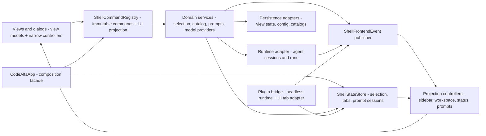

# Development Guide

Repository-wide development rules that should be enforced consistently belong here.

Add a rule here when it is important enough that contributors and agents should reliably follow it. Do not use this document for temporary plans or one-off design notes.

## Async And UI Threading

- Frontend UI flow defaults to plain `await`.
- Do not use `ConfigureAwait(false)` in UI code or UI callbacks when the continuation reads or mutates bindable state, view models, controls, presentation state, or frontend coordinator state.
- `ConfigureAwait(false)` is allowed in explicit background or infrastructure code such as libraries, SDKs, transport, persistence, filesystem I/O, pumps, workers, and startup code that marshals back before touching UI-owned state.
- When code leaves the UI flow for background work, keep the boundary explicit and narrow.
- If background work needs to update UI-owned state afterward, marshal back to the UI dispatcher first.
- File-editor watcher notifications are attachment-scoped: post to the captured terminal app, ignore notifications while unmounted, reconcile disk state on attachment, and invalidate pending callbacks on detach/disposal. Watcher threads must not mutate bindable state or post through an unattached global dispatcher.
- Do not introduce workaround abstractions only to compensate for incorrect frontend `ConfigureAwait(false)` usage.

## Architecture Boundaries

- Keep reusable agent/session orchestration out of frontend projects. `CodeAlta.Tui` (`altatui`) owns terminal controls, view models, visual projections, dialogs, and adapters from user actions to application/runtime commands; `CodeAlta` / `alta` owns the in-development native desktop lifecycle and generated RPC/React presentation. Lower-layer projects must not reference either frontend, and the desktop must not reference the TUI or initialize terminal controls.
- Keep desktop native fixtures under `CodeAlta.Desktop.Tests`, outside production assets and contracts. Native tests require explicit opt-in and report unavailable graphical infrastructure as inconclusive, not native success. All automation injects a task-owned data root; do not enable default-profile desktop startup before shared ownership is implemented. See [native qualification](desktop-native-qualification.md).
- Keep the in-process `alta` tool name, CodeAlta product identity, neutral library namespaces, and shared `.alta` persistence paths stable across frontend/package renames. The broad `CodeAlta.Tests` assembly keeps its identity and references the TUI for existing frontend coverage.
- Keep `CodeAlta.Orchestration`, `CodeAlta.Orchestration.Hosting`, `CodeAlta.Plugins`, and `CodeAlta.Catalog` independent from the TUI project and terminal UI controls.
- `CodeAltaOwnedServices` retains the existing `CodeAltaHost` as its sole runtime-service disposer; its host-exposed services are borrowed views, not a parallel disposal graph. The host still borrows a supplied prestarted plugin runtime. Program remains that runtime's owner, so its actual shutdown now occurs in Program's existing outer `finally`, after TUI host/metadata cleanup rather than during it. This timing change does not establish complete plugin/metadata lifetime qualification. Keep `CodeAlta.Hosting` composition-only; do not introduce a replacement application owner or transfer plugin ownership implicitly.
- Host and outer TUI disposal each use one instance-owned `Lazy<Task>` with default execution-and-publication and mandatory named operation factories. Validate every callback synchronously in signature order, even borrowed callbacks, without invoking it. First access starts inline; ordinary repeated/concurrent callers share the pending or terminal task with no retries. Attempt host runtime → hub → registry → owned plugin → owned logging, then at the outer level await the entire host task → models.dev → owned logging. Each stage catches synchronous throws, asynchronous faults and cancellation and attempts later stages. Rethrow a lone original exception through EDI (lone cancellation yields a canceled task); aggregate multiple direct exception references in execution order without flattening. A host aggregate stays intact when reported by the outer layer. Borrowed callbacks remain uncalled. Do not add a disposal bag, shared error helper, scheduler or generic lifetime facade.
- Same-owner reentrant disposal is unsupported: recursive lazy initialization can throw, and awaiting the already published disposal task from its own callback can deadlock. There is no hard timeout or guarantee that failed/noncooperative children have terminated. Partial-creation rollback, pending startup joining, frontend/probe/refresh/reminder/update lifetime, lower-owner complete disposal and early admission remain separate open work. Characterize only the actual named factories with instance-owned recording operations, independently retained fault/cancellation/gated tasks and finally-released manual gates; all independent observations must be attempted with five-second bounds even if another times out. Never construct real owners/services or use a temporary profile as an isolation shortcut. Named-source tests establish wiring only, not concrete shutdown safety.
- Keep `CodeAlta.Hosting` composition-only. It owns configured provider registration/defaults, bounded cached/temporary inspection, configured Copilot device-login/deletion/cached-status orchestration, xAI's distinct browser-PKCE/device-login/deletion/cached-status orchestration and Codex credential deletion/local account metadata lookup/device and browser login/authentication testing. Registration borrows the registry/config store/models.dev service; inspection directly owns only its temporary runtime, with no temporary registry or new application owner. TUI keeps key lookup, lazy root selection, localization, browser launch and presentation; other auth/configuration/refresh workflows and metadata refresh lifetime remain there until separately extracted. Copilot/xAI orchestration preserves manager construction before root/options and the existing absence of manager/HTTP-client disposal; mandatory call-scoped fake factories must never fall back to production in tests. Cached status is not live authentication; xAI status does not reject expired credentials or apply Copilot-style refresh skew. Keep concrete auth/protocol code, including xAI loopback binding, teardown and exception transformations, in provider packages and persistence in Catalog. Wrapper fakes do not qualify those concrete paths or application lifetime. Add references only for implemented composition, never to either frontend or to anticipate later LiveTool/plugin wiring. The existing `CodeAlta.Orchestration.Hosting` APIs remain in Orchestration.
- Codex deletion: validate required definition/root/message callbacks (and the internal mandatory factory) in order, then exact ordinal `codex`, before invoking the factory with the original definition and lazy-root references. Preserve root callback/store validation → HTTP/OAuth-client construction → key read/login-manager validation → awaited deletion with the original token. Do not snapshot/normalize root/key values, duplicate provider null/blank validation, bypass the manager, add early cancellation/context suppression/scheduling/retry/wrapping/disposal, or treat the trusted backend root as a renderer grant. The store rejects null/blank roots without trimming/fallback; TUI root selection remains unchanged. Deletion removes a credential file, not remote authorization; merely constructing the OAuth client does not perform an OAuth network exchange. No secret metadata or result DTO crosses the deletion boundary, and constructor/callback/operation exceptions propagate. Keep Codex authentication-test presentation in TUI; preserve the original shared login-manager and credential-message helpers even though unused, not called by browser login. Preserve in-memory characterization and bounded gate cleanup mechanically; deletion public guard tests must fail required-null checks before any production factory, with a nonmatching synthetic type as a second barrier. Source guards inspect only named checkout files and preserve the nested expression, not prove concrete constructor/storage behavior. Existing manager/HTTP-client non-disposal and broader lifetime/native parity remain unqualified.
- Codex account lookup has no type/auth-source/enabled/expiry/access-token guard: required definition/root/onMetadata/factory guards precede deferred store construction, key read/load, null short circuit, original definition's post-load configured-ID read, existing resolver, once-only raw-label projection and synchronous callback. Keep the nullable two-string `CodexAccountMetadata` record free of credential/lazy credential captures; missing credential differs from missing ID. The accepted raw-label snapshot is not mechanical equivalence to two mutable property reads. TUI formatting stays in the post-load continuation before operation completion; preserve raw nonblank labels, local root policy and the noncancelable dialog adapter. This is local owned-store lookup, not remote enumeration or auth validation/import/refresh. Storage/resolver/callback exceptions propagate; add no early cancellation, settlement framework, disposal, scheduling, context suppression, retry or metadata logging. Metadata may be personal data and the trusted backend root is not a renderer grant or sandbox. Public account tests must fail required-null guards before construction: unlike deletion, a mismatching type is NOT a secondary barrier. Never probe with only invalid key/root values. Mechanically retain recording fixtures and bounded cleanup; named-source checks preserve projection order without qualifying concrete storage/JWT behavior, provider authentication, application lifetime or native parity.
- Codex device login: preserve the seven nonoptional public parameters and required guard order definition/root/mismatch/report/prefix/completion, then internal mandatory factory, then exact ordinal `codex`. Forward original references/token; only mismatch invokes its formatter before factory/root. Keep the exact deferred root/store → HTTP/OAuth → original key/manager construction and validation, existing `CompleteDeviceLoginAsync`, unspecified `TimeProvider`, and report adapter that ignores its callback token and synchronously forwards raw `VerificationUri` STRING then `UserCode` without URI parsing. Reporting completion is not dispatcher rendering completion. After the manager await, invoke prefix localization FIRST, capture raw nullable `AccountId` ONCE, then synchronously invoke completion with prefix/ID without an intervening await. This separately accepted read-count deviation is not arbitrary-property or task identity/stack/settlement equivalence; add no resolver, trimming, label, account-metadata reuse, secret/protocol DTO or lazy credential capture. Completion can fail after persistence. Preserve all TUI formatting/root/dialog cancellation and shared helper/credential formatter boundaries; authentication-test orchestration is also composed by Hosting. Add no eligibility guards, early cancellation, disposal/ownership, context suppression, retry, scheduling, wrapping or settlement framework. Transient authorization display and personal metadata must not acquire extra logging/persistence; roots are trusted backend input, not renderer grants or sandboxes. Retain all original recording methods and complete instance-owned helpers mechanically across Hosting/TUI. Public device tests must fail required-null guards before concrete factories (nonmatching type is secondary only); never probe with invalid type/key/root alone. No secret/protocol records or concrete runtime/provider objects in fixtures. Release all manual gates in `finally`, join all started work with at most five-second bounds, observe expected failures/cancellation, and dispose CTS only after joining. Named-source checks and inert forwarding do not qualify real protocol/storage, native parity or lifetime; existing SR output-directory reads and writerless logging remain.
- Codex browser login belongs in Hosting: preserve eight nonoptional public parameters definition/root/mismatch/report/opener/prefix/completion/token and seven required-object guards in that order, then the internal mandatory factory guard, then ordinal `codex`. Only mismatch formats; forward original definition, lazy-root and callback references/token. Keep the exact deferred root/store validation → HTTP/OAuth → original key/manager expression. The operation reads original configured `AccountId` AFTER construction at Begin → stores `WaitForBrowserCallbackAsync(...).AsTask()` → reports `login.AuthorizeUri` → opens with a separate URI property read → awaits the stored task → invokes prefix → captures raw nullable ID once → synchronously completes without an intervening await. Preserve the accepted browser nonblank two-reads-to-one deviation, supported by fresh sealed credential/plain property and concrete save, not arbitrary-property or task identity/stack/settlement equivalence. Cross callbacks only with primitive display `Uri` and prefix/raw nullable ID, never credential/PKCE/state/context objects, DTOs, resolver/label/metadata reuse or lazy credential getters. Authorization query/correlation/personal data grants no extra logging, persistence, parsing, snapshots or normalization. Keep TUI display helpers, opener, root policy and dialog cancellation verbatim; the root is trusted backend input, not a renderer grant or sandbox. Preserve missing wait join after report/custom-opener failure and real opener's ordinary-exception suppression; an abandoned wait may later persist. Already-faulted/canceled returned waits still allow reporting/opening before await; a synchronous fake start-wait throw is distinct from ordinary async provider failures. Provider success is status 200 `text/plain; charset=utf-8` after save, not HTML; response/cleanup may supersede earlier outcomes and presentation may fail after persistence. Add no early cancellation/context suppression/scheduling/retry/wrapping/ownership/disposal/settlement remediation; manager/HTTP-client non-disposal remains. Preserve all 19 original method blocks mechanically as 12/50 Hosting and 7/28 TUI, plus both entire corrected helper suffixes. Add only eight Hosting public required-null rows (seven objects individually and all-null), checking already-faulted tasks/exact parameters with throwing callbacks; nonmatching type is secondary, never a public success/type/key/root-only probe. Retain independent waits before invocation, all gate releases/cancels and nested route/wait joins in `finally`, five-second observations and CTS disposal after joins, including abandoned/already-faulted waits. Inert begin/wait events are recording behavior, not concrete protocol/listener/storage coverage or native/lifetime qualification. Keep the existing named-source boundaries without discovery and preserve the unused shared TUI manager/credential helpers; authentication testing is also composed by Hosting.
- Codex authentication testing belongs in Hosting through `TestAuthenticationAsync` with five nonoptional parameters: definition/root/mismatch/completion/token. Guard the four required objects, then the internal mandatory factory, before ordinal `codex`; forward original references/token without consuming root or configuration. Preserve deferred root/store → HTTP/OAuth → original key → null-only auth-source default → configured ID → Codex-home discovery → manager construction, including discovery before key validation for every matching source. An invalid key is not a discovery barrier; roots remain trusted backend inputs, not renderer grants or sandboxes. After `GetAccountContextAsync`, capture the fresh sealed positional context's provider-resolved ID once and synchronously present it with the original blank fallback/whole-message localization; there is no prefix step. This separately accepted one-read deviation is distinct from raw credential-ID browser/device contracts, not arbitrary-property or task identity/stack/settlement equivalence. No credential/context/protocol/metadata record or lazy credential getter crosses the completion callback; IDs may be personal data and gain no additional logging. Testing may import, refresh, save or delete credentials, and fresh cached credentials need no live validation; the readonly auth-file source is not operation-wide read-only. Side effects can precede expiry checks, context resolution or presentation failure. Preserve constructor/callback/protocol/storage exceptions escaping the provider, the noncancelable dialog adapter and existing base-exception message display, which does not guarantee arbitrary errors are sanitized. Add no disposal, early cancellation, context suppression, retry, scheduling, wrapping or settlement framework. Preserve unused TUI auth/login helpers, formatter/opener/root and all unrelated routes. Mechanically preserve all 16 original complete method/attribute/body blocks as 12/49 Hosting and 4/15 TUI, copying the entire frontend-free helper suffix into both fixtures, including unused helpers, with operation alias rebinding only. Add one Hosting public guard method with five rows: each required object individually null and all-null; assert already-faulted tasks and exact parameter names with throwing callbacks and a secondary nonmatching type. Never public success/mismatch-only/key/root probes. Keep ten named-source boundaries, updating only the existing authentication guard and public allowlist/caller ownership. Named-source guards prove wiring, not real discovery/protocol/storage, native parity or lifetime qualification; synthetic gates must be released in `finally`, all work joined within five seconds, and CTS disposed after joins. Existing SR output-directory localization and writerless test logging remain, not zero I/O.
- Keep plugin orchestration hooks headless. Frontend code may render plugin-derived projections or adapt plugin UI/tab services, but should not own agent event observer dispatch or derived-event creation.
- Keep plugin prompt/notification abstractions minimal data contracts. Do not reproduce `XenoAtom.Terminal.UI` toast or control APIs in plugin abstractions; terminal controls and dialogs stay owned by the frontend.
- Treat plugin-derived session/timeline events as transient projections. Do not persist them as canonical user/agent transcript events unless a future decision explicitly changes the event model.
- Prefer named ports, request/response DTOs, immutable snapshots, and event streams over large callback aggregates or callback-wrapper context classes.
- New shell/application contracts should use `ModelProvider` terminology for selectable LLM runtime and endpoint configuration. Do not introduce new `Backend` names for provider/session ownership; keep remaining backend strings limited to explicit compatibility wire/config names or real third-party terminal/backend concepts.

### Agent runtime, sessions, and model providers

The current provider/session split is intentional and should be preserved:

- `AgentHub` is the in-process active-session facade. It owns active session handles, per-session run coordination, abort/steer/compact flow, and provider resolution for start/resume/run. It must not own persisted session discovery or model-provider probing.
- `SessionRuntimeService` is the headless orchestration service that maps UI/live-tool session actions to runtime requests, prompt queues, skill activation, session history, and `SessionRuntimeEvent` projections.
- Execution-options assembly belongs to Orchestration's `SessionExecutionPolicy`: capture an immutable `SessionExecutionRequest` from explicit session/project descriptors and provider/model/reasoning/agent-prompt choices before binding host tools and interaction adapters. Existing sessions resolve their own `ProjectRef`; draft creation must carry its captured project through the frontend route, never infer authority from selected tabs or nonempty roots. Tool caller project/working-directory values and handler fallback identity must remain tied to that captured context; only the intentional post-creation canonical session-id binding is deferred. These are trusted backend inputs, not renderer grants or tool approvals. Keep LiveTool service resolution and UI callbacks out of the portable policy. Immediate user-input answer selection belongs to Orchestration's pure `SessionUserInputPolicy`; permission policy and pending completion ownership belong to `SessionRuntimeService.Permissions`.
- Keep immediate user-input policy separate from presentation: the TUI coordinator retains entry cancellation, captured session association and AutoApprove setting, and open-tab timeline rendering. Preserve the existing substring scores/question heuristics, first-tie selection, literal labels, option precedence over secret/freeform flags, no-option defaults, and ordinal/duplicate answer-id behavior. These trusted request/setting inputs are not renderer permissions; extracting the policy does not introduce pending question UI, shared `alta ask` ownership, reconnect/recovery or lifecycle guarantees.
- `SessionPermissionService` owns the existing AutoApprove decision and attempt-scoped pending permissions outside lossy runtime streams. Frontends capture the setting, present still-pending requests and resolve full session/run/interaction/attempt handles; never expose completion sources or use open tabs as completion authority. Preserve explicit provider-session precedence over captured permission fallback as a trusted callback association, not renderer authorization. Keep user waits outside the mailbox, remove completed entries without tombstones, cancel permissions before joining runtime runs, and join queued presentation/closure work. Disposing presentation alone is not permission cancellation; caller cancellation, explicit Cancel and owner shutdown are. Pending summaries retain scalar preview data, not mutable provider payload collections. User-input/`alta ask` ownership, durable recovery and whole-application close/reload qualification are separate work.
- `IAgentSessionStore` and `IAgentSessionCatalog` are the durable session owners. Session listing, metadata reads, history reads, and deletion are provider-independent for one configured sessions root. The SQLite projection cache under `~/.alta/cache/cache.sqlite3` is only an implementation cache for metadata/session-view overlays: JSONL journals remain authoritative, missing/corrupt cache databases rebuild from journals, and locked-cache failures must surface rather than falling back to a slow scan. Keep the listing surface streaming-only through `IAsyncEnumerable<AgentSessionMetadata> ListSessionsAsync(...)`; callers that need a list can materialize at the edge.
- Model providers own configured provider identity, protocol adaptation, readiness, capabilities, and model catalogs only. `IModelProviderRegistry` and `IModelProviderInitializationService` initialize/probe providers independently and must not gate local session listing, session history loading, or project import.
- Provider initialization starts eagerly after provider descriptors/configuration are available and runs concurrently with session catalog listing and pending-session restore. A slow or failing provider must become a provider state, not an application startup failure.
- Active sessions must remain independently scheduled. Use per-session ownership/serialization for mutable runtime state and event append ordering; do not add a process-wide run lock, event-writer lock, or provider/session deduplication layer.
- Parent/sub-session relationships are lineage/orchestration metadata only. Do not make child sessions share the parent's run gate, cancellation token, provider continuation state, or journal writer after creation.
- Conversation-like orchestration and UI concepts should use `Session` or `SessionView` naming. Keep `Thread` only for actual OS/runtime threading, framework terms, or explicit tolerant readers/legacy view-state APIs that still load old session-view data.
- Removed `AgentBackendId`, `BackendId`, `IAgentBackend`, and `AgentBackendFactory` symbols must not be reintroduced. Use `ModelProviderId`, `ModelProviderDescriptor`, `IModelProviderRegistry`, and `IModelProviderRuntime` for selectable providers.
- Avoid `LocalRuntime`, active `LocalAgent*`, and broad `CodeAlta*` runtime class prefixes in `CodeAlta.Agent`; use neutral agent/session/provider names such as `AgentRuntime`, `AgentSession`, and `AgentModelProviderRuntime`. Keep legacy `backend*`, `Local*`, and `Thread*` terminology only for explicit persisted/wire/config compatibility or genuine external framework/runtime terms.
- Compatibility constraints are user data and configuration only: existing session journals and legacy session-view view state must remain loadable with tolerant reads of legacy `BackendId`/`SessionId`/provider fields, and existing provider `config.toml` / `[providers]` semantics must stay stable unless a focused migrator is added.

Existing guardrail coverage to keep intact when touching startup/session boundaries:

- `src/CodeAlta.Tests/AgentSessionCatalogTests.cs` covers concurrent callers sharing one catalog load, cached streaming snapshots, corrupt-file tolerance, and provider-independent listing for missing/disabled providers.
- `src/CodeAlta.Tests/SessionJournalSqliteCacheTests.cs` covers SQLite session-cache rebuild, hot listing, locked-database errors, stale-row pruning, external reconciliation, write-through projection, and corrupt-journal tolerance.
- `src/CodeAlta.Tests/CodeAltaShellControllerTests.cs` covers sessions becoming visible before provider initialization completes, provider initialization starting before slow session scans complete, and complete startup catalog loading through one recoverable session stream.
- `src/CodeAlta.Tests/ModelProviderInitializationServiceTests.cs` covers per-provider failure/timeout isolation and model-list caching/reuse.
- `src/CodeAlta.Orchestration.Tests/AgentHubTests.cs`, `src/CodeAlta.Tests/AgentSessionJournalFileTests.cs`, and `src/CodeAlta.Orchestration.Tests/SessionRuntimeStressTests.cs` cover per-session runtime coordination and journal/concurrency behavior.

## Frontend Shell Shape

The TUI frontend should stay organized around explicit state, commands, events, and projections rather than broad callbacks into `CodeAltaApp`:

- `CodeAltaApp` is the TUI shell composition root and compatibility facade. `ShellFrontendHost` is only the run/tick/dispose lifecycle wrapper; do not treat it as the owner of frontend service composition.
- Guardrails should prevent `CodeAltaApp` from becoming a broad callback target again: new behavior belongs in named command services, domain coordinators, events, projection controllers, or explicit adapters.
- Remaining `CodeAltaApp` internal methods are grouped by owner: composition/lifecycle wiring; provider and prompt services; projection/status/focus adapters; catalog/selection/session restore coordinators; and tab/file/dialog command routing. Move a method only when doing so deletes callbacks/adapters or shortens an existing call path.
- Views and dialogs receive view models plus command/service interfaces; they should not receive long domain callback lists.
- Selection, catalog, tab, prompt, model-provider, runtime, persistence, and plugin changes should either publish a typed frontend event or return a typed command/use-case result that a small application service projects.
- Shell commands are single immutable `ShellCommand` objects: metadata, placement, visibility/availability, dynamic label, routing flags, and execution callback live together. Add a built-in command by adding one static command instance and one `BuiltinShellCommands.Enumerate()` entry.
- Command activation is no-argument UI activation. Commands read current UI state through narrow `ShellCommandContext` ports or open dialog/controller workflows for additional input; do not reintroduce slash-tail parsers, runtime argument containers, or command-ID switch dispatchers.
- `ShellCommandViewFactory` is the shared XenoAtom projection path for command palette, command bar, shortcuts, help, and placement registration. It forwards the triggering `Visual` to availability, visibility, dynamic labels, and execution, and runs async callbacks through the UI command runner/status diagnostics path.
- Plugin commands enter the same registry by adapting `PluginCommandContribution` instances. The frontend may add generic insertion points, but must not add plugin-specific command, dialog, or status wiring.
- Logical draft, session, editor, and plugin tabs should be inspectable through a single shell tab state/service model even when a visual toolkit requires cached tab-page instances.

## Runtime Orchestration Concurrency

- Runtime session state should have a clear single writer. Prefer per-session mailbox/actor-style command processors for mutable orchestration state instead of scattered locks, callback mutation, and frontend-owned workarounds.
- Pending `alta ask` queue and response authority stays in neutral LiveTool's `AltaAskService`, under its existing instance lock. Copy nested question/choice collections at admission; expose immutable `Peek`/`GetPending` snapshots independent of tabs. `RespondAsync` claims the current owner-issued generation before formatting/history/dispatch; only its private settlement removes an admitted claimed head. Definite non-admission rotates the handle; uncertainty retains a non-replayable Indeterminate head. TUI cancellation must use `TryCancelResponse(handle)`, never raw keys that could cancel a newer attempt of the same ask. Exact ordinal `TryRemoveHead` remains available for unclaimed heads only. No historical attempt map, provider/UI callbacks or awaits belong under queue ownership. `QueueChanged` is outside-lock invalidation/requery, not ordered replay: attempt every subscriber and return immutable scalar `NotificationErrors` with committed mutations, without logging or diagnostic sinks.
- Ask-only dispatch uses the small Orchestration `SessionPromptResponseDispatch` evidence seam. Plugin interception/pre-invocation failure is not admission by this route (nor proof of no plugin side effects). Entering runtime invocation latches uncertainty; only recognized Submitted plus a valid run ID latches positive late evidence before frontend projection. Later UI failure cannot turn that evidence into retry. Do not infer early admission, provider success or safe retry from task completion, cancellation or a bare run ID. Keep ordinary prompt/queue/steer behavior separate. Settlement precedes frontend reconciliation; stale generations cannot reconcile a fresh form. An unresolved head blocks later asks and local cancel/resubmit, with no recovery operation in this slice. Persistence, reconnect, application-owned execution lifetime and authoritative earlier runtime receipts remain unimplemented.
- Actor-style orchestration is an internal implementation pattern: public APIs should expose session/run ids, request DTOs, snapshots, handles, and events, not actor references, actor paths, or mailbox channels.
- Reminder firing ownership stays in LiveTool's `AltaReminderService` instance gate. Verify membership/cancellation and capture the immutable descriptor plus content together immediately before dispatch; pass only that snapshot to delivery. Capture authorizes one local attempt, not runtime admission. Edits after capture affect later firings; delete after capture prevents repeats/bookkeeping but cannot retract that send, queued work or a run. Update completion metadata from the still-owned entry so later edits survive. Keep clock/timer callbacks, service resolution, dispatcher/UI work and awaits outside the gate. Preserve noncancelable `session send --stdin --queue-if-busy`, fixed-delay repeats after delivery returns, failure counting and process-only state. Timer shutdown/join, lazy registration concurrency, retained-history bounds and busy/send admission races remain separate work; this is not application-owned execution lifetime or exactly-once delivery.
- Reminder `Changed` is invalidation/requery, not ordered replay. Capture scalar change context under the reminder gate, then invoke every captured subscriber outside it. Observer exceptions, including `OperationCanceledException`, are feedback failures only: return immutable per-operation `AltaReminderNotificationFailure` through additive CRUD overloads, without changing committed results or timer/delivery cancellation. Retain at most eight messages of 512 characters and the total failure count/truncation flag; never retain exceptions or invoke a logging/diagnostic sink. `GetLastNotificationFailure()` exposes one latest failed-pass publication in instance-owned state, even after deletion. Publication order is not mutation order; success does not erase the snapshot, later failures overwrite it, and publishing feedback never raises another event. Reentrant mutations remain effective and stale context must not restore old entry metadata. Async feedback is query-based and process-only. TUI reports post-commit reload/refresh errors separately from mutation errors; blocking/infinite reentry, later posted-UI failures, status presenter failures and reliable diagnostic delivery remain unqualified.
- Async completions, provider/session callbacks, and plugin observer results must be converted into runtime commands/events before they mutate mailbox-owned state.
- Use bounded queues or documented overflow/coalescing policies for runtime and plugin event streams.
- Do not add Akka.NET or another actor framework as a default dependency. A framework dependency requires a separate decision record/spike showing that it simplifies supervision, testing, shutdown, and host integration compared with the internal mailbox pattern.

## State And Mutability

- Do not add static mutable data anywhere in the codebase. Prefer instance-owned state, DI-managed services, immutable static data, frozen collections, or generated constants.
- Runtime/session state should be owned by explicit services or mailbox actors. Avoid process-wide lock maps and static caches for runtime/session ownership.
- Persist user-owned state only through the catalog/runtime stores that own that data. Do not write config, session journals, prompt drafts, plugin state, or UI state from unrelated layers.
- Session notes are journal-authoritative and tab-independent. Route live-tool reads/writes through `RuntimeAltaNotesService` and `SessionRuntimeService`, capturing a source/fallback ID before awaiting stdin or storage. Never fall back from an unknown explicit ID, start a provider to access notes, or read durable notes synchronously in a UI constructor. Use the canonical bounded-memory latest-event query and existing per-journal gate, not a notes cache or new database. Post-commit notifications must be nonblocking/non-reentrant and stay in write order; only frontend adapters mutate open-tab/sidebar projections. Finish an admitted single-record write without caller cancellation, and distinguish post-commit feedback errors from uncommitted operations. This contract does not add renderer grants, cross-process/power-loss atomicity, or general lifecycle/reload recovery.
- Before notes append, validate canonical journal content on the same handle using the existing parser in strict mode. Preserve a valid unterminated final record by adding a separator, but refuse malformed/truncated content without discarding bytes or reporting success. Ordinary tolerant reads are not append authorization. Gate-owned metadata refresh must not reacquire the journal gate, and TUI committed notifications must always enqueue rather than overtake older queued projections via inline dispatch.
- Startup config recovery uses Catalog's `ConfigRecoveryService` with a captured absolute root and one shared codec for preflight, first-run creation and recovery saves. Validate complete text through the existing config owner, not provider/plugin initialization. Only successfully decoded/acknowledged snapshots are save baselines; unknown reads fail closed, conflicts never silently adopt revisions, and failed reload/save retains dirty UI text. Keep editing, discard confirmation and startup continuation in the frontend. Test the narrow preflight adapter with owned storage and fake callbacks, not the default deferred app constructor (which starts update checking). This does not establish comprehensive startup isolation or conditional persistence for other config mutation routes.
- Prompt-management dialogs use Catalog's `PromptResourceStore` with explicit roots and the application's shared `TextFileCodec`; editable fields and expected revision must come from the same loaded snapshot. Keep prompt discovery/composition in Orchestration and selection/confirmation/status controls in the frontend. Never refresh a revision invisibly before saving dirty fields or treat raw backend paths as renderer grants.
- Live-tool prompt create/edit must use that same Catalog store and host codec, not frontend-local serializers or direct path writes. Structured create validates/serializes metadata; raw edit captures an owner-bound revision/format baseline before awaiting replacement input and saves literal complete text without parsing metadata. Only genuine absence may become Missing; read/decode/conflict/write failure must not report mutation success or adopt another revision. Document command-entry timing honestly: it does not protect content assembled before invocation or close external path/check/commit races. Cancellation after acknowledged commit must not be reported as an uncommitted operation.
- Skill-management backends use Catalog's `SkillManagementService` and existing `SkillCatalog`/`CodeAltaConfigStore`; inject global/profile/project roots explicitly and capture UI selection before worker dispatch. Keep authoring validation/storage and skill enablement TOML edits out of dialogs, while activation, editor dispatch and feedback stay in frontend adapters. Skill opens carry catalog-resolved `TextFileDocument` provenance through the existing editor; all saves/overwrite callbacks retain it and use the shared codec's document-aware policy guard. UI enablement alone is not write protection, and path-keyed reuse must never downgrade a protected document or discard dirty text. Do not infer a profile from a temporary global root or assume it isolates Git ancestor/global-ignore discovery; see [catalog and config](catalog-and-config.md#plugin-and-skill-state) for fixture requirements, workflow/link-race limits, and remaining config transaction boundaries.
- Treat logs, traces, journals, prompts, command output, provider payloads, and plugin diagnostics as potentially sensitive user data.

## Provider Defaults And Compatibility

- Provider-specific request defaults, compatibility profiles, and header/body defaults should live in the copied provider-defaults content file unless they require code-backed message transformation or SDK integration.
- Hosting owns the resolver/generated TOML context and `ProviderDefaults/provider_defaults.toml`; preserve its output/publish target and verify tool-package content when changing composition references. Characterize registration with synthetic documents, explicit state paths and uninvoked concrete factories, not default-profile host startup. A temporary state root does not isolate credential environment lookups, SDK discovery, instruction ancestors or plugin/MCP startup.
- Characterize inspection through mandatory call-scoped in-memory fake factories, never concrete runtime construction. Preserve cached test/list asymmetries, borrowed list identity, uncached-only sorting and ignored probe readiness. Keep synchronous frontend-owned message factories inside the existing disposal scope and preserve continuation context, token passthrough and disposal-exception precedence; no UI control/state access belongs in those formatters. Validate new public inputs before production factory forwarding, without treating a settings-rejection probe as a safe test shortcut.
- Keep `config.toml` backward compatible: existing `extra_body`, `profile`, `compaction`, and `model_overrides` semantics remain authoritative over built-in defaults.
- Do not add script-like provider transforms to config. Complex message restructuring must stay in code behind narrow, named compatibility flags.

## MCP Configuration And Runtime Boundaries

- Keep MCP server connection definitions only in fixed JSON MCP files: global `~/.alta/mcp.json` and project `<project>/.alta/mcp.json`. Do not add scans of editor/provider-specific MCP paths or additional per-scope MCP files.
- Preserve the MCP overlay contract: load global JSON first, then project JSON when a project scope is active; a project server key shadows the matching global server key without creating duplicate connections or tools.
- New MCP JSON files should use CodeAlta's `mcpServers` root. Existing supported MCP JSON flavors must be detected and preserved when writing.
- Keep TOML under `[plugins.mcp]` as policy only. Server connection fields stay in JSON; server/tool enablement (`disabled_tools`), prompt caps, timeouts, static policy knobs, and direct-exposure settings belong in TOML.
- Direct dynamic MCP `AgentToolDefinition` exposure is shipped behavior: enabled/config-controlled MCP tools are exposed where policy allows. HTTP/SSE OAuth browser login is shipped only through explicit dialog/`alta mcp auth` actions, with tokens stored in CodeAlta-owned local state rather than JSON/TOML config; background discovery and agent-tool enumeration must stay non-interactive. Do not document timeline display refinements, resources/prompts/elicitation, or `tool-list-changed` refresh as shipped until those paths have implementation and tests.
- Keep reusable MCP config, policy, runtime, and management code in the MCP plugin/runtime boundary. TUI-specific dialog/status rendering stays in the frontend project. See [MCP support](mcp.md).

## Public APIs

- Public APIs require XML documentation and should document thrown exceptions.
- Validate inputs early with specific exceptions. Use `ArgumentNullException.ThrowIfNull()` and `ArgumentException.ThrowIfNullOrWhiteSpace()` where appropriate.
- Keep APIs small and hard to misuse. Prefer named request/response records over positional parameter lists when a boundary is likely to evolve.
- Preserve nullable annotations. Do not suppress warnings without a justification comment.

## Documentation

- If a repository-wide development rule should be enforced, add or update it here.
- Keep `AGENTS.md` aligned with this document when agent-facing instructions depend on it.
- Update public docs, internal docs, and website pages when behavior changes.
- Internal docs must describe current implementation. Move completed plans or superseded drafts out of tracked docs rather than leaving them as active references.
- Keep `doc/readme.md` as the top-down navigation entry point and link detailed implementation docs from it.
