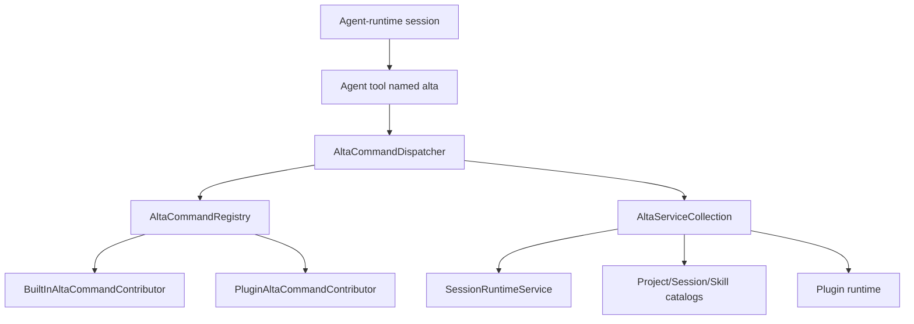

# `alta` live tool

`alta` is an in-process command gateway exposed to CodeAlta-managed sessions and trusted plugins. It is not a separate daemon and it does not keep command streams open. Each invocation builds a fresh command tree, runs one command, and returns help text or a finite JSONL transcript.

The terminal executable is `altatui`; this does not rename the in-process `alta` tool or turn its commands into shell subcommands.

## Architecture



Core types:

- `AltaSessionToolFactory` creates the agent tool named `alta` with `args`, optional `stdin`, `cwd`, output caps, and timeout.
- `AltaCommandRegistry` creates a fresh `XenoAtom.CommandLine.CommandApp` per invocation and merges built-in plus plugin command contributors.
- `AltaCommandDispatcher` captures stdout/stderr and flattens non-help results for live-tool consumption.
- `BuiltInAltaCommandContributor` contributes core `project`, `space`, `session`, `skill`, `provider`, `model`, `plugin`, `tool`, and `version` commands.
- `PluginAltaCommandContributor` adapts trusted plugin command roots while reserving core roots.

`CodeAltaFrontendComposition` wires the registry, dispatcher, service collection, plugin catalog bridge, and coordinator help text used by managed sessions.

## Tool input

The tool accepts CLI-style arguments excluding the executable name:

```json
{
  "args": ["session", "status", "<session-id>"],
  "stdin": null,
  "cwd": null,
  "maxOutputRecords": 50,
  "maxOutputBytes": 20000,
  "timeoutMs": 5000
}
```

Rules:

- `args` is required and must contain at least one string.
- `stdin` is used only by commands that explicitly accept `--stdin`.
- `cwd` is used for project-relative command resolution when supplied.
- output caps and timeout are optional positive integers; omit them unless a bound is needed.
- explicit JSON `null` for optional fields is treated like omission.

## Output contract

Help invocations return plain text:

```text
alta --help
alta session send --help
```

Non-help invocations return compact JSONL headed by an `alta.result` record. Handlers emit flat records that are intended to remain bounded and easy to parse. Commands that submit work return submission/queue metadata instead of waiting for a model run to finish.

Use `--detailed` only when per-item metadata is needed. Discovery commands default to compact aggregate records such as refs, keys, paths, or capability lists.

## Built-in command groups

| Group | Purpose |
| --- | --- |
| `version` | Report host/live-tool version metadata. |
| `ask` | Queue structured user questions for the calling session and return yield guidance. |
| `notes` | Get, replace, or clear the current session's sticky Markdown notes shown in the sidebar. |
| `project` | List, show, resolve and inspect current project context; add, rename, archive, unarchive and remove projects. |
| `space` | List, show, create, update, delete and reorder the spaces that group the projects, put projects in them, and show one in the window. |
| `session` | List, create, show, send, queue, steer, abort, compact, inspect, report, and coordinate sessions. |
| `reminder` | Schedule delayed prompt content for the current or another session, and list/delete reminders. |
| `job` | Start a shell command in the background of a session, list the jobs, read what they write, cancel them; the result is sent to the session when the command ends. |
| `skill` | List, show, and activate CodeAlta-managed skills. |
| `tool` | Inspect live-tool status and command capabilities. |
| `provider` | List configured providers and provider model refs. |
| `model` | List, show, and resolve model refs. |
| `prompt` | List, inspect, create, edit, and select file-backed agent or system prompts. |
| `plugin` | List and inspect the plugins and look their API up. In CodeAlta Desktop, also create, build and reload source plugins. |
| `diff` | Show the changed files of a project to the user. Only in CodeAlta Desktop. |
| `editor` | Show the files of a project to the user in the code editor. Only in CodeAlta Desktop. |
| `canvas` | List the canvases that plugins provide, show one, open, focus and close its tab, and run its actions. Only in CodeAlta Desktop. |
| `terminal` | List, create, read, type in, rename, show and close the terminals of the window. Only in CodeAlta Desktop. |
| `automation` | List, create, run, enable, disable and delete automations, and find the one that started a session. Only in CodeAlta Desktop. |
| `task` | List, show, propose, start, complete, set aside, dismiss and remove the follow-up tasks of a project. |
| `issue` | List and read the issues and the pull requests of a project, from the trackers of its plugins (GitHub, GitLab, Azure DevOps, Bitbucket, Jira). `issues` is the same command. |
| `jira` | Set up the Jira of a project and change its issues: status, login, create, comment, transition, assign (a plugin root). |
| `plan` | List and show the plans of a project, set the status of one, remove one. |
| `ui` | Give the calling session the tools that see and drive the window, or take them back. Only in CodeAlta Desktop (a plugin root, see below). |

`note` is a compatibility alias for `notes`. Prefer the plural `notes` group because it names the sidebar panel and the single sticky notes document. `skills activate` and `skills_activate` are compatibility aliases for `skill activate`. Prefer the singular `skill` group in new prompts and docs.

## Common discovery commands

```text
alta --help
alta tool status
alta tool capability list
alta notes get
alta project current
alta session current
alta project list
alta space list
alta space current
alta provider list
alta model list --provider <provider-key>
alta prompt list --scope all
alta skill list --project <project>
alta plugin list
alta mcp status
alta mcp tool search
```

Most list commands support compact defaults plus a `--detailed` mode.

## Project commands

A project is a folder CodeAlta knows, kept in the catalog of the user. Projects are grouped in spaces
(see "Spaces" below): every project is in the default space, and can be in others.

```text
alta project list [--space <space> | --all] [--include-archived] [--detailed]
alta project show <project>
alta project resolve [--path <path>]
alta project current
alta project upsert <path>
alta project add <path> [--space <space>]...
alta project rename <project> <name>
alta project archive <project>
alta project unarchive <project>
alta project remove <project> [--delete-sessions]
```

`<project>` is the id of a project, its slug or its path.

- `list` lists the projects of the current space: the one the CodeAlta Desktop window shows, or every
  project when no window says what it shows (CodeAlta TUI, a window that is closed, a space that is
  gone). `--space <space>` lists another space, and `--all` or `--space default` every project. The
  compact record is `alta.project.refs` (`spaceId`, `projects`: slug and path of each); `--detailed`
  emits one `alta.project.item` for each project, then `alta.project.summary` (`count`, `spaceId`).
- A project record (`alta.project.item`, `alta.project.detail`, `alta.project.resolution`,
  `alta.project.upserted`, and the records below) has `projectId`, `slug`, `name`, `displayName`,
  `projectPath`, `defaultBranch`, `archived`, `sourcePath`, `description`, `tags` and `spaces`: the
  ids of the spaces of the project besides the default one.
- `current` answers the project of the calling session, and otherwise the catalog project of the cwd.
  A session that works in a git worktree is not in the folder of its project: it still gets its project.
- `add` adds a folder to the catalog, as `upsert` does, and puts the project in the spaces named. A
  folder that is a project already only joins them. It emits `alta.project.added` with `created`.
- `rename` changes the name CodeAlta shows for a project; its id, its slug and its folder stay. It emits
  `alta.project.renamed` with `previousName`.
- `archive` and `unarchive` emit `alta.project.archived` with `archived` and `changed` (false when the
  project was in that state already). An archived project leaves the lists; its folder, its sessions
  and its spaces stay.
- `remove` removes a project from the catalog and never touches its folder. A project that has
  sessions is not removed (`project.hasSessions`, exit code 7): archive it, or pass
  `--delete-sessions` to delete its sessions with it. Then a running session stops the command
  (`project.sessionsRunning`), and a session does not remove its own project
  (`project.callerSession`). It emits `alta.project.removed` with `deletedSessions` and
  `deletedSessionIds`.

`project.notFound` and `project.pathNotFound` (exit code 3) answer a project or a folder that is not
there. `project.conflict` (exit code 1) answers a project file that changed during the command, and
`project.unsupported` (exit code 7) one that cannot be edited as it is written.

## Spaces

A space is a named group of projects. The default space (`default`) holds every project and cannot be
deleted; a project can be in several spaces. A space has an `id`, worked out from its name when it is
created and never changed afterwards, a `name`, and optionally a `description`, an `icon` and a
`color`. The description tells what the space is for, so that an agent knows which projects belong
there. The group exists in a host that registers a `SpaceCatalog` (CodeAlta Desktop and CodeAlta TUI).

```text
alta space list
alta space show <space> [--include-archived]
alta space current
alta space create --name <name> [--description <text> | --stdin] [--icon <name>] [--color <#rgb|#rrggbb>] [--project <project>]...
alta space update <space> [--name <name>] [--description <text> | --stdin] [--icon <name>] [--color <color>]
alta space delete <space>
alta space add <space> <project>...
alta space remove <space> <project>...
alta space reorder <space>...
alta space switch <space>
```

`<space>` is the id of a space, its name, or the start of its id when only one space starts so
(`usage.ambiguousSpace` otherwise).

- `list` emits one `alta.space.item` for each space, the default one first, then `alta.space.summary`:
  `id`, `name`, `description`, `icon`, `color`, `default`, `projectCount` (the projects that are not
  archived) and `current` (true for the space the window shows, or for the default space when no
  window says what it shows).
- `show` emits `alta.space.detail`: the same fields and `projects`, each with `id`, `slug`, `name`,
  `path` and `archived`. Archived projects are listed with `--include-archived`.
- `current` emits the `alta.space.detail` of the space the window shows, with `shown: true`. Without a
  window, or when that space is gone, it is the default space with `shown: false`.
- `create` emits `alta.space.created`, with the ids of the `--project` it was given in `projects`. The
  description comes from `--description` or from stdin with `--stdin`, not from both.
- `update` changes what is given and leaves the rest; an empty value (`--description ""`, `--icon ""`,
  `--color ""`) removes it. It emits `alta.space.updated` with `changed`, the names of the fields that
  changed. The default space takes a name, a description, an icon and a color like the others.
- `delete` emits `alta.space.deleted`. The projects of the space, their folders and their sessions
  stay, and the projects are still in the default space.
- `add` and `remove` emit `alta.space.projects`: `spaceId`, `added` or `removed` (the ids of the
  projects that changed), `unchanged` and `projectCount`. A project that joins a space stays in the
  others it is in.
- `reorder` puts the spaces in the order given; those not named follow in their present order, and the
  default space stays first. It emits `alta.space.order` with `ids`.
- `switch` shows another space in the CodeAlta Desktop window and emits `alta.space.shown` (`spaceId`,
  `name`). It exists only where a window shows one space at a time (`IAltaSpaceView`), changes what the
  window shows and no setting of the user, and is for when the user asks to see another space: `show`
  reads any space. `view.unavailable` (exit code 5) answers when no window is open.

`space.notFound` (exit code 3) answers a reference that is no space. `space.invalid` (exit code 2)
answers a name, a description, an icon or a color the catalog does not take, with its reason.
`space.refused` (exit code 7) answers what cannot be done: deleting the default space, `add` or
`remove` on it, one space too many. `space.conflict` (exit code 1) answers a file that changed during
the command.

After each command that changes a space or a project, the window is told (`IAltaSpaceView.NotifyChanged`)
and reads them again.

## Session commands

Useful read commands:

```text
alta session current
alta session list --project <project> --state all --limit 20
alta session info <session-id>
alta session status <session-id>
alta session children <session-id> --recursive
alta session model <session-id>
alta session result <session-id>
alta session metrics <session-id> --scope last-turn
alta session tail <session-id> --last 10
alta session events <session-id> --kind assistant.message --fields timestamp,kind,text
```

`alta session current` is the shortest way for an agent-invoked live-tool call to discover its own CodeAlta session id. It does not require a session catalog lookup; outside a caller with session context it returns a usage diagnostic.

A session of a project works in the folder of the project or in a git worktree of it (see
`doc/desktop.md`, Worktrees). The records of a session (`alta.session.current`, `alta.session.item`,
`alta.session.created`) name the worktree as `worktreeDirectory` while its folder exists;
`workingDirectory` stays the folder of the project, which is what ties a session to its project.

Useful control commands:

```text
alta session create --project <project> --title "Investigate parser"
alta session create --project <project> --same-model-as <session-id>
alta session set_agent <session-id> --prompt-id <prompt-id>
alta session send <session-id> --message "Summarize the latest failure."
alta session send <session-id> --stdin --queue-if-busy
alta session queue <session-id> --message "Run this after the current turn."
alta session steer <session-id> --message "Focus on the smallest fix."
alta session abort <session-id> --reason "Superseded"
alta session compact <session-id>
```

`alta session create --project <project> --worktree` creates the session in a new git worktree: a
checkout of its own, in the folder the user chose for worktrees, on a new branch `alta/<name>`. It starts
from the commit the folder of the project is on, or from `--base <branch-or-commit>`; what is not
committed in the folder of the project is not in it. The record adds `worktreeDirectory` and
`worktreeBranch`. A session created by a session that works in a worktree, for the same project, works
in that same worktree; `--worktree` gives it one of its own and `--no-worktree` sends it to the folder
of the project. When git creates no worktree the command fails with `worktree.not_repository`,
`worktree.no_commit`, `worktree.invalid` (the base), `worktree.git_unavailable`, `worktree.timeout` or
`worktree.failed`, and no session is created.

```text
alta session create --project <project> --worktree
alta session create --project <project> --worktree --base main
alta session create --project <project> --no-worktree
```

In a host whose sessions have a permission mode (CodeAlta Desktop), a session that another session creates
is given a mode by the host (`SessionRuntimeService.GetCreatedSessionPermissionMode`), named in the record
as `permissionMode` when it has one of its own. By default it does not ask the user: it bypasses
permissions, unless its provider is configured with a mode. When the user chose that such a session asks
what its creator asks, it has the mode of the policy of the calling session (`default`, `acceptEdits` or
`bypassPermissions`), and a session does not hand a prompt to a session that asks less than it does:
`session send`, `queue`, `steer`, a peer message or request, and `reminder create --session` for another
session fail with `session.promptDenied` (exit code 4). A caller that is no session creates a session
without a mode and sends to any session.

Control commands acknowledge submission. They do not block until the target model finishes. If a session is busy, `send --queue-if-busy` and `session queue` persist queue items with caller attribution; the runtime drains at most one queued prompt when that session becomes idle.

## Ask command

Use `alta ask --stdin` when an agent needs structured user input before continuing. Agent callers default to their source session; CLI or plugin callers outside an agent session must pass `--session <session-id>`. The command requires the in-process runtime/frontend ask service and returns immediately after queueing. It does not wait for the user to answer.

```text
alta ask --stdin
alta ask --session <session-id> --stdin
```

Payloads are JSON objects. Keep strings concise and prefer `--stdin` so shell quoting does not corrupt the request:

```json
{
  "file": { "path": "src/CodeAlta.Tui/Views/SessionWorkspaceView.cs" },
  "questions": [
    {
      "title": "Plan",
      "question": "Does this implementation plan look correct?",
      "description": "Review the proposed approach before implementation starts.",
      "choices": [
        { "title": "Approve", "description": "Proceed with the plan as written." },
        { "title": "Revise", "description": "Ask the agent to adjust the plan first." }
      ],
      "freeform": {
        "title": "Additional instructions",
        "placeholder": "Optional notes or requested changes..."
      }
    }
  ]
}
```

Validation requires at least one question; each question requires a `title`, `question`, and at least one of `choices` or `freeform`. The command bounds question/choice counts and text lengths. If `file.path` is present it is resolved under the session workspace/project roots and rejected when it escapes those roots. CodeAlta replaces the session timeline with a file editor while the ask is open. Users can add line comments without changing the file (`Ctrl+K`), finish a comment (`Esc`), delete it (`Ctrl+D`), move between comments (`Ctrl+N` / `Ctrl+P`), clear comments (`Ctrl+L Ctrl+K`), switch between the file editor and questions (`Ctrl+G Ctrl+E` / `Ctrl+G Ctrl+N`), and optionally edit/save the file (`Ctrl+S`). Submitted answers include the file path and any validated line comments in Markdown; if the user saved file edits, the response notes that the file was modified and saved on disk.

Successful output is JSONL headed by `alta.result` followed by one `alta.ask.queued` record:

```json
{"type":"alta.ask.queued","version":1,"askId":"019...","sessionId":"...","queued":true,"shouldYield":true,"recommendedAction":"stop","activeWaitAllowed":false,"shouldPoll":false,"nextStep":"Do not call another tool or poll. Yield now and wait for the next user prompt containing the ask response."}
```

Both frontends present an ask the same way: the questions take the place of the prompt and an attached file takes the place of the session timeline, where the user comments on lines and may edit and save the file (see [Asks and plan review](desktop.md#asks-and-plan-review) for the desktop).

After receiving `alta.ask.queued`, an LLM should stop the turn: do not call another tool, sleep, poll, or inspect status while waiting. CodeAlta presents the ask when the target session is idle, collects answers in ask mode, and submits a normal user prompt back to the same session. The formatted prompt omits the ask id from user-visible Markdown; CodeAlta carries the optional ask id on the prompt/journal event for correlation.

Pending asks are in-memory, per-session FIFO state owned by `CodeAlta.LiveTool.AltaAskService`, not by open tabs. Admission copies question and choice collections into read-only snapshots, preserving their order and scalar values; the command still owns JSON normalization and file-root validation. `Peek(sessionId)` and `GetPending(sessionId)` expose immutable point-in-time state, including Pending/Submitting/Indeterminate response state and an immutable owner-issued response handle. `TryRemoveHead(sessionId, askId)` removes only the exact **unclaimed** current head, using ordinal matching without trimming; admission alone trims the session id as before. It cannot bypass Submitting or Indeterminate ownership.

The TUI calls `RespondAsync(handle, dispatch)` before formatting, history loading or runtime dispatch. The service claims the exact current generation under its existing lock, then runs dispatch outside ownership. Duplicate, foreign, stale and non-head handles do not dispatch. `TryCancelResponse(handle)` uses the same generation identity and succeeds only while Pending. Definite non-admission rotates the handle, so old same-ask submit **and cancel** callbacks cannot act on a fresh presentation. There is no historical attempt map or restart token.

Cancellation observed under queue ownership after snapshot capture and before admission prevents enqueueing. Cancellation after that check does not roll back admission. `QueueChanged` runs outside the lock as invalidation/requery, can reenter/interleave, and is not an authoritative ordered event stream. Every subscriber is attempted; synchronous observer failures, including cancellation exceptions, are returned as immutable scalar `NotificationErrors` alongside the committed admission/removal result. The command still emits `alta.ask.queued` and yield guidance, then reports `ask.notificationFailed` warnings; TUI removal shows a warning if notification failed. The queue does not initialize logging or call a diagnostic sink. Later failures in a caller's output/status sink are not swallowed and cannot undo queue state. Work posted asynchronously by observers remains the frontend's responsibility, not a failure the synchronous notification result can observe.

Ask response dispatch uses Orchestration's `SessionPromptResponseDispatch` on the normal-submit path only:

| Evidence | Settlement |
| --- | --- |
| Preparation failure or plugin interception/cancellation before runtime invocation | Definitely not admitted **by this route**; retain the head with a fresh generation. Plugin side effects are not rolled back or automatically replayed. |
| Recognized `Submitted` with a nonblank runtime run ID | Positive **late** admission evidence; remove the exact claimed head. Later UI/diagnostic failure cannot revoke that evidence. |
| Runtime invocation entered, then exception/cancellation or unknown/malformed result without positive evidence | Indeterminate; retain a visible, non-replayable head. Do not restore the response into the composer as a retry. |

Claim settlement precedes presentation reconciliation. Claim and settlement invalidations use the same outside-lock/all-subscriber scalar diagnostics as queue mutations. The runtime adapter avoids descriptor projection after its positive send return. Plugin replacement retains AskId and images. Rejected callbacks detach only their still-frontend-active obsolete handle, never the same in-flight handle or a newer presentation. Blocked-state warnings target the foreground session, not an unrelated background status event.

On non-admission/uncertainty, the TUI can clear its own synthetic running marker only if its dispatch revision and timestamp are unchanged and no runtime run ID has been observed. It never clears an observed run ID or a newer prompt's projection, nor emits runtime Idle/Abort to resolve uncertainty. Missing/late runtime lifecycle events can still leave observed run projections stale; authoritative projection recovery is not added here.

This does **not** establish early admission, provider success, durability, general queue/steer behavior, application-owned execution lifetime, or restart/reconnect recovery. Runtime SendAsync still spans provider execution and late bookkeeping: failure can occur before admission, after canonical input persistence, after provider execution, or during cache updates. Without a positive receipt these cases remain unresolved. An Indeterminate head blocks later asks and both resubmission and local cancellation; this version has **no recovery/abandon operation**. Closing presentation does not settle ownership, and process restart loses the in-memory state rather than safely recovering or rolling back the response.

## Notes

Use `alta notes` for sticky Markdown such as a checklist, plan status, or next actions. Notes are session-scoped and journal-backed: `get`, `set`, and `clear` work for a known active or persisted caller session even with no open tab. An explicit source session never falls back to a different selected session. Host callers may use the current session as a fallback, captured before reading stdin or awaiting storage; without either identity the command returns `usage.missingSession`. Switching tabs shows that session's notes, and reopening a session restores the latest set or clear event from its journal. The sidebar renders Markdown in a scrollable view, wraps horizontally, offers a copy-to-Markdown button, and clears asynchronously without blocking the UI.

```text
alta notes get
alta notes set --stdin
alta notes clear
```

`alta notes get` emits the current Markdown as `alta.notes.current`. `alta notes set` replaces the entire notes document with Markdown read from stdin and emits `alta.notes.updated`; `--stdin` is accepted for consistency with other text commands. `alta notes clear` sets the document back to empty. Prefer `notes` over the singular `note` alias in new prompts and documentation.

Markdown is preserved exactly, including empty text. Success follows acknowledged journal persistence; unknown IDs do not create sessions or journals, and read failures do not become empty notes. Cancellation before write admission leaves notes unchanged; after admission the single record finishes rather than claiming cancellation rolled it back. If persistence commits but later cache or UI feedback fails, the error explicitly says notes were committed: read them again before retrying. Notes use the existing journal/restart semantics, not a new database, power-loss guarantee, or persistence for asks/reminders.

A valid final journal record missing its newline is preserved when appending notes. Malformed or truncated journal content is instead refused without modifying bytes or reporting an update; notes commands do not repair journals or discard incomplete user data.

## Prompt file mutations

`alta prompt create <id> --scope global|project` creates an agent file; add `--system` for a system file. Supply a non-empty Markdown body with either `--content` or `--stdin`, never both. Catalog's shared serializer validates the portable file id and agent system reference, escapes metadata, and retains the existing defaults (agent name = id, system reference = `default`). System `--name`/`--description` are optional frontmatter; without metadata a replace-mode system body remains plain Markdown. Creation never overwrites an existing same-scope file, including a file created while stdin is pending.

`alta prompt edit <id> --scope global|project` with content replaces the **complete file**, not just its body. It preserves supplied comments, unknown frontmatter and exact newlines without parsing/reserializing metadata, and retains the existing Unicode encoding/BOM. Valid-Unicode files with malformed prompt metadata remain repairable. Editing a missing file creates UTF-8 without a BOM; empty input is a valid replacement. Without `--content` or `--stdin`, edit only reports the validated path and existence, without reading or creating the file or its directories.

The command captures an existing file's raw-byte revision and format before awaiting stdin and retains that baseline through save. Detected changes/deletion/creation during the invocation fail rather than silently adopting the newer revision. **Content assembled before invocation has no earlier revision contract**: an old `--content` value is not protected against changes that already happened before the command began. There is no expected-revision flag or automatic retry. Creation uses the Missing revision and non-overwriting atomic publication. Shared-host writes serialize through the same text codec as prompt management/file editors; external writers can still race path checks or the final revision-check/commit interval, so this is not cross-process atomic compare-and-swap.

Catalog rejects built-in mutation, unavailable project scope, unsafe ids and linked path components. Validation, conflict and read/decode/write failures produce non-success diagnostics, never `alta.prompt.created` or an updated `alta.prompt.edit` record. Duplicate creation keeps `usage.promptExists`; edit conflicts use `prompt.conflict`, storage failures `prompt.storageFailed`. Cancellation is honored before commit; once committed, the command reports success even if cancellation follows. Successful record types, fields, ids and global/project scope/source labels are unchanged. No prompt delete command is added.

## Reminders

Use `alta reminder create` to schedule prompt content to be sent later while the current CodeAlta host process remains running. The target defaults to the calling agent's current session; use `--session <session-id>` or `--session-id <session-id>` to target another session. `--duration` is a positive number of seconds or a `TimeSpan` such as `00:05:00`. `--repeat` is the total number of firings and defaults to 1. A reminder that fires while its target runs a turn is not dropped. In the TUI, delivery uses normal `session send --queue-if-busy` semantics: a busy target queues the reminder, which starts its next turn. In the desktop, the running turn is given the reminder as a steering message (`SessionRuntimeService.DeliverHostPromptToRunningTurnAsync`, recorded with the kind `reminder`), or keeps it in the queue for its end when the provider takes nothing during a turn; an idle target is sent the reminder as an owned send of the window (see `desktop.md`).

A reminder and a background job (below) are what bring a session back by themselves. `shell_command` returns when its command exits, and no provider starts a run for a command that ends after the turn, apart from the background tasks of Claude Code (see `providers.md`). The default agent prompt therefore tells an agent that waits for something outside the session (a CI run, a deployment, a long build) to wait within the turn when that is short, to start a background job when a command can do the waiting, and otherwise to set one reminder with a fitting delay, and to say in its answer what brings it back, instead of ending its turn on "I will report when it finishes". The reminder fires on its timer whether or not the thing ended, and is lost when the host restarts.

The TUI also exposes the same reminder registry for the selected session through the prompt-bar clock button and `/reminder` (`Ctrl+G Ctrl+D`). From the dialog you can create/delete reminders and load a selected reminder message back into the editor to update it. Session and project navigator rows show a clock icon while matching reminders are active.

Each firing captures its target, caller identity and prompt together before dispatch, independently of open tabs. An edit before that capture changes this firing; an edit afterward changes only later firings. Deleting before capture prevents the attempt. Deleting afterward removes the reminder and prevents repeats and retained delivery bookkeeping, but the captured send may still proceed: deletion does not retract queued prompts or abort a run.

Repeats wait the configured duration after the previous delivery call returns, without overlapping delivery calls for the same reminder. Returned failures also count toward `--repeat`; completed reminders remain available through `list --all` until deleted. A successful delivery result is the live-tool command result, not proof of provider success or completed work. Reminder schedules remain process-only; this does not add persistence, exactly-once runtime admission, or coordinated timer shutdown.

Projection observer exceptions, including observer cancellation, do not undo reminder changes, replace delivery results or stop repeats. Create/delete still return success and the normal committed record, followed by an `alta.warning` with code `reminder.notificationFailed` when their notification pass failed. The warning contains captured reminder/session/change/firing context, total `failureCount`, up to eight `messages` of 512 characters each and `messagesTruncated`. These diagnostics are distinct from `lastExitCode`/`lastError` for delivery.

`reminder list` also reports the single latest retained failed notification pass as a **historical** warning, filtered by an explicit target session. This does not change the reminder count and can refer to a completed or deleted reminder. Latest means failed-pass publication order, not mutation order; successful passes do not clear it and subsequent failures replace it. This is process-only, query-based feedback, not an ordered replay or diagnostic history. The TUI shows matching-session historical feedback on opening/refreshing the reminder dialog and labels post-commit notification/refresh failures as warnings. There is no guaranteed diagnostic push: callbacks run before diagnostic publication, later queued-UI/status-display failures remain frontend limitations, and live-tool output limits may truncate warnings. Blocking or infinitely reentrant observers can still prevent progress.

```text
alta reminder create --duration 60 --content "Check the build status."
alta reminder create --duration 300 --repeat 3 --session <session-id> --stdin
alta reminder list --all
alta reminder delete <reminder-id>
```

## Background jobs

A background job is a shell command a session starts without waiting for it. The host runs the command, keeps what it writes, and gives the session a prompt when the command has ended: the agent goes on with other work or ends its turn in the meantime. It is what an agent uses for something long that needs no watching (a long build or test run, a wait such as `gh run watch <id> --exit-status`); a command that ends in a few seconds stays a call of the shell tool. Jobs are a concept of their own: they are not the follow-up tasks of `alta task` and not automations, which start sessions of their own.

```text
alta job start --command "gh run watch 123 --exit-status" --title "CI of the pull request"
alta job start --timeout 00:30:00 --cwd src --stdin
alta job list
alta job status <job-id>
alta job output <job-id> --lines 100
alta job cancel <job-id>
```

- **Start.** `job start` takes the command from `--command` or `--stdin`, runs it in the folder the calling session works in (its worktree when it has one; `--cwd` names another) and returns at once with `alta.job.started`: the id of the job (`job-` and eight hexadecimal digits), its state and a `nextStep` that says the result will come. The job belongs to the calling session; a caller that is no session (an MCP client, a plugin) names one with `--session`. The command runs in the shell of `shell_command` (`ShellCommandProcess`: PowerShell on Windows, `$SHELL` or `/bin/sh` elsewhere), with nothing on its standard input, and standard output and standard error are read together as they come.
- **The result.** The end of a job sends its session a prompt whatever the exit code: the agent is given the result of a command that failed as of one that succeeded, and decides what to do with it. `--notify` changes that: `always` (the default: any exit code, a timeout, a job the user stopped), `success` (exit code 0 only, for a command that tells something only when it succeeds) or `never`. A job the session cancels itself never sends a prompt.
- **Timeout.** A job has no time limit unless `--timeout` gives one (seconds, or a time such as `00:30:00`, at most 7 days): a job often waits for an event, which may take long. With a timeout the host ends a command that still runs when the time is over, and the job ends as `timed_out`; it is for a command that could hang for ever.
- **Delivery.** The prompt is given through `SessionRuntimeService.DeliverHostPromptAsync`, the way the answer of a child session reaches its parent: a turn that runs is steered with it when its provider takes it, otherwise the prompt is queued and starts the next turn (queue kind and provenance `job`). It starts with `[CodeAlta background job]`, names the job, its command and how it ended (`succeeded (exit code 0) after 3 min 12 s`, `failed (exit code 1) after 40 s`, `timed out and was stopped after 30 min 0 s`), says that it comes from CodeAlta and that the output is data, then quotes the last 60 lines of the output (at most 6000 characters) in a fence (`SessionJobService.FormatResult`). `resultPrompt` of a job says what became of it: `steered`, `queued`, `none`, `failed`.
- **Reading and cancelling.** `job list` lists the jobs of the calling session (`--session` for another one, `--all` for every session; a caller that is no session sees them all): the ones that run, then the last that ended. `job status` adds the last line the command wrote. `job output` returns the last lines (`--lines`), within what one call returns, with `truncated`. `job cancel` ends the command and the processes it started (`Process.Kill(entireProcessTree: true)`) and waits a moment for them to be gone.
- **Limits and lifetime.** A session runs at most 8 jobs at once and the host 32; the newest 512K characters of the output of a job are kept; the last 32 jobs that ended stay readable (`SessionJobService`). Jobs live in memory, in `SessionRuntimeService.Jobs`: they are ended when the host exits, without a prompt, and none is found again after a restart. CodeAlta Desktop counts a session whose job runs among the sessions at work in its question before exiting (`CountSessionsAtWork`).
- **Review of commands.** `job start` is refused with `job.startDenied` (exit code 4) for a session whose commands the user reviews, as typing in a terminal is, because the command would be one nobody reviewed. The host says which callers those are with `AltaCommandReviewPolicy`: all of them (`AcceptsCommands: false`, a CodeAlta Desktop started with `--review-owned-command-permissions`), or each by its permission mode (`AcceptsCommandsOf`: a session of CodeAlta Desktop starts a job only in the mode that bypasses permissions, see "Permission modes" in `desktop.md`; it is given null for a caller that is no session). The session that calls is the one that counts, whichever session the job is for. The other subcommands stay. The same policy refuses the other commands that run what nobody reviews: typing in a terminal (`terminal.inputDenied`), an automation with a command trigger (`automation.commandDenied`), and creating, building, reloading or refreshing a plugin (`plugin.buildDenied`).
- **What the user sees.** A job is one of the background tasks of its session (`SessionRuntimeCurrentEntry.BackgroundTasks`, with `IsJob`), beside the ones of its provider: see "Background tasks" in [desktop.md](desktop.md). CodeAlta TUI has the commands and the prompts, and shows nothing of a job but the prompt of its result.

## Delegated work and peer messages

Agent-originated delegated work is designed to yield after submission. Parented session creation/send paths include metadata such as `notificationExpected`, `shouldPoll`, `shouldYield`, and `nextStep` so a coordinator can stop active waiting and let CodeAlta forward the child final reply or error back to the parent session.

Use normal `session send` for actionable prompts that should make the target model run. Use message/request commands for coordination notes that should be attributed as delegated-agent traffic instead of user/developer/system instructions:

```text
alta session message <session-id> --kind handoff --message "Context collected."
alta session request <session-id> --reply-requested --stdin
```

Polling commands such as `status`, `tail`, and `events` are for diagnostics, explicit observation, or cases where no parent notification is expected.

The built-in prompts leave the use of sub-agents to the agent (see "Sub-agents" in `default.prompt.md` and "Focused exploration" in `plan.prompt.md`): it gives each independent part of a piece of work to a sub-agent (as many as there are parts), keeps the decisions and the integration, works directly when the task is small or does not split, lowers the reasoning effort of simple work, and, when its runtime context names a parent session, never hands its task to a single child. `alta session list` and `alta session children` name a session by the title it was given, so that a parent finds the sub-agents it created. A prompt an agent sends with `alta session send` is recorded with the id of the session that sent it (`source_session_id` of the user message), and what the model receives is unchanged. A send made by an MCP client is handed over as the send of an agent is: the command answers once the run has started, and its time limit does not end the run. A child created without a model option inherits the provider/model/reasoning of the session that creates it, as `--same-model-as <session-id>` does, and `--reasoning` alone changes only the effort. When the user requests a specific sub-session agent, provider, model, or reasoning effort, use `--prompt-id`, `--model-ref provider:model@reasoning`, or the separate `--provider`, `--model`, and `--reasoning` flags when available; otherwise state the limitation instead of silently substituting. For implementation delegation, schedule writing children sequentially and have the parent inspect/verify each result before starting the next writing step.

## Provider and model discovery

Provider/model refs are deterministic and id-based:

```text
alta provider list
alta provider list --detailed
alta provider model list --provider <provider-key>
alta model list --provider <provider-key> --reasoning high
alta model show --model-ref <provider-key>:<model-id>@high
alta model resolve --model-ref <provider-key>:<model-id>@high
```

`model show` and `model resolve` validate exact refs when model metadata is available and report requested/effective reasoning so callers can see whether reasoning was applied, defaulted, or unsupported.

A selection that names no model (`alta session create --provider <provider-key>`, `alta model resolve --provider <provider-key>`) is completed with the model a session of that provider starts with in the window: the model of the provider's configuration when the provider lists it, else the first model it lists, with the effort that was asked or inherited when that model has it, else the provider's configured effort, High, the model's default or its first effort (`StartingModel`, which follows `OwnedSessionCommandService`). A model is inherited with its provider only: a session of one provider that creates a session of another gives it the effort, not the model. A provider that lists no model and has none configured is refused (`usage.missingModel`); when its models cannot be read the session is created without one, with a `model.validationUnavailable` warning. `alta session send` completes the same way a session that was saved without a model, so that no request leaves without one while the provider lists models. A `codex` provider fails a turn that still has no model before anything is sent, with a message that says so, where the endpoint would answer "The 'None' model is not supported".

## Diff command

`alta diff show` opens the Changes tab of a project in the CodeAlta Desktop window: the files its work
tree changed since the last commit (untracked files included) and their diff. It shows the changes to
the user and returns no diff: an agent that wants to read one runs git.

```text
alta diff show
alta diff show --file src/app.ts
alta diff show --project <project-id-or-slug-or-path>
```

The project defaults to the one of the calling session, then to the catalog project of the cwd; an
archived project is not shown. A session that works in a git worktree of its project is shown the
changes of that worktree. `--file` is a path relative to the repository root, selected when it is
one of the changed files. The command emits `alta.diff.shown` with the project and the file, or
`view.unavailable` when no window is open.

The window shows one space at a time, and the tab opens only for a project of that space: see "A project
that the shown space does not have" below.

The group exists only where a host registers `IAltaChangesView`, which the desktop host does: in the
terminal UI and the standalone tool it is not among the commands, their help or `alta tool list`.

## Editor command

`alta editor open` opens the code editor of a project in the CodeAlta Desktop window, and a file in it. It
shows a file to the user: an agent that wants to read one reads it with its own tools.

```text
alta editor open
alta editor open --file src/app.ts
alta editor open --file src/app.ts --line 120 --column 8
alta editor open --project <project-id-or-slug-or-path>
```

The project defaults to the one of the calling session, then to the catalog project of the cwd; an
archived project is not shown. `--file` is a path relative to the project folder, with `/` or `\` on
every system, or a full path inside it; the file must exist. Without it the editor opens with the files
of the project. `--line` and
`--column` are 1-based and need a file. The command emits `alta.editor.opened` with the project, the
file and the position, `file.notFound` for a file that is not in the folder, or `view.unavailable` when
no window is open.

Like `diff`, the group exists only where a host registers its view (`IAltaEditorView`), which the desktop
host does: in the terminal UI and the standalone tool it is not among the commands, their help or
`alta tool list`.

A session that works in a git worktree has other files than the project folder, which is what the code
editor shows: `alta editor open` answers `editor.worktree` (exit code 7) to it, unless it names the project
with `--project`. `alta diff show` shows the changes of the worktree.

### A project that the shown space does not have

The window shows one space at a time, and the sessions of the other spaces keep running. `alta editor open`
and `alta diff show` show a project only where the user is: when the space the window shows does not have
the project, nothing is opened, the window stays on its space, and the command answers
`project.notInShownSpace` (exit code 7) instead of `alta.editor.opened` or `alta.diff.shown`. The message
names the shown space and the space to show for the project: the first of its spaces, else the default
one, which has every project.

- The agent tells the user. It runs `alta space switch <space>`, then the command again, when the user
  asks to see it: a command does not move the window of the user by itself.
- The window says it too, in a message with **Show**: that button shows the space and opens what was asked
  there (see "Spaces" in `doc/desktop.md`).

The default space has every project, so nothing is refused while it is shown, nor while no window said
what it shows, nor in a host that keeps no spaces. A project that is not in the catalog, or an archived
one, is `project.notFound` as before.

`alta terminal show` and `alta terminal create --show` are not concerned: the tab of a terminal opens in
the space that is shown, whatever the project of the terminal.

## Canvas commands

`alta canvas` works with the canvases that plugins provide: tabs of the CodeAlta Desktop window that a plugin fills and keeps up to date (see "Canvases" in `doc/plugins.md`). Reading a canvas and running its actions need no window. Opening, focusing and closing a tab do.

```text
alta canvas list [--plugin <key-or-name>] [--open] [--space <space> | --all]
alta canvas show <id> [--project <project>] [--session <id>] [--key <key>]
alta canvas open <id> [--project <project>] [--session <id>] [--space <space>] [--key <key>] [--stdin]
alta canvas focus <id> [--project <project>] [--session <id>] [--space <space>] [--key <key>]
alta canvas close <id> [--project <project>] [--session <id>] [--space <space>] [--key <key>]
alta canvas invoke <id> <action> [--project <project>] [--session <id>] [--key <key>] [--stdin]
```

- **Ids.** `<id>` is `plugin-key/canvas-id` (what `ref` says in `list`), or the id of the canvas alone when one plugin only declares it; several plugins that declare the same id answer `usage.ambiguousCanvas` and name the refs. An unknown canvas is `canvas.notFound`.
- **What a canvas is about.** A canvas of the application needs nothing. A canvas of a project takes `--project` (id, slug or path), then the project of the calling session, then the catalog project of the cwd (`usage.missingProject` when none). A canvas of a session takes `--session` (id), then the calling session (`usage.missingSession`); its project is the one of that session. The window and the plugins use the id of a project, not its slug: the command resolves it. `--key` tells apart several instances of a canvas in the same context.
- **`list`** prints one `alta.canvas.item` per declared canvas (`ref`, `pluginKey`, `plugin`, `canvasId`, `title`, `description`, `icon`, `scope`, `input`, `actions`, `describes`) and an `alta.canvas.summary`. The declared canvases are the same in every space. `--open` prints the tabs that are open instead, as `alta.canvas.instance` records and an `alta.canvas.instanceSummary`: those of the space the window shows, of the space `--space` names, or of every space with `--all`.
- **`show`** prints an `alta.canvas.detail`: the declaration, its `inputSchema`, each action with its `description` and `inputSchema` (JSON, as the plugin wrote it), the instances that are open, and, when the canvas can describe itself and its context is known, `markdown`: what it shows now. Read it instead of looking at a picture.
- **`open`** asks the window for the tab, or brings it to the front, and prints an `alta.canvas.opened` with `instanceId`, `spaceId`, `space` and `shown`. `--stdin` reads the JSON input of the canvas, which the instance that the tab creates gets (an instance that is open keeps what it was opened with). `focus` does the same for a tab that is open and answers `canvas.notOpen` otherwise (`alta.canvas.focused`). `close` closes the tab and its instance; the plugin keeps its state (`alta.canvas.closed`, or `canvas.notOpen`).
- **`invoke`** runs an action that the canvas declares and prints an `alta.canvas.result` with the `result` the plugin returned. The tab need not be open. The input is JSON on stdin and should match the schema that `show` prints for the action; an action the canvas does not declare is `canvas.actionNotFound` and the message lists the ones it does. A plugin that fails answers `canvas.failed` (exit code 1) and writes the reason in the application log.

`--beside` (to open a tab to the right of the calling session) is not part of the command: a tab goes where the window puts the tabs of its kind.

### Which space

The window shows one space at a time, and each space has its own tabs. A canvas tab is a tab of one space:

- `--space <space>` names it (id, start of id or name). A space that does not have the project is refused with `project.notInSpace` (exit code 7) and nothing is asked of the window; the default space has every project.
- Without it, the space the window shows when it has the project or the session (or the canvas is about the application, or the session is a chat, which every space shows); otherwise the first space of the project, the one `project.notInShownSpace` names for the editor.
- A space that is not the one shown gets the tab **without the window moving**: the user finds the canvas when they show that space. The record says so with `spaceId` and `shown: false`. An agent that was asked to show it runs `alta space switch <space>` first, which is what that command is for. The plugin opens the instance at once, hidden, so that `show`, `list --open`, `invoke` and `close` know it.
- A host without spaces leaves the space to the window.

Nothing here changes a setting of the user, and a window that is not open is `view.unavailable` (exit code 5) for `open`, `focus` and `close`.

| Code | Exit | When |
| --- | --- | --- |
| `usage.ambiguousCanvas`, `usage.missingCanvas`, `usage.missingProject`, `usage.missingSession`, `usage.invalidInput`, `usage.scopeConflict`, `usage.invalidCanvasRequest` | 2 | The reference, the context or the input is wrong. |
| `canvas.notFound`, `canvas.notOpen`, `canvas.actionNotFound`, `project.notFound`, `session.notFound`, `space.notFound` | 3 | What was named is not there. |
| `view.unavailable`, `service.unavailable` | 5 | No window is open, or the service is missing. |
| `canvas.pluginStopped`, `project.notInSpace`, `space.unavailable` | 7 | The plugin is not running, the space does not have the project, or the host keeps no spaces. |
| `canvas.failed` | 1 | The action of the plugin failed. |

Like `editor`, the group exists only where a host registers its view (`IAltaCanvasView`), which the desktop host does when it runs plugins: in the terminal UI and the standalone tool it is not among the commands, their help or `alta tool list`.

## Appearance commands

`alta appearance` reads how a session is shown in the CodeAlta Desktop window, and changes the view of one
session. The settings of the window are the user's: no command writes them, so two sessions never compete
for one.

```text
alta appearance get [--session <session-id>]
alta appearance set --session-width <40-100|default> [--session <session-id>]
```

The session defaults to the calling one; a caller that is no session (an MCP client) names one for `set`.
`--session-width` is the width of the conversation, in percent of the space of the session: its timeline and
its prompt stay centered. The session is shown with it until the application exits or the user resizes that
session by dragging an edge of its prompt; `default` follows the user's setting again. The commands emit
`alta.appearance` or `alta.appearance.changed` with `sessionWidth` (what the session is shown with),
`sessionWidthSource` (`user` or `session`), `userSessionWidth` (the setting) and the bounds.

The group exists only where a host registers `IAltaAppearance`, which the desktop host does. More of the
appearance will be added to the same group.

## Terminal commands

`alta terminal` uses the terminals of the CodeAlta Desktop window: the shells the user sees in tabs and
in the **Terminals** list of a project. A terminal keeps running in the window, where the user can
watch it and type in it too: it is for what has to stay up (a dev server, a watcher, a REPL) or what the
user should see. For a command that runs and ends, the shell tool of the agent is simpler.

```text
alta terminal list [--project <project>]
alta terminal shells
alta terminal create [--project <project>] [--cwd <folder>] [--shell <id>] [--title <text>] [--command <line>] [--show]
alta terminal read <terminal-id> [--lines <n>]
alta terminal commands <terminal-id> [--last <n>] [--output]
alta terminal send <terminal-id> [--text <text> | --stdin] [--key <name>]... [--enter] [--wait <seconds>]
alta terminal rename <terminal-id> [<title>]
alta terminal show <terminal-id>
alta terminal close <terminal-id>
```

- `list` emits one `alta.terminal` per terminal, in the order they were created: `id`, `title`, `state`,
  `folder` (where the shell is now), `shell`, `projectId`, `sessionId`, `processId`, the size of the
  screen, `tab` and `createdBy` (`session` or `user`). `state` is `idle` (the shell is at its prompt),
  `busy` (it runs `command`), `running` (the shell does not say which) or `exited` (with `exitCode`).
  `tab` is `visible`, `open` or `closed`: a terminal runs with or without a tab.
- `create` starts a shell and emits `alta.terminal.created`. The terminal is listed under the project
  of the calling session (or `--project`, or the catalog project of the cwd) and starts in the working
  directory of the calling session (or `--cwd`, or the project folder). `--shell` is an id of
  `alta terminal shells`, whose first entry is the default. `--command` types a command line and Enter
  in the new terminal, and `--show` opens its tab. A terminal a session creates stays until it is
  closed, even once its shell has exited, so that it can still be read.
- `read` emits `alta.terminal.text`: the rows of the screen, or with `--lines` the last lines with those
  that scrolled off it (the host keeps 10,000). The text has no colors. A program that draws the whole
  screen (an editor, a pager) is read as its screen (`fullScreen`).
- `commands` lists the last commands the shell ran (`alta.terminal.command`: the command line, the
  folder, `state`, `exitCode`, and with `--output` what it printed). Only a shell that reports its
  commands has some: one whose `state` is `idle` or `busy`.
- `send` types as the keyboard of the terminal would: the text (an end of line is Enter; several lines
  are a paste for a program that tells pastes from typing), then the keys, then Enter with `--enter`.
  Keys are named `enter`, `tab`, `escape`, `space`, `backspace`, `delete`, `insert`, `up`, `down`,
  `left`, `right`, `home`, `end`, `pageup`, `pagedown`, `f1` to `f12`, or one character, each with
  `ctrl+`, `alt+` and `shift+` (`ctrl+c`, `shift+tab`). With `--wait`, a shell that reports its commands
  is waited for until the command has ended, and `alta.terminal.sent` carries its `output` and
  `commandExitCode`; any other terminal is waited for until it has printed nothing for a moment, and
  `output` is what it showed since. When the time runs out, `settled` is false, the command keeps
  running, and `nextStep` says how to read the terminal later.
- `rename` gives a title, or without one gives back the title the terminal has by itself: its folder.
- `show` opens the tab of a terminal for the user, and answers `view.unavailable` when no window is open.
- `close` ends the shell and what runs in it; the terminal is gone.

What a call returns is bounded: when a text is longer than the output budget of the call
(`maxOutputBytes`), its last lines are kept and `truncated` (or `outputTruncated`) is true.

`terminal.notFound` answers an id that is not a terminal, `terminal.ended` typing in a terminal whose
program has ended, and `terminal.inputDenied` (exit code 4) typing for a caller whose commands the user
reviews (`AltaCommandReviewPolicy`, see "Background jobs"; in CodeAlta Desktop a session whose permission
mode asks before commands, or every session of a host started with
`--review-owned-command-permissions`): `send` and `create --command` are refused for it, everything else
works.

Like `diff` and `editor`, the group exists only where a host registers its service (`IAltaTerminals`),
which the desktop host does: in the terminal UI and the standalone tool it is not among the commands,
their help or `alta tool list`.

## Automation commands

`alta automation` uses the automations of CodeAlta Desktop: prompts that start a session by themselves,
on a schedule, on an event of the repository, when a command succeeds, or when asked. An automation is written in the
configuration of the user or of its project, so it outlives the session that creates it, unlike a
reminder; each run starts a new session.

```text
alta automation list [--project <project> | --chats]
alta automation show <automation-id>
alta automation current [--session <session-id>]
alta automation runs [<automation-id>] [--limit <n>]
alta automation run <automation-id>
alta automation create --name <text> (--content <text> | --stdin) [--trigger <trigger>]... [--project <project> | --chat]
                       [--store user|project] [--model <provider[:model][@effort]>] [--agent <id>] [--disabled] [--catch-up]
alta automation enable <automation-id>
alta automation disable <automation-id>
alta automation delete <automation-id>
```

- `list` emits one `alta.automation` per automation, by name: `id`, `name`, `enabled`, `runsIn`
  (`project` or `chat`), `projectId`, `projectPath`, `triggers`, `model`, `agent`, `nextRunAt`,
  `running`, `allowed`, `problem` (why it cannot run as defined) and `file` (the configuration file that
  defines it). `show` adds the `prompt` and the last five runs. An id can be given by its first
  characters. `allowed` is false for an automation that came with the repository of its project and
  that the user has not allowed yet in the Automations tab: its triggers start nothing until then, and
  only the user allows it. `run` works either way.
- A trigger is written on one line: `daily@09:00` (several times: `daily@09:00,17:30`), `hourly@15`
  (minute 15; every two hours: `hourly@15/2`), `weekly@mon,thu@08:30`, `cron@0 9 * * 1-5` (five fields,
  local time), `issue@opened`, `pull_request@opened`, `pull_request@updated` (new commits). An issue or
  pull request trigger watches the repository of the project and runs for what the people of the
  repository open (its owner, the members of its organization, its collaborators); `+anyone`, as in
  `issue@opened+anyone`, runs for every author. `jira@created` and `jira@updated` watch the Jira
  project of the project. `command@<command line>`, as in `command@gh run watch 123 --exit-status`, keeps
  a command running in the shell of `shell_command`, in the folder of the project (the home folder for a
  chat): each time it ends with the exit code 0 the automation starts a session, with what the command
  printed after the prompt, and the command is started again; another exit code starts nothing.
  Everything after `command@` is the command. A trigger whose command runs in another folder is written
  in the window or in the configuration file (`cwd`); this form shows its command only. Without
  `--trigger` the automation is run by hand.
- `create` emits `alta.automation.created`. The automation runs in the project of the calling session
  (or `--project`), or as a chat with `--chat`. It is written in the configuration of the user, or with
  `--store project` in the `.alta/config.toml` of its project. `--catch-up` runs what was missed while
  CodeAlta was closed. What is refused (a trigger that is not one, a name that is missing) is a usage
  error with the reason, and nothing is written.
- `run` starts an automation now, whatever its triggers and whether or not it is enabled, and emits
  `alta.automation.run` once the session exists: `id`, `automationId`, `status`, `trigger`, `detail`,
  `sessionId`, `projectId`, `startedAt`. It does not wait for the answer of the session. A run that
  cannot start has the status `failed` and its `message`, and the command fails.
- `runs` lists the runs of one automation, or of all, newest first (20, or `--limit` up to 100). `status`
  is `running`, `completed`, `failed`, `cancelled`, `interrupted` (CodeAlta stopped during the run) or
  `skipped` (the previous run was still in progress). `trigger` is `manual` or the kind of the trigger,
  and `detail` names the issue or the pull request that started the run, or is the last line its command
  printed.
- `current` shows the automation that started a session (the calling one, or `--session`) and the run
  that did: this is how a session started by an automation finds its definition and the runs before
  it. `alta.automation.none` answers a session that the user, or another session, started.
- `enable` and `disable` switch the triggers of an automation (`alta.automation.changed`); `delete`
  removes it from its configuration file (`alta.automation.deleted`). Its runs and their sessions stay.

`automation.notFound` (exit code for not found) answers an id that is not an automation.
`automation.startedByAutomation` (exit code 4) answers `run`, `create`, `enable`, `disable` and `delete`
called by a session that an automation started: such a session reads the automations and changes none.
`automation.commandDenied` (exit code 4) answers `create` with a `command@` trigger, and `enable` of an
automation that has a command trigger, for a caller whose commands the user reviews
(`AltaCommandReviewPolicy`: in CodeAlta Desktop a session whose permission mode asks before commands, or
every session of a host started with `--review-owned-command-permissions`): the command of a trigger is
one nobody reviews. The user creates such an automation in the Automations
tab; `disable` and `delete` still work.

The group exists only where a host registers its service (`IAltaAutomations`), which the desktop host
does: in the terminal UI and the standalone tool it is not among the commands, their help or
`alta tool list`.

## Task and plan commands

`alta task` and `alta plan` use the work items of a project: the follow-up tasks kept under
`.alta/tasks/` and the plans kept under `.alta/plans/`. They are registered when the host has a
`WorkItemService` (CodeAlta Desktop and CodeAlta TUI). The commands use the project of the calling
session; `--project` names another one and `list --all` reads every project.

```text
alta task list [--project <project> | --all] [--status open|pending|later|in-progress|done|dismissed|all]
alta task show <task-id> [--project <project>]
alta task create --title <text> [--kind gap|problem|improvement] [--summary <text>] (--content <text> | --stdin) [--project <project>]
alta task start|complete|later|reopen|dismiss|remove <task-id> [--project <project>]

alta plan list [--project <project> | --all] [--status open|draft|approved|in-progress|blocked|done|all]
alta plan show <plan-id> [--project <project>]
alta plan status <plan-id> draft|approved|in-progress|done|blocked [--project <project>]
alta plan remove <plan-id> [--project <project>]
```

- `task create` writes the file and records the calling session as the one that proposed it, so
  CodeAlta Desktop shows it as a card of that session at once. The record `alta.task.created` carries
  a `nextStep` that tells the agent the user decides, not the agent. It is refused with
  `task.proposalsDisabled` when the user turned proposals off and with `task.tooManyProposals` when
  the session already has five open proposals.
- `task start` records the calling session as the one that does the task; `complete` and `dismiss`
  delete the file, or write the status in it when the settings keep closed tasks; `later` and
  `reopen` change the status; `remove` deletes the file whatever the settings say.
- `plan status` changes the status in the front matter of the plan, or in the `- Status:` line of a
  plan that has none, without rewriting the rest. `approved` from a session makes the plan a card of
  that session; `in-progress` records the session as the one that carries it out. `done` deletes
  the file instead when the settings do not keep completed plans, and answers `alta.plan.removed`
  with a message that says so. A session that works in a git worktree which has the plan reads and
  updates that copy.
- The ids are the names of the files without `.md`. Records are `alta.task`, `alta.task.created`,
  `alta.task.changed`, `alta.plan`, `alta.plan.changed` and `alta.plan.removed`.

The list and show commands are read-only; the others are mutating.

## Issue commands

`alta issue` reads the issues and the pull requests of a project without the agent having to know where they are
kept. It is registered when the host has a plugin runtime; the trackers are those the active plugins give for the
project (`IIssueTrackerSource`): the Git plugin for the hosting service of the repository, the Jira plugin for a
Jira project. `alta issues` is the same command.

```text
alta issue trackers [--project <project>]
alta issue list [--project <project>] [--tracker <service>] [--kind issue|pr] [--state open|closed|merged|all] [--text <words>] [--limit <n>]
alta issue show <id> [--project <project>] [--tracker <service>] [--kind issue|pr]
```

- `trackers` writes one `alta.issue.tracker` per tracker: its service (`github`, `gitlab`, `azure_devops`,
  `bitbucket`, `jira`), what it is of, its address and the kinds it has.
- `list` asks the tracker named, or the first that has the kind, and writes one `alta.issue` per item (kind, id,
  title, url, state, the status, type and priority the tracker names, author, assignees, labels, dates, branches of
  a pull request), then `alta.issue.summary` with a `problem` when the tracker could not answer and `needsSignIn`
  when signing in is what it takes. 30 items by default, 100 at most.
- `show` adds the description (64 KiB at most), the comments and a note that they are what other people wrote. A
  key such as `ALTA-12` is asked of every tracker of the project that has the kind; a number, of the first.
- The commands only read. Changes are the business of the tool of the service: `gh`, `glab`, `az`, or `alta jira`.

`alta jira` is a plugin root of the Jira plugin, for what is Jira's alone:

```text
alta jira status
alta jira login
alta jira create --summary <text> [--type Task|Bug|Story|...] [--description <text> | --stdin] [--label <label>]...
alta jira comment <key> (--body <text> | --stdin)
alta jira transition <key> <status>
alta jira assign <key> <email|@me>
```

`status` makes Jira ready (the CLI, the account) and says what is missing; `login` runs the browser sign-in of the
CLI and waits five minutes at most. The others change an issue and answer its key and address. A project that
does not name its Jira answers `jira.notConfigured`.

## Skill commands

```text
alta skill list --project <project>
alta skill list --project <project> --detailed
alta skill show <skill-name>
alta skill activate <skill-name> [--session <session-id>]
```

Without `--session`, a session activates the skill for itself. Activation uses the same runtime path as the UI. It injects skill context into the target agent-runtime session when the session and skill are available.

## Plugin commands

`alta plugin` inspects the plugins of the host. In CodeAlta Desktop it also creates, builds and reloads source plugins while the application runs, so a session writes a plugin and tries it in the same turn. The built-in `codealta-plugin-runtime` skill says how a plugin is written.

| Command | What it does |
| --- | --- |
| `alta plugin list [--detailed]` | The plugins, the built-in ones included: id, `scope` (`builtin`, `global`, `project`) and `state` (`running`, `failed`, `disabled`, `unsupported`, `stopped`). |
| `alta plugin status <plugin>` | One plugin: its folder, its state, whether its source changed since it was loaded, what it contributes, its last build and its diagnostics. |
| `alta plugin api [<name>]` | The plugin API of the running version: every type, the types whose name has a word, or one type with its members and their summaries. A name that is not in the API is answered with the names that are close to it. |
| `alta plugin create <id> [--project] [--name <name>] [--description <text>] [--no-start]` | Writes a first `plugin.cs` and a `README.md` in a new folder, then builds and starts the plugin. The plugin is global unless `--project` is given. |
| `alta plugin build <plugin> [--force]` | Builds without loading: says whether the source compiles. |
| `alta plugin reload <plugin> [--force]` | Builds, then replaces the running plugin by the new build, or starts it. |
| `alta plugin refresh` | Applies what changed on disk and in the configuration: starts the new plugins, reloads those whose source changed, stops those that were removed or turned off. |
| `alta plugin open <plugin> [--file <path>] [--line <n>] [--column <n>]` | Shows the folder of the plugin to the user in the code editor of the window, on a file (`plugin.cs` by default). |

`<plugin>` is the id of a plugin (the folder name of a source plugin) or a runtime key. `--global` and `--project` choose between a global and a project plugin of the same id.

`list`, `status` and `api` exist in every host. The other commands exist where the host registers an `AltaPluginWorkshop`: CodeAlta Desktop, when its plugins are started and it was not started with `--review-owned-command-permissions`. `create`, `build`, `reload` and `refresh` are refused with `plugin.buildDenied` (exit code 4) for a caller whose commands the user reviews (`AltaCommandReviewPolicy`: a session whose permission mode asks before commands), because building and starting a plugin runs its code. `open` also needs the window. A project plugin is one of the folder CodeAlta was started in: `create --project` from a session of another project is refused with `plugin.otherProject`.

Records are `alta.plugin.refs` (list), `alta.plugin.item` and `alta.plugin.summary` (list `--detailed`), `alta.plugin.status`, `alta.plugin.created`, `alta.plugin.build`, `alta.plugin.reload`, `alta.plugin.refresh`, `alta.plugin.opened`, `alta.plugin.api` and `alta.plugin.api.index`. The record of a source plugin has:

- `id`, `scope`, `state`, `enabled`, `directory`, `file` (the `plugin.cs` to edit), `readme` and `sourceChanged`;
- `plugins`: the running plugins of the package, each with its `runtimeKey`, `displayName`, `pluginVersion` and, for `status`, `create` and `reload`, its `contributions` (`point` and `name`, and a `detail` for a button: its place);
- `build`: `succeeded`, `upToDate`, `at`, `durationMs`, `errors`, `warnings` and `diagnostics`, the messages of the compiler with `severity`, `code`, `message`, `file`, `line` and `column` (40 at most, then `truncated`); the end of the build output is added when a build failed without such a message;
- `diagnostics`: what the runtime recorded for the package (the 12 most recent);
- `change` (create and reload): `started`, `reloaded`, `unchanged`, `buildFailed`, `startFailed` or `disabled`;
- `agentTools` (create and reload): the names of the agent tools of the plugin, and `available`, which is `now` when they were registered in the turn of the calling session and `next_prompt` otherwise;
- `next`: what to do next, in one sentence.

`reload` exits with 0 only when the plugin runs, and `build` only when the source compiles. When a build fails, the plugin that ran keeps running. `create` exits with 0 once the files are written; its `change` says whether the plugin started. `refresh` lists the packages that changed with their `change`, and counts the others in `unchanged`.

Errors: `plugin.notFound`, `plugin.ambiguous`, `plugin.exists`, `usage.missingPlugin`, `usage.invalidPlugin`, `plugin.otherProject`, `plugin.noProject`, `plugin.buildDenied`, `plugin.writeFailed`, `plugin.unavailable`, `plugin.apiNotFound`, `file.notFound` and `view.unavailable`.

## Plugin command roots

Plugins add live-tool commands by returning `PluginAltaCommandContribution` records from `PluginBase.GetAltaCommands()`. Each contribution declares a root/path, policy flags, ordering, and a factory that creates a fresh unattached `XenoAtom.CommandLine.CommandNode`.

The host reserves these root commands: `version`, `project`, `session`, `skill`, `skills`, `skills_activate`, `provider`, `model`, `plugin`, and `tool`. Plugin roots that collide with a reserved or earlier plugin root are skipped and diagnosed by the plugin runtime.

Plugin command policy flags describe whether a command mutates state, is disruptive, requires the in-process runtime, or supports catalog-only context. Mutating plugin-originated commands include plugin provenance for audit and timeline reconstruction.

Plugins can also call built-in commands through `Services.Alta.InvokeAsync(...)` without referencing `CodeAlta.LiveTool`. Project-scoped plugin invocations inherit their project scope and working directory unless overridden by the runtime rules.

The built-in MCP plugin contributes the `mcp` root. Current shipped commands are:

```text
alta mcp list
alta mcp status
alta mcp activate memory docs
alta mcp config sources
alta mcp server add <server> --command <command>
alta mcp server add <server> --url https://example.test/mcp --header Key=Value
alta mcp server remove <server>
alta mcp server enable <server>
alta mcp server disable <server>
alta mcp auth status [--server <server>]
alta mcp auth login <server>
alta mcp auth logout <server>
alta mcp tool search
alta mcp tool describe --server <server> --tool <raw-tool-name>
alta mcp tool call --server <server> --tool <raw-tool-name> --arguments {"key":"value"}
```

MCP config/list/status commands read fixed JSON config paths and report overlay/shadowing without connecting to servers. MCP server add/remove mutates JSON MCP config only; enable/disable mutates TOML policy only. MCP auth commands manage CodeAlta-owned OAuth token cache state for HTTP/SSE servers; they report cache status, run explicit browser login, or delete cached tokens without writing tokens to MCP JSON. `alta mcp activate <server>...` records selected servers for the current session and performs bounded tool discovery so tools can be registered on future agent runs. MCP tool commands lazily connect to stdio and HTTP/SSE servers, apply policy filters, emit redacted diagnostics, and return raw server/tool names plus stable aliases such as `mcp__server__tool`. Direct policy-controlled MCP agent tools use those same aliases; agents can use `alta mcp tool ...` commands for discovery, diagnostics, and manual calls. See [MCP support](mcp.md).

The built-in `ui` plugin of CodeAlta Desktop contributes the `ui` root:

```text
alta ui activate
alta ui status
alta ui deactivate
```

The UI tools (`take_snapshot`, `take_screenshot`, `click`, `fill`, `press_key`, `evaluate_script` and the
others, named as in Chrome DevTools MCP) see and drive the window the session runs in. They are tools and not
`alta` commands, because their results hold images. `alta ui activate` gives them to the calling session: the
record `alta.ui.activate` has `toolsAvailable` (`now` when an agent run called the command: the tools are
registered in the running turn and are called in the next step; `next_run` otherwise) and the names of the
tools. The session keeps them on its later runs until `alta ui deactivate` (`alta.ui.deactivate`) or the end
of the application. `alta ui status` (`alta.ui.status`) says whether the calling session has them. A caller
that is no session gets `alta.ui.error` with the code `ui.noSession`, and a session whose commands the user
reviews gets it with the code `ui.activateDenied` (exit code 4): it does not drive the window where its
requests are answered. See `doc/desktop.md`, UI tools.

The built-in statistics plugin contributes the `statistics` root: the numbers of the sessions that CodeAlta keeps (`doc/statistics.md`), and the estimate of the size of a text.

```text
alta statistics summary --period 7d --compare previous
alta statistics series tokens --period 90d --by week --group model
alta statistics top tools --by time --limit 5 --project CodeAlta
alta statistics details shell-program --period 30d --limit 10
alta statistics session <id> --with-children
alta statistics status
alta statistics history read --days 90
alta statistics estimate "Summarize this change."
```

Each command writes **one JSONL record**, `alta.statistics.summary`, `.series`, `.top`, `.details`, `.session`, `.status`, `.history`, `.forgotten` or `.estimate`, with the keys of the result in camelCase (`query` with the period that was used, the frequency, the compared period and `coverage`; then the tiles, the buckets and lines, or the rows). They read the same tables as the page, work without a window on any host that has the database, and are bounded: at most 5,000 buckets, 21 lines of a series, 500 rows of a table. A cost is given for each unit and never added across units. `coverage.complete` is false while the user has not chosen how much history to read, or while the period starts before the day the numbers are complete from (`alta statistics status`); `query.ignoredFilters` names a filter the numbers cannot honor. An invalid period, metric, group or filter is exit code 2 with an `alta.error` record.

`history read (--days <N> | --all | --from-today)`, `history pause`, `history resume`, `history stop` and `history forget-deleted` change what CodeAlta keeps: an agent runs them only when the user asks for it. They work only where the statistics are read (CodeAlta Desktop) and say `statistics.notRunning` elsewhere. `estimate` returns byte, character, and approximate-token estimates without mutating state.

## Capability policy

`alta tool capability list` summarizes command policy metadata. Command policies are advisory and host-enforced where applicable:

- read-only vs mutating;
- disruptive operations such as abort;
- requires in-process runtime vs catalog-only context;
- plugin provenance for plugin-contributed or plugin-invoked commands.

The command gateway is available to CodeAlta-managed sessions for any configured provider when the in-process runtime is available.
