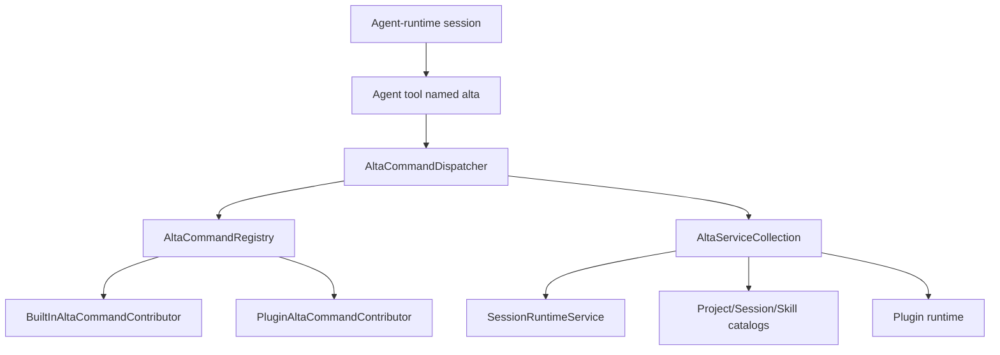

# `alta` live tool

`alta` is an in-process command gateway exposed to CodeAlta-managed sessions and trusted plugins. It is not a separate daemon and it does not keep command streams open. Each invocation builds a fresh command tree, runs one command, and returns help text or a finite JSONL transcript.

The terminal executable is `altatui`; this does not rename the in-process `alta` tool or turn its commands into shell subcommands.

## Architecture



Core types:

- `AltaSessionToolFactory` creates the agent tool named `alta` with `args`, optional `stdin`, `cwd`, output caps, and timeout.
- `AltaCommandRegistry` creates a fresh `XenoAtom.CommandLine.CommandApp` per invocation and merges built-in plus plugin command contributors.
- `AltaCommandDispatcher` captures stdout/stderr and flattens non-help results for live-tool consumption.
- `BuiltInAltaCommandContributor` contributes core `project`, `session`, `skill`, `provider`, `model`, `plugin`, `tool`, and `version` commands.
- `PluginAltaCommandContributor` adapts trusted plugin command roots while reserving core roots.

`CodeAltaFrontendComposition` wires the registry, dispatcher, service collection, plugin catalog bridge, and coordinator help text used by managed sessions.

## Tool input

The tool accepts CLI-style arguments excluding the executable name:

```json
{
  "args": ["session", "status", "<session-id>"],
  "stdin": null,
  "cwd": null,
  "maxOutputRecords": 50,
  "maxOutputBytes": 20000,
  "timeoutMs": 5000
}
```

Rules:

- `args` is required and must contain at least one string.
- `stdin` is used only by commands that explicitly accept `--stdin`.
- `cwd` is used for project-relative command resolution when supplied.
- output caps and timeout are optional positive integers; omit them unless a bound is needed.
- explicit JSON `null` for optional fields is treated like omission.

## Output contract

Help invocations return plain text:

```text
alta --help
alta session send --help
```

Non-help invocations return compact JSONL headed by an `alta.result` record. Handlers emit flat records that are intended to remain bounded and easy to parse. Commands that submit work return submission/queue metadata instead of waiting for a model run to finish.

Use `--detailed` only when per-item metadata is needed. Discovery commands default to compact aggregate records such as refs, keys, paths, or capability lists.

## Built-in command groups

| Group | Purpose |
| --- | --- |
| `version` | Report host/live-tool version metadata. |
| `ask` | Queue structured user questions for the calling session and return yield guidance. |
| `notes` | Get, replace, or clear the current session's sticky Markdown notes shown in the sidebar. |
| `project` | List, show, resolve, upsert, and inspect current project context. |
| `session` | List, create, show, send, queue, steer, abort, compact, inspect, report, and coordinate sessions. |
| `reminder` | Schedule delayed prompt content for the current or another session, and list/delete reminders. |
| `skill` | List, show, and activate CodeAlta-managed skills. |
| `tool` | Inspect live-tool status and command capabilities. |
| `provider` | List configured providers and provider model refs. |
| `model` | List, show, and resolve model refs. |
| `prompt` | List, inspect, create, edit, and select file-backed agent or system prompts. |
| `plugin` | Inspect active plugin runtime state. |
| `diff` | Show the changed files of a project to the user. Only in CodeAlta Desktop. |
| `editor` | Show the files of a project to the user in the code editor. Only in CodeAlta Desktop. |
| `terminal` | List, create, read, type in, rename, show and close the terminals of the window. Only in CodeAlta Desktop. |

`note` is a compatibility alias for `notes`. Prefer the plural `notes` group because it names the sidebar panel and the single sticky notes document. `skills activate` and `skills_activate` are compatibility aliases for `skill activate`. Prefer the singular `skill` group in new prompts and docs.

## Common discovery commands

```text
alta --help
alta tool status
alta tool capability list
alta notes get
alta project current
alta session current
alta project list
alta provider list
alta model list --provider <provider-key>
alta prompt list --scope all
alta skill list --project <project>
alta plugin list
alta mcp status
alta mcp tool search
```

Most list commands support compact defaults plus a `--detailed` mode.

## Session commands

Useful read commands:

```text
alta session current
alta session list --project <project> --state all --limit 20
alta session info <session-id>
alta session status <session-id>
alta session children <session-id> --recursive
alta session model <session-id>
alta session result <session-id>
alta session metrics <session-id> --scope last-turn
alta session tail <session-id> --last 10
alta session events <session-id> --kind assistant.message --fields timestamp,kind,text
```

`alta session current` is the shortest way for an agent-invoked live-tool call to discover its own CodeAlta session id. It does not require a session catalog lookup; outside a caller with session context it returns a usage diagnostic.

Useful control commands:

```text
alta session create --project <project> --title "Investigate parser"
alta session create --project <project> --same-model-as <session-id>
alta session set_agent <session-id> --prompt-id <prompt-id>
alta session send <session-id> --message "Summarize the latest failure."
alta session send <session-id> --stdin --queue-if-busy
alta session queue <session-id> --message "Run this after the current turn."
alta session steer <session-id> --message "Focus on the smallest fix."
alta session abort <session-id> --reason "Superseded"
alta session compact <session-id>
```

Control commands acknowledge submission. They do not block until the target model finishes. If a session is busy, `send --queue-if-busy` and `session queue` persist queue items with caller attribution; the runtime drains at most one queued prompt when that session becomes idle.

## Ask command

Use `alta ask --stdin` when an agent needs structured user input before continuing. Agent callers default to their source session; CLI or plugin callers outside an agent session must pass `--session <session-id>`. The command requires the in-process runtime/frontend ask service and returns immediately after queueing. It does not wait for the user to answer.

```text
alta ask --stdin
alta ask --session <session-id> --stdin
```

Payloads are JSON objects. Keep strings concise and prefer `--stdin` so shell quoting does not corrupt the request:

```json
{
  "file": { "path": "src/CodeAlta.Tui/Views/SessionWorkspaceView.cs" },
  "questions": [
    {
      "title": "Plan",
      "question": "Does this implementation plan look correct?",
      "description": "Review the proposed approach before implementation starts.",
      "choices": [
        { "title": "Approve", "description": "Proceed with the plan as written." },
        { "title": "Revise", "description": "Ask the agent to adjust the plan first." }
      ],
      "freeform": {
        "title": "Additional instructions",
        "placeholder": "Optional notes or requested changes..."
      }
    }
  ]
}
```

Validation requires at least one question; each question requires a `title`, `question`, and at least one of `choices` or `freeform`. The command bounds question/choice counts and text lengths. If `file.path` is present it is resolved under the session workspace/project roots and rejected when it escapes those roots. CodeAlta replaces the session timeline with a file editor while the ask is open. Users can add line comments without changing the file (`Ctrl+K`), finish a comment (`Esc`), delete it (`Ctrl+D`), move between comments (`Ctrl+N` / `Ctrl+P`), clear comments (`Ctrl+L Ctrl+K`), switch between the file editor and questions (`Ctrl+G Ctrl+E` / `Ctrl+G Ctrl+N`), and optionally edit/save the file (`Ctrl+S`). Submitted answers include the file path and any validated line comments in Markdown; if the user saved file edits, the response notes that the file was modified and saved on disk.

Successful output is JSONL headed by `alta.result` followed by one `alta.ask.queued` record:

```json
{"type":"alta.ask.queued","version":1,"askId":"019...","sessionId":"...","queued":true,"shouldYield":true,"recommendedAction":"stop","activeWaitAllowed":false,"shouldPoll":false,"nextStep":"Do not call another tool or poll. Yield now and wait for the next user prompt containing the ask response."}
```

Both frontends present an ask the same way: the questions take the place of the prompt and an attached file takes the place of the session timeline, where the user comments on lines and may edit and save the file (see [Asks and plan review](desktop.md#asks-and-plan-review) for the desktop).

After receiving `alta.ask.queued`, an LLM should stop the turn: do not call another tool, sleep, poll, or inspect status while waiting. CodeAlta presents the ask when the target session is idle, collects answers in ask mode, and submits a normal user prompt back to the same session. The formatted prompt omits the ask id from user-visible Markdown; CodeAlta carries the optional ask id on the prompt/journal event for correlation.

Pending asks are in-memory, per-session FIFO state owned by `CodeAlta.LiveTool.AltaAskService`, not by open tabs. Admission copies question and choice collections into read-only snapshots, preserving their order and scalar values; the command still owns JSON normalization and file-root validation. `Peek(sessionId)` and `GetPending(sessionId)` expose immutable point-in-time state, including Pending/Submitting/Indeterminate response state and an immutable owner-issued response handle. `TryRemoveHead(sessionId, askId)` removes only the exact **unclaimed** current head, using ordinal matching without trimming; admission alone trims the session id as before. It cannot bypass Submitting or Indeterminate ownership.

The TUI calls `RespondAsync(handle, dispatch)` before formatting, history loading or runtime dispatch. The service claims the exact current generation under its existing lock, then runs dispatch outside ownership. Duplicate, foreign, stale and non-head handles do not dispatch. `TryCancelResponse(handle)` uses the same generation identity and succeeds only while Pending. Definite non-admission rotates the handle, so old same-ask submit **and cancel** callbacks cannot act on a fresh presentation. There is no historical attempt map or restart token.

Cancellation observed under queue ownership after snapshot capture and before admission prevents enqueueing. Cancellation after that check does not roll back admission. `QueueChanged` runs outside the lock as invalidation/requery, can reenter/interleave, and is not an authoritative ordered event stream. Every subscriber is attempted; synchronous observer failures, including cancellation exceptions, are returned as immutable scalar `NotificationErrors` alongside the committed admission/removal result. The command still emits `alta.ask.queued` and yield guidance, then reports `ask.notificationFailed` warnings; TUI removal shows a warning if notification failed. The queue does not initialize logging or call a diagnostic sink. Later failures in a caller's output/status sink are not swallowed and cannot undo queue state. Work posted asynchronously by observers remains the frontend's responsibility, not a failure the synchronous notification result can observe.

Ask response dispatch uses Orchestration's `SessionPromptResponseDispatch` on the normal-submit path only:

| Evidence | Settlement |
| --- | --- |
| Preparation failure or plugin interception/cancellation before runtime invocation | Definitely not admitted **by this route**; retain the head with a fresh generation. Plugin side effects are not rolled back or automatically replayed. |
| Recognized `Submitted` with a nonblank runtime run ID | Positive **late** admission evidence; remove the exact claimed head. Later UI/diagnostic failure cannot revoke that evidence. |
| Runtime invocation entered, then exception/cancellation or unknown/malformed result without positive evidence | Indeterminate; retain a visible, non-replayable head. Do not restore the response into the composer as a retry. |

Claim settlement precedes presentation reconciliation. Claim and settlement invalidations use the same outside-lock/all-subscriber scalar diagnostics as queue mutations. The runtime adapter avoids descriptor projection after its positive send return. Plugin replacement retains AskId and images. Rejected callbacks detach only their still-frontend-active obsolete handle, never the same in-flight handle or a newer presentation. Blocked-state warnings target the foreground session, not an unrelated background status event.

On non-admission/uncertainty, the TUI can clear its own synthetic running marker only if its dispatch revision and timestamp are unchanged and no runtime run ID has been observed. It never clears an observed run ID or a newer prompt's projection, nor emits runtime Idle/Abort to resolve uncertainty. Missing/late runtime lifecycle events can still leave observed run projections stale; authoritative projection recovery is not added here.

This does **not** establish early admission, provider success, durability, general queue/steer behavior, application-owned execution lifetime, or restart/reconnect recovery. Runtime SendAsync still spans provider execution and late bookkeeping: failure can occur before admission, after canonical input persistence, after provider execution, or during cache updates. Without a positive receipt these cases remain unresolved. An Indeterminate head blocks later asks and both resubmission and local cancellation; this version has **no recovery/abandon operation**. Closing presentation does not settle ownership, and process restart loses the in-memory state rather than safely recovering or rolling back the response.

## Notes

Use `alta notes` for sticky Markdown such as a checklist, plan status, or next actions. Notes are session-scoped and journal-backed: `get`, `set`, and `clear` work for a known active or persisted caller session even with no open tab. An explicit source session never falls back to a different selected session. Host callers may use the current session as a fallback, captured before reading stdin or awaiting storage; without either identity the command returns `usage.missingSession`. Switching tabs shows that session's notes, and reopening a session restores the latest set or clear event from its journal. The sidebar renders Markdown in a scrollable view, wraps horizontally, offers a copy-to-Markdown button, and clears asynchronously without blocking the UI.

```text
alta notes get
alta notes set --stdin
alta notes clear
```

`alta notes get` emits the current Markdown as `alta.notes.current`. `alta notes set` replaces the entire notes document with Markdown read from stdin and emits `alta.notes.updated`; `--stdin` is accepted for consistency with other text commands. `alta notes clear` sets the document back to empty. Prefer `notes` over the singular `note` alias in new prompts and documentation.

Markdown is preserved exactly, including empty text. Success follows acknowledged journal persistence; unknown IDs do not create sessions or journals, and read failures do not become empty notes. Cancellation before write admission leaves notes unchanged; after admission the single record finishes rather than claiming cancellation rolled it back. If persistence commits but later cache or UI feedback fails, the error explicitly says notes were committed: read them again before retrying. Notes use the existing journal/restart semantics, not a new database, power-loss guarantee, or persistence for asks/reminders.

A valid final journal record missing its newline is preserved when appending notes. Malformed or truncated journal content is instead refused without modifying bytes or reporting an update; notes commands do not repair journals or discard incomplete user data.

## Prompt file mutations

`alta prompt create <id> --scope global|project` creates an agent file; add `--system` for a system file. Supply a non-empty Markdown body with either `--content` or `--stdin`, never both. Catalog's shared serializer validates the portable file id and agent system reference, escapes metadata, and retains the existing defaults (agent name = id, system reference = `default`). System `--name`/`--description` are optional frontmatter; without metadata a replace-mode system body remains plain Markdown. Creation never overwrites an existing same-scope file, including a file created while stdin is pending.

`alta prompt edit <id> --scope global|project` with content replaces the **complete file**, not just its body. It preserves supplied comments, unknown frontmatter and exact newlines without parsing/reserializing metadata, and retains the existing Unicode encoding/BOM. Valid-Unicode files with malformed prompt metadata remain repairable. Editing a missing file creates UTF-8 without a BOM; empty input is a valid replacement. Without `--content` or `--stdin`, edit only reports the validated path and existence, without reading or creating the file or its directories.

The command captures an existing file's raw-byte revision and format before awaiting stdin and retains that baseline through save. Detected changes/deletion/creation during the invocation fail rather than silently adopting the newer revision. **Content assembled before invocation has no earlier revision contract**: an old `--content` value is not protected against changes that already happened before the command began. There is no expected-revision flag or automatic retry. Creation uses the Missing revision and non-overwriting atomic publication. Shared-host writes serialize through the same text codec as prompt management/file editors; external writers can still race path checks or the final revision-check/commit interval, so this is not cross-process atomic compare-and-swap.

Catalog rejects built-in mutation, unavailable project scope, unsafe ids and linked path components. Validation, conflict and read/decode/write failures produce non-success diagnostics, never `alta.prompt.created` or an updated `alta.prompt.edit` record. Duplicate creation keeps `usage.promptExists`; edit conflicts use `prompt.conflict`, storage failures `prompt.storageFailed`. Cancellation is honored before commit; once committed, the command reports success even if cancellation follows. Successful record types, fields, ids and global/project scope/source labels are unchanged. No prompt delete command is added.

## Reminders

Use `alta reminder create` to schedule prompt content to be sent later while the current CodeAlta host process remains running. The target defaults to the calling agent's current session; use `--session <session-id>` or `--session-id <session-id>` to target another session. `--duration` is a positive number of seconds or a `TimeSpan` such as `00:05:00`. `--repeat` is the total number of firings and defaults to 1. Reminder delivery uses normal `session send --queue-if-busy` semantics so a busy target queues the reminder instead of dropping it.

The TUI also exposes the same reminder registry for the selected session through the prompt-bar clock button and `/reminder` (`Ctrl+G Ctrl+D`). From the dialog you can create/delete reminders and load a selected reminder message back into the editor to update it. Session and project navigator rows show a clock icon while matching reminders are active.

Each firing captures its target, caller identity and prompt together before dispatch, independently of open tabs. An edit before that capture changes this firing; an edit afterward changes only later firings. Deleting before capture prevents the attempt. Deleting afterward removes the reminder and prevents repeats and retained delivery bookkeeping, but the captured send may still proceed: deletion does not retract queued prompts or abort a run.

Repeats wait the configured duration after the previous delivery call returns, without overlapping delivery calls for the same reminder. Returned failures also count toward `--repeat`; completed reminders remain available through `list --all` until deleted. A successful delivery result is the live-tool command result, not proof of provider success or completed work. Reminder schedules remain process-only; this does not add persistence, exactly-once runtime admission, or coordinated timer shutdown.

Projection observer exceptions, including observer cancellation, do not undo reminder changes, replace delivery results or stop repeats. Create/delete still return success and the normal committed record, followed by an `alta.warning` with code `reminder.notificationFailed` when their notification pass failed. The warning contains captured reminder/session/change/firing context, total `failureCount`, up to eight `messages` of 512 characters each and `messagesTruncated`. These diagnostics are distinct from `lastExitCode`/`lastError` for delivery.

`reminder list` also reports the single latest retained failed notification pass as a **historical** warning, filtered by an explicit target session. This does not change the reminder count and can refer to a completed or deleted reminder. Latest means failed-pass publication order, not mutation order; successful passes do not clear it and subsequent failures replace it. This is process-only, query-based feedback, not an ordered replay or diagnostic history. The TUI shows matching-session historical feedback on opening/refreshing the reminder dialog and labels post-commit notification/refresh failures as warnings. There is no guaranteed diagnostic push: callbacks run before diagnostic publication, later queued-UI/status-display failures remain frontend limitations, and live-tool output limits may truncate warnings. Blocking or infinitely reentrant observers can still prevent progress.

```text
alta reminder create --duration 60 --content "Check the build status."
alta reminder create --duration 300 --repeat 3 --session <session-id> --stdin
alta reminder list --all
alta reminder delete <reminder-id>
```

## Delegated work and peer messages

Agent-originated delegated work is designed to yield after submission. Parented session creation/send paths include metadata such as `notificationExpected`, `shouldPoll`, `shouldYield`, and `nextStep` so a coordinator can stop active waiting and let CodeAlta forward the child final reply or error back to the parent session.

Use normal `session send` for actionable prompts that should make the target model run. Use message/request commands for coordination notes that should be attributed as delegated-agent traffic instead of user/developer/system instructions:

```text
alta session message <session-id> --kind handoff --message "Context collected."
alta session request <session-id> --reply-requested --stdin
```

Polling commands such as `status`, `tail`, and `events` are for diagnostics, explicit observation, or cases where no parent notification is expected.

Delegated child sessions normally inherit the driving session's provider/model/reasoning with `--same-model-as <session-id>`. When the user requests a specific sub-session agent, provider, model, or reasoning effort, use `--prompt-id`, `--model-ref provider:model@reasoning`, or the separate `--provider`, `--model`, and `--reasoning` flags when available; otherwise state the limitation instead of silently substituting. For implementation delegation, schedule writing children sequentially and have the parent inspect/verify each result before starting the next writing step.

## Provider and model discovery

Provider/model refs are deterministic and id-based:

```text
alta provider list
alta provider list --detailed
alta provider model list --provider <provider-key>
alta model list --provider <provider-key> --reasoning high
alta model show --model-ref <provider-key>:<model-id>@high
alta model resolve --model-ref <provider-key>:<model-id>@high
```

`model show` and `model resolve` validate exact refs when model metadata is available and report requested/effective reasoning so callers can see whether reasoning was applied, defaulted, or unsupported.

## Diff command

`alta diff show` opens the Changes tab of a project in the CodeAlta Desktop window: the files its work
tree changed since the last commit (untracked files included) and their diff. It shows the changes to
the user and returns no diff: an agent that wants to read one runs git.

```text
alta diff show
alta diff show --file src/app.ts
alta diff show --project <project-id-or-slug-or-path>
```

The project defaults to the one of the calling session, then to the catalog project of the cwd; an
archived project is not shown. `--file` is a path relative to the repository root, selected when it is
one of the changed files. The command emits `alta.diff.shown` with the project and the file, or
`view.unavailable` when no window is open.

The group exists only where a host registers `IAltaChangesView`, which the desktop host does: in the
terminal UI and the standalone tool it is not among the commands, their help or `alta tool list`.

## Editor command

`alta editor open` opens the code editor of a project in the CodeAlta Desktop window, and a file in it. It
shows a file to the user: an agent that wants to read one reads it with its own tools.

```text
alta editor open
alta editor open --file src/app.ts
alta editor open --file src/app.ts --line 120 --column 8
alta editor open --project <project-id-or-slug-or-path>
```

The project defaults to the one of the calling session, then to the catalog project of the cwd; an
archived project is not shown. `--file` is a path relative to the project folder, with `/` or `\` on
every system, or a full path inside it; the file must exist. Without it the editor opens with the files
of the project. `--line` and
`--column` are 1-based and need a file. The command emits `alta.editor.opened` with the project, the
file and the position, `file.notFound` for a file that is not in the folder, or `view.unavailable` when
no window is open.

Like `diff`, the group exists only where a host registers its view (`IAltaEditorView`), which the desktop
host does: in the terminal UI and the standalone tool it is not among the commands, their help or
`alta tool list`.

## Terminal commands

`alta terminal` uses the terminals of the CodeAlta Desktop window: the shells the user sees in tabs and
in the **Terminals** list of a project. A terminal keeps running in the window, where the user can
watch it and type in it too: it is for what has to stay up (a dev server, a watcher, a REPL) or what the
user should see. For a command that runs and ends, the shell tool of the agent is simpler.

```text
alta terminal list [--project <project>]
alta terminal shells
alta terminal create [--project <project>] [--cwd <folder>] [--shell <id>] [--title <text>] [--command <line>] [--show]
alta terminal read <terminal-id> [--lines <n>]
alta terminal commands <terminal-id> [--last <n>] [--output]
alta terminal send <terminal-id> [--text <text> | --stdin] [--key <name>]... [--enter] [--wait <seconds>]
alta terminal rename <terminal-id> [<title>]
alta terminal show <terminal-id>
alta terminal close <terminal-id>
```

- `list` emits one `alta.terminal` per terminal, in the order they were created: `id`, `title`, `state`,
  `folder` (where the shell is now), `shell`, `projectId`, `sessionId`, `processId`, the size of the
  screen, `tab` and `createdBy` (`session` or `user`). `state` is `idle` (the shell is at its prompt),
  `busy` (it runs `command`), `running` (the shell does not say which) or `exited` (with `exitCode`).
  `tab` is `visible`, `open` or `closed`: a terminal runs with or without a tab.
- `create` starts a shell and emits `alta.terminal.created`. The terminal is listed under the project
  of the calling session (or `--project`, or the catalog project of the cwd) and starts in the working
  directory of the calling session (or `--cwd`, or the project folder). `--shell` is an id of
  `alta terminal shells`, whose first entry is the default. `--command` types a command line and Enter
  in the new terminal, and `--show` opens its tab. A terminal a session creates stays until it is
  closed, even once its shell has exited, so that it can still be read.
- `read` emits `alta.terminal.text`: the rows of the screen, or with `--lines` the last lines with those
  that scrolled off it (the host keeps 10,000). The text has no colors. A program that draws the whole
  screen (an editor, a pager) is read as its screen (`fullScreen`).
- `commands` lists the last commands the shell ran (`alta.terminal.command`: the command line, the
  folder, `state`, `exitCode`, and with `--output` what it printed). Only a shell that reports its
  commands has some: one whose `state` is `idle` or `busy`.
- `send` types as the keyboard of the terminal would: the text (an end of line is Enter; several lines
  are a paste for a program that tells pastes from typing), then the keys, then Enter with `--enter`.
  Keys are named `enter`, `tab`, `escape`, `space`, `backspace`, `delete`, `insert`, `up`, `down`,
  `left`, `right`, `home`, `end`, `pageup`, `pagedown`, `f1` to `f12`, or one character, each with
  `ctrl+`, `alt+` and `shift+` (`ctrl+c`, `shift+tab`). With `--wait`, a shell that reports its commands
  is waited for until the command has ended, and `alta.terminal.sent` carries its `output` and
  `commandExitCode`; any other terminal is waited for until it has printed nothing for a moment, and
  `output` is what it showed since. When the time runs out, `settled` is false, the command keeps
  running, and `nextStep` says how to read the terminal later.
- `rename` gives a title, or without one gives back the title the terminal has by itself: its folder.
- `show` opens the tab of a terminal for the user, and answers `view.unavailable` when no window is open.
- `close` ends the shell and what runs in it; the terminal is gone.

What a call returns is bounded: when a text is longer than the output budget of the call
(`maxOutputBytes`), its last lines are kept and `truncated` (or `outputTruncated`) is true.

`terminal.notFound` answers an id that is not a terminal, `terminal.ended` typing in a terminal whose
program has ended, and `terminal.inputDenied` (exit code 4) typing on a host that has the user review
the commands of its sessions (`--review-owned-command-permissions`): `send` and `create --command` are
refused there, everything else works.

Like `diff` and `editor`, the group exists only where a host registers its service (`IAltaTerminals`),
which the desktop host does: in the terminal UI and the standalone tool it is not among the commands,
their help or `alta tool list`.

## Skill commands

```text
alta skill list --project <project>
alta skill list --project <project> --detailed
alta skill show <skill-name>
alta skill activate <skill-name> --session <session-id>
```

Activation uses the same runtime path as the UI. It injects skill context into the target agent-runtime session when the session and skill are available.

## Plugin command roots

Plugins add live-tool commands by returning `PluginAltaCommandContribution` records from `PluginBase.GetAltaCommands()`. Each contribution declares a root/path, policy flags, ordering, and a factory that creates a fresh unattached `XenoAtom.CommandLine.CommandNode`.

The host reserves these root commands: `version`, `project`, `session`, `skill`, `skills`, `skills_activate`, `provider`, `model`, `plugin`, and `tool`. Plugin roots that collide with a reserved or earlier plugin root are skipped and diagnosed by the plugin runtime.

Plugin command policy flags describe whether a command mutates state, is disruptive, requires the in-process runtime, or supports catalog-only context. Mutating plugin-originated commands include plugin provenance for audit and timeline reconstruction.

Plugins can also call built-in commands through `Services.Alta.InvokeAsync(...)` without referencing `CodeAlta.LiveTool`. Project-scoped plugin invocations inherit their project scope and working directory unless overridden by the runtime rules.

The built-in MCP plugin contributes the `mcp` root. Current shipped commands are:

```text
alta mcp list
alta mcp status
alta mcp activate memory docs
alta mcp config sources
alta mcp server add <server> --command <command>
alta mcp server add <server> --url https://example.test/mcp --header Key=Value
alta mcp server remove <server>
alta mcp server enable <server>
alta mcp server disable <server>
alta mcp auth status [--server <server>]
alta mcp auth login <server>
alta mcp auth logout <server>
alta mcp tool search
alta mcp tool describe --server <server> --tool <raw-tool-name>
alta mcp tool call --server <server> --tool <raw-tool-name> --arguments {"key":"value"}
```

MCP config/list/status commands read fixed JSON config paths and report overlay/shadowing without connecting to servers. MCP server add/remove mutates JSON MCP config only; enable/disable mutates TOML policy only. MCP auth commands manage CodeAlta-owned OAuth token cache state for HTTP/SSE servers; they report cache status, run explicit browser login, or delete cached tokens without writing tokens to MCP JSON. `alta mcp activate <server>...` records selected servers for the current session and performs bounded tool discovery so tools can be registered on future agent runs. MCP tool commands lazily connect to stdio and HTTP/SSE servers, apply policy filters, emit redacted diagnostics, and return raw server/tool names plus stable aliases such as `mcp__server__tool`. Direct policy-controlled MCP agent tools use those same aliases; agents can use `alta mcp tool ...` commands for discovery, diagnostics, and manual calls. See [MCP support](mcp.md).

The built-in statistics plugin contributes a small `statistics` root:

```text
alta statistics estimate "Summarize this change."
```

It returns byte, character, and approximate-token estimates without mutating state.

## Capability policy

`alta tool capability list` summarizes command policy metadata. Command policies are advisory and host-enforced where applicable:

- read-only vs mutating;
- disruptive operations such as abort;
- requires in-process runtime vs catalog-only context;
- plugin provenance for plugin-contributed or plugin-invoked commands.

The command gateway is available to CodeAlta-managed sessions for any configured provider when the in-process runtime is available.
