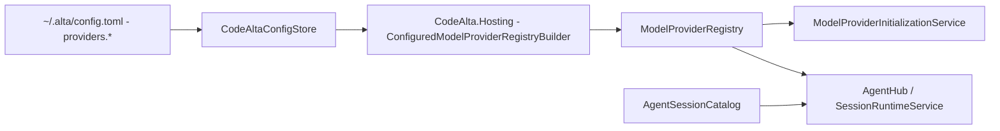
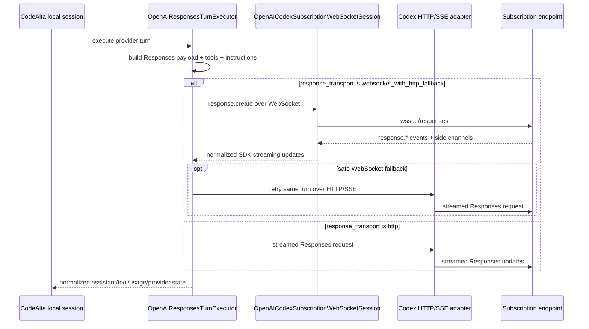
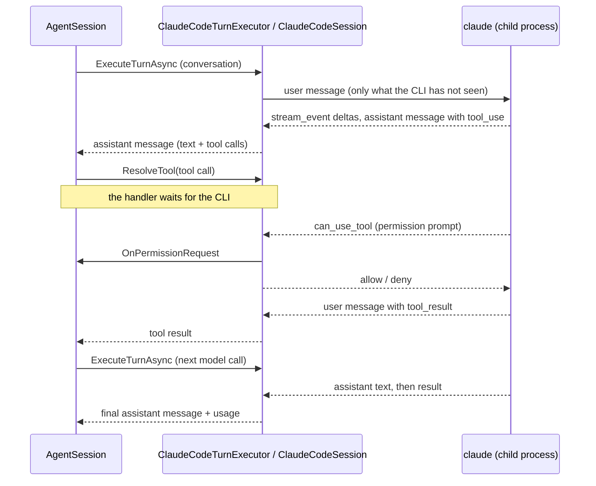

# Model providers

A model provider is the user-facing execution configuration for an LLM endpoint/runtime. Providers own credentials, protocol adaptation, readiness, model metadata, and turn execution. They do not own persisted CodeAlta sessions; sessions are listed and restored through the session catalog.

## Registration and initialization pipeline



At startup, the TUI's `CodeAltaOwnedServices` supplies `CodeAltaConfigStore`, the state root and optional models.dev metadata service to `CodeAlta.Hosting.ConfiguredModelProviderRegistryBuilder`. The composition-only Hosting library builds `ModelProviderDescriptor` entries and lazy concrete runtime factories; registration does not start or probe providers. The same builder serves the existing TUI refresh and temporary test/model-list registration paths. `ModelProviderInitializationService` probes each provider independently and caches readiness/model information. Session listing uses `AgentSessionCatalog` against the single configured sessions root and runs independently of provider probing.

Hosting also owns the raw-provider defaults resolver and bundled `ProviderDefaults/provider_defaults.toml`, copied to application output/publish directories. Provider-specific compatibility defaults and configured overrides retain their existing precedence. The global-store overload excludes disabled definitions; the document-sequence overload preserves caller ordering and disabled descriptors, leaving filtering to its caller. A registration batch shares one Codex subscription concurrency limiter. Registries, config stores and metadata services are borrowed, not newly disposed by the builder; registry replacement retains its existing cached-runtime disposal behavior and is not transactional.

`CodeAlta.Hosting.ConfiguredProviderInspection` owns cached test/model-list policy and uncached temporary probing. TUI adapters still look up active state by provider key only, choose the root lazily, supply synchronous localized message factories, and render forms/progress. A Ready cached test succeeds; Probing/Failed/Unsupported return the cached failure text. Cached model listing reuses Ready only and returns the same list without applying requested sorting. Other states fall back to a directly created runtime, not a temporary registry. A returned probe counts as successful even when empty or non-Ready; only uncached model listing applies requested stable display-name/ID sorting.

Temporary runtimes are asynchronously disposed after probing and success-message formatting, including on probe, sorting, formatting or cancellation failure. Disposal is awaited and its exception takes precedence. There is no explicit start/stop or early cancellation check; the token is forwarded to the probe. The state root and optional metadata service are caller-supplied and borrowed, and unsorted lists are not snapshots. Other auth/configuration/refresh workflows and the background models.dev service lifetime remain TUI-owned, except for the bounded Copilot/xAI orchestration below. Concrete authentication/protocol implementations remain in provider packages, and configuration persistence remains in Catalog. These extractions do not change key-only cache reuse for edited settings, startup admission, host rollback/disposal, active-run refresh safety or desktop composition.

`CodeAlta.Hosting.ConfiguredCopilotAuthentication` composes configured Copilot device login, CodeAlta-owned credential deletion and non-secret cached status. Both TUI login buttons use the same device flow; TUI retains the localized prompts, report-before-browser callback, browser-launch error handling and result formatting. The exact ordinal `copilot` check precedes manager construction; construction precedes the caller's lazy root callback. Options still observe the provider key before that callback and enterprise/API fields afterward, forwarding blank values without new validation. The provider owns credential validation/storage and cached-expiry policy; cached status is not live authentication or environment-token verification. Production operations can perform network/credential I/O. There is no new early cancellation, context suppression, retry or disposal: the existing absence of manager/HTTP-client disposal remains a separate lifetime limitation. Tests use mandatory in-memory operation factories, never concrete managers or credential stores. Copilot model listing still follows the existing connectivity-test route rather than selectable-model listing.

`CodeAlta.Hosting.ConfiguredXaiAuthentication` composes configured xAI browser-PKCE login, separate device-code login, CodeAlta-owned credential deletion and non-secret cached status. TUI retains the distinct prompts, report-before-browser ordering for browser authorization, device reporting without an opener, result formatting and lazy root selection (owned-services global root, otherwise UserProfile/.alta). Required-object validation and the exact ordinal `xai` check precede deferred manager construction; construction precedes provider-key/root/API option evaluation. Keys and roots are forwarded unchanged, invalid or relative API URIs become null, other absolute schemes remain accepted, and no polling override is set. Auth-source/enabled settings do not select these explicit operations. xAI cached status can include past or unknown expiry: it performs no live authentication, refresh-skew/freshness check, environment-token verification or model turn. The provider retains real network/credential I/O, browser PKCE/loopback binding, CORS, cancellation transformation, callback response/persistence ordering and listener teardown. Mandatory recording-factory tests do not exercise those concrete paths. No early cancellation, context suppression, retry or manager/HTTP-client disposal is introduced; the existing non-disposal remains a lifetime limitation. xAI model listing and other provider/configuration/refresh workflows are unchanged.

Providers that are disabled, invalid, or missing required credentials are skipped or marked unavailable without deleting their config entries.

## Config shape

Each provider is configured under `providers.<provider-key>`:

```toml
[chat]
default_provider = "work"

[providers.work]
enabled = true
display_name = "Work endpoint"
type = "openai-responses"
api_key_env = "WORK_ENDPOINT_API_KEY"
api_url = "https://api.example.test/v1"
network_timeout_seconds = 180
model = "model-id"
reasoning_effort = "high"
models_dev_provider_id = "openai"
models_include_regex = "model-id|model-next"

[providers.work.model_overrides.model-id]
context_window = 400000
output_token_limit = 128000
```

Important behavior:

- `enabled = false` prevents registration. Omitted `enabled` normalizes to `true` for user entries.
- `display_name` is optional; CodeAlta can derive a display name from the provider key.
- `model` and `reasoning_effort` are defaults, not a hard limit on model selection unless the provider is configured with `single_model_id`.
- `models_include_regex` is an optional .NET regular expression applied to discovered model ids. Omit it to expose every discovered/fallback model; use alternation such as `model1|model2` or patterns such as `model\d+` to keep a smaller catalog.
- `sort_models = true` sorts discovered models alphabetically by display name (then id) in model selectors. The default is `false`, which preserves the order returned by the provider.
- `api_key` stores a literal secret; `api_key_env` points to an environment variable. Prefer environment variables for shared machines.
- `api_url`, `network_timeout_seconds`, organization/project fields, provider-specific auth fields, `extra_body`, `profile`, `compaction`, `models_dev_provider_id`, `models_include_regex`, `sort_models`, and `model_overrides` are preserved by the advanced TOML editor.
- `network_timeout_seconds` sets the OpenAI/Azure SDK network timeout for `openai-chat`, `openai-responses`, `azure-openai`, and `codex` providers. Leave it unset to use the OpenAI SDK default timeout of 100 seconds.
- The bundled template disables all built-ins explicitly. Users opt in by enabling/configuring a provider.

## Built-in provider types

`ConfiguredModelProviderRegistryBuilder` currently recognizes these `type` values:

| `type` | Runtime adapter | Notes |
| --- | --- | --- |
| `openai-chat` | `CodeAlta.Agent.OpenAI` chat-completions executor | Requires API key. Supports streaming chat completions, strict function schema normalization, usage mapping, and optional protocol traces. |
| `openai-responses` | `CodeAlta.Agent.OpenAI` responses executor | Requires API key. Uses Responses streaming over HTTP by default and stores local CodeAlta session journals. |
| `azure-openai` | `CodeAlta.Agent.OpenAI` Azure OpenAI chat-completions executor | Requires API key and an Azure OpenAI resource endpoint. Uses deployment names as model ids. |
| `codex` | `CodeAlta.Agent.OpenAI` responses executor with subscription options | Uses ChatGPT/Codex subscription credentials stored in CodeAlta state; not treated as an OpenAI platform API-key provider. |
| `copilot` | `CodeAlta.Agent.Copilot` direct HTTP executor | Uses configured token/device-flow auth and dispatches turns through compatible agent-runtime executors according to the selected model. |
| `xai` | `CodeAlta.Agent.Xai` direct HTTP executor | PKCE browser OAuth or device-code OAuth against the xAI API; every turn is dispatched through the OpenAI Responses executor. |
| `anthropic` | `CodeAlta.Agent.Anthropic` | Requires API key. Wraps SDK chat streaming through the agent runtime and supports model metadata enrichment. |
| `google-genai` | `CodeAlta.Agent.GoogleGenAI` | Requires API key. Wraps SDK chat streaming through the agent runtime and supports model metadata enrichment. |
| `vertex-ai` | `CodeAlta.Agent.GoogleGenAI` | Uses Vertex project/location settings instead of an API key. |
| `mistral` | `CodeAlta.Agent.Mistral` | Requires API key. Uses Mistral chat completions with streaming, tool calls, multi-turn replay, and upstream model listing. |
| `claude-code` | `CodeAlta.Agent.Claude` | Runs the Claude Code CLI the user installed and signed in to. No credential, endpoint or login of CodeAlta; see [Claude Code CLI provider](#claude-code-cli-claude-code-provider). |

External ACP CLI adapters are no longer registered as model providers. Legacy `[acp]` config is ignored and preserved only as compatibility data.

## CodeAlta runtime provider behavior

OpenAI-compatible, Anthropic, Google, Mistral, direct HTTP, and subscription-backed providers attach to the agent session runtime. They share these properties:

- sessions are CodeAlta-owned, provider-independent, and journaled under `~/.alta/sessions/yyyy/MM/dd/<session-id>.jsonl`;
- provider/model switches are represented as events in the journal when history can be replayed safely;
- tool declarations are generated from CodeAlta `AgentToolDefinition` values;
- system/developer instructions and project context are composed by CodeAlta before the provider turn;
- compaction is implemented locally through provider summarizer calls;
- model metadata is enriched from upstream discovery, bundled/static metadata, refreshed models.dev data, and user `model_overrides` where available.

## OpenAI-compatible providers

`openai-chat` uses streaming chat completions. The adapter maps content, reasoning, tool calls, usage, and finish reasons into normalized `AgentEvent` values. Tool schemas are normalized for strict function-schema requirements.

`openai-responses` uses SDK-owned Responses streaming over HTTP. For a recognized reasoning model against the official OpenAI endpoint, CodeAlta requests `summary: auto` and encrypted reasoning content even when effort is left to the service's model-specific default: summaries feed the visible timeline, while the opaque encrypted item preserves stateless reasoning continuity between locally replayed calls. OpenAI-compatible custom endpoints retain their existing summary and encrypted-content request shape. Local replay preserves the relative order of assistant messages, opaque reasoning items, and tool calls. WebSocket transport and `response_transport` configuration are available only for subscription-backed `codex` providers.

`azure-openai` uses `Azure.AI.OpenAI` against an Azure OpenAI resource endpoint such as `https://your-resource.openai.azure.com`. Azure OpenAI deployment names are used anywhere CodeAlta asks for a model id, so set `model` and/or `single_model_id` to the deployment name. The Azure SDK does not expose model management for Azure OpenAI, and CodeAlta falls back to the configured single model instead of listing deployments. Azure OpenAI is currently wired to the chat-completions path; use OpenAI-compatible `openai-responses` only for endpoints that expose the OpenAI v1 Responses API directly.

Long-running OpenAI-compatible or Azure OpenAI requests can exceed the SDK pipeline's default network timeout. Set `network_timeout_seconds` to a larger positive value on the affected provider entry when you need to extend that timeout.

Provider profiles can adjust role support and reasoning replay details. For endpoints that do not support developer-role messages, defaults can merge developer guidance into system content. Profiles and `extra_body` remain provider-specific and should be documented in provider examples only when a concrete endpoint requires them.

## Subscription-backed `codex` provider

`CodeAlta.Hosting.ConfiguredCodexAuthentication` composes the same ChatGPT token-sharing flow used on `main`, without moving OAuth or credential handling into either frontend. `LoginWithBrowserAsync` constructs the provider login manager, gets the stable host ID, awaits `BeginBrowserLoginAsync`, starts and retains the callback wait, reports the authorization URI, opens the system browser, and awaits that original wait. The browser-login context is disposed as on `main`. Plan permission is reported independently of validated identity: declining plan access retains the registration but does not enable inference.

`SignOutAsync` delegates to the provider's remote-revocation/local-token-clearing operation and returns whether remote revocation was confirmed. It retains the issued registration for later sign-in; it is not credential-file deletion. `TestAuthenticationAsync` calls `GetCredentialAsync` without a model turn and can refresh/save credentials; fresh cached credentials need not contact the server. Legacy device login, credential imports and Codex-home authentication discovery are removed.

`ReadAccountMetadataAsync` loads the owned credential record and returns null unless the provider identifies a validated registration. It does not refresh or enumerate remote accounts, and does not reinterpret a configured workspace ID as the registration identity. Sign-in, testing and metadata lookup expose only `CodexAccountMetadata`: raw account label, validated subject, issued client ID and plan-permission flag, never access/refresh/ID tokens. TUI uses `main`'s exact label/subject/null fallback and registration messages. Account metadata may be personal data and must not acquire incidental logging.

Required inputs and exact ordinal `codex` selection precede concrete login/sign-out/test factories; local metadata lookup retains its absence of a type guard. Original definitions, lazy root callbacks and cancellation tokens are forwarded. The root is trusted backend input, not a renderer filesystem grant. Localization, system-browser launch and the TUI's global-root fallback stay frontend-owned; no scheduling, retries, context suppression or new exception transformations are introduced by Hosting. Wrapper fixtures qualify forwarding and presentation, not native login or complete application lifetime.

Both the TUI and owned desktop use `ConfiguredModelProviderRegistryBuilder` and the same OpenAI provider runtime, config normalization and global credential store. Sign in through the TUI's **Continue with ChatGPT** action before using the configured provider in the desktop. The desktop's provider Settings remain read-only; this merge does not add browser authentication RPCs or a second credential store.

The `codex` provider type is dedicated ChatGPT/Codex subscription endpoint access. It is intentionally distinct from OpenAI platform API-key access.

Current behavior:

- default endpoint: `https://api.openai.com/v1`;
- default auth source: `codealta_oauth`;
- supported auth source: `codealta_oauth` only; legacy credentials and Codex auth-file imports are rejected;
- default response transport: HTTP/SSE; WebSocket with HTTP fallback is opt-in;
- `response_transport = "http"` forces the Codex HTTP/SSE path (the config validator intentionally does not accept the legacy programmatic `"sse"` alias);
- encrypted reasoning is included by default;
- fast routing is opt-in via provider-scoped `service_tier = "priority"` (`"fast"` alias); omitted or `"default"` uses standard routing;
- model discovery defaults to `codex_endpoint_with_static_fallback`, which reads the subscription `/models` endpoint and falls back to the static allow-list if discovery fails;
- recognized reasoning efforts follow the order advertised by Codex, including model-specific `max`; CodeAlta ignores Codex's `ultra` client tier because its distinct proactive delegation policy is not implemented;
- the static fallback includes GPT-5.6 Sol, Terra, and Luna with `max` as their highest reasoning effort;
- `send_installation_id` defaults to `false` and sends a CodeAlta-owned stable id only when explicitly enabled;
- `send_responses_beta_header` defaults to `false`; set it to `true` only for a legacy turn endpoint that still requires `OpenAI-Beta: responses=experimental`;
- requests use CodeAlta-owned stored subscription credentials and do not convert subscription tokens into platform API keys.

CodeAlta does not rotate accounts, bypass provider limits, or silently fall back to a different provider when this provider reports quota or authentication failures.

### ChatGPT token-sharing authentication

OpenAI's [OSS sign-in documentation](https://developers.openai.com/siwc/token-sharing-open-source/sign-in) requires no pre-provisioned CodeAlta client ID. Initial authorization uses `dynamic_agent_client`, `agent_name_hint=CodeAlta`, a persisted `ext_agent_host_id`, fresh state/nonce/PKCE, and an already-running `127.0.0.1` loopback listener. The callback's issued client ID is used for code exchange and retained with the validated OIDC subject for reauthorization. Returning callbacks may omit the client ID but may not replace it. ID tokens are checked with the pinned OpenAI JWKS and BCL RS256 verification, including issuer, audience/authorized party, lifetime, and nonce; returning sign-in and refreshed ID tokens must retain the verified subject. Email and subject are not workspace IDs.

Each configured Codex provider owns a separate protected credential record, so users add/select provider entries for multiple accounts or workspaces. Successful sign-in is persisted only after identity validation. If the first code exchange returns `invalid_grant`, only the callback's issued client ID and host ID are retained as an incomplete registration, without identity, tokens, or granted scopes. The next **Continue with ChatGPT** action reuses that ID with fresh state/nonce/PKCE, including after restart; it does not register another client or force consent. Pending callbacks cannot change the issued ID, and recovery does not overwrite another completed sign-in. An incomplete registration never authorizes inference. A valid identity lacking plan permission is retained, but inference requires both `chatgpt.tokens.use.direct` and `resource.invoke`. Explicit reauthorization of that disabled grant requests consent; ordinary returning sign-in does not. Authorization URLs omit the optional retained `id_token_hint` so the existing copyable login URL never exposes an ID token; a verified email is used as `login_hint`, and OpenAI displays account selection.

Credential writes atomically replace the token set with Windows DPAPI protection or Unix `0600` permissions. Per-provider file leases serialize rotating refreshes across managers/processes; requests reload credentials so later sign-out or replacement is observed. Refresh fetches OpenAI's signing keys before submitting the rotating refresh token, then validates any returned ID token locally with those keys. A temporary JWKS failure therefore occurs before rotation and can be retried without losing the saved refresh token. Refresh sends the issued client ID, refresh token, and public resource, omitting scope to retain the grant. Terminal refresh error codes clear unusable tokens but preserve the registration; network, infrastructure, and `invalid_client` errors do not erase credentials. OAuth/JWKS HTTP 4xx failures during discovery are surfaced rather than hidden by static model fallback; network and HTTP 5xx failures remain eligible for configured fallback. Sign-out uses the revocation endpoint from pinned OpenAI discovery, clears local tokens even if revocation fails, and reports unconfirmed remote revocation. The validated account/client mapping and host ID survive sign-out; signing out an incomplete registration discards that pending ID.

The local agent comparison at migration time found Pi's `packages/ai/src/auth/oauth/openai-chatgpt.ts` using the new flow, but registering on every login and checking only ID-token presence rather than verifying its signature. Codex's `codex-rs/login/src/auth/manager.rs` and OpenCode's `packages/opencode/src/plugin/openai/codex.ts` still used the fixed Codex client ID. CodeAlta follows the official contract rather than copying those registration/validation shortcuts.

New tokens use public `/v1/models` and `/v1/responses`, not ChatGPT's private backend. Model slugs/display names and server order are preserved. Discovery sends `client_version=<major.minor.patch>` (derived from the CodeAlta OpenAI provider assembly version); the endpoint gates newer models on it and omitting it returns only an older subset. The picker keeps models with `visibility: "list"` (or no visibility) and does not filter on `supported_in_api`, which describes API-key availability rather than the signed-in ChatGPT account's catalog. Authentication/permission failures are surfaced instead of falling back to static models. HTTP requests enforce `store: false`, `stream: true`, array input, developer rather than system messages, namespace-grouped local tools, and omission of unsupported preview fields and HTTP continuation IDs. Existing model-side Lite `additional_tools` input remains supported. The former default backend URL is normalized on config load; custom overrides are left user-owned. All previous Codex credentials require fresh sign-in, and the old device-login UI/implementation has been removed.

### Subscription fast routing and tool batching

To opt in, add `service_tier = "priority"` to the existing `[providers.codex]` table in `~/.alta/config.toml`, or use the advanced TOML editor. It is a dedicated subscription setting, not arbitrary body injection; subscription `extra_body`, `request`, and `model_request` remain rejected. Non-Codex providers reject this top-level setting. Config loading normalizes `fast` to `priority`, rejects other tiers, and saving elides explicit `default`; removing the setting or setting `default` restores standard routing without a wire-level tier field.

Discovery carries only advertised `service_tiers[].id` values into the `serviceTiers` model capability. Missing/malformed advertisements and the static fallback catalog do not imply fast support. The executor sets the SDK `ServiceTier` to `priority` only for an opted-in provider and an advertised `priority` tier. Otherwise it omits the field and emits a session warning plus a log diagnostic for unsupported/unknown priority routing. There are no premium eligibility probes or automatic tier retries.

Tier selection is provider-wide, including child sessions and compaction summaries, and is preserved through option cloning, WebSocket continuation/reconnect, Lite transformation, and HTTP fallback. Fast routing may increase subscription usage or cost; backend/model/account eligibility and actual latency or charging are not guaranteed by sending the field. Reasoning effort and Codex's separate `ultra` client policy are not changed.

Regular subscription prompts set `parallel_tool_calls = true` independently of the removed `supports_parallel_tool_calls` discovery field. Responses Lite still forces false; exported `supportsParallelToolCalls` reflects `!useResponsesLite` for discovered and static models. This permits model-side batching only: `AgentSession` continues to await tool handlers sequentially, and `max_concurrent_requests` limits subscription requests rather than tool execution.

### Subscription transport details



Implementation notes verified against `OpenAIResponsesTurnExecutor` and `OpenAICodexSubscriptionWebSocketSession`:

- Ordinary `openai-responses` providers always use the HTTP/SSE SDK path. The WebSocket path is created only when `provider.CodexSubscription` is set.
- Generic Responses providers remain on SDK-owned HTTP streaming. Codex subscription HTTP uses a narrow adapter around the configured `HttpClient`, SSE framing, and SDK event deserialization so initial response headers and Codex extensions are available before body events.
- The WebSocket URI preserves configured query parameters, appends `/responses` when needed, and changes `http/https` to `ws/wss`. HTTP and discovery also preserve configured query parameters.
- Turn requests consistently send `session-id`, `thread-id`, and `x-client-request-id`; the obsolete underscored `session_id` HTTP header is not sent. WebSocket handshakes additionally send `OpenAI-Beta: responses_websockets=2026-02-06`. HTTP turns send `Accept: text/event-stream`; the legacy Responses beta header is sent only when explicitly enabled.
- HTTP, WebSocket, and `/models` requests share the CodeAlta User-Agent shape, subscription account/FedRAMP identity, endpoint rules, and supplied HTTP transport where applicable. `/models` never receives the Responses beta header.
- A canonical per-turn request context owns compatibility headers and internal `client_metadata`; token-sharing normalization omits `client_metadata` from the wire payload. Turn state remains turn-scoped and is never persisted.
- Responses Lite is enabled only by trusted model metadata (currently GPT-5.6 Sol/Terra/Luna in the static catalog). Lite moves tools and nonempty instructions into leading developer input items, removes top-level tools/instructions and image detail, and uses all-turn reasoning context; ordinary Codex and generic Responses payloads retain their standard shape. When a session has no reasoning-effort override, CodeAlta sends the model's advertised default and requests `summary: auto`, allowing the service to select its most detailed supported summarizer; explicit `None` remains an opt-out from summary delivery. Visible timeline reasoning comes from provider summary events/final summary parts, and terminal raw-reasoning extension data is not promoted into a summary.
- Codex lifecycle reduction stops at the first terminal event, requires a terminal event for Codex streams, treats indexed `output_item.done` items as authoritative, and honors explicit `end_turn: false` by continuing inference. Fatal policy failures are not retried; safe transport failures use a bounded retry/fallback budget.
- Reasoning summary part/done, summary text done, and encrypted reasoning output are retained. The reducer supports sequential-cutoff events, but CodeAlta does not negotiate sequential-cutoff delivery by default.
- Initial/event metadata is projected through an allowlist. Rate limits become usage, effective-model reroutes and safety/verification/moderation become transient updates, and only bounded request/model/ETag/reasoning/rate-limit summaries enter provider state; raw headers, moderation blobs, turn state, credentials, and unknown metadata are excluded.
- Safety buffering is server-side (the backend delays output for extra safety review) and cannot be disabled by the client. Matching the official Codex client, `x-codex-safety-buffering-*` headers only provide the fallback faster model; buffering is reported only when a stream event carries a `safety_buffering` object with `use_cases`/`reasons` (or a `response.metadata` event of metadata type `safety_buffering`), and repeated payloads produce one transient update per attempt unless the retry model changes.
- Model discovery has a five-second outer timeout and up to three attempts for network, timeout, or HTTP 5xx failures. It does not retry 4xx responses, preserves 401 behavior, reads successful ETag headers, and uses the configured static fallback mode after eligible discovery failure.
- Active in-memory WebSocket sessions can reuse provider continuation with `previous_response_id` only when the replayed request prefix still matches. This continuation is not a persisted recovery mechanism; journals remain the durable source of truth.
- Open WebSocket sessions recheck saved credentials before each turn. Sign-out stops subsequent sends; token renewal reconnects with the new credential and full local context rather than carrying continuation across authenticated connections. Token-sharing quota/eligibility/capability/permission errors are terminal rather than ordinary transport-retry signals.
- WebSocket sessions are cached per CodeAlta session and expire after an idle timeout, defaulting to five minutes.
- The turn executor retries subscription streams with a small bounded budget (five retries) when it is safe to retry, using `Retry-After` when the service supplies it and otherwise a 200 ms exponential backoff with 0.9-1.1 jitter (200 ms, 400 ms, 800 ms, 1.6 s, 3.2 s). It avoids retrying after committed final content, dispatched tool side effects, or observed tool-call items.
- Reconnect updates are numbered within the retry budget (`1/5` through `5/5`). The first WebSocket retry is not surfaced because short socket drops are usually self-healing; later WebSocket retries and all HTTP retries are reported.
- Failed WebSocket upgrades keep the HTTP response status and `Retry-After`/request-id headers from the handshake, so a rejected upgrade is classified exactly like the equivalent HTTP response: 401 triggers one credential refresh, 426 switches to HTTP/SSE, and 429/5xx use the bounded retry budget instead of ending the turn. Upgrades that fail without a response status are treated as safe transport failures.
- Wrapped WebSocket error frames with code `websocket_connection_limit_reached` or `previous_response_not_found` are safe reconnect-and-retry signals: the socket is dropped and the next attempt resends the full request without provider continuation.
- An unexpected non-text (binary) WebSocket frame received mid-stream is a retryable stream error rather than a fatal turn failure: the attempt is retried within the bounded budget and can still fall back to HTTP/SSE.
- A WebSocket attempt can switch to HTTP/SSE fallback before visible output or after WebSocket retry exhaustion. Retry exhaustion emits a transport-fallback warning instead of an out-of-budget reconnect counter, retries immediately over HTTP without extra backoff, and restarts the retry budget for the HTTP transport. Authentication failures can trigger one credential refresh only before visible output is emitted.
- `max_concurrent_requests` defaults to `16` per provider/account and is enforced locally to avoid unbounded parallel subscription requests from one CodeAlta process.

Relevant config keys for `type = "codex"` include `auth_source`, `account_id`, `max_concurrent_requests`, `text_verbosity`, `service_tier`, `include_encrypted_reasoning`, `model_discovery`, `response_transport`, `send_responses_beta_header`, `send_installation_id`, `installation_id_source`, and `experimental`.

## Direct HTTP `copilot` provider

The `copilot` provider type registers direct HTTP access through `CodeAlta.Agent.Copilot`. Supported auth sources are device-flow, a GitHub-token environment variable, or a provider-token environment variable. Device-flow and GitHub-token auth exchange for a provider token and cache CodeAlta-owned credentials under the global state root.

Model discovery uses the provider `/models` endpoint with a static fallback according to configuration. Per-model dispatch selects the compatible agent-runtime executor for Responses, chat-completions, or messages-style turns. Optional settings control enterprise domain, model-policy handling, preview model inclusion, single-model pinning, models.dev metadata enrichment, model overrides, and protocol tracing.

## Direct HTTP `xai` provider

The `xai` provider type registers direct HTTP access through `CodeAlta.Agent.Xai`. The base API is `https://api.x.ai/v1` and every turn is dispatched through `OpenAIResponsesTurnExecutor`.

Supported auth sources:

- `xai_browser_oauth` — PKCE login against `auth.x.ai` using the public Grok-CLI OAuth client; the login manager binds the registered loopback redirect URI, exchanges the callback `code` for tokens, and persists them under `<state>/auth/xai/<provider>.json`. The loopback handler answers the consent screen's CORS / Private-Network preflight so the redirect succeeds cleanly.
- `xai_device_flow` — RFC 8628 device authorization against `https://auth.x.ai/oauth2/device/code` for headless hosts.

The auth manager persists access + refresh tokens and auto-refreshes inside the configured `TokenRefreshSkew` window using the rotating refresh-token grant; if refresh fails, the cache is invalidated so the user is prompted to re-authenticate. 401 responses from the upstream xAI API force a single in-flight credential refresh before retrying the turn.

The bundled static fallback catalog ships `grok-4.3`, `grok-4`, and `grok-4-fast`. When endpoint discovery is enabled (`xai_endpoint_with_static_fallback` or `xai_endpoint`) the xAI `/v1/language-models` response is surfaced — image/video models are excluded at the source because they are not listed there. Each discovered model is tagged with reasoning-effort support inferred from the id (`grok-build*`, `grok-code*`, and `*non-reasoning*` ids are treated as non-reasoning, so `reasoning.effort` is not sent for them).

Relevant config keys for `type = "xai"` include `auth_source`, `model_discovery`, `api_url`, `single_model_id`, `models_dev_provider_id`, `model_overrides`, `profile`, `compaction`, and `protocol_trace`.

## Claude Code CLI `claude-code` provider

`CodeAlta.Agent.Claude` runs CodeAlta sessions through the `claude` executable the user installed. It is not an API client: Anthropic's subscriptions are not reachable from a third-party application, and CodeAlta does not try. It starts the unmodified CLI as a child process and speaks the protocol of the Claude Agent SDKs with it (`-p --input-format stream-json --output-format stream-json`, one JSON object per line in both directions).

### What CodeAlta does and does not do

The provider follows Anthropic's conditions for running Claude Code from another product ([Legal and compliance](https://code.claude.com/docs/en/legal-and-compliance)):

- The executable is the user's own installation. CodeAlta ships none, installs none and modifies none (`ClaudeCodeCliLocator`).
- CodeAlta never sees a credential. The CLI signs in with what the user set up for it: `claude` then `/login`, an API key, or a cloud provider. There is no login flow, no token store and no `api_key`/`api_key_env`/`api_url` for this type (the configuration rejects them), and `ClaudeCodeLauncher` neither sets nor removes any authentication, endpoint or provider variable. It never passes `--bare`, which would restrict the CLI to API-key authentication.
- Usage is billed by Anthropic to the account the CLI is signed in to. CodeAlta does not pay for, resell or route it.
- Claude Code keeps its system prompt, its tools, its permission rules, its hooks and its settings. CodeAlta adds to them (`appendSystemPrompt`, an MCP server, a hook that only waits before an edit, a hook that refuses the plan mode of Claude Code); it replaces none.
- The UI names the provider for what it runs ("Claude Code"). It is one provider type among others, not a product or feature name of CodeAlta.

The variables removed from the child's environment are only the marks of a Claude Code session CodeAlta itself may have been started from (`CLAUDECODE`, `CLAUDE_CODE_ENTRYPOINT`, `CLAUDE_CODE_SESSION_ID`, ...). `CLAUDE_AGENT_SDK_CLIENT_APP=codealta/<version>` names CodeAlta in the CLI's user agent.

The models are the ones the CLI lists for the account. Each is then described by what models.dev knows of the Anthropic model it runs (`ClaudeCodeModelCatalog.Describe`): the catalog is asked under the provider `anthropic`, for the `resolvedModel` of the entry, so that an alias such as `sonnet` gets the family, the limits and the abilities of the model it stands for. The entry keeps the name and the description the CLI gave it. An entry with a larger context window (`[1m]`) keeps the limits the CLI reports, not the ones listed for the model.

### A CLI that runs its own loop, behind a turn executor

The CLI calls the model, runs its tools and calls the model again. `AgentSession` expects the opposite: an executor that answers one model call, after which the session runs the tool calls. `ClaudeCodeSession` presents the first as the second, so that the journal, the timeline, the queue, steering and the session catalog work as for any provider:



- Each `ExecuteTurnAsync` returns the next assistant message of the CLI. A message with tool calls is returned as soon as it is complete; one without is held until the CLI says whether the turn is over (`result`), so that a continuation after a Stop hook or a queued message is another turn of the same run.
- `IAgentProviderToolHost.ResolveTool` gives `AgentSession` the definition that "runs" a tool call of such a message. For a tool of Claude Code (`Bash`, `Edit`, `Read`, ...) the handler waits for the `tool_result` the CLI writes. The session therefore emits the same `Requested`/`Started`/`Completed` activity events and records the same tool messages as for its own tools, under the names Claude Code uses.
- The conversation in the request is not sent again. The CLI keeps the context of the session in its own transcript; the executor only sends the user messages it has not sent yet (the prompt, and steering inputs while a turn runs). `ProviderState` records the CLI session id and how much of the CodeAlta conversation it holds.
- A session is resumed with `--resume <id>`. When the transcript is missing (another folder or machine, a cleaned profile), or when another provider wrote part of the conversation, the CLI starts a new conversation and receives a rendering of the recorded one as context (`<codealta_previous_conversation>`).
- One process per session is kept between turns and closed after `IdleTimeout` (10 minutes); the next turn resumes. A change of model, reasoning effort or working folder restarts it the same way.

### Tools of CodeAlta

The tools of a session (`alta`, plugin tools, the tools of MCP servers CodeAlta connected) are offered to the CLI through an MCP server named `codealta` that is served over the control protocol (`"type": "sdk"`): no port is opened and the caller is the session. Claude sees them as `mcp__codealta__<name>`.

A call of such a tool is returned to `AgentSession` under the tool's own name: the session runs the real handler (with its own permission requests, activity events and skill handling), and the wrapper returned by `ResolveTool` gives the result back to the CLI as the answer of the MCP `tools/call`. The tools of the first request are set before the process starts, so that they are the ones the CLI lists when it connects to the server. A tool registered during a run (`alta ui activate`, `alta mcp activate`) reaches the CLI through `notifications/tools/list_changed`.

CodeAlta's file, search, web, shell and question tools are not offered: Claude Code has its own (`ClaudeCodePrompts.ReplacedTools`).

Claude Code defers the tools of an MCP server until the model searches for them. CodeAlta already decides which tools a session carries (the UI tools and the tools of its MCP servers join when the session asks for them) and its instructions name them as tools that are there, so every tool is listed with `_meta["anthropic/alwaysLoad"]`. One case remains, seen with CLI 2.1.292: a tool that joins while a turn runs is not added to the tool list of that turn, and the model loads it with the tool search of the CLI (`select:mcp__codealta__<name>`), which the note of the instructions tells it. From the next prompt on it is there.

A picture in the result of a tool is passed to the CLI as MCP image content. The CLI also saves it in its own folder (`~/.claude/projects/<folder>/<session>/tool-results`), whether or not the tool was asked to save a file.

### Instructions

Claude Code's system prompt stays. The developer instructions CodeAlta composes for the session (agent prompt, runtime context, tool guidance, skills, project context) are appended to it through the `appendSystemPrompt` field of the `initialize` request. CodeAlta's own system prompt is not sent.

The instructions are the ones every provider gets: there is no second set of prompts for Claude Code. A short note written by `ClaudeCodePrompts.CreateAppendSystemPrompt` precedes them and says how they apply there:

- a tool named `<name>` is `mcp__codealta__<name>`, and `alta <command> ...` is a call of that tool with those words as `args`, never a shell command;
- CodeAlta's file, search, web, shell and question tools are not part of the session: the same work is done with the tools of Claude Code, which the note does not name (which ones a version of the CLI has is its own business);
- what CodeAlta has its own way for is done its way, because the user sees and manages it in the window: `alta session` for the delegation the user asks for (the subagents of Claude Code stay its own, for its own work), `alta ask`, `alta skill`, the plan mode and the plan files, `alta notes`, `alta reminder`;
- where the instructions differ from the defaults of Claude Code (when to commit, for instance), the instructions are followed.

**The CLI keeps the system prompt a conversation started with.** A process that resumes a conversation (`--resume`, also with `--fork-session`) ignores the `appendSystemPrompt` it is given: checked with CLI 2.1.292 by resuming a conversation with another appended text and asking for it. The instructions of CodeAlta change during a session (another agent prompt after `alta session set_agent`, an activated skill, the line that says whether the UI tools are active, the date), so `ClaudeCodeSession` keeps what the conversation was told and compares it with the instructions of each prompt that starts:

- nothing changed: nothing is sent;
- something changed: the first content block of the user message is a `<codealta_instructions_update>` note (`ClaudeCodePrompts.CreateInstructionsUpdate`) that names the paragraphs that no longer apply by how they start and gives the new ones in full;
- what the conversation was told is not known (the hash kept in the provider state of the session differs after a restart of the application, or the session predates this): the note gives all the instructions, as a replacement.

A turn that goes on is never interrupted for it: the note goes with the next prompt. The provider state of the session keeps the hash of what was told last (`instructions`).

### Permissions, questions and edits

The CLI only prompts for what the user's Claude Code settings neither allow nor deny (`--permission-prompt-tool stdio`). A prompt is answered with the permission policy of the CodeAlta session:

| Tool | Request | Notes |
| --- | --- | --- |
| `Bash`, `PowerShell` | `AgentCommandPermissionRequest` | Reviewed like `shell_command` when the session reviews commands. |
| `Edit`, `MultiEdit`, `Write`, `NotebookEdit` | `AgentFileChangePermissionRequest` | As for CodeAlta's own edit tools. |
| `AskUserQuestion` | `AgentUserInputRequest` | Answered through the question form when the run takes live questions. The desktop application does not (it asks with `alta ask`): the tool is then refused with a message that names `mcp__codealta__alta` and `ask --stdin`, so that the model asks that way instead of concluding that nothing can be asked. |
| `EnterPlanMode` | none | Refused by a `PreToolUse` hook (`codealta_plan_mode`): the plan mode of Claude Code ends with an approval of the user, which CodeAlta has no form for, and allowing it tells the model "User has approved your plan". The refusal names the plan mode of CodeAlta (`alta session set_agent --prompt-id plan`). |
| `ExitPlanMode` | none | Refused when the provider is configured with `permission_mode = "plan"`: that session was made to plan and nobody approved anything. Allowed otherwise, so that a model that got into the mode another way is not kept in it. |
| `mcp__codealta__*` | none | The tool asks its own permission when the session runs it. |
| any other | none (allowed) | CodeAlta gates commands and file changes only, as for its own tools. |

"Allow for session" applies the rules the CLI proposed with the prompt (`updatedPermissions`). `permission_mode` of the provider sets the mode the CLI starts with.

To show the change of an edit, `AgentSession` reads the file before and after the tool runs. The CLI does not wait for that by itself, so the provider registers one `PreToolUse` hook for the edit tools whose answer waits until the session starts the call. The hook never decides: it returns no decision, and the permissions of the CLI apply. It is released after 20 seconds at the latest.

### Models, usage and compaction

- Models come from the CLI: `ClaudeCodeModelCatalog` starts a short-lived process (`--no-session-persistence`), sends `initialize` and reads `models` and `account`. No model is called. The list is what the plan, the settings and the policies of the user allow, with the effort levels each model supports. The CLI lists a `default` entry first ("Default (recommended)"), which is one of its models under another name (`resolvedModel`): it is not offered. The entry of the same model (`opus` for a Max plan) is moved first instead, where a session that names no model takes it; when no other entry names that model, it is listed under its model id. A session or a `model` setting that still says `default` runs without `--model`, with the choice of the CLI. Aliases (`sonnet`, `opus`, `haiku`) are the fallback when the CLI cannot be asked. `--effort` is passed only for a level the CLI lists for the model. Every model is listed with `supportsImageInput`: the CLI does not say which models take images, the ones it runs do, and the composer only lets an image be pasted for a model that says so. A pasted image is sent as an image block of the user message.
- The probe fails with a message when the executable is not found or when the CLI says it is signed out (`account.tokenSource` is `none` and it names no API key source). A signed-in CLI names its plan and no token source; anything the probe does not recognize is tried, and a turn tells. The probe reports how the CLI authenticates (a plan or a provider), never an identity. The answer of a signed-in CLI is kept for five minutes; a signed-out one is not, so that a test made after `/login` asks the CLI again. A failure has an error category (`claude-code-signed-out`; `claude-code-not-found` when no executable CodeAlta runs was found; `claude-code-unavailable` when it did not start or did not answer), which the desktop application gives to its Providers page as the reason of a failed test.
- The CLI writes the thinking blocks of the model empty unless it is asked for their summary: the provider passes `--thinking-display summarized`, so that the timeline shows the reasoning as for other providers, and starts again without the option for a CLI that predates it.
- Usage is the usage of the last model request, the context window the CLI reports (`get_context_usage`, then `modelUsage`), the cost of the turn and the subscription limit events (`rate_limit_event`). The window holds what the request read and wrote. The operation keeps the three inputs apart, as the statistics expect: `InputTokens` is the input that was not cached, `CacheReadTokens` and `CacheWriteTokens` what was read from and written to the prompt cache. The output tokens are those of the whole message (`message_delta`): the assistant line of a block only has the tokens generated so far. Two values of a `result` are those of the whole conversation, also in a process that resumed it, and are read accordingly: `total_cost_usd` (the cost of a turn is what was added since the result before; the total is kept in the provider state of the session, and a session saved without it gives its next turn no cost), and `modelUsage`, which names every model the conversation used, a subagent's included (the window is the one of the model that answered).
- The CLI keeps and compacts its context. Local compaction is disabled for the provider, and a manual compaction sends `/compact` to the CLI (`IAgentProviderCompaction`). For such a provider the session keeps the context count the provider reported when the images of a run leave the conversation the session would send again: the CLI still has them, and its count holds a prompt and tools the session cannot estimate.

### Robustness

The stream is treated as open-ended: a line that is not a JSON object, a message type, a `system` subtype, a stream event or a content block this version does not know is skipped; a control request it does not handle is answered with an error instead of being left waiting. A failed request is recognized by its meaning (`is_error`, the `error` of the assistant message), not by its subtype. Stopping a turn sends `interrupt`, waits for the CLI to be idle, and stops the process when it is not within `InterruptTimeout`; the conversation is resumable either way. `ClaudeCodeFakeCli` in the tests scripts the CLI with messages of the shape Claude Code 2.1.289 and 2.1.292 write. `ClaudeCodeLiveCliTests` run against a real executable when `CODEALTA_TEST_CLAUDE_CLI` names one (`auto` for the one the provider finds); `CODEALTA_TEST_CLAUDE_TURN=1` also runs a few short turns of the smallest model with the account of that CLI (a file read, a command and an edit with their permission prompts, a tool of CodeAlta, stop and resume, and one turn through a headless `CodeAltaHost` that shows the composed instructions reach Claude Code), and `CODEALTA_TEST_CLAUDE_TRACE=1` prints the lines exchanged. Run them after a change of the protocol code and when a new CLI version behaves differently.

On Windows the provider runs a native `claude.exe` and refuses a `.cmd`/`.bat` shim, whose arguments cannot be escaped reliably for `cmd.exe`.

### Configuration

```toml
[providers.claude-code]
type = "claude-code"
model = "sonnet"                       # optional; omit to let Claude Code choose
reasoning_effort = "high"              # optional; low, medium, high, xhigh or max
command = "~/.local/bin/claude"        # optional; default: `claude` on PATH or in an installer folder
permission_mode = "default"            # optional; default, acceptEdits, plan, auto, dontAsk or bypassPermissions
args = ["--add-dir", "/shared/specs"]  # optional; added to the command line
```

`single_model_id`, `models_include_regex` and `sort_models` apply as for other providers.

### Limits

- A prompt that starts with `/` is a slash command of Claude Code (`/compact`, `/context`, `/clear`).
- Claude Code can start a turn by itself between two prompts: a command it ran in the background ended, a scheduled prompt fired. CodeAlta has no run to show it in. What the CLI wrote for such a turn is dropped when the next prompt is sent (it stays in the context of the CLI); a turn of its own that still runs then is read with the run.
- A tool call that was running when a run is stopped stays shown as running, as for any provider: the session records no end for it.
- The tool calls of a subagent are shown as the output of the `Agent` tool call that started it, not as tool calls of the session.
- `ExitPlanMode` and tools other than commands and edits are allowed without a CodeAlta prompt.
- Images and PDFs of a prompt are sent as attachments; other files are passed as text.
- Changing the instructions or the tools during a conversation does not change the system prompt the CLI recorded.

## Anthropic, Google, and Mistral providers

`anthropic`, `google-genai`, `vertex-ai`, and `mistral` are implemented CodeAlta-runtime providers, not placeholders. They use `Microsoft.Extensions.AI.IChatClient`-based turn execution, list upstream models when supported, and can be constrained with `single_model_id`.

`vertex-ai` uses project/location configuration and application-default/environment credentials expected by the Google SDK. `google-genai` uses API-key configuration. Both can use `models_dev_provider_id` and `model_overrides` for context-window and output-limit metadata.

`mistral` uses API-key configuration (`api_key` or `api_key_env`) and the Mistral `/v1/chat/completions` streaming endpoint for turns. CodeAlta serializes Mistral request roles and tool declarations directly so multi-turn user/assistant/tool replay and streamed tool-call fragments map into normalized CodeAlta messages. Model listing uses the Mistral SDK and can be enriched with `models_dev_provider_id = "mistral"` and `model_overrides`.

Example:

```toml
[providers.mistral]
type = "mistral"
display_name = "Mistral"
api_key_env = "CODEALTA_MISTRAL_API_KEY"
model = "mistral-small-latest"
models_dev_provider_id = "mistral"
```

## Model metadata and context limits

CodeAlta combines model metadata from:

1. upstream model-list APIs when available;
2. provider-specific static fallback lists for selected providers;
3. the bundled `src/CodeAlta.Agent/Data/models_dev_db.json` snapshot;
4. a refreshed cache under `~/.alta/cache/model-catalog/`;
5. user `model_overrides` in `config.toml`.

Context usage uses the resolved input-token limit. If only `context_window` is known, it is treated as the practical input limit. If both total context and output limit are known, CodeAlta derives input capacity from `context_window - output_token_limit` unless an explicit input limit is configured.

When CodeAlta infers a models.dev provider from the configured provider key, it maps local aliases to models.dev ids where needed: `copilot` resolves as `github-copilot`, and `gemini` resolves as `google`.

To refresh the bundled models.dev snapshot manually:

```sh
dotnet run --project src/CodeAlta.Agent.ModelsDev.Updater/CodeAlta.Agent.ModelsDev.Updater.csproj -c Release
```

## Compaction configuration

CodeAlta-runtime providers can set a `compaction` block:

```toml
[providers.work.compaction]
enabled = true
ratio = 0.95
summary_output_ratio = 0.10
post_compaction_target_ratio = 0.10
summary_share_of_target = 0.40
file_context_share_of_summary_target = 0.15
keep_last_user_message = true
allow_split_turn = true
```

The provider-management UI omits properties that match built-in defaults when saving. See [Runtime and agent sessions](runtime.md#compaction) for trigger and checkpoint behavior.

## Protocol tracing

For supported providers, `protocol_trace = true` writes a trace file under `~/.alta/sessions/traces/<session-id>.trace`. Credential headers are redacted, but traces can contain prompts, generated output, tool arguments/results, file names, and streamed SDK updates. Keep tracing disabled except during targeted local diagnostics.

## Provider-management UI

The model providers dialog edits `~/.alta/config.toml` through the same store used at startup. It supports provider add/delete, enable/disable, validation, credential-source edits, lazy model listing/selection when the provider model default is unchecked, connectivity tests, login flows for providers that require them, advanced TOML editing, and refreshing saved provider configuration plus runtime availability with the dialog **Refresh** button or `/model_providers_refresh`. Successful connectivity tests and successful Codex/Copilot login flows automatically enable the provider in the draft before saving.

Startup validates existing global config before constructing provider runtimes. Invalid config opens a recovery editor and blocks provider/session startup until the file is valid or the process exits.
