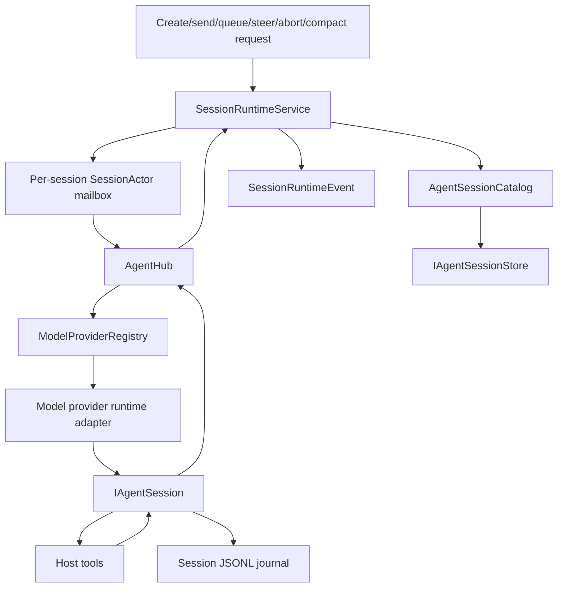

# Runtime and agent sessions

The runtime turns shell, plugin, and live-tool requests into CodeAlta-owned sessions, ordered per-session commands, normalized events, journals, and UI/plugin projections. Model providers execute turns and expose model metadata, but they do not own persisted session discovery.

## Runtime layers

`SessionRuntimeService` is the public runtime service used by the TUI, `alta` commands, and plugin orchestration adapters. It owns session-view creation, coordinator-session setup, prompt queueing, prompt sending, steering fallback, abort, manual compaction, skill activation, runtime event publication, and legacy session-view/session-view metadata journaling.

`AgentHub` is the active CodeAlta agent/session facade. It starts or resumes runnable sessions by resolving the selected `ModelProviderId`/provider key through `IModelProviderRegistry`, then coordinates run/abort/steer/compact operations through per-session handles. It does not list persisted sessions and does not probe providers for models.

`AgentSessionCatalog` and `IAgentSessionStore` own durable session discovery and history reads. `ListSessionsAsync` is streaming-only (`IAsyncEnumerable<AgentSessionMetadata>`) and reads from one configured sessions root for the current runtime.

Same-session mutation is serialized by internal mailbox actors and session coordinators. Different sessions can run concurrently; a blocked provider call, tool execution, or journal append for one session must not serialize unrelated sessions. Runtime events use bounded streams so slow readers do not create unbounded memory pressure.

### Selected-session current-runtime observation

`SessionRuntimeService.GetCurrentStateAsync(sessionId, token)` returns immutable
`SessionRuntimeCurrentState` / `SessionRuntimeCurrentEntry` values from the actual runtime owner.
Admission uses the existing retained-work owner, followed by `TryGet` and a synchronous copy on
the existing session actor. A missing actor returns an absent entry at registry lookup: the query
does not create an actor/coordinator/provider or read catalogs, journals, discovery paths or Display.
Pre-cancellation prevents admission; later cancellation stops the caller's wait, not admitted work.
Runtime/actor closure fails explicitly rather than manufacturing an inactive snapshot.

The observation contains entry presence, coordinator transition, recorded active run, observed
Shutdown termination, attachment retirement and queue-drain facts. **No run recorded is not proof
of provider inactivity**, including while a send is awaiting its provider result/events. Missing
entry, retirement, transition and query failure are not idle/completion signals. Queue depth is
unknown: durable queued records/counts are intentionally not loaded or cached by this query.
Captured provider/key/model/reasoning/prompt settings are not verified provider-effective values;
pending prompt selection remains separate from the coordinator's captured prompt. No tools,
instructions, delegates, credentials or mutable descriptor graphs are returned.

`RuntimeInstanceId` identifies this runtime independently of Display. `AttachmentGeneration` is
the existing attachment ordinal scoped by that instance; it identifies replacement, **not a state
revision**. Results may immediately become stale. Consumers must fence old selection, host epoch
and request-generation results, not order snapshots by attachment ordinal. There is no effect
acknowledgement, replay, history recovery or atomic history/original-event-stream handshake.

Owned Desktop exposes a unary `runtimeState.current` RPC and a manual **Refresh runtime state**
readout, separate from Display/history/receipts. It does not poll or automatically refresh.
Exact-target steering captures this observation, but the host revalidates all target authority.
Host epoch and bounded, well-formed session identity are validated before querying.
Malformed/oversized results produce `wire_limit`, with no partial/truncated authoritative state;
closure and other failures use stable codes without exception messages. Attachment ordinals use
decimal strings to preserve Int64 precision in JavaScript. Seven bounded identity/configuration
strings (256 UTF-16 units each), fixed GUIDs/enums/ordinal/keys and a 4 KiB framing allowance fit
the **32 KiB response budget**, verified with actual generated JSON serialization and worst-case
escaping. Stale host/runtime identity requires UI reload, not retrying the old epoch. Selection
detach cancels the frontend waiter and suppresses obsolete presentation; valid correlated late
host/runtime identity evidence still revokes the captured shared mutation capability. It does not
stop a run or the runtime. The App-owned reader retains one original frontend invocation and one
latest explicitly pending refresh; displaced pending refreshes settle as superseded. It never
creates retries or refreshes. Its retained drain joins original frontend processing and explicit
pending work, separately from individual refresh outcomes. Neither generated timeout/cancellation
nor frontend drain completion proves backend termination or reduces the backend read-ownership bound.

Owned Desktop also exposes a read-only `configuration.snapshot` inventory. In owned-host mode it
lists configured provider descriptors (including enabled/default/model/reasoning presentation fields)
and currently active plugin descriptors/contribution counts from the same Host instances. Listing
does not create provider runtimes, probe models, start plugins, read credentials or grant mutation
authority. Catalog-only startup returns an explicit unavailable/empty inventory. This is an M6
presentation foundation, not provider account/model refresh, prompt/skill CRUD or plugin management.

### Bounded last-observed usage and owned read-only RPC

`SessionRuntimeService.GetUsageStateAsync(sessionId, token)` uses the same admitted, non-creating
existing-actor query as `GetCurrentStateAsync`. It returns runtime-instance/session/attachment
identity and transition/retirement/termination status together with **one last observed typed
usage event on that attachment**, never a provider probe, metadata lookup, history scan or
catalog-derived limit. The existing attachment event path records a fixed-size projection only
after projecting the event on the session actor; it accepts exact session/provider identity and
the current non-retiring entry. Old callbacks cannot populate a replacement attachment.
Transition, retirement and termination withhold the observation. No new subscription is opened.

Window and operation fields are independently nullable; zero is retained when legitimately
reported. Invalid negatives/nonfinite values and nonpositive context limits become unknown and
set `HadInvalidValues`. Rate limits, model/operation labels, provider Details and nonprojected
fields are discarded, flagged by `HadOmittedData` if supplied. Wrong-identity typed callbacks
increment `OmittedUsageEvents` on the current attachment; events never admitted by forwarding
cannot be counted. No fields are carried forward from earlier events, summed or inferred from
catalog metadata. The usage-source timestamp and event timestamp are separate from the
per-attachment actor-admission sequence, neither timestamp orders observations. A missing
observation does not mean zero; a reported window need not describe current occupancy, and
neither the sequence nor this query certifies completeness, recency or provider truth. Readers
must fence host epoch, selection and exact runtime/session/attachment identity themselves.
The owned-only `sessionUsage.read` Desktop RPC now checks the actual host epoch and explicit project/global
request before calling `SessionRuntimeService.ReadOwnedUsageAsync`. The owner captures an **existing** actor
and attachment (no activation), then validates exact persisted session ID, creation time, provider,
working directory and positive scope using the new first-line-only `ReadBoundedHeaderAsync` (32 KiB actual
read plus one sentinel; no journal/history/cache scan). Project scope also requires the complete,
unarchived `ProjectCatalog.ReadBoundedOwnershipAsync` result against the actor-owned ID and normalized
path; an unknown project is never reclassified as global. The owner rechecks the original actor,
attachment and transition/retirement state **after** asynchronous storage checks. Missing usage,
stale/closed/transitioned attachments, invalid/ambiguous/incomplete metadata/catalog and read failures
remain distinct and never imply zero. Numeric Int64s (including generation, sequence, tokens, omissions)
and finite provider-reported cost/duration cross JavaScript as decimal strings; cost has no inferred
currency. The response omits paths, details, raw provider events, labels and history. Neither the
catalog nor journal read is an atomic cross-process snapshot or CAS against external changes/link swaps.
The Desktop composer now offers an opt-in HTML-dialog read-only usage inspector only for an exact uniquely
verified, untruncated owned writable scope; it reads on opening or explicit Refresh only. It validates
the epoch/session/runtime GUID/attachment/event sequence and each nullable wire field before displaying
anything. Old close/selection/scope/host responses cannot publish, and refresh replaces rather than merges
one attachment's last observation. It never polls, infers totals/current occupancy or establishes full/native
usage parity qualification.

### Committed live display window (M4 foundation, not complete M4)

`SessionRuntimeService.Display` exposes runtime-owned immutable renderer values. The runtime's
`SessionRuntimeEventPublisher` commits each publication **before** attempting delivery of the
same original event instance to the existing bounded/lossy `StreamEventsAsync` route. All
publication sites share this owner, including concurrent sessions. A short synchronous gate
orders commits and delivery attempts; projection work contains no I/O, provider calls, observer
callbacks or asynchronous waits. Observers cannot backpressure publication (ordinary bounded
gate contention/allocation still exists). There is no new stream reader. The original runtime
event/plugin-effects path is unchanged and remains separate from display storage; renderer
DTOs must never be substituted for genuine plugin inputs. No exception or JSON round-trip
compatibility is claimed.

Candidate display values are calculated before revision/state eviction is committed. Malformed
null text/lifecycle/catalog payloads are counted as unsupported (null/invalid session identities
as omitted) while original event delivery remains unchanged; this is not generic fault rollback
or a guarantee of recovery from allocation/process failure.

The original `StreamEventsAsync` route is **exclusive per runtime publisher**, not broadcast.
Admission is claimed on the first `MoveNextAsync`, not when obtaining a sequence or enumerator;
a competing consumer receives `InvalidOperationException` without touching the queue. A pre-canceled
token neither claims admission nor consumes an event. Admission adds only short claim/release
bookkeeping under the existing publisher gate; no asynchronous reads or yields run under it.

Dispose the original-event enumerator on detach. Only actual enumeration termination/disposal
releases its claim: cancellation or publisher completion does **not** release a reader suspended
at a yield. After admission, underlying channel semantics remain in force: buffered events may
still be yielded after cancellation. There is no added per-item cancellation check that consumes
and then drops an original event. Completion still drains accepted events, and a successor can
consume the remaining buffer without replay. Abandoned enumerators can prevent a successor from
being admitted until they are disposed; cancellation alone is not a join.

This prerequisite leaves TUI pumping, after-input queue draining, compatible adjacent-delta merging,
history, rich rendering and original plugin/effect inputs unchanged. Accepted events retain original
references and FIFO order up to that existing TUI merge boundary; newest-event drops still apply.
Exclusivity does not acknowledge UI/plugin effects, recover missed history, bound the TUI queue or
join asynchronous plugin work. Detaching the reader does not stop a run or the runtime. Independent
Display observations do not consume original events, and their revisions are not effect watermarks.

`Display.ObserveAsync` admits on first enumeration: registration and initial snapshot capture
are atomic. Each owner has a new `Epoch`; every publication and the final close increments one
global `Revision`. Subsequent messages are **full replacements**, not events or append deltas.
Each carries `PreviousRevision` and `HasGap` when intermediate revisions were coalesced. Replace
the entire local window, removing absent sessions/items; never replay these messages as effects.
One payload-free wakeup slot per observer coalesces arbitrarily slow consumption. There is no
event replay buffer. The next read captures current committed state under the same gate, so a
gap requires no upstream lossy-stream reconciliation for this retained window. It does not
recover history or omitted content. `GetSnapshot` is an atomic standalone query, not a substitute
for the observation handshake.

Coverage is deliberately partial (`IsPartial` is always true): latest published lifecycle,
queue **count**, configuration labels, host status and selected text channels (user, assistant,
reasoning/summary, plan, notice), plus two recently updated reported plain ToolCalls. Null state means not observed, not idle/empty. Lifecycle,
queue count and configuration survive text eviction **within a retained session**. Text keys
are `(session ID, run ID, content ID, channel)`; finalized content replaces its prefix, and late
deltas cannot unfinalize it. `StartedWithDelta` warns that there is no finalized baseline.
The projection is not hydrated from journals, does not infer command admission, and is not an
authoritative execution/permission/queue-item API. Catalog events copy configuration labels,
not mutable descriptors. Tool arguments/results, errors/exception graphs, other activity kinds, notes, asks, interactions,
plugin data, attachments and arbitrary JSON details are not projected. `UnsupportedEvents`
counts unsupported publications; omitted optional details/queue payloads/catalog fields are
part of the declared partial coverage rather than individually counted.

Reported ToolCall rows use exact `(provider.Value, nullable run ID, activity ID)` keys within the
existing session container. Requested/Started/Progressed/Completed/Failed/Canceled are the only
supported phases. Matching updates move to newest; a third identity evicts the oldest and increments
`EvictedToolActivities`. Latest published phase wins even if it regresses; this is not lifecycle
reconstruction. Identities are untruncated, well-formed and at most 256 units; an absent run stays null,
while a supplied empty/default run is invalid. A name is optional and retained as a surrogate-safe
128-unit prefix with its own truncation flag. An unpaired surrogate anywhere in the name rejects
the report, including beyond the prefix. Invalid reports increment unsupported accounting without
replacing valid rows or changing original event delivery. Name validation scans the whole supplied
string; retained payload limits are not a bound on validation time. No message, structured details,
arguments, results, paths or exceptions are traversed/copied into these rows.

Started is reported before invocation and may precede permission resolution; it proves neither
approval nor process launch. Other phases prove neither run completion nor exactly-once effects.
Missing/evicted activities remain unknown. Display values confer no command or permission authority.

Fixed bounds (UTF-16 code units, not UTF-8 bytes): **128 session windows**, **8 text items per
session**, **4,096 units per text prefix**, **256 per stable identity**, **512 per metadata
label**, **2 ToolCall rows per session** with **128-unit name prefixes**, and **32 live observers**. New sessions/text evict the least recently published/updated
window/item; eviction counters expose loss. Oversized/missing session or text identities are
omitted and counted rather than truncated into colliding keys. Text/metadata truncation is
explicit; prefix cutting avoids splitting a well-formed surrogate pair. Session eviction may
remove even a running session and all its last-known status; reappearance starts a fresh window.
No claim of complete active-session discovery should be made from this bounded display API.

These are **retained payload/count bounds, not a total heap cap**: current text payload is at
most 4,194,304 UTF-16 units (8 MiB of character storage), plus bounded identities, labels and
collection overhead. Tool identity/name payload adds at most 1,792 units per session. Immutable arrays/strings are shared with snapshots. Consumers may retain
unlimited old snapshots; iteration, concurrent snapshot reads, transient allocations, original
event/provider graphs, the legacy event channel, journals and renderer serialization are not
covered by that payload budget. There is no measured performance/whole-process memory claim.

Cancellation releases subscriber admission even while an enumerator is suspended at `yield`;
enumerator disposal also detaches. Neither cancels a run. Runtime disposal settles its existing
owned forwarding work, commits final closed state, wakes/completes observations and releases
the subscriber set. Late publications are refused. Late observers get one closed baseline;
closed state remains queryable for the runtime owner's lifetime. Next integration seam: a
host/frontend adapter can observe `RuntimeService.Display`, authorize transport scope and apply
replacements without adding a `StreamEventsAsync` reader. History paging, full status recovery,
shared interactions, original-effects routing changes and broader Desktop/TUI integration remain
later M4 work; the scoped selected-session Desktop channel is described below.

#### Selected-session Desktop channel (owned mode)

`SessionDisplayService` is registered in the real `DesktopApplication.RunOwnedAsync` against
that host's `RuntimeService.Display`. Normal no-argument startup now uses this route; the explicit
catalog-only route does not register it. This default change does not expand tool or permission
policy. `display.observe` is a generated
NeoAstra 0.1.0 channel using `DesktopJsonContext`. Before creating a runtime observation it validates
the expected **host epoch** and bounded, well-formed selected-session identity. Unknown/unobserved
or evicted identities yield an explicit absent session and partial coverage, without catalog/store
scans. Runtime stable session/run/content identities also reject unpaired UTF-16 surrogates so JSON
normalization cannot alias distinct row keys; rejected display identities are counted, while the
original event/effects route still receives the original objects.

Each item contains exactly the selected session, not the runtime's 128-session snapshot. It carries
separate host and projection epochs, decimal-string global observation revision/previous revision,
and decimal-string coverage counters/session revision. TypeScript orders revisions with `BigInt`,
not unsafe JavaScript numbers. Items are full replacements: absence clears the session; missing
text/tool keys remove rows. Text identity is session/run/content/channel; tool identity is
session/provider/nullable-run/activity. Lifecycle, queue count, configuration, text and reported
tools are display-only; submitted receipts are never interpreted as run completion.
Service failures use `invalid_request`, `stale_epoch`, `capacity` or `observation_failed`, with no
exception messages. Closing the runtime yields final closed state and ends the channel; canceling
or disposing its iterator releases only observation resources, including after a suspended yield.

The selected DTO retains at most eight 4,096-unit text prefixes and 256-unit stable identities.
Status/configuration/lifecycle labels are additionally limited to 256 UTF-16 units, with an explicit
transport-truncation flag. Including both tool rows, the conservative bound is 41,216 string units
at six escaped bytes each, plus 8 KiB JSON overhead and a separate 4 KiB framing allowance:
**259,584 bytes < 256 KiB per item**. The generated-serialization regression measures **247,886 bytes**,
**251,982 including framing**, with old and new fields maximized together. This replaces the earlier
16-KiB overhead estimate, which no longer fits the expanded conservative payload. This is a
selected-item payload budget, not a total heap claim. `MaximumFrameBytes`
remains an **inbound-only** limit and is not being used as an outbound payload cap.

Buffering layers are separate: the runtime retains one payload-free wakeup per observer; the
owned RPC session permits two channels (allowing teardown overlap) and two unacknowledged items
per channel. The published default client has a 64-item channel buffer. The application store
retains one selected replacement and serializes local iterator cleanup before opening another
selected-session channel; it does not replace the library's channel machinery. At the conservative
item budget, 64 buffered payloads alone could approach 16 MiB before parsed-object/string overhead,
and host credit/transport/transient/React allocations are additional. Credits acknowledge transport
buffer admission, **not DOM application**. No whole-process memory/performance measurement or
native final-message delivery-on-window-close guarantee is claimed.

`createSessionDisplayStore` centrally owns one original observation and one replaceable latest
desired selection. Scoped detach cannot cancel a newer selection. A successor waits for successful
terminal iterator return; failed, unavailable or incomplete cleanup retains the owner and blocks
reopening in that store (`cleanupBlocked` / sanitized `cleanup_failed`). Cancellation alone never
authorizes release. Its immutable current snapshot reports loading/connected/closed/error; late
selection/unmount callbacks, wrong epochs and out-of-order revisions cannot restore stale display
state. Valid correlated late host identity evidence revokes the captured shared mutation capability
before presentation fencing. Capability invalidation is monotonic and observable; subscriber faults
cannot prevent denial or other notifications. Revision strings are exact nonnegative Int64 values.
The UI offers
explicit reconnect without automatic commands, keeps persisted history separate, and renders plain
React text (no HTML/Markdown execution). A known stale host epoch explicitly requires UI reload and
disables reconnect with the old identity, even if iterator cleanup also fails. Opening timeout uses
the standard generated API; its signal remains attached for the full channel lifetime. This slice has managed in-memory channel, generated
contract/typechecking and frontend helper verification, not native/real-provider or complete M4 parity.
A renderer reload does not prove that an old channel or host work finished cleanup. These local
ownership guarantees do not establish a history/live watermark, effect replay or durable outcomes.

### Runtime-owned file-search cache invalidation

The host supplies the same concrete `ProjectFileSnapshotCache` to the runtime and project-file
search service. Live projected `FileChange` events (all phases) and `DiffUpdated` events mark it
dirty independently of TUI attachment and original-stream delivery, including stream overflow.
Provider forwarding carries the exact publication event and captured attachment directory out of
the actor; cache invalidation runs outside actor/publisher locks in the existing owned operation,
before parent-notification and queue tails. CodeAlta-authored appends capture the effect directory
before asynchronous admission and invalidate after the existing append/catalog/publication path.

This is a best-effort, noncancelable in-memory dirty mark, not a file scan, proof of a successful
write, or durable effect acknowledgment. Blank directories and standalone runtimes without a
borrowed cache do nothing. There is no additional worker, reader, retry or shutdown owner.
History rebuild and Display observation no longer repeat cache invalidation through TUI handlers.
Live plugin observation is now owned by `SessionRuntimeService` at provider publication, explicit
append, notes and synthetic-failure origins. The runtime captures the exact published event plus
session/project/path context, releases publisher/actor/journal ownership before invoking plugins,
and then runs cache, parent-notification and queue effects independently. The TUI no longer invokes
plugins from its live event reader; history replay remains unchanged and still invokes plugin
projection for historical reconstruction. There is no history/live watermark or exactly-once claim.
Explicit dependency-retention failures keep their owners alive; ordinary synchronous cleanup
failures remain ordinary and continue best-effort dependent cleanup.

### Durable session notes

`SessionRuntimeService.GetNotesMarkdownAsync` and `UpdateNotesAsync` own tab-independent notes operations. `RuntimeAltaNotesService` is the actual live-tool adapter used by TUI composition; the old tab-authoritative notes service is removed. An explicit caller session ID wins, including when it is unknown (no fallback to another selected session). A host fallback captures only a session ID once, before awaiting stdin or storage. Resolution uses active runtime provider identity or persisted metadata and the configured global/project catalog association, without provider startup or prompt/skill discovery. These are trusted backend identities, not renderer authorization or arbitrary journal-path inputs.

The existing `SessionViewJournalStore.CreateSessionStore` supplies the shared journal gate/cache. `FileSystemAgentSessionStore.ReadLatestNotesAsync` deserializes every record as the canonical parser does and retains only the last notes event; it does not materialize full history or introduce a notes database. Journal order, not event timestamps, wins, including cleared and empty Markdown events. The shared journal owner (`AgentSessionJournalFile`, instance-owned, so shared by every store that `CreateSessionStore` returns) remembers the scanned prefix of each journal in memory: its end offset, the bytes just before it and the last notes event in it. The first read of a journal after host start scans it completely. A later read of a journal with the same length and last-write time is answered without opening it, and a longer journal is scanned only past the remembered prefix once the bytes before that offset still match; anything else (shorter, same length with another write time, different bytes) is scanned from the start. A malformed or unterminated final record is never part of the remembered prefix, so the existing incomplete-final-record tolerance and malformed-interior rejection are unchanged. Like the history stamps, this does not detect same-stamp rewrites. Notes reads take the per-journal gate only to capture the journal length after admitted writes; the scan runs outside it, so it does not delay history pages or event appends for the same session. Concurrent notes reads of one journal are serialized so the later one reuses the earlier scan. BOM-detected non-UTF-8 journals keep the complete scan under the gate. Deleting a session or replacing its journal for provider selection drops the remembered prefix. Before appending, notes writes validate canonical content strictly: no malformed final record is tolerated, notes events without Markdown are rejected and a BOM-detected non-UTF-8 journal is refused. Validation reuses the remembered prefix, because every record in it was deserialized successfully and is newline-terminated; those records are not read again. An append first brings the prefix up to date exactly as a notes read does, outside the per-journal gate. It then takes the gate, opens the read/write handle with read-only sharing requested and validates on that handle only what follows the prefix: records written in the meantime and a final record the tolerant scan left out. The gate is therefore held for that remainder and the append rather than for a journal-size scan. The first notes operation on a journal after host start still reads it completely, without the gate. A successful append remembers the prefix it validated; the appended record itself is read back from the journal by the next notes read or append. The prefix is reused when the journal is longer and the bytes before its offset still match, or when length and last-write time are unchanged and those bytes match; anything else is validated from the start, so rewrite detection is that of notes reads. Validation uses bounded memory and is not repair or a paging framework. A valid final record without a newline is preserved and separated from the new event; malformed/truncated content (with or without a final newline) is refused without changing user bytes. Ordinary reads retain their existing incomplete-final-record tolerance. Writes append the same `AgentNotesEvent` format, refresh metadata, invalidate the catalog and publish runtime feedback. Post-commit adapter notifications run in that same per-file order; they must enqueue presentation work, never synchronously wait on UI or reenter journal operations. Metadata refresh uses the already-owned journal gate rather than reacquiring it; cache hydration reads do not acquire that gate.

Cancellation applies to lookup, reading, gate admission and opening the existing journal. After write admission, the single record and feedback finish without caller cancellation; an acknowledged write is not reported as canceled. Read failures never become empty notes, and failed admission/write does not emit `Changed` or command success. A record committed before cache/invalidation/observer failure produces an explicit `AgentNotesCommittedException`: read notes again before retrying, rather than assuming rollback. Partial filesystem I/O and power-loss atomicity are not promised.

TUI owns only projections: acknowledged changes update a matching open tab and the selected sidebar. Sidebar construction receives an initial Markdown snapshot without storage I/O; selection/history replay later supplies recovered notes. Closing a view does not gate shared notes operations. Existing timeline delivery/loss and history-load races remain unchanged; this slice does not add loop-stop/reload reconciliation, renderer reconnect/grants, shared host lifetime transactions, or new durability for drafts, asks or reminders.

### Owned Desktop current-notes read

Owned-host composition exposes unary `sessionNotes.current` through `OwnedSessionWorkspace` and
`SessionRuntimeService.GetOwnedNotesMarkdownAsync`, independently of owned asks. The catalog-copy
branch does not register it. Requests contain only a canonical host epoch and bounded session ID;
backend active/recoverable session and project association resolution remains authoritative. No
provider or prompt/skill discovery is started. The notes-specific `ReadLatestNotesContainedAsync`
validates lexical containment and passes that exact path to the shared legacy parser and journal
lock. It does not re-resolve the path after validation. Existing TUI/read/write semantics are unchanged.
Containment guards the notes-content open, not prior cache metadata/existence probes, reparse points
or external filesystem races; this is not a sandbox.

Notes shares the existing **eight actual workspace reads** with snapshot/history operations. The
owner retains work and fault observers before launch. Caller cancellation or a bridge timeout ends
only its wait, not the actual read or occupied slot. Host shutdown closes read admission and starts
command disposal independently, joins reads, then disposes runtime dependencies. No shutdown timeout
is added. Synchronous capacity refusal is distinguished from downstream read failure; error responses
contain sanitized status and validated identity, never exception details or Markdown.

Only `ok` carries complete well-formed text, capped at **262,144 UTF-16 units** without truncation.
Empty Set, Clear and no notes event all remain `""`; no timestamp, revision or update kind is invented.
Journal order and incomplete-final-record tolerance are preserved. Generated worst-escaping response
measures **1,574,495 UTF-8 bytes /1,578,591 with framing**, below 2 MiB. This is a wire bound, not a bound
on journal scanning, allocation or latency: the first read of a journal scans it completely, and
later reads reuse that scan as described under durable session notes.

The App-owned reader offers **Refresh notes** only. Selection/remount changes detach presentation
without cancelling the original bridge promise; synchronous exclusion prevents overlapping local
reads. Valid late host-epoch evidence revokes the shared mutation capability before obsolete-result
suppression. Failures are not empty notes and are not a mutation uncertainty ledger. Reload may make
a fresh durable read, not recover execution authority. Text renders literally in a `<pre>`; notes
editing, rich Markdown, automatic refresh/retry, browser persistence and native qualification are
separate work.

### Captured execution options

`SessionExecutionPolicy` captures a portable, immutable `SessionExecutionRequest` and assembles `SessionExecutionOptions` with host-supplied Agent tool and interaction contracts. Assembly performs no filesystem access, provider startup, model discovery or prompt discovery. Descriptors and root lists are copied into scalar/read-only values rather than retained as mutable authority. Provider/model/reasoning choices are preserved even before the model catalog synchronizes; an existing tab's provider override wins over the stored provider, and agent prompt preferences retain null-fallback and whitespace normalization behavior.

The TUI's creation route carries the explicitly captured project to this policy. Existing send/resume options resolve the session's own `ProjectRef`, independent of selection, and reject an unrelated resolved project. Global sessions use the configured global root without project tool identity or overlays; known project sessions use their project path; missing projects retain the stored working directory with no project overlays. A missing project reference still identifies the session's project association, not whichever project happens to be selected.

`SessionExecutionOptionsFactory` remains the TUI adapter for `alta` tools and permission/user-input callbacks. Tools share the execution request's frozen project identity and working directory. Existing-session ids are captured too; draft tools retain only the deliberate deferred canonical id binding after creation. Permission callbacks still prefer an explicit request session id over the captured fallback (including transient draft keys), and user-input callbacks retain their captured session association. This is trusted provider callback association, not renderer authorization. Auto-approval defaults and immediate user-input responses are unchanged; permission completion ownership is now shared as described below.

These APIs accept trusted backend policy inputs. They are not renderer authorization, filesystem grants, or new tool approvals: an application boundary must authorize renderer requests and resolve their descriptors before calling them. LiveTool and UI services are supplied by adapters, not located or referenced by Orchestration.

### Explicit prompt and skill discovery roots

`CodeAltaHostOptions.DiscoveryScope` is an opt-in `SessionDiscoveryScope` with two independent,
fully qualified paths: `UserProfileRoot` for prompt/skill home inputs, and
`InstructionAncestorRoot` for instruction-file ancestry. `GlobalRoot` remains the separate
catalog/configuration root; it is not used to infer either scope path. Scoped host creation
requires explicit absolute `GlobalRoot` and `CurrentProjectPath`, with the latter inside the
instruction boundary, before bootstrap or other host acquisition.

The template provider retains the scope, and `SessionRuntimeService` derives it from that
same provider. Runtime creation/discovery and prompt construction validate supplied working
directories and project roots before persistence or discovery. Relative, blank, sibling-prefix
and normalized `..` escapes are rejected rather than silently filtered out. Instruction files
are visited from the permitted boundary through the leaf, including the boundary; existing
selection and deduplication rules remain. Callers without a scope retain the previous home
defaults and full ancestor walk. The runtime constructor and the template provider's original
constructor remain available.

This is a **lexical discovery policy, not a filesystem sandbox or ownership grant**. It does
not resolve links/reparse points, bound builtin-skill source lookup or Git configuration
discovery, isolate plugins/providers/authentication, or authorize tools. A scoped host is not
automatically safe to execute against arbitrary roots. Real-host fixtures still need separate
discovery, storage, provider and lifetime admission; this plumbing alone does not enable
Desktop startup, owned commands or event subscriptions.

### Host-owned text commands (in development)

`CodeAltaHost.Commands` owns text-send, abort, exact-target steering, idle-compaction and exact-run cancellation admission against that host's existing
runtime. Requests contain scalar identity/text values, not mutable descriptors, execution
options, tools or callbacks. Send preparation resolves the durable session directly and captures
its execution policy; this bounded route supplies no custom tools, defaults to denying permission
requests and cancels user-input requests. The explicit owned-command permission opt-in below
does not change preparation/session callbacks, existing TUI policy or direct runtime callers.

Admission reserves one owned send per session before lookup. Client request IDs are ordinal;
send identity uses a case-insensitive session ID and exact text. Matching retries return the
same receipt. `OwnedCommandReceiptCapacity` defaults to 256; receipts are retained for the
owner's lifetime rather than evicted, and new requests, including abort receipts, are rejected
when full. Disposal can still initiate control without allocating another receipt.

`OwnedTextSteerRequest` captures exact session/runtime-instance/positive-attachment/non-null-run
identity, retry key and unnormalized text. Steering reserves an independent per-session slot
and shares receipt capacity with Send/Abort; exact record replay returns the same receipt and
changed payload or command kind conflicts. It does not prepare or discover a runtime. The
existing session mailbox validates the target, owned-denying defaults and transition/termination
state before acquiring the existing attachment's use; retirement rejects acquisition. Dispatch
forwards the original `AgentSteerOptions.ExpectedRunId`, never retargets, and rejects a different
returned run. Provider-boundary expected-run enforcement remains essential to later-run exclusion.
The existing run retains its permission callback; steering creates no new approval window.
Caller cancellation cannot cancel admitted steering. Shutdown starts independent cancellation,
then joins retained dispatch and cancellation work; explicit forwarding registrations are joined
before releasing the execution source and captured attachment use. This does not add active-run
abort or durable queue execution ownership. The separate idle-compaction route is described below.

`OwnedCompactRequest` captures session/runtime-instance/attachment/key, without a fabricated run
or history revision. The mailbox rejects stale/non-owned/transitioning/terminated entries,
recorded runs and queue drains, then retains use of the exact existing attachment; retirement
refuses acquisition. It never discovers/replaces a coordinator, clears pending prompt selection
or publishes a start event before provider admission. Null recorded run only permits an attempt.
`AgentHub.TryCompactWhenIdleAsync` attempts its run gate without waiting and requires the optional
`IAgentIdleCompactionProvider`; unsupported sessions have no fallback. `AgentSession` likewise
attempts its state gate without waiting, refuses active runs and holds that gate through the
existing compaction body. Trusted `CompactWithOutcomeAsync` retains its existing behavior.
The new capability's null outcome means busy/no compaction started, not background execution.
Compaction can summarize with the configured model and persist context current at admission;
the in-process summary request has no tools. No new permission callback/window is created.

Compaction has its own per-session slot within shared receipt capacity. Exact record replay
returns the same receipt; different request fields or command kind conflict. Outcomes distinguish
`compact_busy`, `compact_unsupported`, `compact_unsuccessful` and `compact_failed` without exposing
arbitrary provider messages. Success means actual compaction settled successfully, including a
valid no-op. Caller cancellation governs admission only. Dispatch, cancellation traversals and
attachment/source lifetime are retained and joined through shutdown just as for owned steering.

Caller cancellation governs admission only. Accepted preparation, send, cancellation and
attachment-aware abort work are retained by the owner; a session slot remains occupied until
its send and control settle. Host disposal closes admission and joins commands before runtime
dependencies. Noncooperative preparation can keep that join pending indefinitely. Receipt
completion describes the returned send/control operation, **not transcript or provider-turn
completion**; it does not add an event reader or govern callers that bypass this service.

`BuiltInSkillRoot` optionally supplies an absolute builtin-skill root without assembly-ancestor
lookup. Null preserves the existing default. Neither it nor `DiscoveryScope` isolates Git,
plugins, authentication or ambient environment reads. `PluginEnvironment` optionally supplies
a map copied with case-insensitive keys for host-created plugin adapter operations; null
retains the ambient snapshot. It does not isolate process or provider environments.

The owned route passed 17 exact real-host tests using a registered fake provider, fresh explicit
roots and an empty plugin environment map. Tests cover retries, capacity, caller cancellation,
attachment-aware abort, provider faults, deny/cancel interactions and disposal ordering. The
fixture initially failed because a view header alone did not seed an agent summary; it now
uses existing store APIs and validates durable readback before creating the host. The separate
Desktop integration below has separate fake-provider qualification; these earlier tests alone do
not qualify that integration. TUI activation, real providers, event projection, noncooperative
shutdown and frontend/native parity remain unqualified.

### Volatile owned deferred text execution

`OwnedSessionCommandService.AdmitQueue` reserves one outstanding text item per session, sharing
the owner's bounded receipt capacity and ordinal retry-key namespace. `OwnedTextQueueRequest`
captures exact text, session, runtime instance and attachment generation, not an expected run:
it authorizes future execution on that existing owned attachment only. Reservation is distinct
from retained `QueueInsertion` (`queue_accepted`: retained **in this host only**) and eventual
`Completion`. Exact replay returns the original receipt/results, even after closure; changed
immutable fields or command kind conflict. Caller cancellation after admission abandons only a waiter.

No queue journal row is inserted. Waiting items retain cancellation/task ownership, not a long-lived
handle-use lease. A temporary use protects attachment-token registration outside the mailbox;
publication and claim revalidate exact identity, owned defaults, retirement, transition, termination
and pending prompt replacement. Claim shares existing drain arbitration and atomically acquires
its slot/use. Eligible legacy journal records take precedence; a failed/null journal read cannot
authorize an independent owned drainer. Enqueue attempts one immediate drain, then uses existing
event/completion opportunities, not polling. Durable records, including owned-looking provenance,
never construct live owned authority or gain owned permission review.

Claimed work sends through the captured handle without resolving/replacing it. Opted-in review
binds actual run lifecycle authority at execution time; default denial and user-input behavior
remain unchanged. `queue_dispatched` describes returned dispatch and cleanup, not conversation
completion. Bounded failures include `queue_target_unavailable`, `queue_binding_unavailable`,
`queue_failed`, `queue_cleanup_failed` and `queue_cancel_failed`. A hook-ignoring provider is denied
owned review; binding failure is reported after dispatch returns, not as preflight rejection or
rollback. Unsolicited provider cancellation exceptions are failures, not `queue_cancelled`.

`AdmitCancelQueue` targets the original queue operation ID, never a current/later run. Cancellation
uses only that operation's source; `queue_cancellation_signalled` or `already_terminal` does not
prove rollback. Waiting items settle on retirement/owner/runtime closure without acquisition.
Claimed sends retain original work, permission closure, callback traversal and registration joins
before source/use release. Independent cancellation starts before dependent joins; noncooperative
providers/callbacks can keep shutdown pending indefinitely. Timeouts are not termination proof.

Desktop exposes this host-lifetime contract through unary `sessions.queue` and `sessions.cancelQueue`,
routed only to those owner admissions. Queue requests contain epoch, client key, session, runtime,
canonical positive Int64 attachment **string**, and exact text (at most 32768 UTF-16 units). Cancellation
contains epoch, client key and original operation ID. Admission checks epoch first. The shared receipt
index retains at most 256 owner references and returns manual 64-row pages; no text is reconstructed.
Nullable `QueueInsertion` is null on other command kinds, initially pending on Queue, then settles
independently of execution. Projection samples completion before insertion, allowing settled/refused
insertion with still-pending execution, never terminal execution with pending insertion. Generated JSON
fixtures include framing allowances within 208-KiB inbound and 448-KiB response budgets.

The manual UI captures explicitly refreshed exact identity; busy/draining is permitted, but unavailable,
transitioning, retiring, terminated and pending-prompt observations are not. App-owned immutable intents
and synchronous in-flight latches survive selection/remount (256 combined queue/cancel intents).
Manual reconciliation requires matching epoch/kind/key/session and original cancellation target;
late epoch mismatch disables shared mutation without rebasing. Only actual queue-intent recovery clears
queue text; cancellation-only recovery preserves an unrelated draft. Document reload loses local intent;
manual receipt browsing does not recreate its text/key or authorize automatic retry. No durable/restart
recovery, new raw-event reader or renderer permission authority is introduced.
The [parity ledger](dual-head-desktop-parity.md) records focused verification and two explicitly
uncovered paths: injected failed/null journal reads and retirement forced between setup capture
and registration/publication. Source inspection is not dynamic proof of those interleavings.

### Desktop submissions and owned reads

The in-development Desktop owned mode borrows `Commands` and `WorkspaceReads` from one
`CodeAltaHost`. Normal no-argument startup uses this mode with the current directory, standard
`~/.alta` profile and the same instruction/builtin discovery defaults as the TUI. The separate
scoped form requires the existing browser/catalog/cache-consent arguments plus all of
`--allow-owned-host`, `--project-root`, `--discovery-home`, `--instruction-root` and
`--builtin-skill-root`. Every scoped root is explicit and absolute; the instruction root must
include the project. This is not proof of task ownership or reparse isolation. Browser-only and
catalog-copy-only modes retain their read-only behavior.

Owned-mode consent includes lock, project catalog, journal, cache and provider-state writes;
configuration, instruction and skill reads; and configured-provider registration, which can read
declared credential environment variables and shipped defaults. Registration is lazy, not
provider readiness. A later submission can invoke provider authentication, storage and network
access. Plugins and probes remain disabled, and the plugin environment map is explicitly empty;
that map does not isolate provider environments.

`WorkspaceReads` retains at most eight actual uncancelled reads, rejecting excess admission
rather than queuing. Caller cancellation stops only the wait. Snapshot reads fully consume the
host journal's cached session store directly, including final cache writes, without
`AgentSessionCatalog`, an uncached fallback or invalidation. History uses that same store's
bounded page reader. The existing 200-project/500-session/700-KiB projection limits do not bound
the underlying catalog enumeration. Host shutdown closes read admission, starts command and
read drainage before awaiting either, joins both, and only then attempts runtime disposal.
Settled failures preserve command/read/runtime order; noncooperative work can remain pending.

Desktop mutations validate an expected host epoch before owner admission. The transport keeps
only owner receipt references, never a second execution queue or retry policy. Up to 256 receipts
remain available in stable 64-row pages for that epoch; reload recovers receipts, not prompt text.
The owned RPC host uses a 208-KiB inbound frame ceiling, while validated receipt projection and
generated-JSON checks establish a separate 448-KiB response budget. This is not a per-response
limit supplied by NeoAstra. Text is limited to 32,768 UTF-16 units; identities are validated rather
than silently trimmed or truncated.

**Refresh submissions** is explicit. App-owned `createOwnedSubmissions` retains up to 256 combined
Send/Abort intents and their original transport waiters. Send captures immutable epoch/key/session/
exact text; Abort captures the original pending Send operation and session metadata, not a runtime
or later run. Synchronous exclusion survives selection/remount and prevents recaptured intent from
replacing uncertainty. Matching receipts cannot release an intent while its original waiter is live.
Accepted/replay responses and manual reconciliation require valid exact kind/key/session identity,
plus original target for Abort; malformed/mismatched responses and transport uncertainty retain intent.
Legacy nullable outcome/code/run fields remain valid, including on mixed receipt pages. Coherent
definite refusals require absent receipts. Recovery reports Send separately from Abort so Abort-only
refresh cannot clear unrelated composer text. There is no polling or automatic resend.

Valid late host/runtime mismatch latches shared mutation invalidation even after selection cancellation;
obsolete UI publication is suppressed independently. Reload allows manual host receipt browsing, not
reconstruction/rekeying of lost local text or targets. **Abort original Send operation** is not a general
Stop-agent command: control settlement does not prove rollback, decision retraction or run termination.
No runtime event reader or live projection is added by this frontend correction.

Generated owned-only `sessions.steer` accepts up to 32,768 UTF-16 text units and 256-unit
identities, canonical runtime GUID and positive decimal attachment generation. It uses the
same epoch gate, bounded owner receipts and sanitized outcomes. **Steer observed run** captures
only the manually refreshed current-runtime response, not Display/history or a send receipt.
App-owned immutable retention and synchronous per-session in-flight exclusion survive panel
remounts; uncertainty can be reconciled by manual receipt refresh or an explicit exact-key retry,
never automatic retry/rekeying/retargeting. Receipt matching includes command kind. Stale host or
observed runtime identity disables mutations until reload. Completed steering means input
submitted, not completion of the run. Generated-contract and inert managed/frontend coverage is
recorded in the [parity ledger](dual-head-desktop-parity.md); mounted/native/provider behavior is
not established by those tests.

Generated `sessions.compact` adds the same owned-only epoch/identity validation, canonical GUID
and decimal attachment checks. Maximum-escaping input plus framing fits 16 KiB within the existing
208 KiB bridge frame budget; this is not a heap bound. The UI captures only a manually observed
attachment with no recorded run/drain and explains provider-time idleness. App-owned immutable
retention, synchronous in-flight exclusion and **Compact-kind** receipt reconciliation survive
selection/remount. Manual exact-key retry never retargets or changes a settled busy receipt;
trying again requires a new explicit action. No automatic retry, polling or new production event
reader is added. Native/provider qualification and broader command parity remain open.

The explicit catalog-copy lease belongs to the Desktop application through the synchronous
native loop. A cancellable close signals retained shutdown work without awaiting it inside the
native close callback. Five seconds is a diagnostic threshold, not termination: unconfirmed
host cleanup must retain the lease and acquired native resources. Only confirmed cleanup permits
normal final close and lease release. External/noncancellable termination is not successful
cleanup. Native lifecycle behavior remains unqualified. Separately audited tests passed for
real host/cached-store RPC reads and submission/replay with a registered fake provider, seven
literal read/drain cases, generated DTO bounds, and five frontend helper cases. These do not
execute configured providers, mount React, or prove native close behavior; see the
[qualification record](desktop-native-qualification.md#desktop-owned-session-integration-managed-qualification).

### Immediate user-input policy

Orchestration's pure `SessionUserInputPolicy.CreateResponse` owns the existing immediate answer selection. With AutoApprove disabled, every prompt receives an empty answer. When enabled, nonempty options are scored by the existing case-insensitive substring keywords and question heuristics; the first highest-scoring option wins and its label is returned literally, including whitespace. Options take precedence even for secret prompts. Without options, secret or nonfreeform prompts receive empty answers; other prompts receive `No preference. Use your best judgment and continue.` Answer identifiers retain ordinal comparison and duplicate identifiers still fail. The policy does not mutate the supplied form.

`SessionUserInputRequestCoordinator` remains the TUI adapter: it checks cancellation at entry, captures `GetAutoApproveEnabled`, calls the shared policy, and presents the request/immediate response timeline only if the captured session has an open tab. Callback session association and immediate completion are unchanged. These are trusted request/setting inputs, not renderer permissions. This extraction does not implement pending question UI, shared `alta ask` ownership, reconnect/recovery, or new lifecycle behavior.

### Permission ownership

`SessionRuntimeService.Permissions` owns one `SessionPermissionService` for the runtime/application lifetime. Its mailbox serializes registration, independent pending-summary listing, full-handle resolution and cancellation; it never waits for a user's decision inside the runner. Registrations expose a read-only completion task and a presentation guard, not a completion source. A handle contains the captured session ID, nullable provider run ID, provider interaction ID and a fresh application attempt ID. Providers without a run ID retain an explicit null association; the service does not invent a runtime run ID. Wrong scopes, invalid decisions, old attempts and replayed responses cannot resolve a pending request. Reusing a provider interaction ID creates a new attempt. Completion removes the pending entry without accumulating completed tombstones.

AutoApprove still defaults to `true` in `NavigatorSettings` and returns `AllowOnce`; disabling it retains the existing **Allow Once**, **Allow for Session**, **Deny**, and Escape/**Cancel** choices. The provider runtime still enforces the choice; the shared owner does not grant new tool capabilities or policy amendments. Caller cancellation returns Cancel (the TUI retains its pre-entry cancellation exception), as does owner shutdown. Runtime disposal cancels pending permissions before joining session actors/runs. The explicit `CancelRunAsync` operation cancels current requests for exactly one session/run association, not future run admission.

Cancellation cleanup is asynchronous, but cancellation validity is not deferred to its mailbox message. Resolution checks the retained caller token inside the mailbox before completing the attempt: if cancellation is already signaled, the attempt completes Cancel and a non-Cancel response is rejected. Cancellation after that check does not revoke a decision that won the race. `ListAsync` and `IsPendingAsync` also check cancellation inside the mailbox and exclude canceled attempts even before cleanup removes them. Their observations are not reservations: cancellation after a read may invalidate an already returned summary, and resolution always rechecks. Removal remains single-writer and exactly once, with no completed tombstones.

The TUI coordinator is a presentation adapter. It checks pending state again inside queued UI work and joins dialog closure on completion/cancellation. Presentation failure cancels the attempt and propagates the observed failure rather than allowing a tool or leaving an unresolved owner entry. Buttons resolve scoped handles, not frontend completion sources. Disposing a dialog only detaches presentation; it does not decide the permission. Timeline formatting and open-tab lookup stay in TUI and do not gate authoritative completion.

Pending summaries remain available without an open tab and outside the bounded/lossy runtime timeline. They copy only immutable identity and scalar command/file preview data; mutable provider collections and raw JSON payloads are not retained as authoritative state. These are trusted in-process application contracts, not renderer grants, full payload replay or durable restart recovery. This bounded permission slice does not implement shared pending user-input/`alta ask` workflows, renderer reattachment, general host admission/shutdown changes, or whole-runtime close/reload stress qualification. In particular, the terminal loop must still service queued presentation work while it is being joined; full application exit ordering is a separate lifecycle qualification.

#### Opt-in owned command permission lifetime

`CodeAltaHostOptions.ReviewOwnedCommandPermissions` defaults to **false**. When explicitly enabled,
an owned text send can register a plain command request for manual resolution in the same
`SessionPermissionService` mailbox. Experimental owned Desktop startup enables it only with
`--review-owned-command-permissions`; ordinary and catalog-only launches do not enable review.
Preparation and persistent session callbacks always deny; user input remains canceled.
Only providers honoring `AgentSendOptions.OnPermissionRequest` can participate. Ignoring the
per-send hook leaves the provider's permission path denial-only.

Coordinator matching intentionally does not compare callbacks. Therefore every owned send, including
with opt-in disabled, checks that its captured attachment was prepared with the owner's fixed
denial/canceled-input callbacks. A matching coordinator with different defaults fails the send before
provider invocation rather than inheriting those defaults or silently replacing the coordinator.
This conservative callback-identity check establishes only the fixed default policy; it is not the
per-operation association, which remains the mailbox-owned execution record below.
For a matching coordinator with incompatible defaults, owned preparation preserves its pending
prompt and send admission rejects before clearing that prompt or changing run/start state. The
rejection reports failure on the owned command receipt, not a session-wide error or run-terminal
event attributable to a pre-existing run. Any allocated permission execution still closes before
the acquired handle use releases; the existing attachment and active run are left intact.

The command owner creates one record for the immutable receipt operation ID and canonical
session ID with that operation's execution token. Runtime send acquisition binds the record once
to the runtime identity and actual attachment while holding its handle use, then passes a delegate
capturing that record through `AgentHub.RunAsync`. There is no current-run lookup, nullable-run
inference, token-equality association or mutable latest callback. A retained delegate cannot
rebind its record or join a later send on a reused coordinator. Receipt replay does not recreate
the record. A request's provider run ID, including null, remains part of the fresh attempt handle.
For supporting providers, the optional per-send `AgentRunLifecycle` also binds the execution once
to the actual activated run ID and provider-owned execution token. `StartedAsync` is awaited
outside provider gates before permission-capable work; this identity is never inferred from an
event or the first request. A supplied non-null request run ID must match the binding. Null-run
requests still belong to that exact execution. Bound-token cancellation rejects new approvals
at mailbox admission/list/resolution checks and cancels pending deliveries even when the request
token is `None`. `ClosingAsync` closes and joins the captured execution before provider source
release, including activation-hook failure. Providers ignoring the hook retain baseline unbound
behavior, not an inferred exact-run capability. Trusted TUI registrations are unaffected.

Admission requires an exact session and bound provider identity and an `AgentCommandPermissionRequest`
with complete nonblank command and working directory. `ApprovalId`, `Actions`, `Network`,
`ProposedExecPolicyAmendment` and `ProposedNetworkPolicyAmendments` must all be null (not empty
collections). Fields are validated without truncation or normalization: well-formed UTF-16, no
NUL, and no controls or surrounding whitespace in identity fields. Conservative limits, in UTF-16
code units, are 128 for session/provider/interaction/run identities, 4,096 for command, 1,024 for
directory and 1,024 for optional reason. Other typed requests and raw/generic requests deny.
Only **Allow Once**, **Deny** and **Cancel** resolve owned records; the existing trusted
`ResolveAsync` cannot grant **Allow for Session** on them. Immutable validated scalar snapshots
are retained rather than mutable request collections.

The mailbox rechecks the exact association and command, attachment and callback cancellation on
resolution as well as registration, even when the provider passes `CancellationToken.None`.
Invalidation cancels pending attempts and denies later callbacks. A decision accepted before
invalidation remains accepted; an earlier cancellation/invalidation rejects a later approval.
Send return/failure/cancellation closes the window in runtime `finally`, joining only owner-controlled
delivery cleanup before linked-source disposal and handle-use release. Exact-operation abort closes
before preparation/provider/cancellation joins. Attachment retirement invalidates before handle-use
joins while preserving independently initiated cancellation and abort. Command-owner disposal closes
owned admission without disposing shared TUI permissions. Runtime shutdown still initiates permission
disposal and attachment retirement concurrently and retains the existing failed-retirement behavior.
Closure is **not** provider quiescence, tool-effect acknowledgment, durable recovery or a general
shutdown deadline; noncooperative provider/preparation work can still prevent termination.

Limits per permission service are 64 live owned execution records, 128 owned pending/delivering
attempts total and four per execution. Excess requests deterministically deny; inability to allocate
an execution fails the owned send with `permission_unavailable`. Completed delivery bookkeeping is
removed and closed records leave the live index; cleanup still in flight counts against attempt
capacity. There are no permission tombstones or growing completed-task lists. These limits do **not**
bound legacy trusted TUI pending state, externally retained delegates/requests, receipt history,
mailbox callers waiting for admission, provider memory or total process heap. Parent-audited isolated
backend fixtures exercise these lifetimes with fake providers and inert decisions; see the
[parity ledger](dual-head-desktop-parity.md) for verification evidence. They do not qualify
native/frontend or real-provider behavior.

#### Owned Desktop command review

The generated `sessionPermissions.list` and `sessionPermissions.resolve` RPCs use dedicated
`ListOwnedCommandsAsync` / `ResolveOwnedCommandAsync` operations, never the trusted TUI list/resolve
surface. The mailbox filters owned plain-command requests and validates the receipt operation,
runtime instance, attachment generation and complete session/provider-run/interaction/attempt
association atomically against the still-live record. A null provider run stays null. Ordinary
trusted TUI registrations cannot be listed or resolved through this route.

The adapter requires the current host epoch and canonical nonempty GUID/decimal identities.
Selected-session lists return at most four complete commands with an explicit more-entries flag;
refresh after resolving entries reveals remaining requests. Invalid or oversized data fails closed
without shortening a command being approved. The 192 KiB response budget includes a 4 KiB framing
allowance; it is not a process memory bound. Errors are stable codes, not provider exception text.

The App-owned frontend reviewer retains one immutable original epoch, complete handle and clicked
decision with its original transport waiter. Detaching presentation cancels selection-owned list
reads, not that decision wait, pending permissions or the run. Resolution keeps its existing
8,000-ms transport deadline; this is not a host-termination guarantee. Exact replies are validated
before obsolete presentation callbacks are suppressed. Epoch invalidation remains latched even
when a late exact success arrives. Refresh/response races cannot restore actionable stale cards.

**Observe retained decision** is synchronous and local-only: it reports the original session/handle
and pending/result/error state without either RPC. Neither mounting nor live result publication
acknowledges a terminal response; explicit terminal observation and fresh manual review are required
before replacing the record. Pending observation grants no authority. Only an exact resolved/rejected
response settles the decision: resolved means accepted, not executed, and rejected does not identify
an earlier decision. The mailbox consumes attempts without replayable outcomes; pending-list absence
cannot reconcile them. Transport failure, malformed/mismatched responses and genuine uncertainty
keep review disabled across selections until renderer reload, as does epoch invalidation.

Renderer reload loses the local record and permits only explicit reads of still-pending requests
under the existing opt-in. It reconstructs no lost decision; host restart restores no old authority.
This is not retry, pending-list reconciliation, a completion ledger or durable recovery. It adds no
polling, push notifications, file-change review, session-wide approval, user-input/ask handling,
or native/provider qualification.

## Restricted owned Desktop asks

`CodeAltaHostOptions.EnableOwnedAsks` defaults false; the existing explicitly owned Desktop
composition enables it. `Commands.Asks` owns a private instance of the shared `AltaAskService`.
The shared queue/contracts now live in Orchestration while retaining their public `CodeAlta.LiveTool`
namespaces; LiveTool forwards 20 public types and retains its internal JSON context. TUI composition
continues to use the same queue implementation independently. Dependent source builds are not
old-binary forwarding qualification.

Optional per-send `AgentSendOptions.AdditionalTools` preserves the old route when null/empty and
rejects collisions against actual normalized/truncated/suffixed registered aliases. The owned
producer exposes only `alta` with exactly `ask --stdin`: no registry, dispatcher, target override,
files or provider user-input activation. It captures the original operation, durable session,
runtime instance, attachment, provider and actual nullable `StartedAsync` run. Ignored lifecycle
cannot enqueue, closed callbacks cannot rebind, and one producer commits at most one ask.

Finite `sessionAsks` list/answer/cancel/observe RPCs project only bounded immutable values.
The owner recovers the exact retained queue-issued handle; deserialized fields never create
authority. Domain generations remain `long`; Desktop wire generations are canonical ASCII decimal
strings: attachment 1..9007199254740991, response 0..256. Reject noncanonical spelling, missing/null
fields, wrong JSON types and overflow without numeric coercion in the frontend.

An answer validates/formats the original request through `RespondAsync`, then makes a new ordinary
owned text submission with the original `AskId`. The early accepted receipt is not admission proof;
actual successful `RunCapturedAsync` return is retained before later publication/cleanup. Definite
non-admission rotates the response generation; uncertainty retains the claimed head and blocks
replay/cancel. Cancel removes only the original unclaimed pending ask, never the producer run or an
admitted answer. A committed ask survives producer closure. Producer close joins producer work,
not response work that may await Commands; shutdown closes ask admission before controls/cancellation
and joins retained response work before releasing dependencies. No Commands call occurs under the
ask owner gate, and no production shutdown timeout is added.

Bounds: 256 retained asks and 256 actions, 12 questions with at most 20 choices each, aggregate
request/answer text 8,192 UTF-16 units each, and formatted answer 32,768 units. The producer uses a
fixed 128-KiB serialization buffer, a 65,536-unit stdin limit and pre-normalization depth/count checks;
oversize data is rejected, not truncated. RPC payload plus 4,096 framing bytes must fit 192 KiB for
a page and 208 KiB for an action. Measured framed fixture maxima are 74,720 and 59,662 bytes,
respectively; these are transport measurements, not heap/latency/rendering guarantees.

App-owned frozen actions and observations survive selection/remount. Synchronous exclusion precedes
launch; exact-ID reuse retains the original. An eight-second deadline permanently latches local
uncertainty. Explicit observation is separate backend evidence, not redispatch or acknowledgment.
Epoch evidence is processed before obsolete-read presentation fences and revokes shared mutation
capability. Same-host reload reads retained facts only; missing action/head is not non-commit proof,
and restart restores no authority. Attachments, general LiveTool parity and provider input remain
separate work. See the parity ledger for focused qualification and exclusions.

### Opt-in owned nonsecret provider input

`CodeAltaHostOptions.EnableOwnedUserInput` defaults to false. Desktop requires the separate
`--enable-owned-user-input` flag in explicitly admitted owned mode; duplicate flags and browse-only
use are rejected. This capability is independent of command review and owned asks. Input-only sends
retain denying permission callbacks and never alter persistent session defaults or trusted TUI policy.

The existing `SessionPermissionService` mailbox owns input attempts. A successful original Started
hook binds the actual run token; a nullable provider request RunId remains nullable, and a supplied
RunId must match. Handles include original operation/runtime, decimal-safe attachment generation,
canonical session, nullable request RunId, interaction and fresh attempt ID. Exact live-owner membership,
not Display/history/latest-selection state, authorizes unary `sessionUserInput.list`, `.resolve`, `.cancel`.
Cancellation targets only the exact attempt. Operation/run cancellation, attachment retirement and
owner shutdown invalidate requests and join retained deliveries without changing host close ordering.

Only bounded nonsecret choice/freeform forms are supported. Reject malformed/ambiguous/secret or
oversized callback forms in full, without truncation or implicit empty answers. Limits are 64 executions,
128 combined permission/input pending-or-delivering requests (four per execution), four whole forms per
page, eight prompts and eight options per prompt, 8,192 aggregate form UTF-16 units, and 2,048 units per
answer/8,192 aggregate answer units. Resolve uses answer pairs to detect duplicates and requires exactly
one answer per prompt, with ordinal IDs/options and literal freeform values. Answers may enter provider
tool-result/history storage; this is not credential entry. An accepted decision is not provider success.

App-owned immutable original actions survive selection/remount and exclude competing actions before
transport launch. A shared page-authority token invalidates old pages and outstanding reads at action
admission and terminal acknowledgment. Local observation precedes acknowledgment; another action needs
a fresh explicit list. Late epoch evidence revokes shared mutation capability before presentation fences.
Uncertainty is never replayed. Renderer reload can re-list pending host forms; completed removal cannot
recover lost outcomes, and restart restores no authority. No durable decision ledger is added.

Generated full-nested escaping fixtures measure 224,920 bytes/page and 62,245 bytes/resolve including
4,096 bytes framing, below the 256/96-KiB limits. These are not parser-allocation, heap or latency bounds.
Focused qualification includes scripted actual Agent sends with a borrowed rejecting HTTP client and
three isolated inert-provider runtime routes, not default client ownership or configured providers.
Strict suspension inside real registration disposal, broader queue failure retention, native UI and
durable recovery remain open; see the parity ledger. Internal init-only borrowed client/prompt-catalog
dependencies preserve default construction paths and require their supplying owner to retain them
through all invocations/cleanup; the Agent never disposes the borrowed HTTP client.

## Provider initialization

`IModelProviderRegistry` lists configured `ModelProviderDescriptor` values and creates provider runtimes. `IModelProviderInitializationService` starts provider probes eagerly after provider descriptors/configuration are available. Each provider probe owns its success/failure state and model list cache:

- provider initialization is independent per provider and fault-isolated;
- one slow or failing provider does not block other providers;
- session listing, local history loading, project import, and pending-session restore do not wait for provider readiness;
- model lists are loaded during provider initialization or explicit refresh, then reused by session start/resume paths.

Provider identity is not session ownership. Persisted sessions keep last-used provider/model metadata for UX defaults and resume choices; the session id remains the durable session identity. When CodeAlta starts a new or empty session, it generates the canonical session id before provider attachment, passes it to the agent/provider runtime, and treats a different returned id as a provider contract violation rather than rekeying the session.

## Agent contracts

`CodeAlta.Agent` defines the headless agent/session/provider boundary.

### Provider compatibility names

Provider runtime adapters use `ModelProviderId`, `ModelProviderDescriptor`, `IModelProviderRegistry`, and `IModelProviderRuntime` for selectable providers. Do not reintroduce `IAgentBackend`, `AgentBackendId`, or `AgentBackendFactory`, and do not use backend terminology to imply that providers own persisted sessions.

### `IAgentSession`

A session owns one conversation/run attachment. It exposes:

- normalized event streaming through `StreamEventsAsync` and `Subscribe`;
- `SendAsync` for normal user input;
- `SteerAsync` for live steering when the selected provider/runtime supports it;
- `AbortAsync` for best-effort cancellation;
- `CompactAsync` for manual compaction when supported;
- `GetHistoryAsync` for replayable stored history.

### `AgentEvent`

`AgentEvent` is a polymorphic normalized model. Current event families include raw provider events, content deltas/completions, activity lifecycle events, system-prompt records, session updates, plan snapshots, interactions, errors, permission requests, file-change permission requests, command permission requests, and user-input requests.

Runtime projections should be derived from these normalized events rather than provider-specific payloads whenever possible.

## Session flow

A normal prompt follows this path:

1. The caller selects a global or project session view and model provider.
2. `SessionRuntimeService` ensures a coordinator session exists for the session view.
3. System/developer instructions, runtime context, project context, skills metadata, and tool definitions are composed.
4. `AgentHub` starts or resumes the CodeAlta session using the selected provider runtime.
5. The prompt is sent through `IAgentSession.SendAsync`.
6. Normalized `AgentEvent` values are observed, persisted when applicable, and converted into `SessionRuntimeEvent` values.
7. The runtime marks the session idle, updates usage/state, and drains at most one queued prompt for that session.

Busy-session sends are queued when requested by UI or live-tool options. Queue items keep caller attribution and are durable enough for runtime recovery paths that read session state. Steering requests are sent only when a run is active and the provider/runtime supports `SteerAsync`; otherwise CodeAlta falls back to normal send or re-queues according to the caller path.

Those legacy UI/live-tool paths are distinct from volatile owned deferred text execution above;
their recovered records do not establish owned execution or permission authority.

## Agent session runtime

`AgentRuntime` and `AgentSession` implement CodeAlta-owned local sessions for raw provider APIs. Provider packages create model-provider runtimes with provider-specific turn executors, profiles, model catalogs, credentials, and compaction settings; the session runtime attaches those providers when starting or resuming work.

A local session:

- replays the session journal into local conversation state on resume;
- composes provider messages from normalized history, instructions, tool results, and active context;
- emits normalized content/activity/session/permission/error events;
- runs model/tool turns until the provider is idle;
- can transfer replayable local history to another compatible configured provider when no exact provider continuation state exists;
- persists session summary/state snapshots and legacy session-view headers/state into the same JSONL journal.

The journal path is `~/.alta/sessions/yyyy/MM/dd/<session-id>.jsonl`. Startup session listing reads a local projection cache at `~/.alta/cache/cache.sqlite3` first, then reconciles external journal additions/changes after the initial projection; journals remain the source of truth and are used to rebuild a missing or corrupt cache. Optional traces live at `~/.alta/sessions/traces/<session-id>.trace` when protocol tracing is enabled for a provider.

Built-in file mutation tools use `AgentTurnFileChangeTracker` for per-tool and whole-turn diffs.
Text snapshot capture skips files larger than 1 MiB and retains at most 8,388,608 text characters
per tracker across before/after snapshots. Reads are bounded even if a file grows during capture.
Oversized or budget-exhausted snapshots preserve existence and path information with an explicit
`File content diff omitted` notice; uncaptured text is never treated as known equal content.
Generated diffs retain complete per-file blocks up to 1,048,576 characters, reserving space for a
`Remaining file diffs omitted` notice when further blocks do not fit. Both tool details and
`DiffUpdated` events use these bounded diffs before JSON serialization. These are inspection limits,
not mutation/permission limits: file operations are unchanged, and omitted content is not stored
elsewhere or recoverable from the journal. Use Git or another external diff for complete inspection.

## Built-in local tools

CodeAlta-runtime providers can receive host-injected tools. Current built-ins are:

- `read_file`
- `list_dir`
- `grep`
- `webget`
- `shell_command`
- `write_file`
- `replace_in_file`
- `delete_file_or_dir`
- `rename_file_or_dir`
- `apply_patch`

Mutation and shell tools flow through host permission handling. Tool schemas are bridged to provider-specific declarations, including strict-schema normalization where required. `request_user_input` is registered only when the send explicitly sets default-false `EnableUserInputTool` and has a selected user-input callback. A profile may disable it but cannot independently activate it. `OnUserInputRequest` selects a per-send callback or falls back to the session callback when null; a callback alone never enables the tool. Retained definitions keep their original callback selection. Owned input adds the separate run/attachment authority described above; other provider implementations must explicitly support these options.

`AgentSendOptions.OnPermissionRequest` optionally selects the permission callback for one send's built-in tool definitions in the in-process `AgentSession`. Null preserves the existing `AgentSessionCreateOptions.OnPermissionRequest` fallback. Session options, custom tool definitions and user-input handling are unchanged; other provider session implementations must explicitly support this option. This is callback selection only, not automatic approval, lifetime cancellation, stale-callback rejection or recovery: a retained built-in tool definition still holds its original callback after the send returns. Owned command permissions default to denial; the backend opt-in described above supplies runtime execution/attachment binding. This API alone enables no Desktop approval route.

#### Exact-run cancellation and provider lifetime

`IAgentTargetedAbortProvider.AbortRunAsync` is an optional capability exposed through exact
`AgentHub.AbortRunAsync`, owned command admission and Desktop `sessions.abortRun`. The in-process `AgentSession`
atomically matches the expected run to its original source record. Cancellation remains possible
during successful postprocessing, but exact admission closes when `Closing` begins. Stale targets
return `TargetNotActive` without cancellation; unsupported providers have no unconditional fallback.
The caller token can cancel admission, not abandon an admitted traversal. `CancellationSignalled`
means the original cancellation traversal settled, not that the run stopped or effects rolled back.
Callback failures are reported even if cancellation was already signalled.

Each run owns one cancellation worker shared by exact abort, trusted untargeted abort, caller-token
forwarding and disposal. No callbacks execute under provider gates. Teardown joins lifecycle hooks,
the caller forwarding registration and the original worker before disposing the source once.
Concurrent session disposal joins the same cleanup and retains operations through provider/gate
release. A later send or idle compaction cannot overtake postprocessing or held Closing. Logical
turn completion still clears steering/conversation bookkeeping before post-turn usage/compaction;
it no longer releases source lifetime. Hooks/cancellation callbacks must not await their own
send, abort or disposal. Noncooperative dependencies can prevent shutdown; timeouts are not proof
of settlement. Existing trusted targeting, AutoApprove and user-input policy remain unchanged.

Only capability providers bypass the hub run/control gates for exact and trusted cancellation.
They must support concurrent cancellation and independent control reads from callbacks; otherwise
retirement can hold the control gate while joining a traversal whose callback needs that gate.
Legacy providers retain trusted control serialization; exact cancellation throws without fallback.
The original hub entry reference remains retained until the provider task settles, including failure.

`OwnedAbortRunRequest` captures immutable session/runtime/positive attachment/run/retry identity.
The runtime captures only an existing matching actor/owned attachment, refusing transition,
termination, retirement and queue drain. It acquires handle use atomically, leaves the mailbox,
then forwards the original expected run unchanged. Recorded `ActiveRunId` is not authority.
There is no discovery, acquisition, replacement, recapture or attachment-wide permission invalidation.
Provider-bound execution cancellation supplies the permission authority. Original provider work and
forwarding registration disposal settle before destination source and handle-use release.

AbortRun reserves one independent per-session slot and shares bounded receipt capacity/key identity
with Send/Abort/Steer/Compact. Exact replay returns the original receipt even after closure; changed
fields or kind conflict. Post-admission caller cancellation abandons only the wait. Shutdown initiates
independent cancellation before joining workers. Terminal codes are `cancellation_signalled`,
`abort_run_not_active`, `abort_run_target_unavailable`, `abort_run_unsupported` and `abort_run_failed`.
Failure can occur after signalling; no raw provider exception text or run-stopped claim is returned.

Unary `sessions.abortRun` adds the host epoch and validates canonical runtime GUID, positive decimal
attachment string and bounded well-formed identities before admission. The App retains a frozen
observed target/key and synchronous in-flight latch across selection/remount. Only matching epoch,
session, key and AbortRun-kind receipts reconcile it, never while its original waiter remains live.
Legacy Abort rows cannot reconcile it. Late epoch mismatch disables shared mutations without stale
panel publication. **Signal cancellation for observed run** remains separate from **Abort submission**;
manual refresh/retry never retargets an uncertain request or automatically retries cancellation.

The `alta` live tool is injected for CodeAlta-managed sessions on any configured provider when the in-process runtime is available. See [`alta` live tool](live-tool.md).

MCP uses progressive, policy-controlled `AgentToolDefinition` registration for session-activated MCP servers, with `alta mcp tool search|describe|call` remaining available for discovery, diagnostics, and manual invocation. The compact MCP prompt inventory is built from configuration without connecting; activated servers are connected lazily on agent runs, apply TOML policy (`enabled`, `allowed_tools`, `disabled_tools`, timeouts, output caps), and redact diagnostics/results. Timeline refinements for friendly direct-tool labels and automatic refresh on `tool-list-changed` notifications are follow-up work. See [MCP support](mcp.md).

## System prompts, agent prompts, and instruction composition

Prompt resources are file-backed under `prompts/` roots:

- built-in content: `content/prompts/`;
- user-global content: `~/.alta/prompts/`;
- project-local content: `<project>/.alta/prompts/`.

Each root can contain `system/<id>.system-prompt.md` and `agents/<id>.prompt.md`. Source precedence is deterministic: built-in < global < project. A later source with the same id replaces the earlier source by default. Add `mode: append` (or `append: true`) to a system or agent prompt's frontmatter to append its body to the nearest lower-precedence replacement chain instead. Appended agent prompts inherit lower-precedence metadata such as `name`, `description`, `system`, and generated-part options unless the appended file sets those fields.

System prompts carry the invariant host/agent behavior. Agent prompts are selectable session profiles with `name` frontmatter for UI display (required for replacement prompts and inherited for appended prompts), optional `description`, optional `system` (default `default`), optional generated-part overrides (`skills`, `project_context`, `runtime_context`, `tool_guidance`), and a Markdown body that is included in the composed developer instructions. Prompt descriptions are also surfaced in generated model context for prompt/mode discoverability, so custom descriptions should be concise and decision-useful. Built-in resources are read-only; global and project prompt/system-prompt files can be edited through the prompt manager or `alta prompt` live-tool commands. The selected agent prompt determines the system prompt id unless a runtime system override is supplied.

`SystemPromptBuilder` composes:

- native system prompt content selected from `prompts/system`;
- the selected agent prompt body from `prompts/agents`;
- generated runtime/tool guidance;
- skills metadata when skills are available for the selected session;
- project-context sections and file/reference context.

Orchestration appends parent/additional developer guidance and trusted plugin-contributed system/developer prompt parts after the file-backed builder output. Dedicated plugin instruction processors can then inspect or replace the final system/developer instruction text before provider submission, prompt hashing/statistics, and system-prompt journal/manifest events. `AgentInstructionComposer` still adds fallback agent-runtime context and project instruction files for lower-level callers unless orchestration marks the instructions as already fully composed, which prevents a plugin transform from being undone by fallback runtime-context injection.

Instruction composition should remain deterministic and file-backed. Avoid embedding large static prompt strings directly in orchestration code when they belong in prompt resources.

## Compaction

Agent-runtime compaction is implemented in `AgentSession` and the `CodeAlta.Agent.Runtime.Compaction` namespace. It is a provider-call workflow, not a separate remote compaction API.

Triggers:

- **Manual:** caller invokes `IAgentSession.CompactAsync` through the UI or `alta session compact`.
- **Threshold:** automatic compaction is considered before turns and after idle when projected active context reaches the resolved input-context limit times the configured ratio.
- **Overflow recovery:** the runtime can compact after provider context-limit failures when the session can still be summarized.

Defaults from `AgentCompactionSettings`:

| Setting | Default |
| --- | ---: |
| `enabled` | `true` |
| `ratio` | `0.95` |
| `post_compaction_target_ratio` | `0.10` |
| `summary_output_ratio` | `0.10` |
| `summary_share_of_target` | `0.40` |
| `file_context_share_of_summary_target` | `0.15` |
| `keep_last_user_message` | `true` |
| `allow_split_turn` | `true` |

The summarizer is an ordinary provider turn executed through the same turn executor. Checkpoints are persisted as `local.compactionCheckpoint` raw events, and visible session updates mark compaction start/completion. Activated CodeAlta-managed skills can be rehydrated into composed instructions after compaction so skill guidance survives without duplicating current context.

## Persistence model

Agent-runtime session journals contain replayable normalized history plus raw state records:

- `local.sessionSummary` for session summary metadata;
- `local.sessionState` for agent runtime replay state;
- `local.compactionCheckpoint` for compaction outcomes;
- `codealta.sessionHeader` and `codealta.sessionState` for legacy session-view/session-view metadata.

The runtime reads journals to restore recoverable sessions, session history, usage, modified-file summaries, activated-skill state, parent/sub-session lineage, provider/model/reasoning selections, and the selected agent prompt id. Metadata-only recovery paths use the SQLite projection cache when healthy, but history/resume reads continue to replay JSONL. Unknown recovered agent prompt ids fall back to the default agent prompt. The frontend stores only view/prompt state outside the journal.

## Runtime events and plugins

`SessionRuntimeEvent` is the current orchestration-to-host event stream name. It is a transitional legacy type name; events describe session-view/runtime changes, not operating-system sessions. The frontend projects it into sidebars, timelines, status lines, usage indicators, and dialogs. Plugins can observe normalized agent events and contribute transient derived timeline cards through the plugin orchestration bridge.

Derived plugin events are not canonical transcript entries. They are replayed from stored normalized events and can be recalculated after restart.

Agent-event callbacks now use activation-owned admission: at most 64 outstanding attempts, no
queued waiters, and explicit `Capacity` or `Closing` rejection. Rejection means that callback was
not delivered, not that it succeeded. The slot covers the original callback and adapter diagnostics/
context tail. Ordinary exceptions still produce diagnostics and allow later applicable plugins;
cancellation still propagates, and context invalidation remains success-only. History observation
is unchanged; this does not move plugin callbacks into runtime forwarding or establish a replay watermark.

`RuntimePluginAgentEventObserver` is a prepared, **not yet runtime-wired** helper. Its immutable
envelope retains the supplied event reference and captured session/project/path strings. Options use
the event provider and exact nullable run ID, with no selected model or forced headless conversion.
The helper borrows the manager's observation-time active snapshot and each activation's existing
services. A mandatory, awaited failure policy receives escaping exceptions, including cancellation;
successful policy completion handles the exception. If the policy also fails, an ordered aggregate
retains both exact exception references, even when they are the same object or cancellation-shaped.
The returned operation includes this policy tail, but the tail is not an additional activation lease:
the caller must retain its dependencies until actual completion. The existing headless observer,
TUI error/fatal policy, live/history routes and publication behavior remain unchanged.

Activation and manager quiescence retain original event/task/cancellation work before dependent
release. The manager admits one startup per lifetime and joins returned late activations before
shutdown. Host/outer rollback and frontend cleanup require successful quiescence before releasing
borrowed dependencies; the frontend barrier runs before reminder disposal. A failed or pending drain
prevents release. Deactivation timeout/cancellation bounds only the caller's wait, never the original
operation's lifetime. Borrowed managers are quiesced globally without transferring disposal ownership.
Flowed callback/startup self-joins are rejected before close mutation; suppressed-context/detached
cycles are not universally detected. Initialization and activation failures before an active handle
is returned remain outside this guarantee, as do unregistered background work and complete host termination.

## Error and cancellation behavior

Providers and sessions should surface recoverable failures as structured events or command outcomes when possible. Unrecoverable actor failures stop the affected session actor and complete pending replies. Runtime event streams are bounded; callers must not depend on unbounded buffering for UI or plugin responsiveness.
