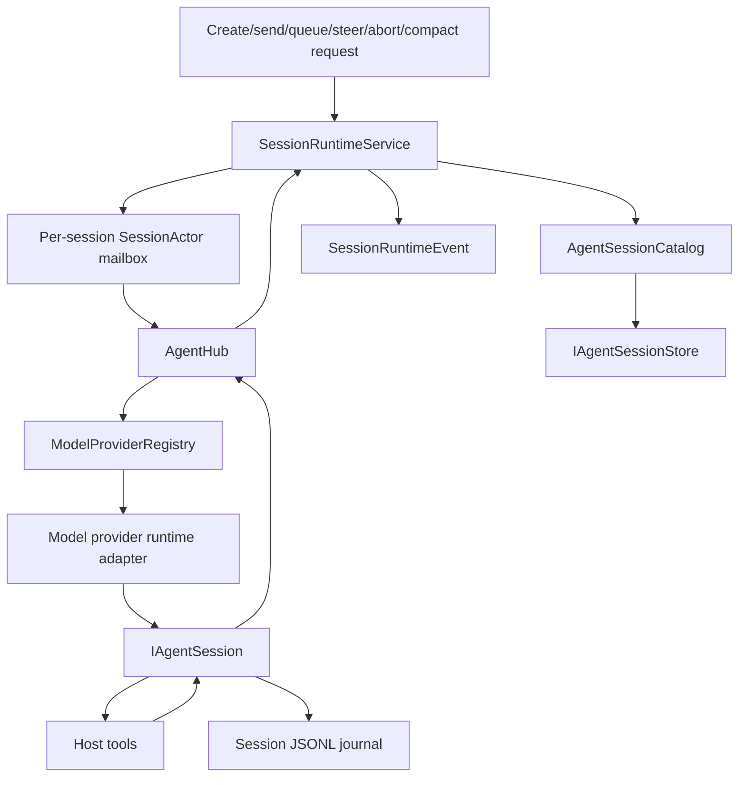

# Runtime and agent sessions

The runtime turns shell, plugin, and live-tool requests into CodeAlta-owned sessions, ordered per-session commands, normalized events, journals, and UI/plugin projections. Model providers execute turns and expose model metadata, but they do not own persisted session discovery.

## Runtime layers

`SessionRuntimeService` is the public runtime service used by the TUI, `alta` commands, and plugin orchestration adapters. It owns session-view creation, coordinator-session setup, prompt queueing, prompt sending, steering fallback, abort, manual compaction, skill activation, runtime event publication, and legacy session-view/session-view metadata journaling.

`AgentHub` is the active CodeAlta agent/session facade. It starts or resumes runnable sessions by resolving the selected `ModelProviderId`/provider key through `IModelProviderRegistry`, then coordinates run/abort/steer/compact operations through per-session handles. It does not list persisted sessions and does not probe providers for models.

`AgentSessionCatalog` and `IAgentSessionStore` own durable session discovery and history reads. `ListSessionsAsync` is streaming-only (`IAsyncEnumerable<AgentSessionMetadata>`) and reads from one configured sessions root for the current runtime.

Same-session mutation is serialized by internal mailbox actors and session coordinators. Different sessions can run concurrently; a blocked provider call, tool execution, or journal append for one session must not serialize unrelated sessions. Runtime events use bounded streams so slow readers do not create unbounded memory pressure.

### Selected-session current-runtime observation

`SessionRuntimeService.GetCurrentStateAsync(sessionId, token)` returns immutable
`SessionRuntimeCurrentState` / `SessionRuntimeCurrentEntry` values from the actual runtime owner.
Admission uses the existing retained-work owner, followed by `TryGet` and a synchronous copy on
the existing session actor. A missing actor returns an absent entry at registry lookup: the query
does not create an actor/coordinator/provider or read catalogs, journals, discovery paths or Display.
Pre-cancellation prevents admission; later cancellation stops the caller's wait, not admitted work.
Runtime/actor closure fails explicitly rather than manufacturing an inactive snapshot.

The observation contains entry presence, coordinator transition, recorded active run, observed
Shutdown termination, attachment retirement and queue-drain facts. **No run recorded is not proof
of provider inactivity**, including while a send is awaiting its provider result/events. Missing
entry, retirement, transition and query failure are not idle/completion signals. Queue depth is
unknown: durable queued records/counts are intentionally not loaded or cached by this query.
Captured provider/key/model/reasoning/prompt settings are not verified provider-effective values;
pending prompt selection remains separate from the coordinator's captured prompt. No tools,
instructions, delegates, credentials or mutable descriptor graphs are returned.

`RuntimeInstanceId` identifies this runtime independently of Display. `AttachmentGeneration` is
the existing attachment ordinal scoped by that instance; it identifies replacement, **not a state
revision**. Results may immediately become stale. Consumers must fence old selection, host epoch
and request-generation results, not order snapshots by attachment ordinal. There is no effect
acknowledgement, replay, history recovery or atomic history/original-event-stream handshake.

Owned Desktop exposes a unary `runtimeState.current` RPC and a manual **Refresh runtime state**
readout, separate from Display/history/receipts. It does not poll, automatically refresh or gate
commands. Host epoch and bounded, well-formed session identity are validated before querying.
Malformed/oversized results produce `wire_limit`, with no partial/truncated authoritative state;
closure and other failures use stable codes without exception messages. Attachment ordinals use
decimal strings to preserve Int64 precision in JavaScript. Seven bounded identity/configuration
strings (256 UTF-16 units each), fixed GUIDs/enums/ordinal/keys and a 4 KiB framing allowance fit
the **32 KiB response budget**, verified with actual generated JSON serialization and worst-case
escaping. Stale host/runtime identity requires UI reload, not retrying the old epoch. Selection
detach cancels the waiter and discards late results; it does not stop a run or the runtime.

### Committed live display window (M4 foundation, not complete M4)

`SessionRuntimeService.Display` exposes runtime-owned immutable renderer values. The runtime's
`SessionRuntimeEventPublisher` commits each publication **before** attempting delivery of the
same original event instance to the existing bounded/lossy `StreamEventsAsync` route. All
publication sites share this owner, including concurrent sessions. A short synchronous gate
orders commits and delivery attempts; projection work contains no I/O, provider calls, observer
callbacks or asynchronous waits. Observers cannot backpressure publication (ordinary bounded
gate contention/allocation still exists). There is no new stream reader. The original runtime
event/plugin-effects path is unchanged and remains separate from display storage; renderer
DTOs must never be substituted for genuine plugin inputs. No exception or JSON round-trip
compatibility is claimed.

Candidate display values are calculated before revision/state eviction is committed. Malformed
null text/lifecycle/catalog payloads are counted as unsupported (null/invalid session identities
as omitted) while original event delivery remains unchanged; this is not generic fault rollback
or a guarantee of recovery from allocation/process failure.

The original `StreamEventsAsync` route is **exclusive per runtime publisher**, not broadcast.
Admission is claimed on the first `MoveNextAsync`, not when obtaining a sequence or enumerator;
a competing consumer receives `InvalidOperationException` without touching the queue. A pre-canceled
token neither claims admission nor consumes an event. Admission adds only short claim/release
bookkeeping under the existing publisher gate; no asynchronous reads or yields run under it.

Dispose the original-event enumerator on detach. Only actual enumeration termination/disposal
releases its claim: cancellation or publisher completion does **not** release a reader suspended
at a yield. After admission, underlying channel semantics remain in force: buffered events may
still be yielded after cancellation. There is no added per-item cancellation check that consumes
and then drops an original event. Completion still drains accepted events, and a successor can
consume the remaining buffer without replay. Abandoned enumerators can prevent a successor from
being admitted until they are disposed; cancellation alone is not a join.

This prerequisite leaves TUI pumping, after-input queue draining, compatible adjacent-delta merging,
history, rich rendering and original plugin/effect inputs unchanged. Accepted events retain original
references and FIFO order up to that existing TUI merge boundary; newest-event drops still apply.
Exclusivity does not acknowledge UI/plugin effects, recover missed history, bound the TUI queue or
join asynchronous plugin work. Detaching the reader does not stop a run or the runtime. Independent
Display observations do not consume original events, and their revisions are not effect watermarks.

`Display.ObserveAsync` admits on first enumeration: registration and initial snapshot capture
are atomic. Each owner has a new `Epoch`; every publication and the final close increments one
global `Revision`. Subsequent messages are **full replacements**, not events or append deltas.
Each carries `PreviousRevision` and `HasGap` when intermediate revisions were coalesced. Replace
the entire local window, removing absent sessions/items; never replay these messages as effects.
One payload-free wakeup slot per observer coalesces arbitrarily slow consumption. There is no
event replay buffer. The next read captures current committed state under the same gate, so a
gap requires no upstream lossy-stream reconciliation for this retained window. It does not
recover history or omitted content. `GetSnapshot` is an atomic standalone query, not a substitute
for the observation handshake.

Coverage is deliberately partial (`IsPartial` is always true): latest published lifecycle,
queue **count**, configuration labels, host status and selected text channels (user, assistant,
reasoning/summary, plan, notice). Null state means not observed, not idle/empty. Lifecycle,
queue count and configuration survive text eviction **within a retained session**. Text keys
are `(session ID, run ID, content ID, channel)`; finalized content replaces its prefix, and late
deltas cannot unfinalize it. `StartedWithDelta` warns that there is no finalized baseline.
The projection is not hydrated from journals, does not infer command admission, and is not an
authoritative execution/permission/queue-item API. Catalog events copy configuration labels,
not mutable descriptors. Tools, errors/exception graphs, activities, notes, asks, interactions,
plugin data, attachments and arbitrary JSON details are not projected. `UnsupportedEvents`
counts unsupported publications; omitted optional details/queue payloads/catalog fields are
part of the declared partial coverage rather than individually counted.

Fixed bounds (UTF-16 code units, not UTF-8 bytes): **128 session windows**, **8 text items per
session**, **4,096 units per text prefix**, **256 per stable identity**, **512 per metadata
label**, and **32 live observers**. New sessions/text evict the least recently published/updated
window/item; eviction counters expose loss. Oversized/missing session or text identities are
omitted and counted rather than truncated into colliding keys. Text/metadata truncation is
explicit; prefix cutting avoids splitting a well-formed surrogate pair. Session eviction may
remove even a running session and all its last-known status; reappearance starts a fresh window.
No claim of complete active-session discovery should be made from this bounded display API.

These are **retained payload/count bounds, not a total heap cap**: current text payload is at
most 4,194,304 UTF-16 units (8 MiB of character storage), plus bounded identities, labels and
collection overhead. Immutable arrays/strings are shared with snapshots. Consumers may retain
unlimited old snapshots; iteration, concurrent snapshot reads, transient allocations, original
event/provider graphs, the legacy event channel, journals and renderer serialization are not
covered by that payload budget. There is no measured performance/whole-process memory claim.

Cancellation releases subscriber admission even while an enumerator is suspended at `yield`;
enumerator disposal also detaches. Neither cancels a run. Runtime disposal settles its existing
owned forwarding work, commits final closed state, wakes/completes observations and releases
the subscriber set. Late publications are refused. Late observers get one closed baseline;
closed state remains queryable for the runtime owner's lifetime. Next integration seam: a
host/frontend adapter can observe `RuntimeService.Display`, authorize transport scope and apply
replacements without adding a `StreamEventsAsync` reader. History paging, full status recovery,
shared interactions, original-effects routing changes and broader Desktop/TUI integration remain
later M4 work; the scoped selected-session Desktop channel is described below.

#### Selected-session Desktop channel (explicit owned mode only)

`SessionDisplayService` is registered in the real `DesktopApplication.RunOwnedAsync` against
that host's `RuntimeService.Display`. Default boot/catalog-only modes do not register it; no
startup opt-in, root, provider, tool or permission policy changes. `display.observe` is a generated
NeoAstra 0.1.0 channel using `DesktopJsonContext`. Before creating a runtime observation it validates
the expected **host epoch** and bounded, well-formed selected-session identity. Unknown/unobserved
or evicted identities yield an explicit absent session and partial coverage, without catalog/store
scans. Runtime stable session/run/content identities also reject unpaired UTF-16 surrogates so JSON
normalization cannot alias distinct row keys; rejected display identities are counted, while the
original event/effects route still receives the original objects.

Each item contains exactly the selected session, not the runtime's 128-session snapshot. It carries
separate host and projection epochs, decimal-string global observation revision/previous revision,
and decimal-string coverage counters/session revision. TypeScript orders revisions with `BigInt`,
not unsafe JavaScript numbers. Items are full replacements: absence clears the session; missing
text keys remove rows. Text identity is session/run/content/channel. Lifecycle, queue count,
configuration and text are display-only; submitted receipts are never interpreted as run completion.
Service failures use `invalid_request`, `stale_epoch`, `capacity` or `observation_failed`, with no
exception messages. Closing the runtime yields final closed state and ends the channel; canceling
or disposing its iterator releases only observation resources, including after a suspended yield.

The selected DTO retains at most eight 4,096-unit text prefixes and 256-unit stable identities.
Status/configuration/lifecycle labels are additionally limited to 256 UTF-16 units, with an explicit
transport-truncation flag. Conservative six-byte-per-unit JSON escaping plus a 16 KiB fixed
property/framing allowance stays below **256 KiB per item**; a regression serializes worst-case
escaped content with the actual generated type metadata and reserves a further explicit 4 KiB
framing check. This is a selected-item payload budget, not a total heap claim. `MaximumFrameBytes`
remains an **inbound-only** limit and is not being used as an outbound payload cap.

Buffering layers are separate: the runtime retains one payload-free wakeup per observer; the
owned RPC session permits two channels (allowing teardown overlap) and two unacknowledged items
per channel. The published default client has a 64-item channel buffer. The application store
retains one selected replacement and serializes local iterator cleanup before opening another
selected-session channel; it does not replace the library's channel machinery. At the conservative
item budget, 64 buffered payloads alone could approach 16 MiB before parsed-object/string overhead,
and host credit/transport/transient/React allocations are additional. Credits acknowledge transport
buffer admission, **not DOM application**. No whole-process memory/performance measurement or
native final-message delivery-on-window-close guarantee is claimed.

`createSessionDisplayStore` centrally owns selection, opening cancellation and iterator return.
Its immutable current snapshot reports loading/connected/closed/error; late selection/unmount
callbacks, wrong epochs and out-of-order revisions cannot restore stale display state. The UI offers
explicit reconnect without automatic commands, keeps persisted history separate, and renders plain
React text (no HTML/Markdown execution). A known stale host epoch explicitly requires UI reload and
disables reconnect with the old identity, even if iterator cleanup also fails. Opening timeout uses
the standard generated API; its signal remains attached for the full channel lifetime. This slice has managed in-memory channel, generated
contract/typechecking and frontend helper verification, not native/real-provider or complete M4 parity.

### Durable session notes

`SessionRuntimeService.GetNotesMarkdownAsync` and `UpdateNotesAsync` own tab-independent notes operations. `RuntimeAltaNotesService` is the actual live-tool adapter used by TUI composition; the old tab-authoritative notes service is removed. An explicit caller session ID wins, including when it is unknown (no fallback to another selected session). A host fallback captures only a session ID once, before awaiting stdin or storage. Resolution uses active runtime provider identity or persisted metadata and the configured global/project catalog association, without provider startup or prompt/skill discovery. These are trusted backend identities, not renderer authorization or arbitrary journal-path inputs.

The existing `SessionViewJournalStore.CreateSessionStore` supplies the shared journal gate/cache. `FileSystemAgentSessionStore.ReadLatestNotesAsync` streams the existing canonical parser and retains only the last notes event; it does not materialize full history or introduce a notes cache/database. Journal order, not event timestamps, wins, including cleared and empty Markdown events. Before appending, notes writes stream-validate canonical content on the same read/write handle with read-only sharing requested. This is a linear journal scan with bounded memory, not repair or a paging framework. A valid final record without a newline is preserved and separated from the new event; malformed/truncated content (with or without a final newline) is refused without changing user bytes. Ordinary reads retain their existing incomplete-final-record tolerance. Writes append the same `AgentNotesEvent` format, refresh metadata, invalidate the catalog and publish runtime feedback. Post-commit adapter notifications run in that same per-file order; they must enqueue presentation work, never synchronously wait on UI or reenter journal operations. Metadata refresh uses the already-owned journal gate rather than reacquiring it; cache hydration reads do not acquire that gate.

Cancellation applies to lookup, reading, gate admission and opening the existing journal. After write admission, the single record and feedback finish without caller cancellation; an acknowledged write is not reported as canceled. Read failures never become empty notes, and failed admission/write does not emit `Changed` or command success. A record committed before cache/invalidation/observer failure produces an explicit `AgentNotesCommittedException`: read notes again before retrying, rather than assuming rollback. Partial filesystem I/O and power-loss atomicity are not promised.

TUI owns only projections: acknowledged changes update a matching open tab and the selected sidebar. Sidebar construction receives an initial Markdown snapshot without storage I/O; selection/history replay later supplies recovered notes. Closing a view does not gate shared notes operations. Existing timeline delivery/loss and history-load races remain unchanged; this slice does not add loop-stop/reload reconciliation, renderer reconnect/grants, shared host lifetime transactions, or new durability for drafts, asks or reminders.

### Captured execution options

`SessionExecutionPolicy` captures a portable, immutable `SessionExecutionRequest` and assembles `SessionExecutionOptions` with host-supplied Agent tool and interaction contracts. Assembly performs no filesystem access, provider startup, model discovery or prompt discovery. Descriptors and root lists are copied into scalar/read-only values rather than retained as mutable authority. Provider/model/reasoning choices are preserved even before the model catalog synchronizes; an existing tab's provider override wins over the stored provider, and agent prompt preferences retain null-fallback and whitespace normalization behavior.

The TUI's creation route carries the explicitly captured project to this policy. Existing send/resume options resolve the session's own `ProjectRef`, independent of selection, and reject an unrelated resolved project. Global sessions use the configured global root without project tool identity or overlays; known project sessions use their project path; missing projects retain the stored working directory with no project overlays. A missing project reference still identifies the session's project association, not whichever project happens to be selected.

`SessionExecutionOptionsFactory` remains the TUI adapter for `alta` tools and permission/user-input callbacks. Tools share the execution request's frozen project identity and working directory. Existing-session ids are captured too; draft tools retain only the deliberate deferred canonical id binding after creation. Permission callbacks still prefer an explicit request session id over the captured fallback (including transient draft keys), and user-input callbacks retain their captured session association. This is trusted provider callback association, not renderer authorization. Auto-approval defaults and immediate user-input responses are unchanged; permission completion ownership is now shared as described below.

These APIs accept trusted backend policy inputs. They are not renderer authorization, filesystem grants, or new tool approvals: an application boundary must authorize renderer requests and resolve their descriptors before calling them. LiveTool and UI services are supplied by adapters, not located or referenced by Orchestration.

### Explicit prompt and skill discovery roots

`CodeAltaHostOptions.DiscoveryScope` is an opt-in `SessionDiscoveryScope` with two independent,
fully qualified paths: `UserProfileRoot` for prompt/skill home inputs, and
`InstructionAncestorRoot` for instruction-file ancestry. `GlobalRoot` remains the separate
catalog/configuration root; it is not used to infer either scope path. Scoped host creation
requires explicit absolute `GlobalRoot` and `CurrentProjectPath`, with the latter inside the
instruction boundary, before bootstrap or other host acquisition.

The template provider retains the scope, and `SessionRuntimeService` derives it from that
same provider. Runtime creation/discovery and prompt construction validate supplied working
directories and project roots before persistence or discovery. Relative, blank, sibling-prefix
and normalized `..` escapes are rejected rather than silently filtered out. Instruction files
are visited from the permitted boundary through the leaf, including the boundary; existing
selection and deduplication rules remain. Callers without a scope retain the previous home
defaults and full ancestor walk. The runtime constructor and the template provider's original
constructor remain available.

This is a **lexical discovery policy, not a filesystem sandbox or ownership grant**. It does
not resolve links/reparse points, bound builtin-skill source lookup or Git configuration
discovery, isolate plugins/providers/authentication, or authorize tools. A scoped host is not
automatically safe to execute against arbitrary roots. Real-host fixtures still need separate
discovery, storage, provider and lifetime admission; this plumbing alone does not enable
Desktop startup, owned commands or event subscriptions.

### Host-owned text commands (in development)

`CodeAltaHost.Commands` owns text-send and abort admission against that host's existing
runtime. Requests contain scalar identity/text values, not mutable descriptors, execution
options, tools or callbacks. Preparation resolves the durable session directly and captures
its execution policy; this bounded route supplies no tools, denies permission requests and
cancels user-input requests. Existing TUI policy and direct runtime callers are unchanged.

Admission reserves one owned send per session before lookup. Client request IDs are ordinal;
send identity uses a case-insensitive session ID and exact text. Matching retries return the
same receipt. `OwnedCommandReceiptCapacity` defaults to 256; receipts are retained for the
owner's lifetime rather than evicted, and new requests, including abort receipts, are rejected
when full. Disposal can still initiate control without allocating another receipt.

Caller cancellation governs admission only. Accepted preparation, send, cancellation and
attachment-aware abort work are retained by the owner; a session slot remains occupied until
its send and control settle. Host disposal closes admission and joins commands before runtime
dependencies. Noncooperative preparation can keep that join pending indefinitely. Receipt
completion describes the returned send/control operation, **not transcript or provider-turn
completion**; it does not add an event reader or govern callers that bypass this service.

`BuiltInSkillRoot` optionally supplies an absolute builtin-skill root without assembly-ancestor
lookup. Null preserves the existing default. Neither it nor `DiscoveryScope` isolates Git,
plugins, authentication or ambient environment reads. `PluginEnvironment` optionally supplies
a map copied with case-insensitive keys for host-created plugin adapter operations; null
retains the ambient snapshot. It does not isolate process or provider environments.

The owned route passed 17 exact real-host tests using a registered fake provider, fresh explicit
roots and an empty plugin environment map. Tests cover retries, capacity, caller cancellation,
attachment-aware abort, provider faults, deny/cancel interactions and disposal ordering. The
fixture initially failed because a view header alone did not seed an agent summary; it now
uses existing store APIs and validates durable readback before creating the host. The separate
Desktop integration below has separate fake-provider qualification; these earlier tests alone do
not qualify that integration. TUI activation, real providers, event projection, noncooperative
shutdown and frontend/native parity remain unqualified.

### Explicit Desktop submissions and owned reads

The in-development Desktop owned mode borrows `Commands` and `WorkspaceReads` from one
`CodeAltaHost`. It requires the existing browser/catalog/cache-consent arguments plus all of
`--allow-owned-host`, `--project-root`, `--discovery-home`, `--instruction-root` and
`--builtin-skill-root`. Every root is explicit and absolute; the instruction root must include
the project. This is not default-profile startup or proof of task ownership or reparse isolation.
Browser-only and catalog-copy-only modes retain their existing behavior.

Owned-mode consent includes lock, project catalog, journal, cache and provider-state writes;
configuration, instruction and skill reads; and configured-provider registration, which can read
declared credential environment variables and shipped defaults. Registration is lazy, not
provider readiness. A later submission can invoke provider authentication, storage and network
access. Plugins and probes remain disabled, and the plugin environment map is explicitly empty;
that map does not isolate provider environments.

`WorkspaceReads` retains at most eight actual uncancelled reads, rejecting excess admission
rather than queuing. Caller cancellation stops only the wait. Snapshot reads fully consume the
host journal's cached session store directly, including final cache writes, without
`AgentSessionCatalog`, an uncached fallback or invalidation. History uses that same store's
bounded page reader. The existing 200-project/500-session/700-KiB projection limits do not bound
the underlying catalog enumeration. Host shutdown closes read admission, starts command and
read drainage before awaiting either, joins both, and only then attempts runtime disposal.
Settled failures preserve command/read/runtime order; noncooperative work can remain pending.

Desktop mutations validate an expected host epoch before owner admission. The transport keeps
only owner receipt references, never a second execution queue or retry policy. Up to 256 receipts
remain available in stable 64-row pages for that epoch; reload recovers receipts, not prompt text.
The owned RPC host uses a 208-KiB inbound frame ceiling, while validated receipt projection and
generated-JSON checks establish a separate 448-KiB response budget. This is not a per-response
limit supplied by NeoAstra. Text is limited to 32,768 UTF-16 units; identities are validated rather
than silently trimmed or truncated.

**Refresh submissions** is explicit. An uncertain send retains its exact epoch, retry key,
session and text for deliberate retry; there is no polling or automatic resend. A host-epoch
mismatch latches mutation invalidation across panel remounts and requires reload, not rekeying
the old request. Labels describe submission
pending/submitted/failed/cancelled, never a completed conversation. **Abort submission** targets
one pending owned send, not an arbitrary later run or a general Stop-agent command. No runtime
event reader or live projection is added by this vertical.

The explicit catalog-copy lease belongs to the Desktop application through the synchronous
native loop. A cancellable close signals retained shutdown work without awaiting it inside the
native close callback. Five seconds is a diagnostic threshold, not termination: unconfirmed
host cleanup must retain the lease and acquired native resources. Only confirmed cleanup permits
normal final close and lease release. External/noncancellable termination is not successful
cleanup. Native lifecycle behavior remains unqualified. Separately audited tests passed for
real host/cached-store RPC reads and submission/replay with a registered fake provider, seven
literal read/drain cases, generated DTO bounds, and five frontend helper cases. These do not
execute configured providers, mount React, or prove native close behavior; see the
[qualification record](desktop-native-qualification.md#desktop-owned-session-integration-managed-qualification).

### Immediate user-input policy

Orchestration's pure `SessionUserInputPolicy.CreateResponse` owns the existing immediate answer selection. With AutoApprove disabled, every prompt receives an empty answer. When enabled, nonempty options are scored by the existing case-insensitive substring keywords and question heuristics; the first highest-scoring option wins and its label is returned literally, including whitespace. Options take precedence even for secret prompts. Without options, secret or nonfreeform prompts receive empty answers; other prompts receive `No preference. Use your best judgment and continue.` Answer identifiers retain ordinal comparison and duplicate identifiers still fail. The policy does not mutate the supplied form.

`SessionUserInputRequestCoordinator` remains the TUI adapter: it checks cancellation at entry, captures `GetAutoApproveEnabled`, calls the shared policy, and presents the request/immediate response timeline only if the captured session has an open tab. Callback session association and immediate completion are unchanged. These are trusted request/setting inputs, not renderer permissions. This extraction does not implement pending question UI, shared `alta ask` ownership, reconnect/recovery, or new lifecycle behavior.

### Permission ownership

`SessionRuntimeService.Permissions` owns one `SessionPermissionService` for the runtime/application lifetime. Its mailbox serializes registration, independent pending-summary listing, full-handle resolution and cancellation; it never waits for a user's decision inside the runner. Registrations expose a read-only completion task and a presentation guard, not a completion source. A handle contains the captured session ID, nullable provider run ID, provider interaction ID and a fresh application attempt ID. Providers without a run ID retain an explicit null association; the service does not invent a runtime run ID. Wrong scopes, invalid decisions, old attempts and replayed responses cannot resolve a pending request. Reusing a provider interaction ID creates a new attempt. Completion removes the pending entry without accumulating completed tombstones.

AutoApprove still defaults to `true` in `NavigatorSettings` and returns `AllowOnce`; disabling it retains the existing **Allow Once**, **Allow for Session**, **Deny**, and Escape/**Cancel** choices. The provider runtime still enforces the choice; the shared owner does not grant new tool capabilities or policy amendments. Caller cancellation returns Cancel (the TUI retains its pre-entry cancellation exception), as does owner shutdown. Runtime disposal cancels pending permissions before joining session actors/runs. The explicit `CancelRunAsync` operation cancels current requests for exactly one session/run association, not future run admission.

Cancellation cleanup is asynchronous, but cancellation validity is not deferred to its mailbox message. Resolution checks the retained caller token inside the mailbox before completing the attempt: if cancellation is already signaled, the attempt completes Cancel and a non-Cancel response is rejected. Cancellation after that check does not revoke a decision that won the race. `ListAsync` and `IsPendingAsync` also check cancellation inside the mailbox and exclude canceled attempts even before cleanup removes them. Their observations are not reservations: cancellation after a read may invalidate an already returned summary, and resolution always rechecks. Removal remains single-writer and exactly once, with no completed tombstones.

The TUI coordinator is a presentation adapter. It checks pending state again inside queued UI work and joins dialog closure on completion/cancellation. Presentation failure cancels the attempt and propagates the observed failure rather than allowing a tool or leaving an unresolved owner entry. Buttons resolve scoped handles, not frontend completion sources. Disposing a dialog only detaches presentation; it does not decide the permission. Timeline formatting and open-tab lookup stay in TUI and do not gate authoritative completion.

Pending summaries remain available without an open tab and outside the bounded/lossy runtime timeline. They copy only immutable identity and scalar command/file preview data; mutable provider collections and raw JSON payloads are not retained as authoritative state. These are trusted in-process application contracts, not renderer grants, full payload replay or durable restart recovery. This bounded permission slice does not implement shared pending user-input/`alta ask` workflows, renderer reattachment, general host admission/shutdown changes, or whole-runtime close/reload stress qualification. In particular, the terminal loop must still service queued presentation work while it is being joined; full application exit ordering is a separate lifecycle qualification.

## Provider initialization

`IModelProviderRegistry` lists configured `ModelProviderDescriptor` values and creates provider runtimes. `IModelProviderInitializationService` starts provider probes eagerly after provider descriptors/configuration are available. Each provider probe owns its success/failure state and model list cache:

- provider initialization is independent per provider and fault-isolated;
- one slow or failing provider does not block other providers;
- session listing, local history loading, project import, and pending-session restore do not wait for provider readiness;
- model lists are loaded during provider initialization or explicit refresh, then reused by session start/resume paths.

Provider identity is not session ownership. Persisted sessions keep last-used provider/model metadata for UX defaults and resume choices; the session id remains the durable session identity. When CodeAlta starts a new or empty session, it generates the canonical session id before provider attachment, passes it to the agent/provider runtime, and treats a different returned id as a provider contract violation rather than rekeying the session.

## Agent contracts

`CodeAlta.Agent` defines the headless agent/session/provider boundary.

### Provider compatibility names

Provider runtime adapters use `ModelProviderId`, `ModelProviderDescriptor`, `IModelProviderRegistry`, and `IModelProviderRuntime` for selectable providers. Do not reintroduce `IAgentBackend`, `AgentBackendId`, or `AgentBackendFactory`, and do not use backend terminology to imply that providers own persisted sessions.

### `IAgentSession`

A session owns one conversation/run attachment. It exposes:

- normalized event streaming through `StreamEventsAsync` and `Subscribe`;
- `SendAsync` for normal user input;
- `SteerAsync` for live steering when the selected provider/runtime supports it;
- `AbortAsync` for best-effort cancellation;
- `CompactAsync` for manual compaction when supported;
- `GetHistoryAsync` for replayable stored history.

### `AgentEvent`

`AgentEvent` is a polymorphic normalized model. Current event families include raw provider events, content deltas/completions, activity lifecycle events, system-prompt records, session updates, plan snapshots, interactions, errors, permission requests, file-change permission requests, command permission requests, and user-input requests.

Runtime projections should be derived from these normalized events rather than provider-specific payloads whenever possible.

## Session flow

A normal prompt follows this path:

1. The caller selects a global or project session view and model provider.
2. `SessionRuntimeService` ensures a coordinator session exists for the session view.
3. System/developer instructions, runtime context, project context, skills metadata, and tool definitions are composed.
4. `AgentHub` starts or resumes the CodeAlta session using the selected provider runtime.
5. The prompt is sent through `IAgentSession.SendAsync`.
6. Normalized `AgentEvent` values are observed, persisted when applicable, and converted into `SessionRuntimeEvent` values.
7. The runtime marks the session idle, updates usage/state, and drains at most one queued prompt for that session.

Busy-session sends are queued when requested by UI or live-tool options. Queue items keep caller attribution and are durable enough for runtime recovery paths that read session state. Steering requests are sent only when a run is active and the provider/runtime supports `SteerAsync`; otherwise CodeAlta falls back to normal send or re-queues according to the caller path.

## Agent session runtime

`AgentRuntime` and `AgentSession` implement CodeAlta-owned local sessions for raw provider APIs. Provider packages create model-provider runtimes with provider-specific turn executors, profiles, model catalogs, credentials, and compaction settings; the session runtime attaches those providers when starting or resuming work.

A local session:

- replays the session journal into local conversation state on resume;
- composes provider messages from normalized history, instructions, tool results, and active context;
- emits normalized content/activity/session/permission/error events;
- runs model/tool turns until the provider is idle;
- can transfer replayable local history to another compatible configured provider when no exact provider continuation state exists;
- persists session summary/state snapshots and legacy session-view headers/state into the same JSONL journal.

The journal path is `~/.alta/sessions/yyyy/MM/dd/<session-id>.jsonl`. Startup session listing reads a local projection cache at `~/.alta/cache/cache.sqlite3` first, then reconciles external journal additions/changes after the initial projection; journals remain the source of truth and are used to rebuild a missing or corrupt cache. Optional traces live at `~/.alta/sessions/traces/<session-id>.trace` when protocol tracing is enabled for a provider.

## Built-in local tools

CodeAlta-runtime providers can receive host-injected tools. Current built-ins are:

- `read_file`
- `list_dir`
- `grep`
- `webget`
- `shell_command`
- `write_file`
- `replace_in_file`
- `delete_file_or_dir`
- `rename_file_or_dir`
- `apply_patch`

Mutation and shell tools flow through host permission handling. Tool schemas are bridged to provider-specific declarations, including strict-schema normalization where required. A user-input/request tool is intentionally not registered as a local raw-API built-in until host UI pause/resume semantics are implemented.

`AgentSendOptions.OnPermissionRequest` optionally selects the permission callback for one send's built-in tool definitions in the in-process `AgentSession`. Null preserves the existing `AgentSessionCreateOptions.OnPermissionRequest` fallback. Session options, custom tool definitions and user-input handling are unchanged; other provider session implementations must explicitly support this option. This is callback selection only, not automatic approval, lifetime cancellation, stale-callback rejection or recovery: a retained built-in tool definition still holds its original callback after the send returns. Owned command permissions remain denied; this API alone enables no Desktop approval route or runtime execution/attachment binding.

The `alta` live tool is injected for CodeAlta-managed sessions on any configured provider when the in-process runtime is available. See [`alta` live tool](live-tool.md).

MCP uses progressive, policy-controlled `AgentToolDefinition` registration for session-activated MCP servers, with `alta mcp tool search|describe|call` remaining available for discovery, diagnostics, and manual invocation. The compact MCP prompt inventory is built from configuration without connecting; activated servers are connected lazily on agent runs, apply TOML policy (`enabled`, `allowed_tools`, `disabled_tools`, timeouts, output caps), and redact diagnostics/results. Timeline refinements for friendly direct-tool labels and automatic refresh on `tool-list-changed` notifications are follow-up work. See [MCP support](mcp.md).

## System prompts, agent prompts, and instruction composition

Prompt resources are file-backed under `prompts/` roots:

- built-in content: `content/prompts/`;
- user-global content: `~/.alta/prompts/`;
- project-local content: `<project>/.alta/prompts/`.

Each root can contain `system/<id>.system-prompt.md` and `agents/<id>.prompt.md`. Source precedence is deterministic: built-in < global < project. A later source with the same id replaces the earlier source by default. Add `mode: append` (or `append: true`) to a system or agent prompt's frontmatter to append its body to the nearest lower-precedence replacement chain instead. Appended agent prompts inherit lower-precedence metadata such as `name`, `description`, `system`, and generated-part options unless the appended file sets those fields.

System prompts carry the invariant host/agent behavior. Agent prompts are selectable session profiles with `name` frontmatter for UI display (required for replacement prompts and inherited for appended prompts), optional `description`, optional `system` (default `default`), optional generated-part overrides (`skills`, `project_context`, `runtime_context`, `tool_guidance`), and a Markdown body that is included in the composed developer instructions. Prompt descriptions are also surfaced in generated model context for prompt/mode discoverability, so custom descriptions should be concise and decision-useful. Built-in resources are read-only; global and project prompt/system-prompt files can be edited through the prompt manager or `alta prompt` live-tool commands. The selected agent prompt determines the system prompt id unless a runtime system override is supplied.

`SystemPromptBuilder` composes:

- native system prompt content selected from `prompts/system`;
- the selected agent prompt body from `prompts/agents`;
- generated runtime/tool guidance;
- skills metadata when skills are available for the selected session;
- project-context sections and file/reference context.

Orchestration appends parent/additional developer guidance and trusted plugin-contributed system/developer prompt parts after the file-backed builder output. Dedicated plugin instruction processors can then inspect or replace the final system/developer instruction text before provider submission, prompt hashing/statistics, and system-prompt journal/manifest events. `AgentInstructionComposer` still adds fallback agent-runtime context and project instruction files for lower-level callers unless orchestration marks the instructions as already fully composed, which prevents a plugin transform from being undone by fallback runtime-context injection.

Instruction composition should remain deterministic and file-backed. Avoid embedding large static prompt strings directly in orchestration code when they belong in prompt resources.

## Compaction

Agent-runtime compaction is implemented in `AgentSession` and the `CodeAlta.Agent.Runtime.Compaction` namespace. It is a provider-call workflow, not a separate remote compaction API.

Triggers:

- **Manual:** caller invokes `IAgentSession.CompactAsync` through the UI or `alta session compact`.
- **Threshold:** automatic compaction is considered before turns and after idle when projected active context reaches the resolved input-context limit times the configured ratio.
- **Overflow recovery:** the runtime can compact after provider context-limit failures when the session can still be summarized.

Defaults from `AgentCompactionSettings`:

| Setting | Default |
| --- | ---: |
| `enabled` | `true` |
| `ratio` | `0.95` |
| `post_compaction_target_ratio` | `0.10` |
| `summary_output_ratio` | `0.10` |
| `summary_share_of_target` | `0.40` |
| `file_context_share_of_summary_target` | `0.15` |
| `keep_last_user_message` | `true` |
| `allow_split_turn` | `true` |

The summarizer is an ordinary provider turn executed through the same turn executor. Checkpoints are persisted as `local.compactionCheckpoint` raw events, and visible session updates mark compaction start/completion. Activated CodeAlta-managed skills can be rehydrated into composed instructions after compaction so skill guidance survives without duplicating current context.

## Persistence model

Agent-runtime session journals contain replayable normalized history plus raw state records:

- `local.sessionSummary` for session summary metadata;
- `local.sessionState` for agent runtime replay state;
- `local.compactionCheckpoint` for compaction outcomes;
- `codealta.sessionHeader` and `codealta.sessionState` for legacy session-view/session-view metadata.

The runtime reads journals to restore recoverable sessions, session history, usage, modified-file summaries, activated-skill state, parent/sub-session lineage, provider/model/reasoning selections, and the selected agent prompt id. Metadata-only recovery paths use the SQLite projection cache when healthy, but history/resume reads continue to replay JSONL. Unknown recovered agent prompt ids fall back to the default agent prompt. The frontend stores only view/prompt state outside the journal.

## Runtime events and plugins

`SessionRuntimeEvent` is the current orchestration-to-host event stream name. It is a transitional legacy type name; events describe session-view/runtime changes, not operating-system sessions. The frontend projects it into sidebars, timelines, status lines, usage indicators, and dialogs. Plugins can observe normalized agent events and contribute transient derived timeline cards through the plugin orchestration bridge.

Derived plugin events are not canonical transcript entries. They are replayed from stored normalized events and can be recalculated after restart.

## Error and cancellation behavior

Providers and sessions should surface recoverable failures as structured events or command outcomes when possible. Unrecoverable actor failures stop the affected session actor and complete pending replies. Runtime event streams are bounded; callers must not depend on unbounded buffering for UI or plugin responsiveness.
