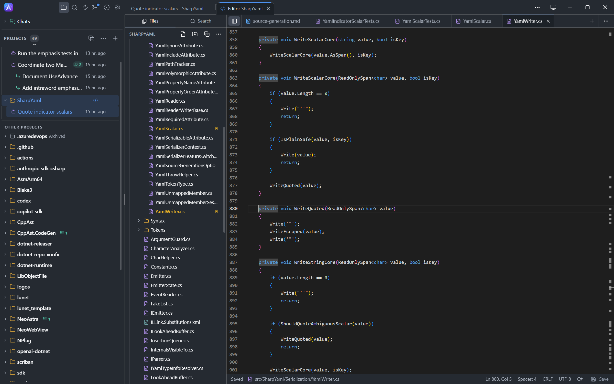

# CodeAlta [](https://github.com/CodeAlta/CodeAlta/actions/workflows/ci.yml) [](https://www.nuget.org/packages/CodeAlta/) [](https://www.nuget.org/packages/CodeAlta.Tui/)

CodeAlta is a workspace for agentic coding on your local projects. It brings model providers, durable sessions, agent prompts, MCP tools, skills, plugins, and delegated agents together, in a desktop app or a terminal UI.

<p align="center">
  
</p>

> CodeAlta is distributed as preview `0.x` releases. Configuration, screenshots, and extension APIs may change before `1.0`.

## 🖥️ Two apps

| App | NuGet package | Command |
| --- | --- | --- |
| **CodeAlta Desktop** | [`CodeAlta`](https://www.nuget.org/packages/CodeAlta/) | `alta` |
| **CodeAlta TUI** | [`CodeAlta.Tui`](https://www.nuget.org/packages/CodeAlta.Tui/) | `altatui` |

- **CodeAlta Desktop** is a desktop application with session tabs you can drag and split, a file editor, and every setting in one window. It is the most complete way to use CodeAlta.
- **CodeAlta TUI** is a keyboard-first terminal UI with the same sessions, providers, and tools.

Both apps run the same agents on the same `~/.alta` profile. A session started in one app can be continued in the other. See [Desktop and TUI](https://codealta.github.io/docs/desktop-and-tui/) for what each app offers.

## 🚀 Install

Install [.NET 10](https://dotnet.microsoft.com/en-us/download/dotnet/10.0), then install the desktop app and launch it from a project folder:

```sh
dotnet tool install -g CodeAlta
alta
```

Or install the terminal UI:

```sh
dotnet tool install -g CodeAlta.Tui
altatui
```

You can install both. Only one CodeAlta runs on a profile at a time, so close one app before starting the other.

Update with `dotnet tool update -g CodeAlta` or `dotnet tool update -g CodeAlta.Tui`. The desktop app can also update itself with **Update and restart**.

Requirements:

- **CodeAlta Desktop** uses the web view of the operating system: WebView2 on Windows, macOS 11 or later, or WebKitGTK 6.0 with GTK 4 on Linux.
- **CodeAlta TUI** needs a current [Nerd Fonts](https://www.nerdfonts.com/) patched font, such as `CaskaydiaCove Nerd Font`, selected in your terminal profile.

On first launch, CodeAlta creates `~/.alta/config.toml` and opens the provider setup. Sign in with a ChatGPT or GitHub Copilot subscription, or add an API key for OpenAI, Anthropic, Google, Mistral, xAI, Azure OpenAI, or an OpenAI-compatible server. Then open a project and send a prompt.

See [Getting Started](https://codealta.github.io/docs/getting-started/) for the full walkthrough.

## ✨ What it gives you

- **Sessions on your projects**: sessions are saved on disk per project. Reopen them later, queue prompts on a busy session, steer a running turn, and compact a long conversation.
- **Several agents at once**: a session can start child sessions for bounded tasks and collect their reports. On the desktop, put them side by side in split panes.
- **The models you already have**: choose the provider, model, and reasoning effort per session. See [model providers](https://codealta.github.io/docs/model-providers/).
- **Everything the agent did**: tool calls, file diffs, context usage, and turn statistics are in the timeline, and each one opens with its details.
- **Context-aware prompts**: attach files and folders with `@`, reference GitHub, GitLab and Azure DevOps issues with `#`, paste images, and switch between agent prompts such as Default and Plan.
- **A file editor**: open a project file with `Ctrl+E`. On the desktop, the editor tab can sit beside the session that works on the file.
- **Extensions**: MCP servers, Agent Skills-compatible skill folders, trusted local .NET plugins, and the in-session `alta` tool for notes, reminders, asks, and session control.
- **Your language and colors**: English, Spanish, French, German, Japanese, or Simplified Chinese, with light and dark themes on the desktop and terminal themes in the TUI.

<p align="center">
  
</p>

<p align="center">
  
</p>

## ⌨️ Common shortcuts

Both apps use the same shortcuts and slash commands.

| Action | Shortcut or command |
| --- | --- |
| Help and command discovery | `F1`, `/help`, or `?` |
| Command palette | `Ctrl+P` or `/` |
| Open project | `Ctrl+O` or `/open` |
| Open file editor | `Ctrl+E` or `/edit` |
| Attach project files | type `@` in the prompt |
| Switch to next agent prompt | `Ctrl+T` or `/next_prompt` |
| Open model providers | `Ctrl+G Ctrl+R` or `/model_providers` |
| Browse models | `Ctrl+G Ctrl+O` or `/models` |
| Open settings | `Ctrl+G Ctrl+W` or `/settings` |
| Steer a running session | `Ctrl+Enter` |
| Abort the running turn | `F8` or `/abort` |
| Switch tabs | `Ctrl+Alt+Left` / `Ctrl+Alt+Right` |

## 📖 Documentation

- User guide and screenshots: <https://codealta.github.io/>
- Getting started: <https://codealta.github.io/docs/getting-started/>
- Desktop and TUI: <https://codealta.github.io/docs/desktop-and-tui/>
- Model provider configuration: <https://codealta.github.io/docs/model-providers/>
- Prompts and instructions: <https://codealta.github.io/docs/prompts/>
- Sessions and delegation: <https://codealta.github.io/docs/sessions/>
- Plugins and MCP servers: <https://codealta.github.io/docs/plugins/>
- Maintainer notes: [doc/readme.md](doc/readme.md)

## 🪪 License

CodeAlta is released under the [BSD-2-Clause license](https://opensource.org/licenses/BSD-2-Clause).

## 🤗 Author

Alexandre Mutel aka [xoofx](https://xoofx.github.io).
