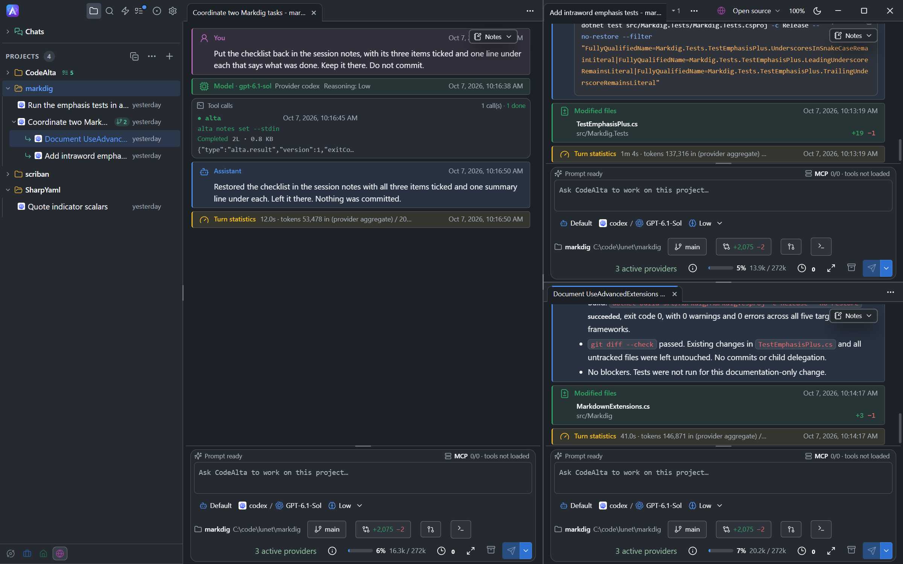

# CodeAlta [](https://github.com/CodeAlta/CodeAlta/actions/workflows/ci.yml) [](https://www.nuget.org/packages/CodeAlta/) [](https://www.nuget.org/packages/CodeAlta.Tui/)

CodeAlta is a desktop workspace for agentic coding on your local projects. A terminal UI is available too.

<p align="center">
  
</p>

## 🚀 Install

Install [.NET 10](https://dotnet.microsoft.com/en-us/download/dotnet/10.0), then install CodeAlta Desktop, the app we recommend:

```sh
dotnet tool install -g CodeAlta
alta
```

CodeAlta TUI runs the same agents in a terminal. You can install both:

```sh
dotnet tool install -g CodeAlta.Tui
altatui
```

Launch the app from a project folder. On first launch it opens the provider setup: sign in with a ChatGPT or GitHub Copilot subscription, or add an API key.

See [Getting Started](https://codealta.github.io/docs/getting-started/) for requirements and the first steps.

## ✨ Features

- **A desktop app, and a terminal UI**: CodeAlta Desktop has session tabs you can drag and split, a code editor, terminals and git changes for your projects, and every setting in one window. CodeAlta TUI is a keyboard-first terminal UI. Both share the `~/.alta` profile, so a session started in one can be continued in the other. See [how they compare](https://codealta.github.io/docs/desktop-and-tui/).
- **Sessions on your projects**: sessions are saved on disk. Queue prompts, steer a running turn, and let a session delegate tasks to child sessions.
- **Spaces**: in CodeAlta Desktop, group your projects into spaces such as Work and Personal. The window shows one space at a time, each with its own tabs.
- **Worktrees**: a session can work in its own git worktree, on its own branch, so that several sessions change the same project at the same time.
- **Automations**: in CodeAlta Desktop, a prompt can run on a schedule, when an issue or a pull request is opened, when a command succeeds, or on demand.
- **UI tools and MCP server**: in CodeAlta Desktop, an agent sees and drives the window, and other applications do the same through its MCP server.
- **The models you already have**: subscriptions and API keys for OpenAI, Anthropic, Google, Mistral, xAI, Azure OpenAI, and OpenAI-compatible servers, and Claude Code through the CLI you installed.
- **Everything the agent does**: tool calls, file diffs, and context usage are in the timeline. In CodeAlta Desktop a tool call opens with its output in a live terminal, or with the file or the diff it worked on. Web links in assistant messages open in your default browser.
- **Extensions**: agent prompts, MCP servers, skills, and trusted local .NET plugins, which an agent can write and reload while CodeAlta Desktop runs.

<p align="center">
  
</p>

## 📖 Documentation

The user guide is at <https://codealta.github.io>:

- [Getting started](https://codealta.github.io/docs/getting-started/)
- [Desktop and TUI](https://codealta.github.io/docs/desktop-and-tui/)
- [Model providers](https://codealta.github.io/docs/model-providers/)
- [Sessions and delegation](https://codealta.github.io/docs/sessions/)
- [Prompts](https://codealta.github.io/docs/prompts/)
- [Plugins and MCP servers](https://codealta.github.io/docs/plugins/)

Maintainer notes are in [doc/readme.md](doc/readme.md).

## 🪪 License

CodeAlta is released under the [BSD-2-Clause license](https://opensource.org/licenses/BSD-2-Clause).

## 🤗 Author

Alexandre Mutel aka [xoofx](https://xoofx.github.io).
